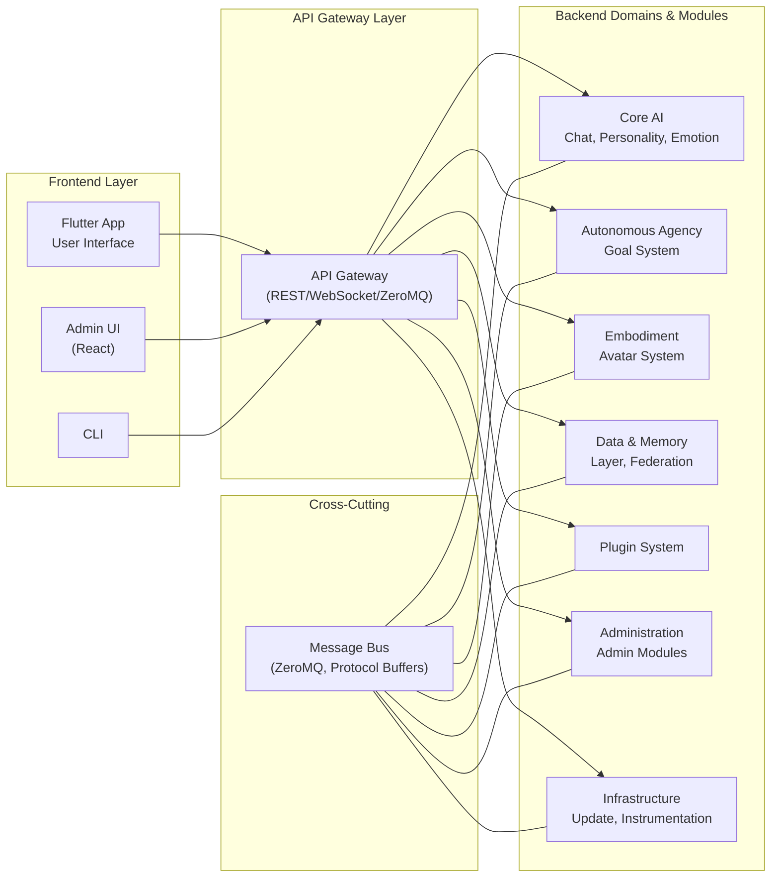

# Architecture

## Project Summary

AICO is an open-source experiment to build an **emotionally present, visually embodied, and proactive AI companion**—intended to act as a family member, confidante and sidekick, not just an assistant. Unlike productivity-oriented conversationbots, AICO naturally recognizes and builds individual relationships with family members through multi-modal identification, creating authentic bonds without technical barriers while maintaining a consistent core personality.

**Core Principles:**
- **Local-First Privacy:** All data and processing are local by default, with encrypted storage and secure communication.
- **Modular, Extensible System:** System → Module → Component hierarchy, message-driven, plugin-ready.
- **Production-Ready Foundation:** Focus on reliable, tested infrastructure before advanced features.
- **Brain-Inspired Memory:** Complementary learning systems (fast hippocampal + slow cortical) for genuine relationship evolution.
- **Knowledge Graph Intelligence:** Property graph with temporal reasoning for relationship modeling.
- **Adaptive Learning:** Thompson Sampling and RLHF for behavioral optimization.
- **Zero Configuration:** Systems learn automatically from natural interactions.

**Planned Principles:**
- **Natural Family Recognition:** Multi-modal identification (architecture defined, implementation planned).
- **Embodiment:** Visual/audio presence with 3D avatars (ready for integration).
- **Autonomous Agency:** Proactive behavior and goal generation (architecture defined, implementation planned).
- **Personality & Emotion:** Sophisticated simulation (architecture defined, implementation planned).

## System Features

AICO's features are organized into logical modules for development and deployment:

### 👥 Social Relationship Intelligence
**Production Implementation:**
- **Property Graph Storage**: NetworkX + libSQL + ChromaDB with 204 nodes, 27 edges, 552 indexed properties
- **Multi-Pass Entity Extraction**: GLiNER zero-shot recognition + LLM relationship extraction
- **Entity Resolution**: 3-step deduplication (semantic blocking → LLM matching → merging)
- **Temporal Reasoning**: Bi-temporal tracking (valid_from, valid_until, is_current)
- **Graph Analytics**: PageRank importance, Louvain community detection, betweenness centrality
- **GQL/Cypher Queries**: Full graph query language via GrandCypher
- **Graph Fusion**: Conflict resolution and canonical ID management
- **HNSW Search**: Approximate nearest neighbor for fast entity similarity

**Planned Features:**
- Dynamic relationship learning from interactions
- Voice biometrics and behavioral pattern analysis
- Natural family member recognition

### 🗣️ Conversation & Memory
**Production Implementation:**
- **Three-Tier Memory Architecture**: Working (LMDB) + Semantic (ChromaDB) + Adaptive (AMS)
- **Hybrid Search V3**: Semantic embeddings + BM25 keyword + IDF filtering + RRF fusion
- **Working Memory**: 30-day TTL, sub-millisecond access, conversation-scoped
- **Knowledge Graph**: Full property graph with temporal reasoning and multi-hop queries
- **Memory Album**: User-curated memories (conversation + message level) with emotional tone
- **Memory Consolidation**: Background "sleep phases" integrate experiences without forgetting
- **Behavioral Learning**: Skill library with RLHF and Thompson Sampling
- **Context Assembly**: Multi-factor scoring (recency, relevance, relationship)
- **Chat Interface**: Real-time text conversation with streaming responses
- **Multi-turn Dialogue**: Complex conversation flow with context preservation

**Planned Features:**
- Voice interaction (speech-to-text and text-to-speech)
- Autonomous agency (goal generation, curiosity-driven learning)
- Proactive engagement and conversation starters

### 🤖 Task Automation & Scheduling
**Production Implementation:**
- **Cron-Based Scheduler**: Production-ready task scheduler with resource awareness
- **Built-in Maintenance Tasks**: Log cleanup, key rotation, health checks, database vacuum
- **AMS Tasks**: Consolidation, feedback classification, Thompson sampling, trajectory cleanup
- **KG Tasks**: Graph consolidation, entity resolution, relationship inference
- **Resource Monitoring**: CPU/memory tracking for adaptive execution
- **Task History**: Complete execution tracking with success/failure logging
- **Database Schema v4**: scheduled_tasks, task_executions, task_locks tables

**Planned Features:**
- Personality simulation (trait-based modeling with Big Five/HEXACO)
- Emotion simulation (C-CPM 4-stage appraisal; Phase 1 implemented, further phases planned)
- Meta-cognition and self-assessment

### 😊 Sentiment & Emotion Analysis
**Production Implementation:**
- **Text Sentiment**: BERT Multilingual sentiment classification
- **Emotion Analysis**: RoBERTa 6-emotion classification (joy, sadness, anger, fear, surprise, disgust)
- **Intent Classification**: XLM-RoBERTa multilingual intent understanding
- **Memory Album Integration**: Automatic emotional tone detection for memory organization

**Planned Features:**
- Facial emotion recognition (computer vision)
- Voice emotion analysis (audio-based)
- Mood tracking and empathetic response generation
- Advanced emotion simulation (C-CPM extensions)

### 🎭 Frontend & User Experience
**Production Implementation:**
- **Flutter 3.27+**: Cross-platform UI (macOS, iOS, Android, Linux, Windows)
- **Glassmorphic Design**: Premium UI with backdrop blur, noise textures, organic curves
- **Riverpod 3.0**: Modern state management with compile-safe code generation
- **Drift + SQLCipher**: Encrypted local message cache with <200ms load times
- **Message Actions**: Hover-based toolbar (Copy, Remember, Regenerate, Feedback)
- **Connection Management**: Resilient API service with exponential backoff
- **Real-time Streaming**: WebSocket support for streaming AI responses
- **Offline-First**: Cache-first loading with background sync
- **Dio HTTP Client**: Feature-rich client with interceptors and retry logic

**Planned Features:**
- 3D Avatar System (Three.js + Ready Player Me + TalkingHead.js)
- Voice interaction (speech-to-text and text-to-speech)
- Gesture and eye tracking
- Multi-device roaming with P2P encrypted sync

### 🔒 Privacy & Security
**Production Implementation:**
- **SQLCipher Encryption**: AES-256-GCM for all databases (libSQL + Drift)
- **CurveZMQ**: 100% encrypted message bus with mandatory mutual authentication
- **Argon2id**: Memory-hard KDF for master key derivation
- **PBKDF2**: Database encryption key derivation (100k iterations)
- **NaCl/libsodium**: Modern cryptography for frontend (Ed25519, X25519)
- **JWT Authentication**: HS256 tokens with 24-hour expiry and refresh
- **Platform Keychain**: OS-native secure storage (Keychain, Credential Manager)
- **Audit Logging**: Encrypted log persistence with 7-day retention
- **Database Resilience**: FULL synchronous mode for crash-safe operations

**Planned Features:**
- Consent management and granular privacy controls
- Federated learning for privacy-preserving model improvements

### 🔌 Extensibility & Administration
**Production Implementation:**
- **Plugin System**: Message bus, log consumer, validation, security, rate limiting, encryption
- **API Gateway**: FastAPI with REST + WebSocket, 12+ endpoint groups
- **CLI v1.1.0**: 15 command groups with 100+ subcommands for complete system administration
- **Task Scheduler**: Extensible task system with built-in and custom tasks
- **Developer Tools**: Schema management, protobuf generation, testing utilities
- **Hot Reload**: Configuration changes without service restart
- **Health Monitoring**: Comprehensive system health and performance tracking

**Planned Features:**
- Plugin marketplace and community extensions
- External integrations (calendar, email, smart home)
- Automated update system with rollback

## Design Principles

- **Agency Over Pure Reactivity** - AICO initiates and acts, not just responds
- **Local-First by Default** - All personal data and core inference runs locally
- **Modular Architecture** - Decoupled components with clear interfaces
- **Message-Driven Integration** - Event-based communication via central message bus
- **Multi-Modal Embodiment** - Visual, auditory, and textual presence
- **Emotional Intelligence** - Sophisticated emotion recognition and simulation
- **Privacy by Design** - User control of all data and processing

## Architectural Decisions

**Implemented:**
- **CurveZMQ Message Bus** - 100% encrypted pub/sub with mandatory mutual authentication
- **Protocol Buffers 6.32** - High-performance binary serialization for backend (5.0 for Flutter)
- **Topic-Based Pub/Sub** - Hierarchical topics with wildcard pattern matching
- **Three-Tier Memory** - Working (LMDB) + Semantic (ChromaDB) + Adaptive (AMS)
- **Hybrid Search V3** - Semantic + BM25 + IDF filtering + RRF fusion
- **Property Graph** - NetworkX + libSQL + ChromaDB for knowledge graph with temporal reasoning
- **Thompson Sampling** - Contextual bandit for skill selection and behavioral learning
- **Qwen3 Abliterated 8B** - Uncensored foundation model for character consistency
- **Plugin Architecture** - Modular backend with lifecycle management
- **Encrypted Storage** - SQLCipher (AES-256-GCM) for all databases

**Planned:**
- **C-CPM Emotion Model** - Component Process Model for emotion simulation (Phase 1 implemented, advanced phases planned)
- **Multi-Faceted Agency** - Goal generation, curiosity, planning, meta-cognition
- **3D Avatar System** - Three.js + Ready Player Me + TalkingHead.js
- **Sandboxed Plugin Execution** - Isolated environments with permission controls
- **Atomic Updates** - Reliable system updates with rollback capabilities


## System Architecture

AICO's architecture is organized into domains, modules, and components:

```
AICO System
├── Domain: Core Infrastructure
│   ├── Module: Message Bus
│   │   ├── Component: Topic Management
│   │   ├── Component: Message Routing
│   │   └── Component: Plugin Integration
│   ├── Module: Plugin Manager
│   │   ├── Component: Plugin Discovery
│   │   ├── Component: Sandbox Execution
│   │   └── Component: Permission Management
│   ├── Module: API Gateway
│   │   ├── Component: External Interfaces
│   │   └── Component: Protocol Adapters
│   ├── Module: Resource Monitor
│   │   ├── Component: CPU Usage
│   │   ├── Component: Memory Usage
│   │   ├── Component: Battery Status
│   │   └── Component: System Load Metrics
│   └── Module: Update System
│       ├── Component: Version Management
│       └── Component: Atomic Updates
├── Domain: Autonomous Agency
│   ├── Module: Goal System
│   │   ├── Component: Goal Generation
│   │   ├── Component: Goal Prioritization
│   │   └── Component: Goal Tracking
│   ├── Module: Planning System
│   │   ├── Component: Plan Formulation
│   │   ├── Component: Plan Execution
│   │   └── Component: Plan Adaptation
│   ├── Module: Curiosity Engine
│   │   ├── Component: Novelty Detection
│   │   ├── Component: Exploration Strategy
│   │   └── Component: Interest Model
│   ├── Module: Job Scheduler
│   │   ├── Component: Task Queue
│   │   ├── Component: Priority Scheduling
│   │   └── Component: Idle Detection
│   └── Module: Initiative Manager
│       ├── Component: Proactive Engagement
│       └── Component: Conversation Starter
├── Domain: Personality & Emotion
│   ├── Module: Personality Simulation
│   │   ├── Component: Trait Vector System
│   │   ├── Component: Value System
│   │   ├── Component: Expression Mapper
│   │   └── Component: Consistency Validator
│   ├── Module: Emotion Simulation
│   │   ├── Component: Appraisal Engine
│   │   ├── Component: Affect Derivation
│   │   └── Component: Expression Synthesis
│   └── Module: Emotion Recognition
│       ├── Component: Facial Analysis
│       ├── Component: Voice Analysis
│       └── Component: Text Analysis
├── Domain: Self-Awareness
│   ├── Module: State Monitoring
│   │   ├── Component: System Health
│   │   └── Component: Performance Metrics
│   └── Module: Meta-Cognition
│       ├── Component: Reflection Engine
│       └── Component: Self-Assessment
├── Domain: Intelligence & Memory
│   ├── Module: LLM Module
│   │   ├── Component: Model Management
│   │   ├── Component: Inference Engine
│   │   └── Component: Resource Coordination
│   ├── Module: Conversation Engine
│   │   ├── Component: Conversation Flow
│   │   ├── Component: Prompt Conditioning
│   │   └── Component: Response Processing
│   ├── Module: Memory System
│   │   ├── Component: Episodic Memory
│   │   ├── Component: Semantic Memory
│   │   ├── Component: Behavioral Learning
│   │   └── Component: Memory Consolidation
│   └── Module: Learning System
│       ├── Component: Continual Learning
│       └── Component: Skill Acquisition
├── Domain: User Interface
│   ├── Module: Context Manager
│   │   ├── Component: Conversation State
│   │   └── Component: User Context
│   └── Module: Presentation Layer
│       ├── Component: Flutter UI
│       ├── Component: Avatar System
│       └── Component: Voice & Audio
├── Domain: Privacy & Security
│   ├── Module: Consent Manager
│   │   ├── Component: Permission Control
│   │   └── Component: Data Governance
│   ├── Module: Encryption System
│   │   ├── Component: Data Encryption
│   │   └── Component: Secure Communication
│   └── Module: Audit System
│       ├── Component: Activity Logging
│       └── Component: Compliance Monitoring
├── Domain: Administration
│   ├── Module: System Config Manager
│   │   ├── Component: Config Loader
│   │   └── Component: Config Validator
│   ├── Module: Instrumentation & Logging
│   │   ├── Component: Log Aggregator
│   │   ├── Component: Log Rotation
│   │   └── Component: Diagnostics Export
│   ├── Module: Resource Monitor (Admin)
│   │   ├── Component: System Status Dashboard
│   │   ├── Component: Resource Alerts
│   │   └── Component: Health Checks
│   ├── Module: Plugin Admin
│   │   ├── Component: Install/Disable/Update
│   │   └── Component: Sandbox Policy Control
│   ├── Module: Update Admin
│   │   ├── Component: System Updates
│   │   └── Component: Module Updates
│   ├── Module: Audit & Compliance (Admin)
│   │   ├── Component: Admin Log Access
│   │   └── Component: Compliance Dashboard
│   ├── Module: Backup & Restore
│   │   ├── Component: Snapshot Manager
│   │   └── Component: Restore Engine
│   ├── Module: Developer Tools
│   │   ├── Component: Hot Reload
│   │   └── Component: Profiling & Debug
│   ├── Module: Admin Access Control
│   │   ├── Component: Admin Authentication
│   │   └── Component: Privilege Management
│   ├── Module: Notification Center
│   │   ├── Component: Critical Event Alerts
│   │   └── Component: Admin Messaging
│   └── Module: Policy Manager
│       ├── Component: Resource Limits
│       └── Component: Plugin Permissions
└── Domain: Extensibility & Integration
    ├── Module: Plugin System
    │   ├── Component: Community-Developed Extensions
    │   └── Component: Skill Acquisition
    ├── Module: API Gateway
    │   ├── Component: External Interfaces
    │   └── Component: Protocol Adapters
    ├── Module: External Integrations
    │   ├── Component: Calendar, Email, Smart Home
    │   └── Component: Custom Integrations
    ├── Module: Custom Skills
    │   ├── Component: User-Defined Behaviors
    │   └── Component: Response Generation
    ├── Module: Developer Tools
    │   ├── Component: SDKs and Documentation
    │   └── Component: Testing Framework
    ├── Module: Marketplace
    │   ├── Component: Plugin Discovery
    │   └── Component: Distribution Platform
    └── Module: Automated Updates
        ├── Component: Self-Updating System
        └── Component: User Control

```

## Main parts

The AICO system consists of the following main parts:
- Backend service
- Frontend app
- Modelservice
- Admin UI
- CLI

### Backend Service
Python-based persistent service providing core AICO functionality:
- **Plugin-based architecture** with FastAPI and ZeroMQ message bus
- **Encrypted data storage** using libSQL with SQLCipher
- **Continuous operation** enabling autonomous agency and background processing
- **Modular design** with lifecycle management and dependency injection

### Frontend App
Flutter-based cross-platform user interface:
- **Thin client design** connecting to backend via REST/WebSocket
- **Real-time communication** for notifications and status updates
- **Cross-platform support** for desktop, mobile, and web
- **Responsive interface** with avatar integration via WebView

### Modelservice
Lightweight LLM inference service:
- **Ollama integration** with automatic binary management
- **REST API gateway** for model inference requests
- **Cross-platform deployment** with native binary handling
- **Resource coordination** with backend monitoring systems

### CLI
Professional command-line interface:
- **Rich output formatting** with tables and colors
- **Cross-platform executables** via PyInstaller
- **Direct backend integration** through ZeroMQ and REST APIs
- **Administrative functions** for system management

## Architecture Patterns

AICO's core architecture is designed to maximize modularity and maintain low coupling, with clear boundaries between domains (e.g. Personality, Emotion, Agency, Memory, etc.). The system uses a message-driven architecture with distinct frontend and backend components.

### Modular Message-Driven Design
- **Each domain/module is a distinct code package or subsystem** with its own internal state, logic, and strict interface.
- **All communication between backend modules is via the internal message bus (ZeroMQ) using Protocol Buffers for high-performance binary serialization. External API communication with the frontend uses JSON over HTTP/WebSocket for web-standard compatibility.**
- **No direct function calls or shared state between modules** (except for startup/configuration)—all data exchange is through published/subscribed messages.
- **Each module subscribes to topics and publishes outputs on its own topics**, using versioned, validated Protocol Buffer schemas.
- **Modules can be developed, tested, and even replaced independently** as long as they honor the message contracts.

### Low Coupling and Contract Guarantees
- **Loose Coupling:** Modules are only coupled by the message schemas and topic contracts—not by code dependencies or shared state.
- **Contract Enforcement:** The message bus enforces versioned Protocol Buffer schemas, so if a publisher or subscriber changes, integration tests will catch contract violations.
- **Pluggability:** Any module could, in theory, be extracted into a separate process or container in the future with minimal refactor, since all communication is already message-based.

### Client-Service Architecture
- **Separation of Concerns:** Frontend handles presentation and user interaction, backend manages all AI processing and data persistence.
- **Persistent Backend Service:** Backend runs continuously as a system service, enabling proactive agency and background processing.
- **Thin Client Pattern:** Frontend is a lightweight client that connects to the backend via REST API/WebSocket.

### Architecture Overview




**Communication Flow:**

1. **Frontend → API Gateway**: HTTP/WebSocket calls for user interactions
2. **API Gateway → Message Bus**: Publishes events to appropriate topics
3. **Message Bus → Modules**: Distributes messages to subscribed backend modules
4. **Module → Module**: Inter-module communication via message bus only
5. **Backend → Frontend**: Real-time updates via WebSocket notifications

**Key Architectural Principles:**

- **🔄 Message-Driven**: All backend communication via ZeroMQ pub/sub
- **🏗️ Modular Design**: Independent modules with clear boundaries
- **🔌 Loose Coupling**: Modules only depend on message contracts
- **⚡ Responsive UI**: Frontend never blocks on backend processing
- **🔒 Secure**: API Gateway controls all external access
- **📈 Scalable**: Modules can be moved to separate processes/containers


## Frontend

The AICO frontend is implemented as a Flutter application that serves as a thin client, focusing on user interface and real-time interaction while delegating all heavy processing to the backend service.

### Flutter Application Architecture
- **Thin Client Design:** The UI (Flutter app) is a lightweight client that connects to the backend via local REST API/WebSocket.
- **Real-time Communication:** WebSocket connections enable real-time updates from the backend for notifications and status changes.
- **Responsive Interface:** UI remains responsive at all times since no heavy processing occurs in the frontend.
- **Cross-platform Support:** Flutter enables consistent experience across desktop, mobile, and web platforms.

### Frontend Responsibilities
- **User Interface Rendering:** Chat interface, settings, avatar display, and all visual components.
- **User Input Handling:** Text input, voice capture, gesture recognition, and user interactions.
- **Real-time Updates:** Receiving and displaying notifications, status updates, and background accomplishments from the backend.
- **Local State Management:** Managing UI state, user preferences, and temporary display data.

### Connection Management
- **Automatic Reconnection:** Frontend automatically reconnects to backend service if connection is lost.
- **Offline Graceful Degradation:** UI provides appropriate feedback when backend is unavailable.
- **Session Continuity:** When UI reconnects, backend proactively notifies of any background accomplishments or updates.

### Update Management
- **Update Notifications:** Displays update availability notifications from the backend with changelog details.
- **User Consent Interface:** Provides UI for users to approve, schedule, or defer updates.
- **Update Progress:** Shows download and installation progress for both frontend and backend updates.
- **Restart Coordination:** Handles graceful shutdown and restart during update installation.
- **Update Preferences:** Allows users to configure update settings (automatic/manual, channels, scheduling).
- **Rollback Interface:** Provides one-click rollback option if users experience issues post-update.

## Backend

The AICO backend runs as a persistent system service, handling all AI processing, data management, and autonomous agency tasks. This design enables continuous operation and proactive behavior even when the UI is closed.

### Service Architecture
- **System Service:** Backend runs as a persistent service with PID file management and graceful shutdown
- **Plugin-Based Core:** Modular architecture using `BackendLifecycleManager`, `ServiceContainer`, and `BasePlugin` hierarchy
- **Continuous Operation:** Background tasks and autonomous agency continue when UI is closed
- **Resource-Aware Processing:** Intelligent resource management with configurable policies
- **Process Management:** Signal-based shutdown coordination and background task management

### Local LLM Integration

AICO uses a **native binary integration pattern** for local LLM deployment:

- **LLM Module:** Manages Ollama and other model runners as native binaries (not containers or daemons). The backend handles all packaging, download, installation, and update for maximum user experience.
- **Ollama Integration:** Communicates with the Ollama binary over HTTP/gRPC. No Docker or container engine is required.
- **Cross-Platform:** Prebuilt binaries for all major OSes are fetched and managed automatically.
- **Message Bus Communication:** LLM Module communicates via ZeroMQ like all other modules.
- **Resource Coordination:** Integrates with existing Resource Monitor for CPU/memory/battery policies.
- **Context Integration:** Receives real-time personality and emotion context for prompt conditioning.
- **Fallback:** In-process model serving (e.g., via llama.cpp Python bindings) may be supported for lightweight or experimental models in the future.

#### Why Native Binary?
Native binaries provide the best user experience, performance, and compatibility for local-first, privacy-first AI. Docker is not required, reducing installation complexity and system bloat.

#### Comparison Table
| Feature/Aspect            | Native Binary Integration (AICO)         | Docker-based (not used) | In-Process Model (future option) |
|--------------------------|------------------------------------------|-------------------------|-----------------------------------|
| User Installation        | Handled automatically by AICO            | Requires Docker install | Pure Python/pip, but limited      |
| Platform Support         | Windows, macOS, Linux (prebuilt)         | All with Docker         | Python-supported only             |
| Performance              | High (native, multi-threaded, GPU)       | High                    | Good for small models             |
| Resource Isolation       | Excellent (separate process)             | Good                    | Poor (main process only)          |
| Model Support            | Any CLI/server model runner (Ollama)     | Any in container        | Python-bindable models            |
| Upgrade Path             | Handled by AICO, independent             | Docker images           | Python deps, less robust          |
| Simplicity for User      | Maximum (zero manual steps)              | Low                     | Maximum (if supported)            |
| GPU/Advanced HW          | Supported by runner                      | Supported               | Sometimes, with setup             |
| Debuggability            | Good (logs, subprocess mgmt)             | Moderate                | High (in Python)                  |
| Security                 | Good (sandboxable subprocess)            | Good                    | Good, but less isolated           |
| Best For                 | All users, especially non-experts        | Advanced/server         | Dev, testing, light use           |

This approach maintains architectural consistency, simplifies deployment, and enables tight integration with AICO's personality and emotion systems while preserving privacy through local-only processing.

### Core Backend Components

#### API Gateway
The API Gateway provides a unified, secure entry point:

```python
# Example: API Gateway initialization
from backend.core.lifecycle_manager import BackendLifecycleManager

lifecycle_manager = BackendLifecycleManager(config_manager)
app = await lifecycle_manager.startup()
```

- **Single Port Design:** All endpoints on port 8771 with FastAPI
- **Encryption Middleware:** Request/response encryption with selective bypass
- **Domain Routing:** `/api/v1/admin/`, `/api/v1/scheduler/`, `/api/v1/logs/`
- **Plugin Architecture:** Modular middleware and protocol adapters

#### Job Scheduler & Task Queue
- **Task Management:** Internal job/task queue manages all long-running, background, or proactive jobs (skill brushing, summarization, research).
- **Priority Scheduling:** UI/interactive tasks always run first; background jobs are paused/throttled if system is busy.
- **Resource-Aware Scheduling:** Job Scheduler can defer or cancel tasks based on system load and user preferences.

#### Resource Monitor
- **System Monitoring:** Tracks CPU, memory, battery, and system load metrics in real-time.
- **Policy Enforcement:** User-configurable policies (e.g., "only run background jobs when on AC power" or "limit CPU usage to 20%").
- **Adaptive Behavior:** Modules (especially Agency and Learning) query Resource Monitor before starting background work.

#### Autonomous Agency Engine
- **Idle Detection:** Detects system/user idle periods for opportunistic background tasks.
- **Background Learning:** Performs learning, research, skill updates during spare time.
- **User-Configurable Limits:** Users control which activities are allowed and resource limits.

#### Message Bus & Log Consumer

```python
# Example: Message bus usage
from aico.core.bus import MessageBusClient, create_client

client = create_client("api_gateway")
await client.connect()

# Publish encrypted message
await client.publish("logs/backend/main", {"level": "INFO", "message": "Service started"})

# Subscribe to topics
def log_handler(topic: str, message: dict):
    print(f"Received: {topic} - {message}")

await client.subscribe("logs/", log_handler)
```

- **ZeroMQ Broker:** High-performance routing with CurveZMQ encryption
- **Topic Hierarchy:** Structured topics (`logs/`, `events/`) with prefix matching
- **Log Consumer:** Dedicated service persisting logs to encrypted libSQL database
- **Protobuf Serialization:** Binary format for performance and type safety

#### Plugin Manager
- **Plugin Discovery:** Automatically discovers and loads available plugins.
- **Sandbox Execution:** Runs plugins in isolated environments for security.
- **Permission Management:** Controls plugin access to system resources and data.

#### Update System
The Update System manages automatic updates for both frontend and backend components while ensuring user control and system reliability.

**Update Architecture:**
- **Update Orchestrator (Backend):** Centralized update management running in the backend service
- **Update Checker:** Periodically checks for updates to both frontend and backend components
- **Update Downloader:** Securely downloads updates with signature verification
- **Update Installer:** Coordinates installation of frontend and backend updates
- **Rollback Manager:** Provides rollback capabilities if updates fail

**Update Flow:**
1. **Automatic Checking:** Backend periodically checks for updates (configurable interval, default: daily)
2. **User Notification:** Frontend displays update notifications with details and changelog
3. **User Consent:** User approves/schedules updates through the frontend UI
4. **Coordinated Installation:** Backend orchestrates installation of both components
5. **Restart Coordination:** Manages restart sequence (backend first, then frontend reconnection)
6. **Verification:** Ensures both components are running correctly post-update

**Update Types:**
- **Backend Updates:** Service restarts automatically, frontend reconnects seamlessly
- **Frontend Updates:** Downloaded and applied when frontend restarts
- **Coordinated Updates:** Both components updated in sequence with user consent
- **Security Updates:** Can be marked as critical with expedited user notification

**User Control:**
- **Update Preferences:** Users can configure automatic vs manual updates
- **Scheduling:** Users can schedule updates for convenient times
- **Rollback Option:** One-click rollback if issues occur post-update
- **Update Channels:** Stable, beta, or development update channels

#### Goal System
- **Goal Generation:** Creates self-formulated objectives and sub-goals.
- **Goal Prioritization:** Manages goal importance and scheduling.
- **Goal Tracking:** Monitors progress toward objectives.

#### Planning System
- **Plan Formulation:** Creates multi-step strategic plans to achieve goals.
- **Plan Execution:** Manages plan implementation and task coordination.
- **Plan Adaptation:** Adjusts plans based on changing circumstances.

#### Curiosity Engine
- **Novelty Detection:** Identifies new or interesting information and experiences.
- **Exploration Strategy:** Determines what to explore and learn about.
- **Interest Model:** Maintains and evolves areas of curiosity and interest.

#### Initiative Manager
- **Proactive Engagement:** Initiates conversations and interactions with users.
- **Conversation Starter:** Generates contextually appropriate conversation topics.

#### Personality Simulation
- **Trait Vector System:** Manages personality traits (Big Five, HEXACO).
- **Value System:** Maintains ethical principles and preferences.
- **Expression Mapper:** Translates personality traits to behavioral parameters.
- **Consistency Validator:** Ensures behavioral coherence over time.

#### Emotion Simulation
- **Appraisal Engine:** Processes emotional appraisals using Component Process Model.
- **Affect Derivation:** Maps appraisals to emotional states.
- **Expression Synthesis:** Coordinates emotional expression across modalities.

#### Emotion Recognition
- **Facial Analysis:** Computer vision-based emotion detection from facial expressions.
- **Voice Analysis:** Audio-based emotion and sentiment recognition.
- **Text Analysis:** Natural language emotion understanding.

#### LLM Module
- **Model Management:** Manages local LLM models (Ollama) as native binaries, including automatic download, installation, update, and lifecycle management. No Docker or container engine is required.
- **Cross-Platform:** Prebuilt binaries for Ollama are available for Windows (10+), macOS (12+), and Linux (x86_64/AMD64). The backend detects the user's OS and fetches the correct binary as needed.
- **Maximum UX:** Users do not need to manually install or configure anything; all model runner management is handled automatically by AICO.
- **Inference Engine:** Handles quantized model inference with resource-aware processing.
- **Resource Coordination:** Integrates with Resource Monitor for CPU/memory/battery policy enforcement.

#### Conversation Engine
- **Conversation Flow:** Manages dialogue state, context, and multi-turn conversations.
- **Prompt Conditioning:** Incorporates personality and emotional context into prompts via message bus.
- **Response Processing:** Processes LLM responses and coordinates with other modules.

#### Memory System
- **Episodic Memory:** Stores personal experiences and interaction history.
- **Semantic Memory:** Maintains knowledge base and learned concepts.
- **Behavioral Learning:** Stores learned skills and behavioral patterns.
- **Memory Consolidation:** Long-term memory formation and optimization.

#### Data & Storage Layer

```python
# Example: Encrypted database usage
from aico.data.libsql.encrypted import EncryptedLibSQLConnection
from aico.security import AICOKeyManager

key_manager = AICOKeyManager(config_manager)
master_key = key_manager.authenticate()
db_key = key_manager.derive_database_key(master_key, "libsql", "aico.db")

conn = EncryptedLibSQLConnection("aico.db", encryption_key=db_key)
with conn:
    conn.execute("INSERT INTO logs (message) VALUES (?)", ["Hello World"])
```

- **Primary Storage (libSQL):** Encrypted SQLite-compatible engine with SQLCipher-style integration
- **Vector Database (ChromaDB):** Embedding storage for semantic search and KG embeddings
- **Analytical Engine:** libSQL + ChromaDB hybrid queries for analytics
- **Unified Schema:** Single core schema with atomic migrations

#### Learning System
- **Continual Learning:** Ongoing learning from interactions and experiences.
- **Skill Acquisition:** Learning new capabilities and behaviors.

#### Context Manager
- **Conversation State:** Maintains current conversation context and history.
- **User Context:** Tracks user preferences, mood, and situational context.

#### State Monitoring
- **System Health:** Monitors backend system health and performance.
- **Performance Metrics:** Tracks system performance and resource usage.

#### Meta-Cognition
- **Reflection Engine:** Self-reflection on learning and behavior.
- **Self-Assessment:** Evaluation of capabilities and performance.

#### Consent Manager
- **Permission Control:** Manages user permissions and privacy settings.
- **Data Governance:** Ensures compliance with privacy policies.

#### Encryption System
- **Data Encryption:** Encrypts stored personal data and memories.
- **Secure Communication:** Ensures secure communication channels.

#### Audit System
- **Activity Logging:** Logs system activities for transparency.
- **Compliance Monitoring:** Monitors compliance with privacy and security policies.

### Backend Use Cases
- **Proactive Preparation:** AICO prepares summaries or suggestions while UI is closed.
- **Background Skill Development:** Agency module practices or updates skills, pausing if user becomes active.
- **Dynamic Resource Management:** System throttles non-essential jobs during high CPU/memory usage or on battery power.
- **Continuous Availability:** Backend remains ready to respond instantly when user opens UI.

## Shared Library Architecture

AICO employs a **shared library approach** for cross-subsystem logic to maintain DRY principles while enabling early development access to core functionality.

### Design Philosophy

**Problem**: Core functionality (security, data models, utilities) needed across multiple subsystems (CLI, backend, frontend) with different development timelines.

**Solution**: Standalone shared libraries that can be imported by any subsystem, following the `aico.*` namespace hierarchy.

### Current Library Structure

```
aico/
├── shared/                     # Unified shared library
│   ├── pyproject.toml          # Namespace package configuration
│   └── aico/
│       ├── __init__.py         # Namespace package declaration
│       ├── core/               # Core utilities
│       │   ├── config.py       # Configuration management
│       │   ├── logging.py      # Structured logging with ZMQ transport
│       │   ├── bus.py          # Message bus client
│       │   ├── paths.py        # Cross-platform path management
│       │   └── process.py      # Process and PID management
│       ├── security/           # Security & encryption
│       │   ├── key_manager.py  # Key derivation and session management
│       │   └── __init__.py
│       ├── data/               # Data layer
│       │   └── libsql/
│       │       └── encrypted.py # Encrypted database connections
│       └── proto/              # Protocol Buffers
│           ├── aico_core_logging_pb2.py
│           └── aico_core_common_pb2.py
├── backend/                    # Backend service
│   ├── pyproject.toml          # Dependencies: -e ../shared/
│   ├── main.py                 # Service entry point
│   ├── log_consumer.py         # Log persistence service
│   └── api_gateway/            # Plugin-based gateway
├── cli/                        # CLI application
│   ├── requirements.txt        # Dependencies: -e ../shared/
│   └── commands/               # CLI command modules
├── cli/                        # Development CLI
│   ├── pyproject.toml          # includes aico-shared dependency
│   └── aico_main.py
└── frontend/                   # Flutter frontend
    └── pubspec.yaml            # May reference shared schemas
```

### Startup Sequence

The current backend follows this initialization sequence:

1. **Main Process** (`main.py`):
   - Initialize configuration and logging
   - Setup PID file management and signal handlers
   - Create shared encrypted database connection

2. **API Gateway** (`BackendLifecycleManager`):
   - Initialize `ServiceContainer` with dependency injection
   - Register and start services/plugins with priority ordering
   - Setup FastAPI integration with single lifespan context and domain routing

3. **Plugin Lifecycle**:
   - Message bus broker starts on ports 5555/5556
   - Log consumer service begins ZMQ subscription
   - Protocol adapters register endpoints
   - Middleware plugins configure security stack

4. **Service Ready**:
   - Health endpoints available
   - Background tasks running
   - Graceful shutdown handlers active

### Implementation Patterns

#### Namespace Packages
All shared libraries use Python namespace packages:

```python
# setup.py for each shared library
setup(
    name="aico-security",
    packages=["aico.security"],
    namespace_packages=["aico"]
)
```

#### Development Installation
Subsystems install shared libraries in development mode:

```toml
# In backend/pyproject.toml or cli/pyproject.toml
[tool.uv.sources]
aico-shared = { path = "../shared", editable = true }

# Dependencies section includes:
dependencies = [
    "aico-shared",
    # ... other dependencies
]
```

#### Usage Examples

**CLI Usage** (Early Development):
```python
# CLI can use security features before backend exists
from aico.security import AICOKeyManager
from aico.security.filesystem import SecureFilesystem

key_manager = AICOKeyManager()
fs = SecureFilesystem(key_manager)
fs.setup_encrypted_directory("/path/to/data")
```

**Backend Usage** (Production):
```python
# Backend imports same libraries
from aico.security import AICOKeyManager
from aico.data.models import Conversation
from aico.core.config import Config

# Identical API, different context
key_manager = AICOKeyManager()
config = Config.load()
```

### Development Workflow

1. **Library-First Development**: Core functionality implemented as shared libraries
2. **CLI Integration**: Development tools import and use shared libraries
3. **Backend Integration**: Production backend imports same libraries
4. **Cross-Language Sharing**: Data models/schemas can be shared with frontend via JSON/Protocol Buffers

### Library Categories

- **aico.security**: Key management, encryption, authentication
- **aico.data**: Data models, schemas, repositories
- **aico.core**: Configuration, logging, message bus
- **aico.common**: Utilities, constants, helpers
- **aico.ai**: AI/ML utilities (when needed)
- **aico.tools**: Development and debugging utilities

This approach ensures **KISS** (simple imports), **DRY** (single implementation), and enables rapid development while maintaining professional code organization.

