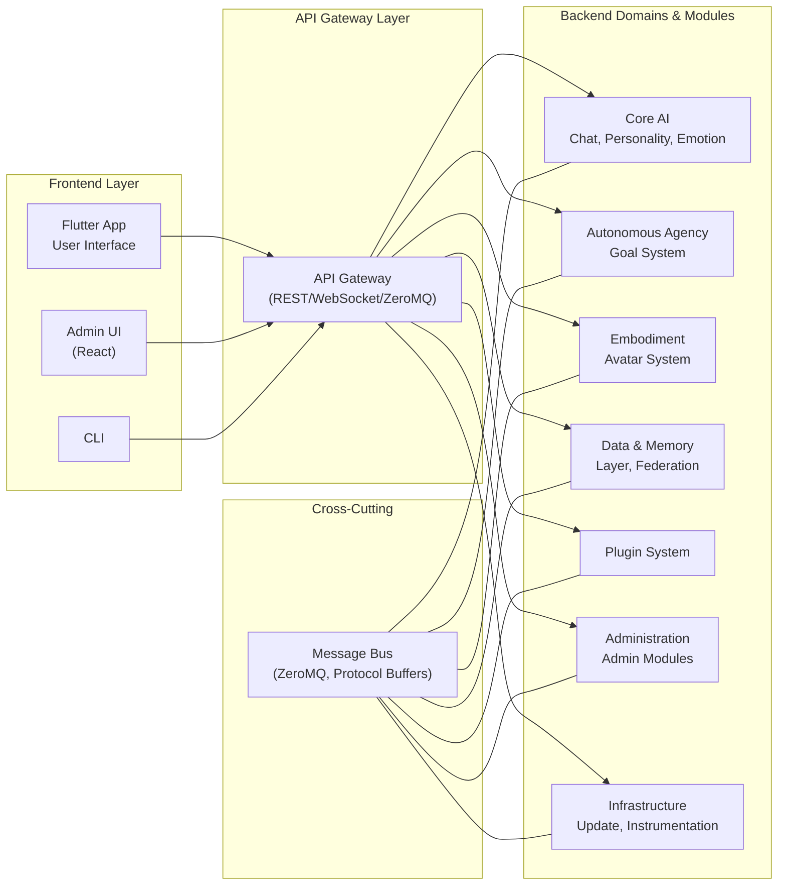

# Architecture

## Project Summary

AICO is an open-source experiment to build an **emotionally present, visually embodied, and proactive AI companion**—intended to act as a confidante and sidekick, not just an assistant. Unlike productivity-oriented chatbots, AICO is designed to sense and adapt to the user's moods, initiate engagement, and form an evolving, personality-rich relationship with a visual, emotional, and proactive presence.

**Core Principles:**
- **Embodiment:** Visual/audio presence and non-verbal communication are core MVP requirements.
- **Autonomous Agency:** AICO initiates, acts, and pursues its own goals and curiosities.
- **Personality & Emotion:** Consistent, evolving personality and sophisticated emotion simulation.
- **Local-First Privacy:** All data and processing are local by default, with user-controlled federated sync.
- **Modular, Extensible System:** System → Module → Component hierarchy, message-driven, plugin-ready.
- **Real-Time Emotional Awareness:** Multi-modal emotion recognition, simulation, and expression.

## System Features

AICO's features are organized into logical modules for development and deployment:

### 🗣️ Conversation & Interaction
- **Chat Interface**: Real-time text-based conversation
- **Voice Interaction**: Speech-to-text and text-to-speech processing
- **Context Management**: Conversation thread management and context switching
- **Autonomous Agency**: Multi-faceted self-directed behavior including:
  - **Goal Generation**: Self-formulated objectives and sub-goals
  - **Curiosity-Driven Learning**: Intrinsic motivation to explore and learn
  - **Interest Development**: Autonomous preference formation and pursuit
  - **Planning & Reasoning**: Multi-step strategic thinking and adaptation
  - **Meta-Cognition**: Self-awareness of learning progress and capabilities
- **Multi-turn Dialogue**: Complex conversation flow management
- **Interruption Handling**: Natural conversation interruption and resumption

### 🧠 Intelligence & Memory
- **Personality Simulation**: Multi-dimensional trait-based personality modeling with:
  - **Trait Vector System**: Management of personality traits (Big Five, HEXACO)
  - **Value System**: Ethical principles and preference management
  - **Expression Mapper**: Translation of traits to behavioral parameters
  - **Consistency Validator**: Ensuring behavioral coherence over time
  - **Personality Evolution**: Gradual adaptation based on interactions
- **Episodic Memory**: Personal experience and interaction history
- **Semantic Memory**: Knowledge base and learned concepts
- **Vector Storage**: ChromaDB-powered embedding storage and similarity search
- **Memory Consolidation**: Long-term memory formation and optimization
- **Context Retrieval**: Relevant memory recall based on current situation

### 😊 Emotion & Awareness
- **Facial Recognition**: Computer vision-based face recognition
- **Visual Emotion Detection**: Computer vision-based emotion recognition
- **Voice Analysis**: Audio-based emotion and sentiment recognition
- **Text Sentiment**: Natural language emotion understanding
- **Behavioral Patterns**: User habit and preference learning
- **Mood Tracking**: Long-term emotional state monitoring
- **Empathetic Responses**: Emotion-appropriate reaction generation

### 🎭 Embodiment & Presence

AICO's embodiment system enables multi-modal presence—visual, vocal, and spatial—across physical and digital environments.

- **Avatar System:** 3D avatars (Ready Player Me) with real-time animation (Three.js, TalkingHead.js)
- **Rendering Pipeline:** Cross-platform 3D graphics (WebGL), integrated in Flutter via WebView
- **Voice & Audio:** Local speech-to-text (Whisper.cpp), text-to-speech (Coqui/Piper)
- **Gesture & Eye Tracking:** Computer vision-based interaction
- **Spatial Intelligence:** Environmental mapping, object recognition, spatial memory
- **Device Integration:** IoT control, multi-device presence, context handoff
- **Deployment Patterns:** Coupled (frontend/backend on same device) and Detached (frontend on lightweight device, backend remote)

### 🔒 Privacy & Security
- **Local Processing**: Edge-first computation and storage
- **Data Encryption**: End-to-end encryption for all personal data
- **Consent Management**: Granular privacy control and permissions
- **Audit Logging**: Transparent data usage tracking
- **Homomorphic Encryption**: Privacy-preserving cloud computations
- **Zero-knowledge Authentication**: Secure access without data exposure

### 🔌 Extensibility & Integration
- **Plugin System**: Community-developed extensions and skills
- **API Gateway**: Unified interface for all system components
- **External Integrations**: Calendar, email, smart home connectivity
- **Custom Skills**: User-defined behaviors and responses
- **Developer Tools**: SDKs and documentation for extensions
- **Marketplace**: Plugin discovery and distribution platform
- **Automated Updates**: Self-updating system with user control

## Design Principles

- **Agency Over Pure Reactivity** - AICO initiates and acts, not just responds
- **Local-First by Default** - All personal data and core inference runs locally
- **Modular Architecture** - Decoupled components with clear interfaces
- **Message-Driven Integration** - Event-based communication via central message bus
- **Multi-Modal Embodiment** - Visual, auditory, and textual presence
- **Emotional Intelligence** - Sophisticated emotion recognition and simulation
- **Privacy by Design** - User control of all data and processing

## Architectural Decisions

- **Hybrid Flutter + WebView UI** - Native app performance with web-based avatar
- **AppraisalCloudPCT for Emotion** - Component Process Model for sophisticated emotions
- **TraitEmergence for Personality** - Multi-dimensional trait-based modeling
- **Multi-Faceted Agency** - Goal generation, curiosity, planning, meta-cognition
- **Topic-Based Pub/Sub** - Standardized message formats with versioned schemas
- **Protocol Buffers Message Format** - High-performance binary serialization with strong typing
- **Plugin Manager as Gateway** - Mediated access for third-party extensions
- **Homomorphic Encryption** - Privacy-preserving cloud computations when needed
- **Sandboxed Plugin Execution** - Isolated environments with permission controls
- **Atomic Updates** - Reliable system updates with rollback capabilities


## System Architecture

AICO's architecture is organized into domains, modules, and components:

```
AICO System
├── Domain: Core Infrastructure
│   ├── Module: Message Bus
│   │   ├── Component: Topic Management
│   │   ├── Component: Message Routing
│   │   └── Component: Plugin Integration
│   ├── Module: Plugin Manager
│   │   ├── Component: Plugin Discovery
│   │   ├── Component: Sandbox Execution
│   │   └── Component: Permission Management
│   ├── Module: API Gateway
│   │   ├── Component: External Interfaces
│   │   └── Component: Protocol Adapters
│   ├── Module: Resource Monitor
│   │   ├── Component: CPU Usage
│   │   ├── Component: Memory Usage
│   │   ├── Component: Battery Status
│   │   └── Component: System Load Metrics
│   └── Module: Update System
│       ├── Component: Version Management
│       └── Component: Atomic Updates
├── Domain: Autonomous Agency
│   ├── Module: Goal System
│   │   ├── Component: Goal Generation
│   │   ├── Component: Goal Prioritization
│   │   └── Component: Goal Tracking
│   ├── Module: Planning System
│   │   ├── Component: Plan Formulation
│   │   ├── Component: Plan Execution
│   │   └── Component: Plan Adaptation
│   ├── Module: Curiosity Engine
│   │   ├── Component: Novelty Detection
│   │   ├── Component: Exploration Strategy
│   │   └── Component: Interest Model
│   ├── Module: Job Scheduler
│   │   ├── Component: Task Queue
│   │   ├── Component: Priority Scheduling
│   │   └── Component: Idle Detection
│   └── Module: Initiative Manager
│       ├── Component: Proactive Engagement
│       └── Component: Conversation Starter
├── Domain: Personality & Emotion
│   ├── Module: Personality Simulation
│   │   ├── Component: Trait Vector System
│   │   ├── Component: Value System
│   │   ├── Component: Expression Mapper
│   │   └── Component: Consistency Validator
│   ├── Module: Emotion Simulation
│   │   ├── Component: Appraisal Engine
│   │   ├── Component: Affect Derivation
│   │   └── Component: Expression Synthesis
│   └── Module: Emotion Recognition
│       ├── Component: Facial Analysis
│       ├── Component: Voice Analysis
│       └── Component: Text Analysis
├── Domain: Self-Awareness
│   ├── Module: State Monitoring
│   │   ├── Component: System Health
│   │   └── Component: Performance Metrics
│   └── Module: Meta-Cognition
│       ├── Component: Reflection Engine
│       └── Component: Self-Assessment
├── Domain: Intelligence & Memory
│   ├── Module: LLM Module
│   │   ├── Component: Model Management
│   │   ├── Component: Inference Engine
│   │   └── Component: Resource Coordination
│   ├── Module: Chat Engine
│   │   ├── Component: Conversation Flow
│   │   ├── Component: Prompt Conditioning
│   │   └── Component: Response Processing
│   ├── Module: Memory System
│   │   ├── Component: Episodic Memory
│   │   ├── Component: Semantic Memory
│   │   ├── Component: Procedural Memory
│   │   └── Component: Memory Consolidation
│   └── Module: Learning System
│       ├── Component: Continual Learning
│       └── Component: Skill Acquisition
├── Domain: User Interface
│   ├── Module: Context Manager
│   │   ├── Component: Conversation State
│   │   └── Component: User Context
│   └── Module: Presentation Layer
│       ├── Component: Flutter UI
│       ├── Component: Avatar System
│       └── Component: Voice & Audio
├── Domain: Privacy & Security
│   ├── Module: Consent Manager
│   │   ├── Component: Permission Control
│   │   └── Component: Data Governance
│   ├── Module: Encryption System
│   │   ├── Component: Data Encryption
│   │   └── Component: Secure Communication
│   └── Module: Audit System
│       ├── Component: Activity Logging
│       └── Component: Compliance Monitoring
├── Domain: Administration
│   ├── Module: System Config Manager
│   │   ├── Component: Config Loader
│   │   └── Component: Config Validator
│   ├── Module: Instrumentation & Logging
│   │   ├── Component: Log Aggregator
│   │   ├── Component: Log Rotation
│   │   └── Component: Diagnostics Export
│   ├── Module: Resource Monitor (Admin)
│   │   ├── Component: System Status Dashboard
│   │   ├── Component: Resource Alerts
│   │   └── Component: Health Checks
│   ├── Module: Plugin Admin
│   │   ├── Component: Install/Disable/Update
│   │   └── Component: Sandbox Policy Control
│   ├── Module: Update Admin
│   │   ├── Component: System Updates
│   │   └── Component: Module Updates
│   ├── Module: Audit & Compliance (Admin)
│   │   ├── Component: Admin Log Access
│   │   └── Component: Compliance Dashboard
│   ├── Module: Backup & Restore
│   │   ├── Component: Snapshot Manager
│   │   └── Component: Restore Engine
│   ├── Module: Developer Tools
│   │   ├── Component: Hot Reload
│   │   └── Component: Profiling & Debug
│   ├── Module: Admin Access Control
│   │   ├── Component: Admin Authentication
│   │   └── Component: Privilege Management
│   ├── Module: Notification Center
│   │   ├── Component: Critical Event Alerts
│   │   └── Component: Admin Messaging
│   └── Module: Policy Manager
│       ├── Component: Resource Limits
│       └── Component: Plugin Permissions
└── Domain: Extensibility & Integration
    ├── Module: Plugin System
    │   ├── Component: Community-Developed Extensions
    │   └── Component: Skill Acquisition
    ├── Module: API Gateway
    │   ├── Component: External Interfaces
    │   └── Component: Protocol Adapters
    ├── Module: External Integrations
    │   ├── Component: Calendar, Email, Smart Home
    │   └── Component: Custom Integrations
    ├── Module: Custom Skills
    │   ├── Component: User-Defined Behaviors
    │   └── Component: Response Generation
    ├── Module: Developer Tools
    │   ├── Component: SDKs and Documentation
    │   └── Component: Testing Framework
    ├── Module: Marketplace
    │   ├── Component: Plugin Discovery
    │   └── Component: Distribution Platform
    └── Module: Automated Updates
        ├── Component: Self-Updating System
        └── Component: User Control

```

## Main parts

The AICO system consists of the following main parts:
- Backend service
- Frontend app
- Admin UI
- CLI

**Backend Service**
The backend service is a Python application that provides the core functionality of AICO. It is built using FastAPI and ZeroMQ, and it is responsible for managing the state of the system, handling user input, and coordinating the work of the various domains.

**Frontend App**

The frontend app is a Flutter application that provides a user interface for interacting with AICO. It is built using the Flutter framework and the Dart programming language and provides a responsive and intuitive interface for users to interact with AICO.

**Admin UI**
The admin UI is a web application that provides a user interface for managing the system. It is built using the React framework and provides a responsive and intuitive interface for developers and advanced users to manage the system.

**CLI**
The CLI is a Python application that provides a command-line interface for interacting with AICO. It provides a simple and intuitive interface for developers and advanced users to interact with AICO.

## Architecture Patterns

AICO's core architecture is designed to maximize modularity and maintain low coupling, with clear boundaries between domains (e.g. Personality, Emotion, Agency, Memory, etc.). The system uses a message-driven architecture with distinct frontend and backend components.

### Modular Message-Driven Design
- **Each domain/module is a distinct code package or subsystem** with its own internal state, logic, and strict interface.
- **All communication between modules is via the internal message bus** (ZeroMQ), within the backend service.
- **No direct function calls or shared state between modules** (except for startup/configuration)—all data exchange is through published/subscribed messages.
- **Each module subscribes to topics and publishes outputs on its own topics**, using versioned, validated JSON schemas.
- **Modules can be developed, tested, and even replaced independently** as long as they honor the message contracts.

### Low Coupling and Contract Guarantees
- **Loose Coupling:** Modules are only coupled by the message schemas and topic contracts—not by code dependencies or shared state.
- **Contract Enforcement:** The message bus enforces versioned schemas, so if a publisher or subscriber changes, integration tests will catch contract violations.
- **Pluggability:** Any module could, in theory, be extracted into a separate process or container in the future with minimal refactor, since all communication is already message-based.

### Client-Service Architecture
- **Separation of Concerns:** Frontend handles presentation and user interaction, backend manages all AI processing and data persistence.
- **Persistent Backend Service:** Backend runs continuously as a system service, enabling proactive agency and background processing.
- **Thin Client Pattern:** Frontend is a lightweight client that connects to the backend via REST API/WebSocket.

### Architecture Overview




**Communication Flow:**

1. **Frontend → API Gateway**: HTTP/WebSocket calls for user interactions
2. **API Gateway → Message Bus**: Publishes events to appropriate topics
3. **Message Bus → Modules**: Distributes messages to subscribed backend modules
4. **Module → Module**: Inter-module communication via message bus only
5. **Backend → Frontend**: Real-time updates via WebSocket notifications

**Key Architectural Principles:**

- **🔄 Message-Driven**: All backend communication via ZeroMQ pub/sub
- **🏗️ Modular Design**: Independent modules with clear boundaries
- **🔌 Loose Coupling**: Modules only depend on message contracts
- **⚡ Responsive UI**: Frontend never blocks on backend processing
- **🔒 Secure**: API Gateway controls all external access
- **📈 Scalable**: Modules can be moved to separate processes/containers


## Frontend

The AICO frontend is implemented as a Flutter application that serves as a thin client, focusing on user interface and real-time interaction while delegating all heavy processing to the backend service.

### Flutter Application Architecture
- **Thin Client Design:** The UI (Flutter app) is a lightweight client that connects to the backend via local REST API/WebSocket.
- **Real-time Communication:** WebSocket connections enable real-time updates from the backend for notifications and status changes.
- **Responsive Interface:** UI remains responsive at all times since no heavy processing occurs in the frontend.
- **Cross-platform Support:** Flutter enables consistent experience across desktop, mobile, and web platforms.

### Frontend Responsibilities
- **User Interface Rendering:** Chat interface, settings, avatar display, and all visual components.
- **User Input Handling:** Text input, voice capture, gesture recognition, and user interactions.
- **Real-time Updates:** Receiving and displaying notifications, status updates, and background accomplishments from the backend.
- **Local State Management:** Managing UI state, user preferences, and temporary display data.

### Connection Management
- **Automatic Reconnection:** Frontend automatically reconnects to backend service if connection is lost.
- **Offline Graceful Degradation:** UI provides appropriate feedback when backend is unavailable.
- **Session Continuity:** When UI reconnects, backend proactively notifies of any background accomplishments or updates.

### Update Management
- **Update Notifications:** Displays update availability notifications from the backend with changelog details.
- **User Consent Interface:** Provides UI for users to approve, schedule, or defer updates.
- **Update Progress:** Shows download and installation progress for both frontend and backend updates.
- **Restart Coordination:** Handles graceful shutdown and restart during update installation.
- **Update Preferences:** Allows users to configure update settings (automatic/manual, channels, scheduling).
- **Rollback Interface:** Provides one-click rollback option if users experience issues post-update.

## Backend

The AICO backend runs as a persistent system service, handling all AI processing, data management, and autonomous agency tasks. This design enables continuous operation and proactive behavior even when the UI is closed.

### Service Architecture
- **System Service:** Backend runs as a system/background service (Windows Service, Linux daemon, macOS LaunchAgent).
- **Continuous Operation:** Backend continues agency tasks (learning, research, reminders) even when UI is closed or minimized.
- **Resource-Aware Processing:** All heavy AI processing occurs in the backend with intelligent resource management.

### Local LLM Integration

AICO uses an **integrated service pattern** for local LLM deployment:

- **LLM Module:** Runs within the backend service process, not as a separate container/daemon
- **Ollama Integration:** Uses Ollama Python client library for model management and inference
- **Message Bus Communication:** LLM Module communicates via ZeroMQ like all other modules
- **Resource Coordination:** Integrates with existing Resource Monitor for CPU/memory/battery policies
- **Context Integration:** Receives real-time personality and emotion context for prompt conditioning

This approach maintains architectural consistency, simplifies deployment, and enables tight integration with AICO's personality and emotion systems while preserving privacy through local-only processing.

### Core Backend Components

#### Single Multi-Protocol API Gateway
The API gateway is the single and multi-protocol entrypoint for the backend services. It acts as the counterpart for the Flutter UI, other UIs, embodiment adapters and other external services.

- **REST API:** Standard HTTP API for commands, queries, and configuration.
- **WebSocket API:** Real-time, bidirectional communication for events and notifications.
- **(optional) gRPC:** High-performance, binary-protocol API for internal services.

#### Job Scheduler & Task Queue
- **Task Management:** Internal job/task queue manages all long-running, background, or proactive jobs (skill brushing, summarization, research).
- **Priority Scheduling:** UI/interactive tasks always run first; background jobs are paused/throttled if system is busy.
- **Resource-Aware Scheduling:** Job Scheduler can defer or cancel tasks based on system load and user preferences.

#### Resource Monitor
- **System Monitoring:** Tracks CPU, memory, battery, and system load metrics in real-time.
- **Policy Enforcement:** User-configurable policies (e.g., "only run background jobs when on AC power" or "limit CPU usage to 20%").
- **Adaptive Behavior:** Modules (especially Agency and Learning) query Resource Monitor before starting background work.

#### Autonomous Agency Engine
- **Idle Detection:** Detects system/user idle periods for opportunistic background tasks.
- **Background Learning:** Performs learning, research, skill updates during spare time.
- **User-Configurable Limits:** Users control which activities are allowed and resource limits.

#### Message Bus
- **Topic Management:** Manages publish/subscribe topics for inter-module communication.
- **Message Routing:** Routes messages between modules based on topic subscriptions.
- **Plugin Integration:** Enables third-party plugins to communicate via the message bus.

#### Plugin Manager
- **Plugin Discovery:** Automatically discovers and loads available plugins.
- **Sandbox Execution:** Runs plugins in isolated environments for security.
- **Permission Management:** Controls plugin access to system resources and data.

#### Update System
The Update System manages automatic updates for both frontend and backend components while ensuring user control and system reliability.

**Update Architecture:**
- **Update Orchestrator (Backend):** Centralized update management running in the backend service
- **Update Checker:** Periodically checks for updates to both frontend and backend components
- **Update Downloader:** Securely downloads updates with signature verification
- **Update Installer:** Coordinates installation of frontend and backend updates
- **Rollback Manager:** Provides rollback capabilities if updates fail

**Update Flow:**
1. **Automatic Checking:** Backend periodically checks for updates (configurable interval, default: daily)
2. **User Notification:** Frontend displays update notifications with details and changelog
3. **User Consent:** User approves/schedules updates through the frontend UI
4. **Coordinated Installation:** Backend orchestrates installation of both components
5. **Restart Coordination:** Manages restart sequence (backend first, then frontend reconnection)
6. **Verification:** Ensures both components are running correctly post-update

**Update Types:**
- **Backend Updates:** Service restarts automatically, frontend reconnects seamlessly
- **Frontend Updates:** Downloaded and applied when frontend restarts
- **Coordinated Updates:** Both components updated in sequence with user consent
- **Security Updates:** Can be marked as critical with expedited user notification

**User Control:**
- **Update Preferences:** Users can configure automatic vs manual updates
- **Scheduling:** Users can schedule updates for convenient times
- **Rollback Option:** One-click rollback if issues occur post-update
- **Update Channels:** Stable, beta, or development update channels

#### Goal System
- **Goal Generation:** Creates self-formulated objectives and sub-goals.
- **Goal Prioritization:** Manages goal importance and scheduling.
- **Goal Tracking:** Monitors progress toward objectives.

#### Planning System
- **Plan Formulation:** Creates multi-step strategic plans to achieve goals.
- **Plan Execution:** Manages plan implementation and task coordination.
- **Plan Adaptation:** Adjusts plans based on changing circumstances.

#### Curiosity Engine
- **Novelty Detection:** Identifies new or interesting information and experiences.
- **Exploration Strategy:** Determines what to explore and learn about.
- **Interest Model:** Maintains and evolves areas of curiosity and interest.

#### Initiative Manager
- **Proactive Engagement:** Initiates conversations and interactions with users.
- **Conversation Starter:** Generates contextually appropriate conversation topics.

#### Personality Simulation
- **Trait Vector System:** Manages personality traits (Big Five, HEXACO).
- **Value System:** Maintains ethical principles and preferences.
- **Expression Mapper:** Translates personality traits to behavioral parameters.
- **Consistency Validator:** Ensures behavioral coherence over time.

#### Emotion Simulation
- **Appraisal Engine:** Processes emotional appraisals using Component Process Model.
- **Affect Derivation:** Maps appraisals to emotional states.
- **Expression Synthesis:** Coordinates emotional expression across modalities.

#### Emotion Recognition
- **Facial Analysis:** Computer vision-based emotion detection from facial expressions.
- **Voice Analysis:** Audio-based emotion and sentiment recognition.
- **Text Analysis:** Natural language emotion understanding.

#### LLM Module
- **Model Management:** Manages local LLM models (Ollama) including loading, unloading, and updates.
- **Inference Engine:** Handles quantized model inference with resource-aware processing.
- **Resource Coordination:** Integrates with Resource Monitor for CPU/memory/battery policy enforcement.

#### Chat Engine
- **Conversation Flow:** Manages dialogue state, context, and multi-turn conversations.
- **Prompt Conditioning:** Incorporates personality and emotional context into prompts via message bus.
- **Response Processing:** Processes LLM responses and coordinates with other modules.

#### Memory System
- **Episodic Memory:** Stores personal experiences and interaction history.
- **Semantic Memory:** Maintains knowledge base and learned concepts.
- **Procedural Memory:** Stores learned skills and behavioral patterns.
- **Memory Consolidation:** Long-term memory formation and optimization.

#### Data & Storage Layer
- **Multi-Database Architecture:** Specialized databases for different workloads.
- **Primary Storage (libSQL):** Core structured data with built-in encryption.
- **Vector Database (ChromaDB):** Embedding storage and similarity search.
- **Analytical Engine (DuckDB):** Fast analytical processing for complex queries.
- **Key-Value Store (RocksDB):** Optional high-performance caching layer.
- **Federated Sync:** P2P encrypted device synchronization.

#### Learning System
- **Continual Learning:** Ongoing learning from interactions and experiences.
- **Skill Acquisition:** Learning new capabilities and behaviors.

#### Context Manager
- **Conversation State:** Maintains current conversation context and history.
- **User Context:** Tracks user preferences, mood, and situational context.

#### State Monitoring
- **System Health:** Monitors backend system health and performance.
- **Performance Metrics:** Tracks system performance and resource usage.

#### Meta-Cognition
- **Reflection Engine:** Self-reflection on learning and behavior.
- **Self-Assessment:** Evaluation of capabilities and performance.

#### Consent Manager
- **Permission Control:** Manages user permissions and privacy settings.
- **Data Governance:** Ensures compliance with privacy policies.

#### Encryption System
- **Data Encryption:** Encrypts stored personal data and memories.
- **Secure Communication:** Ensures secure communication channels.

#### Audit System
- **Activity Logging:** Logs system activities for transparency.
- **Compliance Monitoring:** Monitors compliance with privacy and security policies.

### Backend Use Cases
- **Proactive Preparation:** AICO prepares summaries or suggestions while UI is closed.
- **Background Skill Development:** Agency module practices or updates skills, pausing if user becomes active.
- **Dynamic Resource Management:** System throttles non-essential jobs during high CPU/memory usage or on battery power.
- **Continuous Availability:** Backend remains ready to respond instantly when user opens UI.

