# Architecture

## Project Summary

AICO is an open-source experiment to build an **emotionally present, embodied, and proactive AI companion**—meant to act as more of a confidante and sidekick than a traditional assistant. Unlike typical productivity-oriented virtual assistants, AICO is designed to sense and adapt to the user's moods, initiate engagement, and form an evolving, personality-rich relationship.

**Core Principles:**
- **Autonomous agency** - AICO has its own goals, interests, and curiosities that drive self-directed behavior and learning
- **Strong user-centric privacy** - Local-first with full user control
- **Modular, extensible architecture** - Prioritizes companionship and long-term learning
- **Real-time emotional awareness** - Multi-modal emotion recognition and adaptation

## System Features

AICO's features are organized into logical modules for development and deployment:

### 🗣️ Conversation & Interaction
- **Chat Interface**: Real-time text-based conversation
- **Voice Interaction**: Speech-to-text and text-to-speech processing
- **Context Management**: Conversation thread management and context switching
- **Autonomous Agency**: Multi-faceted self-directed behavior including:
  - **Goal Generation**: Self-formulated objectives and sub-goals
  - **Curiosity-Driven Learning**: Intrinsic motivation to explore and learn
  - **Interest Development**: Autonomous preference formation and pursuit
  - **Planning & Reasoning**: Multi-step strategic thinking and adaptation
  - **Meta-Cognition**: Self-awareness of learning progress and capabilities
- **Multi-turn Dialogue**: Complex conversation flow management
- **Interruption Handling**: Natural conversation interruption and resumption

### 🧠 Intelligence & Memory
- **Personality Simulation**: Multi-dimensional trait-based personality modeling with:
  - **Trait Vector System**: Management of personality traits (Big Five, HEXACO)
  - **Value System**: Ethical principles and preference management
  - **Expression Mapper**: Translation of traits to behavioral parameters
  - **Consistency Validator**: Ensuring behavioral coherence over time
  - **Personality Evolution**: Gradual adaptation based on interactions
- **Episodic Memory**: Personal experience and interaction history
- **Semantic Memory**: Knowledge base and learned concepts
- **Vector Storage**: ChromaDB-powered embedding storage and similarity search
- **Memory Consolidation**: Long-term memory formation and optimization
- **Context Retrieval**: Relevant memory recall based on current situation

### 😊 Emotion & Awareness
- **Facial Recognition**: Computer vision-based emotion detection
- **Voice Analysis**: Audio-based emotion and sentiment recognition
- **Text Sentiment**: Natural language emotion understanding
- **Behavioral Patterns**: User habit and preference learning
- **Mood Tracking**: Long-term emotional state monitoring
- **Empathetic Responses**: Emotion-appropriate reaction generation

### 🎭 Embodiment & Presence

**Embodiment** is AICO's ability to manifest as a physical presence through avatars, voice, gestures, and spatial awareness across different devices and environments.

- **Avatar System**: Visual representation and animation
- **Gesture Recognition**: Body language understanding
- **Spatial Awareness**: Environmental context understanding
- **Physical Presence**: Desktop, mobile, or projected embodiment
- **AR/VR Integration**: Immersive interaction capabilities
- **Federated Device Roaming**: AICO's ability to seamlessly transition between devices while maintaining continuity of state, context, and capabilities
- **Multi-device Sync**: Zero-knowledge presence coordination across devices

### 🔒 Privacy & Security
- **Local Processing**: Edge-first computation and storage
- **Data Encryption**: End-to-end encryption for all personal data
- **Consent Management**: Granular privacy control and permissions
- **Audit Logging**: Transparent data usage tracking
- **Homomorphic Encryption**: Privacy-preserving cloud computations
- **Zero-knowledge Authentication**: Secure access without data exposure

### 🔌 Extensibility & Integration
- **Plugin System**: Community-developed extensions and skills
- **API Gateway**: Unified interface for all system components
- **External Integrations**: Calendar, email, smart home connectivity
- **Custom Skills**: User-defined behaviors and responses
- **Developer Tools**: SDKs and documentation for extensions
- **Marketplace**: Plugin discovery and distribution platform
- **Automated Updates**: Self-updating system with user control

## Design Principles

- **Agency Over Pure Reactivity** - AICO initiates and acts, not just responds
- **Local-First by Default** - All personal data and core inference runs locally
- **Modular Architecture** - Decoupled components with clear interfaces
- **Message-Driven Integration** - Event-based communication via central message bus
- **Multi-Modal Embodiment** - Visual, auditory, and textual presence
- **Emotional Intelligence** - Sophisticated emotion recognition and simulation
- **Privacy by Design** - User control of all data and processing

## Architectural Decisions

- **Hybrid Flutter + WebView UI** - Native app performance with web-based avatar
- **AppraisalCloudPCT for Emotion** - Component Process Model for sophisticated emotions
- **TraitEmergence for Personality** - Multi-dimensional trait-based modeling
- **Multi-Faceted Agency** - Goal generation, curiosity, planning, meta-cognition
- **Topic-Based Pub/Sub** - Standardized message formats with versioned schemas
- **JSON Message Format** - Human-readable, widely supported serialization
- **Plugin Manager as Gateway** - Mediated access for third-party extensions
- **Homomorphic Encryption** - Privacy-preserving cloud computations when needed
- **Sandboxed Plugin Execution** - Isolated environments with permission controls
- **Atomic Updates** - Reliable system updates with rollback capabilities


## System Architecture

AICO's architecture is organized into domains, modules, and components:

```
AICO System
├── Domain: Core Infrastructure
│   ├── Module: Message Bus
│   │   ├── Component: Topic Management
│   │   ├── Component: Message Routing
│   │   └── Component: Plugin Integration
│   ├── Module: Plugin Manager
│   │   ├── Component: Plugin Discovery
│   │   ├── Component: Sandbox Execution
│   │   └── Component: Permission Management
│   ├── Module: API Gateway
│   │   ├── Component: External Interfaces
│   │   └── Component: Protocol Adapters
│   ├── Module: Resource Monitor
│   │   ├── Component: CPU Usage
│   │   ├── Component: Memory Usage
│   │   ├── Component: Battery Status
│   │   └── Component: System Load Metrics
│   └── Module: Update System
│       ├── Component: Version Management
│       └── Component: Atomic Updates
├── Domain: Autonomous Agency
│   ├── Module: Goal System
│   │   ├── Component: Goal Generation
│   │   ├── Component: Goal Prioritization
│   │   └── Component: Goal Tracking
│   ├── Module: Planning System
│   │   ├── Component: Plan Formulation
│   │   ├── Component: Plan Execution
│   │   └── Component: Plan Adaptation
│   ├── Module: Curiosity Engine
│   │   ├── Component: Novelty Detection
│   │   ├── Component: Exploration Strategy
│   │   └── Component: Interest Model
│   ├── Module: Job Scheduler
│   │   ├── Component: Task Queue
│   │   ├── Component: Priority Scheduling
│   │   └── Component: Idle Detection
│   └── Module: Initiative Manager
│       ├── Component: Proactive Engagement
│       └── Component: Conversation Starter
├── Domain: Personality & Emotion
│   ├── Module: Personality Simulation
│   │   ├── Component: Trait Vector System
│   │   ├── Component: Value System
│   │   ├── Component: Expression Mapper
│   │   └── Component: Consistency Validator
│   ├── Module: Emotion Simulation
│   │   ├── Component: Appraisal Engine
│   │   ├── Component: Affect Derivation
│   │   └── Component: Expression Synthesis
│   └── Module: Emotion Recognition
│       ├── Component: Facial Analysis
│       ├── Component: Voice Analysis
│       └── Component: Text Analysis
├── Domain: Self-Awareness
│   ├── Module: State Monitoring
│   │   ├── Component: System Health
│   │   └── Component: Performance Metrics
│   └── Module: Meta-Cognition
│       ├── Component: Reflection Engine
│       └── Component: Self-Assessment
├── Domain: Intelligence & Memory
│   ├── Module: LLM Module
│   │   ├── Component: Model Management
│   │   ├── Component: Inference Engine
│   │   └── Component: Resource Coordination
│   ├── Module: Chat Engine
│   │   ├── Component: Conversation Flow
│   │   ├── Component: Prompt Conditioning
│   │   └── Component: Response Processing
│   ├── Module: Memory System
│   │   ├── Component: Episodic Memory
│   │   ├── Component: Semantic Memory
│   │   ├── Component: Procedural Memory
│   │   └── Component: Memory Consolidation
│   └── Module: Learning System
│       ├── Component: Continual Learning
│       └── Component: Skill Acquisition
├── Domain: User Interface
│   ├── Module: Context Manager
│   │   ├── Component: Conversation State
│   │   └── Component: User Context
│   └── Module: Presentation Layer
│       ├── Component: Flutter UI
│       ├── Component: Avatar System
│       └── Component: Voice & Audio
└── Domain: Privacy & Security
    ├── Module: Consent Manager
    │   ├── Component: Permission Control
    │   └── Component: Data Governance
    ├── Module: Encryption System
    │   ├── Component: Data Encryption
    │   └── Component: Secure Communication
    └── Module: Audit System
        ├── Component: Activity Logging
        └── Component: Compliance Monitoring
```

---

## Architecture Patterns

AICO's core architecture is designed to maximize modularity and maintain low coupling, with clear boundaries between domains (e.g. Personality, Emotion, Agency, Memory, etc.). The system uses a message-driven architecture with distinct frontend and backend components.

### Modular Message-Driven Design
- **Each domain/module is a distinct code package or subsystem** with its own internal state, logic, and strict interface.
- **All communication between modules is via the internal message bus** (ZeroMQ), within the backend service.
- **No direct function calls or shared state between modules** (except for startup/configuration)—all data exchange is through published/subscribed messages.
- **Each module subscribes to topics and publishes outputs on its own topics**, using versioned, validated JSON schemas.
- **Modules can be developed, tested, and even replaced independently** as long as they honor the message contracts.

### Low Coupling and Contract Guarantees
- **Loose Coupling:** Modules are only coupled by the message schemas and topic contracts—not by code dependencies or shared state.
- **Contract Enforcement:** The message bus enforces versioned schemas, so if a publisher or subscriber changes, integration tests will catch contract violations.
- **Pluggability:** Any module could, in theory, be extracted into a separate process or container in the future with minimal refactor, since all communication is already message-based.

### Client-Service Architecture
- **Separation of Concerns:** Frontend handles presentation and user interaction, backend manages all AI processing and data persistence.
- **Persistent Backend Service:** Backend runs continuously as a system service, enabling proactive agency and background processing.
- **Thin Client Pattern:** Frontend is a lightweight client that connects to the backend via REST API/WebSocket.

### Architecture Overview

```mermaid
flowchart TD
    F["🖥️ FRONTEND<br/>Flutter App"] --> G["🌐 API GATEWAY<br/>REST/WebSocket/gRPC"]
    G --> M["📡 MESSAGE BUS<br/>ZeroMQ Pub/Sub"]
    M --> B["⚙️ BACKEND SERVICE<br/>Python Modules"]
    
    subgraph "Frontend Components"
        F1["UI & Chat"]
        F2["Avatar System"]
        F3["Input Handling"]
        F4["Update Manager"]
    end
    
    subgraph "Backend Modules"
        B1["🏗️ Infrastructure"]
        B2["🧠 AI Intelligence"]
        B3["😊 Personality & Emotion"]
        B4["🎯 Autonomous Agency"]
        B5["🔒 Privacy & Security"]
        B6["🔍 Self-Awareness"]
    end
    
    F -.-> F1
    F -.-> F2
    F -.-> F3
    F -.-> F4
    
    B -.-> B1
    B -.-> B2
    B -.-> B3
    B -.-> B4
    B -.-> B5
    B -.-> B6
```



**Alternative: Unicode diagram for better visual detail**


**Communication Flow:**

1. **Frontend → API Gateway**: HTTP/WebSocket calls for user interactions
2. **API Gateway → Message Bus**: Publishes events to appropriate topics
3. **Message Bus → Modules**: Distributes messages to subscribed backend modules
4. **Module → Module**: Inter-module communication via message bus only
5. **Backend → Frontend**: Real-time updates via WebSocket notifications

**Key Architectural Principles:**

- **🔄 Message-Driven**: All backend communication via ZeroMQ pub/sub
- **🏗️ Modular Design**: Independent modules with clear boundaries
- **🔌 Loose Coupling**: Modules only depend on message contracts
- **⚡ Responsive UI**: Frontend never blocks on backend processing
- **🔒 Secure**: API Gateway controls all external access
- **📈 Scalable**: Modules can be moved to separate processes/containers


## Frontend

The AICO frontend is implemented as a Flutter application that serves as a thin client, focusing on user interface and real-time interaction while delegating all heavy processing to the backend service.

### Flutter Application Architecture
- **Thin Client Design:** The UI (Flutter app) is a lightweight client that connects to the backend via local REST API/WebSocket.
- **Real-time Communication:** WebSocket connections enable real-time updates from the backend for notifications and status changes.
- **Responsive Interface:** UI remains responsive at all times since no heavy processing occurs in the frontend.
- **Cross-platform Support:** Flutter enables consistent experience across desktop, mobile, and web platforms.

### Frontend Responsibilities
- **User Interface Rendering:** Chat interface, settings, avatar display, and all visual components.
- **User Input Handling:** Text input, voice capture, gesture recognition, and user interactions.
- **Real-time Updates:** Receiving and displaying notifications, status updates, and background accomplishments from the backend.
- **Local State Management:** Managing UI state, user preferences, and temporary display data.

### Connection Management
- **Automatic Reconnection:** Frontend automatically reconnects to backend service if connection is lost.
- **Offline Graceful Degradation:** UI provides appropriate feedback when backend is unavailable.
- **Session Continuity:** When UI reconnects, backend proactively notifies of any background accomplishments or updates.

### Update Management
- **Update Notifications:** Displays update availability notifications from the backend with changelog details.
- **User Consent Interface:** Provides UI for users to approve, schedule, or defer updates.
- **Update Progress:** Shows download and installation progress for both frontend and backend updates.
- **Restart Coordination:** Handles graceful shutdown and restart during update installation.
- **Update Preferences:** Allows users to configure update settings (automatic/manual, channels, scheduling).
- **Rollback Interface:** Provides one-click rollback option if users experience issues post-update.

## Backend

The AICO backend runs as a persistent system service, handling all AI processing, data management, and autonomous agency tasks. This design enables continuous operation and proactive behavior even when the UI is closed.

### Service Architecture
- **System Service:** Backend runs as a system/background service (Windows Service, Linux daemon, macOS LaunchAgent).
- **Continuous Operation:** Backend continues agency tasks (learning, research, reminders) even when UI is closed or minimized.
- **Resource-Aware Processing:** All heavy AI processing occurs in the backend with intelligent resource management.

### Local LLM Integration

AICO uses an **integrated service pattern** for local LLM deployment:

- **LLM Module:** Runs within the backend service process, not as a separate container/daemon
- **Ollama Integration:** Uses Ollama Python client library for model management and inference
- **Message Bus Communication:** LLM Module communicates via ZeroMQ like all other modules
- **Resource Coordination:** Integrates with existing Resource Monitor for CPU/memory/battery policies
- **Context Integration:** Receives real-time personality and emotion context for prompt conditioning

This approach maintains architectural consistency, simplifies deployment, and enables tight integration with AICO's personality and emotion systems while preserving privacy through local-only processing.

### Core Backend Components

#### Single Multi-Protocol API Gateway
The API gateway is the single and multi-protocol entrypoint for the backend services. It acts as the counterpart for the Flutter UI, other UIs, embodiment adapters and other external services.

- **REST API:** Standard HTTP API for commands, queries, and configuration.
- **WebSocket API:** Real-time, bidirectional communication for events and notifications.
- **(optional) gRPC:** High-performance, binary-protocol API for internal services.

#### Job Scheduler & Task Queue
- **Task Management:** Internal job/task queue manages all long-running, background, or proactive jobs (skill brushing, summarization, research).
- **Priority Scheduling:** UI/interactive tasks always run first; background jobs are paused/throttled if system is busy.
- **Resource-Aware Scheduling:** Job Scheduler can defer or cancel tasks based on system load and user preferences.

#### Resource Monitor
- **System Monitoring:** Tracks CPU, memory, battery, and system load metrics in real-time.
- **Policy Enforcement:** User-configurable policies (e.g., "only run background jobs when on AC power" or "limit CPU usage to 20%").
- **Adaptive Behavior:** Modules (especially Agency and Learning) query Resource Monitor before starting background work.

#### Autonomous Agency Engine
- **Idle Detection:** Detects system/user idle periods for opportunistic background tasks.
- **Background Learning:** Performs learning, research, skill updates during spare time.
- **User-Configurable Limits:** Users control which activities are allowed and resource limits.

#### Message Bus
- **Topic Management:** Manages publish/subscribe topics for inter-module communication.
- **Message Routing:** Routes messages between modules based on topic subscriptions.
- **Plugin Integration:** Enables third-party plugins to communicate via the message bus.

#### Plugin Manager
- **Plugin Discovery:** Automatically discovers and loads available plugins.
- **Sandbox Execution:** Runs plugins in isolated environments for security.
- **Permission Management:** Controls plugin access to system resources and data.

#### Update System
The Update System manages automatic updates for both frontend and backend components while ensuring user control and system reliability.

**Update Architecture:**
- **Update Orchestrator (Backend):** Centralized update management running in the backend service
- **Update Checker:** Periodically checks for updates to both frontend and backend components
- **Update Downloader:** Securely downloads updates with signature verification
- **Update Installer:** Coordinates installation of frontend and backend updates
- **Rollback Manager:** Provides rollback capabilities if updates fail

**Update Flow:**
1. **Automatic Checking:** Backend periodically checks for updates (configurable interval, default: daily)
2. **User Notification:** Frontend displays update notifications with details and changelog
3. **User Consent:** User approves/schedules updates through the frontend UI
4. **Coordinated Installation:** Backend orchestrates installation of both components
5. **Restart Coordination:** Manages restart sequence (backend first, then frontend reconnection)
6. **Verification:** Ensures both components are running correctly post-update

**Update Types:**
- **Backend Updates:** Service restarts automatically, frontend reconnects seamlessly
- **Frontend Updates:** Downloaded and applied when frontend restarts
- **Coordinated Updates:** Both components updated in sequence with user consent
- **Security Updates:** Can be marked as critical with expedited user notification

**User Control:**
- **Update Preferences:** Users can configure automatic vs manual updates
- **Scheduling:** Users can schedule updates for convenient times
- **Rollback Option:** One-click rollback if issues occur post-update
- **Update Channels:** Stable, beta, or development update channels

#### Goal System
- **Goal Generation:** Creates self-formulated objectives and sub-goals.
- **Goal Prioritization:** Manages goal importance and scheduling.
- **Goal Tracking:** Monitors progress toward objectives.

#### Planning System
- **Plan Formulation:** Creates multi-step strategic plans to achieve goals.
- **Plan Execution:** Manages plan implementation and task coordination.
- **Plan Adaptation:** Adjusts plans based on changing circumstances.

#### Curiosity Engine
- **Novelty Detection:** Identifies new or interesting information and experiences.
- **Exploration Strategy:** Determines what to explore and learn about.
- **Interest Model:** Maintains and evolves areas of curiosity and interest.

#### Initiative Manager
- **Proactive Engagement:** Initiates conversations and interactions with users.
- **Conversation Starter:** Generates contextually appropriate conversation topics.

#### Personality Simulation
- **Trait Vector System:** Manages personality traits (Big Five, HEXACO).
- **Value System:** Maintains ethical principles and preferences.
- **Expression Mapper:** Translates personality traits to behavioral parameters.
- **Consistency Validator:** Ensures behavioral coherence over time.

#### Emotion Simulation
- **Appraisal Engine:** Processes emotional appraisals using Component Process Model.
- **Affect Derivation:** Maps appraisals to emotional states.
- **Expression Synthesis:** Coordinates emotional expression across modalities.

#### Emotion Recognition
- **Facial Analysis:** Computer vision-based emotion detection from facial expressions.
- **Voice Analysis:** Audio-based emotion and sentiment recognition.
- **Text Analysis:** Natural language emotion understanding.

#### LLM Module
- **Model Management:** Manages local LLM models (Ollama) including loading, unloading, and updates.
- **Inference Engine:** Handles quantized model inference with resource-aware processing.
- **Resource Coordination:** Integrates with Resource Monitor for CPU/memory/battery policy enforcement.

#### Chat Engine
- **Conversation Flow:** Manages dialogue state, context, and multi-turn conversations.
- **Prompt Conditioning:** Incorporates personality and emotional context into prompts via message bus.
- **Response Processing:** Processes LLM responses and coordinates with other modules.

#### Memory System
- **Episodic Memory:** Stores personal experiences and interaction history.
- **Semantic Memory:** Maintains knowledge base and learned concepts.
- **Procedural Memory:** Stores learned skills and behavioral patterns.
- **Memory Consolidation:** Long-term memory formation and optimization.

#### Data & Storage Layer
- **Multi-Database Architecture:** Specialized databases for different workloads.
- **Primary Storage (libSQL):** Core structured data with built-in encryption.
- **Vector Database (ChromaDB):** Embedding storage and similarity search.
- **Analytical Engine (DuckDB):** Fast analytical processing for complex queries.
- **Key-Value Store (RocksDB):** Optional high-performance caching layer.
- **Federated Sync:** P2P encrypted device synchronization.

#### Learning System
- **Continual Learning:** Ongoing learning from interactions and experiences.
- **Skill Acquisition:** Learning new capabilities and behaviors.

#### Context Manager
- **Conversation State:** Maintains current conversation context and history.
- **User Context:** Tracks user preferences, mood, and situational context.

#### State Monitoring
- **System Health:** Monitors backend system health and performance.
- **Performance Metrics:** Tracks system performance and resource usage.

#### Meta-Cognition
- **Reflection Engine:** Self-reflection on learning and behavior.
- **Self-Assessment:** Evaluation of capabilities and performance.

#### Consent Manager
- **Permission Control:** Manages user permissions and privacy settings.
- **Data Governance:** Ensures compliance with privacy policies.

#### Encryption System
- **Data Encryption:** Encrypts stored personal data and memories.
- **Secure Communication:** Ensures secure communication channels.

#### Audit System
- **Activity Logging:** Logs system activities for transparency.
- **Compliance Monitoring:** Monitors compliance with privacy and security policies.

### Backend Use Cases
- **Proactive Preparation:** AICO prepares summaries or suggestions while UI is closed.
- **Background Skill Development:** Agency module practices or updates skills, pausing if user becomes active.
- **Dynamic Resource Management:** System throttles non-essential jobs during high CPU/memory usage or on battery power.
- **Continuous Availability:** Backend remains ready to respond instantly when user opens UI.

