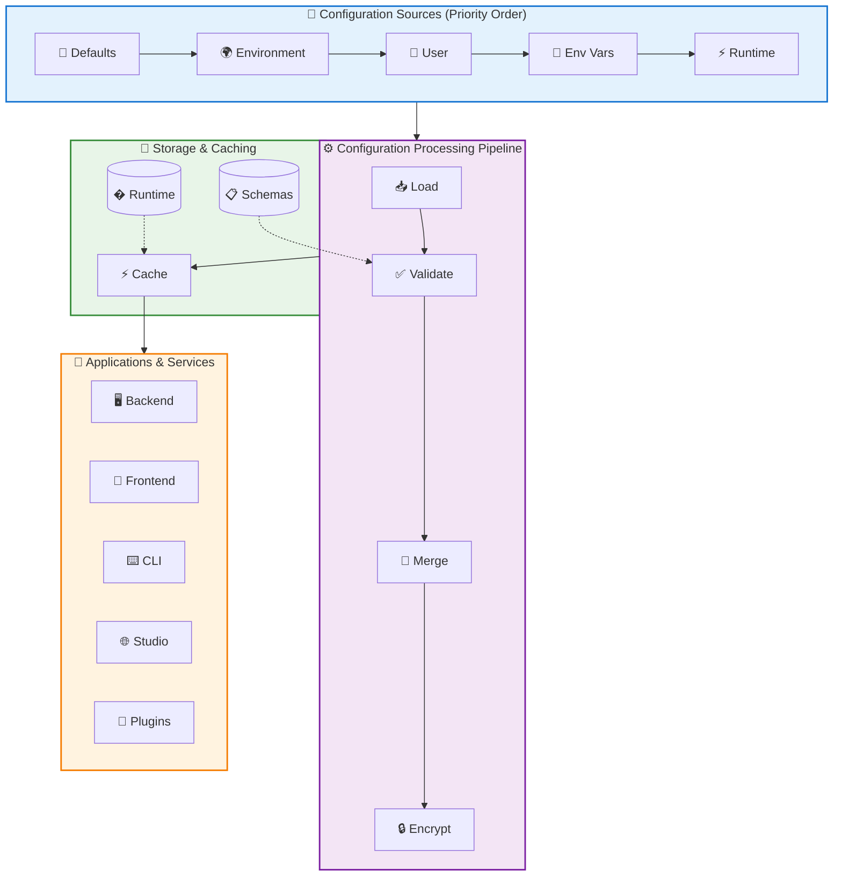

# Configuration Management Architecture

## Overview

AICO's configuration management system provides a unified, hierarchical, and secure approach to managing configuration across all subsystems (backend, frontend, CLI, studio). The system prioritizes local-first privacy, environment isolation, and runtime flexibility while maintaining consistency across the modular architecture.

## Design Principles

- **Unified Schema**: Single source of truth for all configuration definitions
- **Hierarchical Overrides**: Environment → User → Runtime configuration layering
- **Type Safety**: Strong typing with validation and schema enforcement
- **Privacy-First**: Sensitive configuration encrypted at rest
- **Hot Reloading**: File watchers for automatic config reload (optional, skipped in lightweight mode)
- **Environment Isolation**: Clear separation between dev/staging/prod environments
- **Cross-Platform**: Consistent behavior across Windows, macOS, Linux

## Runtime filesystem write guard (fs_guard)

AICO enforces a strict runtime filesystem write guard (`fs_guard`) in backend entrypoints. Any attempt to write files outside approved runtime locations will **fail loudly** (CRITICAL log + exception).

### Allowed write locations

Writes are only allowed under `AICO_DATA_DIR` in the following subdirectories:
- `AICO_DATA_DIR/runtime`
- `AICO_DATA_DIR/cache`
- `AICO_DATA_DIR/logs`
- `AICO_DATA_DIR/tmp`
- `AICO_DATA_DIR/artifacts`

This supports stateless service processes (especially in Docker/HA deployments) by preventing correctness-critical state from accidentally being written to local disk.

### Configuration implications

- `AICO_CONFIG_DIR` may be treated as read-only in container deployments.
- Runtime overrides must be persisted in a writable location under `AICO_DATA_DIR`.

## Architecture Overview


```mermaid
flowchart TD
    %% Configuration Sources (Top)
    subgraph SOURCES [" 📁 Configuration Sources (Priority Order) "]
        direction LR
        A1[🔧 Defaults] --> A2[🌍 Environment] --> A3[👤 User] --> A4[🔐 Env Vars] --> A5[⚡ Runtime]
    end
    
    %% Processing Pipeline (Middle)
    subgraph PIPELINE [" ⚙️ Configuration Processing Pipeline "]
        direction LR
        B1[📥 Load] --> B2[✅ Validate] --> B3[🔄 Merge] --> B4[🔒 Encrypt]
    end
    
    %% Storage Layer (Middle-Bottom)
    subgraph STORAGE [" 💾 Storage & Caching "]
        direction LR
        C1[(📋 Schemas)] 
        C2[⚡ Cache]
        C3[(� Runtime)]
    end
    
    %% Applications (Bottom)
    subgraph APPS [" 🎯 Applications & Services "]
        direction LR
        D1[🖥️ Backend] 
        D2[📱 Frontend] 
        D3[⌨️ CLI] 
        D4[🌐 Studio] 
        D5[🔌 Plugins]
    end
    
    %% Main flow
    SOURCES --> PIPELINE
    PIPELINE --> C2
    C2 --> APPS
    
    %% Side connections
    C1 -.-> B2
    C3 -.-> C2
    
    %% Styling
    classDef sourceStyle fill:#e3f2fd,stroke:#1976d2,stroke-width:2px
    classDef pipelineStyle fill:#f3e5f5,stroke:#7b1fa2,stroke-width:2px
    classDef storageStyle fill:#e8f5e8,stroke:#388e3c,stroke-width:2px
    classDef appStyle fill:#fff3e0,stroke:#f57c00,stroke-width:2px
    
    class SOURCES sourceStyle
    class PIPELINE pipelineStyle
    class STORAGE storageStyle
    class APPS appStyle
```

## Configuration Hierarchy

Configuration values are resolved using a hierarchical override system:

```
1. Default Values (lowest priority)
2. Environment Configuration Files
3. User Configuration Files
4. Environment Variables
5. Runtime Configuration Changes (highest priority)
```

### Directory Structure

```
aico/
├── config/
│   ├── schemas/                    # Configuration schemas
│   │   ├── system.schema.json
│   │   ├── logging.schema.json
│   │   ├── message_bus.schema.json
│   │   ├── api_gateway.schema.json
│   │   ├── modelservice.schema.json
│   │   ├── emotion.schema.json
│   │   ├── memory.schema.json
│   │   ├── agency.schema.json
│   │   ├── scheduler.schema.json
│   │   ├── security.schema.json
│   │   ├── service_auth.schema.json
│   │   ├── postgres.schema.json
│   │   └── influx.schema.json
│   ├── defaults/                   # Default configurations
│   │   ├── system.yaml
│   │   ├── logging.yaml
│   │   ├── message_bus.yaml
│   │   ├── api_gateway.yaml
│   │   ├── modelservice.yaml
│   │   ├── emotion.yaml
│   │   ├── memory.yaml
│   │   ├── agency.yaml
│   │   ├── scheduler.yaml
│   │   ├── security.yaml
│   │   ├── service_auth.yaml
│   │   ├── postgres.yaml
│   │   └── influx.yaml
│   ├── environments/               # Environment-specific configs
│   │   ├── development.yaml
│   │   └── production.yaml
│   ├── modelfiles/                  # Modelfiles (e.g. Modelfile.eve)
│   ├── user/                        # User override configs (optional)
│   │   └── *.yaml
│   └── runtime.yaml                 # Persisted runtime overrides
```

The runtime config root is platform-dependent and can be overridden via `AICO_CONFIG_DIR`.

## Configuration Domains

Configuration is split into domain files. Each file `config/defaults/{domain}.yaml` defines the top-level `{domain}.*` namespace.

Primary domains:

### System
- **System Settings**: environment, paths, global flags

### Logging
- **Logging**: log level and logging-related defaults

### Message Bus
- **Message Bus**: broker ports, timeouts, transport behavior

### API Gateway
- **API Gateway**: REST/WebSocket ports, auth policies, plugin toggles

### Modelservice
- **Modelservice**: Ollama config, transformers models, TTS

### Emotion
- **Emotion**: emotion simulation engine configuration
### Memory
- **Memory**: working/semantic/AMS settings

### Agency & Scheduler
- **Agency**: planning/safety policies
- **Scheduler**: scheduler tuning and execution policies

### Security & Service Auth
- **Security**: encryption/KDF/RBAC/transport settings
- **Service Auth**: service-to-service tokens/defaults/permissions

### Datastores
- **Postgres**: `postgres.*` connection + pool settings
- **InfluxDB**: `influx.*` telemetry backend settings

## Configuration Management API

```python
# Example: Using ConfigurationManager
from aico.core.config import ConfigurationManager

config = ConfigurationManager()
config.initialize()

# Get configuration with fallback (optional values)
api_port = config.get("api_gateway.rest.port", 8771)
pg_host = config.get("postgres.host", "127.0.0.1")

# Set configuration values
config.set("system.log_level", "DEBUG", persist=True)

# Validate configuration
validation_errors = config.validate_schemas()
```

### Core Operations
- **Initialization**: Loads schemas and configurations with file watchers
- **Dot-notation access**: `api_gateway.rest.port`, `postgres.host`, `system.log_level`
- **Schema validation**: JSON Schema-based validation
- **Hot reloading**: Automatic reload on file changes (via watchdog observers, optional)
- **Runtime persistence**: Runtime changes stored in `runtime.yaml` (platform-specific user config dir)

## Subsystem Integration

### Backend Service
- Integrates with `AICOKeyManager` for encryption keys
- Provides configuration access to FastAPI, database connections, and message bus
- Supports runtime configuration updates without service restart

### Frontend (Flutter)
- Local configuration cache with `SharedPreferences`
- Syncs with backend API for configuration changes
- Supports offline operation with cached configuration

### CLI Tools
- Rich CLI commands following AICO's visual style guide
- Commands: `get`, `set`, `list`, `validate`, `export`, `import`
- Table-based output with color coding and clear formatting

### Studio (Admin UI)
- React-based configuration management interface
- Real-time configuration editing with validation
- Schema-driven form generation for configuration domains

## Security Considerations

### Encryption at Rest

- **Sensitive Configuration**: Encrypted using AES-256-GCM with keys from AICOKeyManager
- **Salt Management**: Unique salts for configuration encryption
- **Key Rotation**: Support for periodic encryption key rotation

### Access Control

- **Role-Based Access**: Different access levels for different configuration domains
- **Audit Logging**: All configuration changes logged with user attribution
- **Validation**: Schema validation prevents invalid configurations

### Environment Isolation

- **Environment Separation**: Clear boundaries between dev/staging/prod
- **Secret Management**: Sensitive values never stored in plain text
- **Backup Security**: Configuration backups encrypted and authenticated

## Usage Examples

### CLI Configuration Management
```bash
# View current configuration
aico config list

# Update personality trait  
aico config set personality.traits.openness 0.8

# Export configuration for backup
aico config export backup.yaml

# Validate all configurations
aico config validate
```

### Backend Configuration Access
```python
# Get database configuration
db_config = config_manager.get("postgres")

# Get API settings with fallback
api_port = config_manager.get("api_gateway.rest.port", 8771)
```

This configuration management system provides a robust, secure, and flexible foundation for managing AICO's complex configuration needs across all subsystems while maintaining the privacy-first, local-first principles of the project.
