# Configuration Management Architecture

## Overview

AICO's configuration management system provides a unified, hierarchical, and secure approach to managing configuration across all subsystems (backend, frontend, CLI, studio). The system prioritizes local-first privacy, environment isolation, and runtime flexibility while maintaining consistency across the modular architecture.

## Design Principles

- **Unified Schema**: Single source of truth for all configuration definitions
- **Hierarchical Overrides**: Environment → User → Runtime configuration layering
- **Type Safety**: Strong typing with validation and schema enforcement
- **Privacy-First**: Sensitive configuration encrypted at rest
- **Hot Reloading**: Runtime configuration updates without service restart
- **Environment Isolation**: Clear separation between dev/staging/prod environments
- **Audit Trail**: Complete change tracking for security and compliance
- **Cross-Platform**: Consistent behavior across Windows, macOS, Linux

## Architecture Overview

```mermaid
flowchart TD
    %% Configuration Sources (Top)
    subgraph SOURCES [" 📁 Configuration Sources (Priority Order) "]
        direction LR
        A1[🔧 Defaults] --> A2[🌍 Environment] --> A3[👤 User] --> A4[🔐 Env Vars] --> A5[⚡ Runtime]
    end
    
    %% Processing Pipeline (Middle)
    subgraph PIPELINE [" ⚙️ Configuration Processing Pipeline "]
        direction LR
        B1[📥 Load] --> B2[✅ Validate] --> B3[🔄 Merge] --> B4[🔒 Encrypt]
    end
    
    %% Storage Layer (Middle-Bottom)
    subgraph STORAGE [" 💾 Storage & Caching "]
        direction LR
        C1[(📋 Schemas)] 
        C2[(🗃️ Config DB)]
        C3[⚡ Cache]
        C4[(📝 Audit)]
    end
    
    %% Applications (Bottom)
    subgraph APPS [" 🎯 Applications & Services "]
        direction LR
        D1[🖥️ Backend] 
        D2[📱 Frontend] 
        D3[⌨️ CLI] 
        D4[🌐 Studio] 
        D5[🔌 Plugins]
    end
    
    %% Main flow
    SOURCES --> PIPELINE
    PIPELINE --> C2
    C2 --> C3
    C3 --> APPS
    
    %% Side connections
    C1 -.-> B2
    APPS -.-> C4
    
    %% Styling
    classDef sourceStyle fill:#e3f2fd,stroke:#1976d2,stroke-width:2px
    classDef pipelineStyle fill:#f3e5f5,stroke:#7b1fa2,stroke-width:2px
    classDef storageStyle fill:#e8f5e8,stroke:#388e3c,stroke-width:2px
    classDef appStyle fill:#fff3e0,stroke:#f57c00,stroke-width:2px
    
    class SOURCES sourceStyle
    class PIPELINE pipelineStyle
    class STORAGE storageStyle
    class APPS appStyle
```



## Configuration Hierarchy

Configuration values are resolved using a hierarchical override system:

```
1. Default Values (lowest priority)
2. Environment Configuration Files
3. User Configuration Files
4. Environment Variables
5. Runtime Configuration Changes (highest priority)
```

### Directory Structure

```
aico/
├── config/
│   ├── schemas/                    # Configuration schemas
│   │   ├── core.schema.json
│   │   ├── security.schema.json
│   │   ├── database.schema.json
│   │   ├── personality.schema.json
│   │   ├── plugins.schema.json
│   │   └── ui.schema.json
│   ├── defaults/                   # Default configurations
│   │   ├── core.yaml
│   │   ├── security.yaml
│   │   ├── database.yaml
│   │   └── personality.yaml
│   ├── environments/               # Environment-specific configs
│   │   ├── development.yaml
│   │   ├── staging.yaml
│   │   └── production.yaml
│   └── user/                       # User customizations
│       ├── overrides.yaml
│       ├── personality.yaml
│       └── plugins/
│           ├── plugin1.yaml
│           └── plugin2.yaml
├── data/
│   ├── config.db                   # Encrypted configuration store
│   ├── config.db.salt             # Encryption salt
│   └── audit/
│       └── config_changes.log     # Configuration audit trail
└── logs/
    └── config.log                 # Configuration system logs
```

## Configuration Domains

The system manages configuration across five primary domains:

### Core System Configuration
- **System Settings**: Environment, data directories, logging levels
- **Message Bus**: Port assignments, message limits, heartbeat intervals  
- **API Gateway**: Host/port bindings, CORS policies, rate limiting

### Security Configuration
- **Encryption**: Algorithm selection, key derivation parameters
- **Authentication**: Session timeouts, failed attempt limits, lockout policies
- **Audit**: Logging levels, retention periods, compliance settings

### Database Configuration
- **LibSQL**: Connection paths, encryption settings, journal modes
- **ChromaDB**: Vector storage paths, collection names, distance functions
- **Analytics DB (planned)**: Future analytical database settings, memory limits, threading

### Personality Configuration
- **Traits**: Big Five personality dimensions (0.0-1.0 scale)
- **Values**: Core ethical and behavioral values
- **Expression**: Communication style parameters (formality, enthusiasm, verbosity)

### UI Configuration
- **Theme**: Color schemes, fonts, display modes (light/dark/auto)
- **Avatar**: Animation settings, lip-sync, facial expressions
- **Chat Interface**: History limits, notifications, interaction preferences

## Configuration Management API

```python
# Example: Using ConfigurationManager
from aico.core.config import ConfigurationManager

config = ConfigurationManager()
config.initialize()

# Get configuration with fallback
api_port = config.get("api.port", 8771)
db_path = config.get("database.libsql.path", "aico.db")

# Set configuration values
config.set("personality.traits.openness", 0.8, persist=True)

# Validate configuration
config.validate("security", security_config)
```

### Core Operations
- **Initialization**: Loads schemas and configurations with file watchers
- **Dot-notation access**: `api.port`, `personality.traits.openness`
- **Schema validation**: JSON Schema-based validation
- **Hot reloading**: Automatic reload on file changes
- **Encrypted persistence**: Runtime changes stored securely

## Subsystem Integration

### Backend Service
- Integrates with `AICOKeyManager` for encryption keys
- Provides configuration access to FastAPI, database connections, and message bus
- Supports runtime configuration updates without service restart

### Frontend (Flutter)
- Local configuration cache with `SharedPreferences`
- Syncs with backend API for configuration changes
- Supports offline operation with cached configuration

### CLI Tools
- Rich CLI commands following AICO's visual style guide
- Commands: `get`, `set`, `list`, `validate`, `export`, `import`
- Table-based output with color coding and clear formatting

### Studio (Admin UI)
- React-based configuration management interface
- Real-time configuration editing with validation
- Schema-driven form generation for configuration domains

## Security Considerations

### Encryption at Rest

- **Sensitive Configuration**: Encrypted using AES-256-GCM with keys from AICOKeyManager
- **Salt Management**: Unique salts for configuration encryption
- **Key Rotation**: Support for periodic encryption key rotation

### Access Control

- **Role-Based Access**: Different access levels for different configuration domains
- **Audit Logging**: All configuration changes logged with user attribution
- **Validation**: Schema validation prevents invalid configurations

### Environment Isolation

- **Environment Separation**: Clear boundaries between dev/staging/prod
- **Secret Management**: Sensitive values never stored in plain text
- **Backup Security**: Configuration backups encrypted and authenticated

## Usage Examples

### CLI Configuration Management
```bash
# View current configuration
aico config list

# Update personality trait  
aico config set personality.traits.openness 0.8

# Export configuration for backup
aico config export backup.yaml

# Validate all configurations
aico config validate
```

### Backend Configuration Access
```python
# Get database configuration
db_config = config_manager.get("database.libsql")

# Get API settings with fallback
api_port = config_manager.get("api.port", 8771)
```

This configuration management system provides a robust, secure, and flexible foundation for managing AICO's complex configuration needs across all subsystems while maintaining the privacy-first, local-first principles of the project.
