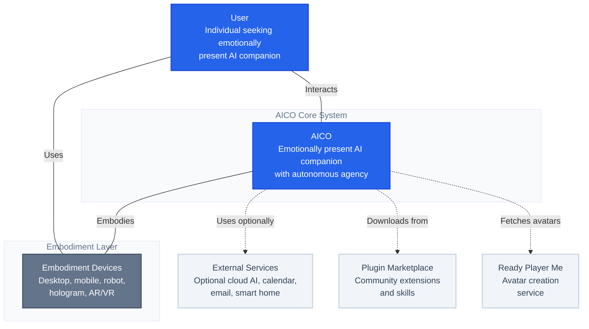

# System Context Diagram

## C4 Model - Level 1: System Context

This diagram shows AICO in the context of its users and external systems, illustrating the high-level relationships and data flows.

## System Purpose

**AICO** is an emotionally present, embodied AI companion designed to act as a confidante and sidekick rather than a traditional productivity assistant. The system prioritizes:

- **Companionship over tasks** - Building genuine relationships and emotional connections
- **Privacy-first design** - Local processing with user-controlled data sharing
- **Autonomous agency** - Self-directed goals, curiosity, and proactive engagement
- **Multi-modal embodiment** - Visual, audio, and spatial presence

## Key Actors

### Primary User
- **Individual seeking AI companionship** - People who want an emotionally aware, supportive AI presence that grows and adapts over time
- **Builders and tinkerers** - Technical users who value privacy and want to customize their AI companion
- **Privacy-conscious users** - Individuals who want AI benefits without sacrificing personal data control

## System Components

### AICO Core System
- **AICO** - The central AI companion with autonomous agency, privacy-first design, and multi-modal interaction capabilities

### Embodiment Layer
AICO can be embodied across various devices and form factors:

- **Embodiment Devices** - Consolidated representation of all possible embodiment forms:
  - Desktop/Laptop (screen-based avatar)
  - Mobile devices (portable interface)
  - Physical robots (embodied presence)
  - Holographic displays (3D projection)
  - AR/VR headsets (immersive experience)

### External Systems

#### Core Dependencies
- **Ready Player Me** - Avatar creation and customization service for visual embodiment
- **Plugin Marketplace** - Community-driven ecosystem for extending AICO's capabilities

#### Optional External Services (User Opt-in)
- **External Services** - Consolidated optional integrations including:
  - Cloud LLM Services (OpenAI, Gemini) for enhanced AI capabilities
  - Calendar/Email integration for context awareness
  - Smart Home devices for environmental awareness
  - All require explicit user opt-in and permission

## Data Flows

### Core Interactions (Bidirectional)
- **User ↔ AICO** - Multi-modal communication (voice, text, gestures, emotions) with empathetic responses
- **AICO ↔ Embodiment Devices** - AICO manifests through various physical and virtual forms
- **User ↔ Embodiment Devices** - Direct interaction with the chosen embodiment medium

### External System Integration
- **Avatar customization** - One-way flow from Ready Player Me for visual representation
- **Plugin extensions** - One-way flow from marketplace for system capabilities
- **Optional services** - Bidirectional API calls to external services (user opt-in only)
- **Context data** - Selective data flows from external services (explicit user permission)

## Privacy & Security Context

AICO's architecture emphasizes **local-first processing** with **explicit user consent** for any external data sharing:

- **Default local processing** - All personal data and core AI processing happens on user's device
- **Opt-in cloud features** - External AI services only used when user explicitly chooses
- **Granular permissions** - User controls exactly what data can be accessed by which systems
- **Encrypted communications** - All external API calls use secure, encrypted channels
- **Audit transparency** - User can see exactly what data flows to external systems and when

## System Boundaries

The **AICO System** boundary encompasses all local processing, data storage, and core AI capabilities. External systems are only accessed with explicit user permission and for specific, well-defined purposes that enhance the companion experience while maintaining privacy and user control.

This context establishes AICO as a privacy-respecting, locally-intelligent system that can optionally leverage external services to provide enhanced capabilities when the user chooses to do so.
