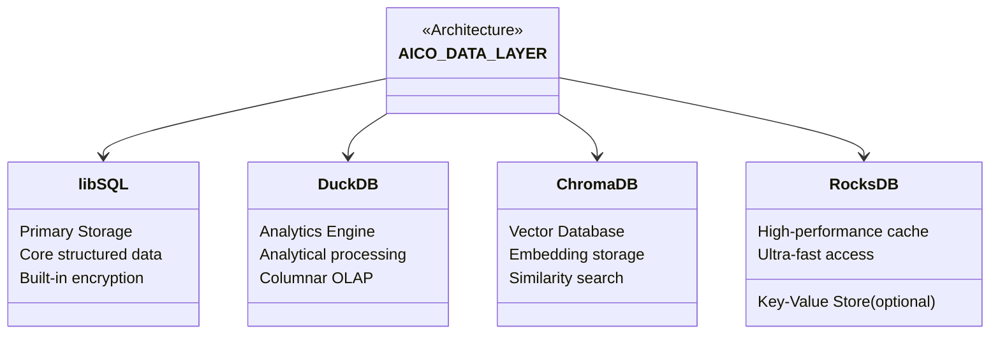
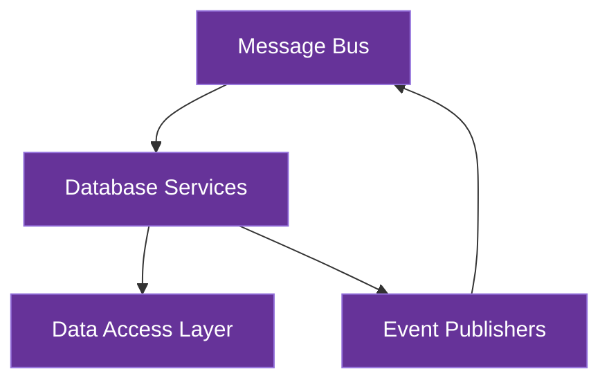

# Core Data Layer

This document details AICO's core data layer architecture, which employs a specialized multi-database approach optimized for a local-first, privacy-preserving AI companion system.

## Architecture Overview

AICO's data layer consists of four specialized database systems, each serving a distinct purpose:



**Key Features**:
- **libSQL**: Modern SQLite fork with encryption for structured data
- **DuckDB**: Analytical engine for complex queries and data processing
- **ChromaDB**: Vector database for AI embeddings and semantic search
- **RocksDB**: Optional high-performance key-value store for caching

All components are:
- File-based without requiring daemons/services
- Optimized for single-user, local-first operation
- Compatible with future federated device sync
- Cross-platform for deployment flexibility

## Database Components

### 1. Primary Storage: libSQL

**Purpose**: Core structured data storage for the AI companion system.

**Key Features**:
- Modern SQLite fork with enhanced features
- Built-in encryption at rest
- Improved concurrency for multi-threaded access
- Vector extensions for basic embedding operations
- File-based format (single file database)

**Data Domains**:
- User preferences and settings
- Conversation history and interactions
- Device trust registry for federated sync
- Relationship memory and user information
- System configuration and state

**Implementation**:
```python
# Example libSQL integration
import libsql_client

db = libsql_client.connect(
    url="file:aico.db",
    encryption_key=user_encryption_key
)

# Standard SQL operations
db.execute("INSERT INTO conversations (timestamp, content, sentiment) VALUES (?, ?, ?)", 
           [timestamp, message_content, sentiment_score])
```

### 2. Analytics Engine: DuckDB

**Purpose**: Analytical processing of user interactions and conversation data.

**Key Features**:
- Columnar storage optimized for OLAP workloads
- Vectorized execution for complex aggregations
- Advanced window functions and analytical capabilities
- File-based operation with no service requirements
- Python integration for data science workflows

**Data Domains**:
- Conversation pattern analysis
- Interaction metrics and statistics
- Temporal behavior analysis
- Personality adaptation insights
- Usage patterns and preferences

**Implementation**:
```python
# Example DuckDB integration
import duckdb

# Connect to analytics database
con = duckdb.connect('aico_analytics.duckdb')

# Example analytical query
result = con.execute("""
    SELECT 
        date_trunc('day', timestamp) as day,
        count(*) as message_count,
        avg(sentiment_score) as avg_sentiment,
        approx_quantile(response_time, 0.95) as p95_response_time
    FROM conversations
    WHERE timestamp > date_sub(now(), interval 30 day)
    GROUP BY 1
    ORDER BY 1 DESC
""").fetchall()
```

### 3. Vector Database: ChromaDB

**Purpose**: Storage and retrieval of AI embeddings for semantic search and memory.

**Key Features**:
- Purpose-built for embedding storage and similarity search
- Document storage with metadata and filtering
- Multiple storage backends (in-memory, persistent)
- Embedded operation without external services
- Simple API with core CRUD operations

**Data Domains**:
- Semantic embeddings of conversations
- Long-term memory vectors
- Knowledge base embeddings
- Contextual information retrieval
- Semantic search capabilities

**Implementation**:
```python
# Example ChromaDB integration
import chromadb

# Create client with persistent storage
client = chromadb.PersistentClient(path="./aico_embeddings")

# Create or get collection
collection = client.get_or_create_collection(name="conversation_memory")

# Add documents with embeddings
collection.add(
    documents=["User expressed interest in machine learning"],
    embeddings=[[0.1, 0.2, ...]], # Vector from embedding model
    metadatas=[{"timestamp": "2025-07-30T20:30:45Z", "sentiment": "positive"}],
    ids=["memory-001"]
)

# Query similar memories
results = collection.query(
    query_embeddings=[[0.15, 0.25, ...]], # Current context embedding
    n_results=5
)
```

### 4. Cache/KV Store: RocksDB (Optional)

**Purpose**: High-performance storage for frequently accessed data and ephemeral state.

**Key Features**:
- Log-structured merge-tree for write optimization
- Microsecond access latencies
- Minimal memory footprint with tunable performance
- Optimized for high-throughput key-value operations
- Embedded operation with no service requirements

**Data Domains**:
- Session state and context
- Frequently accessed configuration
- Real-time interaction cache
- Temporary computation results
- Message queue persistence

**Implementation**:
```python
# Example RocksDB integration
import rocksdb

# Open database with options
opts = rocksdb.Options()
opts.create_if_missing = True
opts.compression = rocksdb.CompressionType.lz4_compression
db = rocksdb.DB("aico_cache.rdb", opts)

# Fast key-value operations
db.put(b'session:active_context', context_data)
current_context = db.get(b'session:active_context')
```

## Data Flow and Integration

The databases integrate through AICO's message-driven architecture:

1. **Message Bus Integration**:
    - Database operations triggered by system messages
    - Updates published as events for other modules
    - Consistent data access patterns across modules

2. **Data Access Layers**:
    - Each database has a dedicated service module
    - Abstraction layers hide implementation details
    - Clear API boundaries for data access

3. **Cross-Database Consistency**:
    - Event-driven updates maintain consistency
    - Eventual consistency model for non-critical paths
    - Transactional boundaries for critical operations



## Federated Device Sync

The data layer is designed to support AICO's federated device roaming capability:

1. **Device Registry**:
    - Stored in libSQL
    - Manages trusted device information
    - Handles encryption keys and trust relationships

2. **Selective Sync**:
    - Different sync policies per database and data type
    - Prioritization of critical vs. non-critical data
    - Bandwidth-efficient delta synchronization

3. **P2P Encrypted Sync**:
    - End-to-end encryption for all synced data
    - Direct device-to-device communication when possible
    - Fallback to encrypted relay when necessary

4. **Conflict Resolution**:
    - Type-specific merge strategies
    - Vector data merging with deduplication
    - Timestamp-based resolution for simple conflicts
    - Semantic merging for complex conflicts

## Security and Privacy

The data layer implements AICO's privacy-first principles:

1. **Encryption**:
    - libSQL: Built-in encryption at rest
    - ChromaDB: Encrypted storage backend
    - DuckDB/RocksDB: Application-level encryption

2. **Local-First**:
    - All data stored on user's device
    - No cloud dependencies for core functionality
    - User maintains complete ownership of their data

3. **Zero-Knowledge Design**:
    - Encryption keys never leave user devices
    - Federated sync with encrypted payloads only
    - No third-party access to user data

## Performance Considerations

Each database is chosen to optimize specific workloads:

| Database | Read Speed | Write Speed | Memory Usage | Storage Efficiency | Query Complexity | Vector Search |
|----------|------------|-------------|--------------|-------------------|------------------|--------------|
| libSQL   | High       | High        | Low          | High              | High             | Basic        |
| DuckDB   | Very High  | Medium      | Medium       | Very High         | Very High        | Medium       |
| ChromaDB | Medium     | Medium      | Medium       | Medium            | Low              | High         |
| RocksDB  | Very High  | Very High   | Very Low     | High              | Very Low         | None         |

## Rationale for Multi-Database Approach

AICO uses specialized databases for several key reasons:

1. **Optimized Performance**: Each database excels at specific workloads
2. **Clear Separation of Concerns**: Each data domain has appropriate storage
3. **Scalability**: Different scaling characteristics for different data types
4. **Future-Proofing**: Specialized capabilities for AI companion evolution
