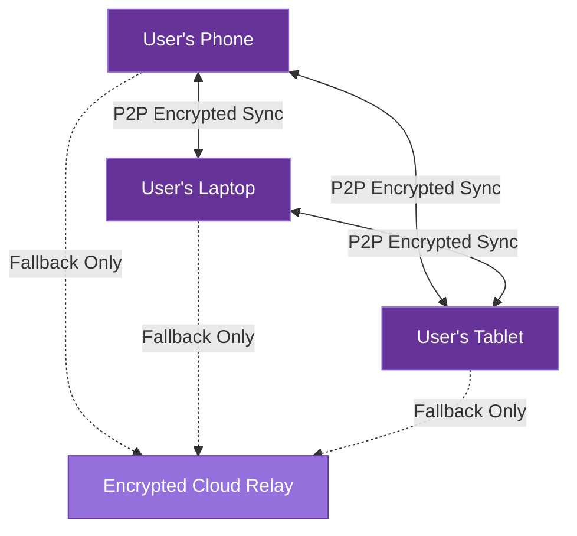

# Data Federation

This document outlines AICO's federated device network architecture, which enables secure synchronization of user data across multiple trusted devices while maintaining privacy and local-first principles.

## Federated Device Network

AICO implements a privacy-preserving federated device network that allows the AI companion to seamlessly roam between a user's trusted devices:



## Core Principles

1. **P2P Encrypted Mesh**: Direct device-to-device synchronization without intermediaries
2. **Local Network Priority**: Devices on the same network communicate directly
3. **Zero-Knowledge Design**: No external parties can access user data
4. **Fallback Cloud Relay**: Optional encrypted relay only when direct connection impossible
5. **User Control**: Complete user control over trusted devices and sync policies

## Key Components

### Device Registry

The device registry manages trusted device information and is stored in the primary libSQL database:

```python
# Example device registry schema
CREATE TABLE device_registry (
    device_id TEXT PRIMARY KEY,
    device_name TEXT NOT NULL,
    device_type TEXT NOT NULL,
    public_key BLOB NOT NULL,
    last_seen TIMESTAMP,
    trust_level INTEGER NOT NULL,
    sync_policy TEXT NOT NULL
);
```

### Selective Sync

Different data types have different synchronization policies:

| Data Type | Sync Priority | Policy |
|-----------|---------------|--------|
| User Profile | High | Immediate sync |
| Conversation History | Medium | Configurable (Full/Summary) |
| Personality Model | High | Full sync |
| Vector Embeddings | Low | On-demand sync |
| Media Files | Low | Thumbnail only by default |

### P2P Encrypted Sync

The federated sync mechanism uses:

1. **Device Discovery**:
   - Local network: mDNS/Bonjour
   - Remote: DHT (Distributed Hash Table)

2. **Authentication**:
   - Mutual device authentication using public key cryptography
   - Trust establishment through user verification

3. **Data Transfer**:
   - End-to-end encrypted channels
   - Delta synchronization for bandwidth efficiency
   - Resumable transfers for reliability

### Conflict Resolution

Type-specific conflict resolution strategies:

1. **Last-Writer-Wins**: For simple data types
2. **Semantic Merging**: For complex data like conversation history
3. **Vector Merging**: For embedding databases with deduplication

## Implementation Timeline

The federated device network will be implemented in phases:

1. **MVP**: Single device with local data only
2. **Post-MVP**: Add federated device network as an enhancement
3. **Future**: Advanced conflict resolution and offline operation

## Security Considerations

1. **Device Authorization**: New devices require explicit user approval
2. **Revocation**: Compromised devices can be removed from trust network
3. **Encryption**: All synchronized data is encrypted with device-specific keys
4. **Audit Trail**: All sync operations are logged for transparency

## Conclusion

AICO's federated device network enables a seamless multi-device experience while maintaining the project's core privacy principles. By prioritizing direct P2P communication and implementing zero-knowledge encryption, users maintain complete control over their data while enjoying the convenience of a companion AI that follows them across devices.
