# Data Layer

This document details AICO's core data layer architecture, which employs a specialized multi-database approach optimized for a local-first, privacy-preserving AI companion system.

## Architecture Overview

AICO's data layer consists of four specialized database systems, each serving a distinct purpose:


**Key Features**:
- **libSQL**: Modern SQLite fork with encryption for structured data
- **DuckDB**: Analytical engine for complex queries and data processing
- **ChromaDB**: Vector database for AI embeddings and semantic search
- **RocksDB**: Optional high-performance key-value store for caching

All components are:
- File-based without requiring daemons/services
- Optimized for single-user, local-first operation
- Compatible with future federated device sync
- Cross-platform for deployment flexibility

## Database Components

### 1. Primary Storage: libSQL

**Purpose**: Core structured data storage for the AI companion system.

**Key Features**:
- Modern SQLite fork with enhanced features
- Built-in encryption at rest
- Improved concurrency for multi-threaded access
- Vector extensions for basic embedding operations
- File-based format (single file database)

**Data Domains**:
- User preferences and settings
- Conversation history and interactions
- Device trust registry for federated sync
- Relationship memory and user information
- System configuration and state

**Implementation**:
```python
# Example libSQL integration
import libsql_client

db = libsql_client.connect(
    url="file:aico.db",
    encryption_key=user_encryption_key
)

# Standard SQL operations
db.execute("INSERT INTO conversations (timestamp, content, sentiment) VALUES (?, ?, ?)", 
           [timestamp, message_content, sentiment_score])
```

### 2. Analytics Engine: DuckDB

**Purpose**: Analytical processing of user interactions and conversation data.

**Key Features**:
- Columnar storage optimized for OLAP workloads
- Vectorized execution for complex aggregations
- Advanced window functions and analytical capabilities
- File-based operation with no service requirements
- Python integration for data science workflows

**Data Domains**:
- Conversation pattern analysis
- Interaction metrics and statistics
- Temporal behavior analysis
- Personality adaptation insights
- Usage patterns and preferences

**Implementation**:
```python
# Example DuckDB integration
import duckdb

# Connect to analytics database
con = duckdb.connect('aico_analytics.duckdb')

# Example analytical query
result = con.execute("""
    SELECT 
        date_trunc('day', timestamp) as day,
        count(*) as message_count,
        avg(sentiment_score) as avg_sentiment,
        approx_quantile(response_time, 0.95) as p95_response_time
    FROM conversations
    WHERE timestamp > date_sub(now(), interval 30 day)
    GROUP BY 1
    ORDER BY 1 DESC
""").fetchall()
```

### 3. Vector Database: ChromaDB

**Purpose**: Storage and retrieval of AI embeddings for semantic search and memory.

**Key Features**:
- Purpose-built for embedding storage and similarity search
- Document storage with metadata and filtering
- Multiple storage backends (in-memory, persistent)
- Embedded operation without external services
- Simple API with core CRUD operations

**Data Domains**:
- Semantic embeddings of conversations
- Long-term memory vectors
- Knowledge base embeddings
- Contextual information retrieval
- Semantic search capabilities

**Implementation**:
```python
# Example ChromaDB integration
import chromadb

# Create client with persistent storage
client = chromadb.PersistentClient(path="./aico_embeddings")

# Create or get collection
collection = client.get_or_create_collection(name="conversation_memory")

# Add documents with embeddings
collection.add(
    documents=["User expressed interest in machine learning"],
    embeddings=[[0.1, 0.2, ...]], # Vector from embedding model
    metadatas=[{"timestamp": "2025-07-30T20:30:45Z", "sentiment": "positive"}],
    ids=["memory-001"]
)

# Query similar memories
results = collection.query(
    query_embeddings=[[0.15, 0.25, ...]], # Current context embedding
    n_results=5
)
```

### 4. Cache/KV Store: RocksDB (Optional)

**Purpose**: High-performance storage for frequently accessed data and ephemeral state.

**Key Features**:
- Log-structured merge-tree for write optimization
- Microsecond access latencies
- Minimal memory footprint with tunable performance
- Optimized for high-throughput key-value operations
- Embedded operation with no service requirements

**Data Domains**:
- Session state and context
- Frequently accessed configuration
- Real-time interaction cache
- Temporary computation results
- Message queue persistence

**Implementation**:
```python
# Example RocksDB integration
import rocksdb

# Open database with options
opts = rocksdb.Options()
opts.create_if_missing = True
opts.compression = rocksdb.CompressionType.lz4_compression
db = rocksdb.DB("aico_cache.rdb", opts)

# Fast key-value operations
db.put(b'session:active_context', context_data)
current_context = db.get(b'session:active_context')
```

## Data Flow and Integration

The databases integrate through AICO's message-driven architecture:

1. **Message Bus Integration**:
    - Database operations triggered by system messages
    - Updates published as events for other modules
    - Consistent data access patterns across modules

2. **Data Access Layers**:
    - Each database has a dedicated service module
    - Abstraction layers hide implementation details
    - Clear API boundaries for data access

3. **Cross-Database Consistency**:
    - Event-driven updates maintain consistency
    - Eventual consistency model for non-critical paths
    - Transactional boundaries for critical operations


## Federated Device Sync

The data layer is designed to support AICO's federated device roaming capability. For detailed information about the federated device network architecture, synchronization protocols, and conflict resolution strategies, see [Data Federation](data_federation.md).

**Key Integration Points**:
- Device registry stored in libSQL primary database
- Database-specific sync policies for optimal performance
- Integration with message bus for sync event handling
- Support for selective sync based on data criticality

## Security and Privacy

The data layer implements AICO's privacy-first principles:

1. **Encryption**:
    - libSQL: Built-in encryption at rest
    - ChromaDB: Encrypted storage backend
    - DuckDB/RocksDB: Application-level encryption

2. **Local-First**:
    - All data stored on user's device
    - No cloud dependencies for core functionality
    - User maintains complete ownership of their data

3. **Zero-Knowledge Design**:
    - Encryption keys never leave user devices
    - Federated sync with encrypted payloads only
    - No third-party access to user data

## Performance Considerations

Each database is chosen to optimize specific workloads:

| Database | Read Speed | Write Speed | Memory Usage | Storage Efficiency | Query Complexity | Vector Search |
|----------|------------|-------------|--------------|-------------------|------------------|--------------|
| libSQL   | High       | High        | Low          | High              | High             | Basic        |
| DuckDB   | Very High  | Medium      | Medium       | Very High         | Very High        | Medium       |
| ChromaDB | Medium     | Medium      | Medium       | Medium            | Low              | High         |
| RocksDB  | Very High  | Very High   | Very Low     | High              | Very Low         | None         |

## Rationale for Multi-Database Approach

AICO uses specialized databases for several key reasons:

1. **Optimized Performance**: Each database excels at specific workloads
2. **Clear Separation of Concerns**: Each data domain has appropriate storage
3. **Scalability**: Different scaling characteristics for different data types
4. **Future-Proofing**: Specialized capabilities for AI companion evolution

## Database Integration Module

The Database Integration Module provides a unified interface for accessing AICO's multi-database architecture, following clean architecture principles to ensure maintainability and testability.

### Architecture Pattern

AICO's database integration follows the **Repository Pattern** combined with a **Data Access Layer (DAL)** approach. This architectural pattern provides clean separation of concerns, testability, and maintainability by abstracting database operations through well-defined layers.

#### Pattern Overview

The architecture consists of four distinct layers, each with specific responsibilities:

1. **Domain Logic Layer**: Contains business logic and domain entities
2. **Repository Layer**: Provides domain-specific data access interfaces
3. **Data Access Layer**: Handles database operations and transactions
4. **Database Adapter Layer**: Manages database-specific implementations

```mermaid
flowchart TD
    A["🏗️ Domain Module<br/>Business Logic"] --> B["📋 Repository Interface<br/>Domain-Specific API<br/>"]
    B --> C["🔧 Data Access Layer<br/>Database Operations<br/>(Connection Pooling, Transactions, Query Execution)"]
    C --> D["🗄️ Database Adapter<br/>DB-Specific Implementation<br/>(libSQL, ChromaDB, DuckDB Adapters)"]
    
    style A fill:#e1f5fe
    style B fill:#f3e5f5
    style C fill:#fff3e0
    style D fill:#e8f5e8
```



#### Architectural Benefits

**Separation of Concerns**: Each layer has a single, well-defined responsibility:
- Domain modules focus purely on business logic without database concerns
- Repositories provide clean, domain-specific data access APIs
- Data access layer handles cross-cutting concerns like transactions and connections
- Database adapters encapsulate database-specific implementation details

**Testability**: The layered approach enables comprehensive testing:
- Domain logic can be unit tested with mocked repositories
- Repository interfaces can be tested with in-memory implementations
- Data access layer can be integration tested against real databases
- Database adapters can be tested in isolation

**Maintainability**: Changes are localized to specific layers:
- Database schema changes only affect the adapter layer
- Business logic changes only affect the domain and repository layers
- Performance optimizations can be implemented in the data access layer
- New database types can be added by implementing new adapters

**Flexibility**: The pattern supports multiple database backends:
- Each database type (libSQL, ChromaDB, DuckDB) has its own adapter
- Repositories can switch between different implementations
- Cross-database operations are handled at the data access layer
- Future database migrations are simplified

#### Layer Implementation Examples

The following examples illustrate how each architectural layer is implemented and how they interact:

##### 1. Domain Logic Layer

The domain layer contains business logic and orchestrates data operations through repository interfaces:

```python
# Domain service handling conversation logic
class ConversationService:
    def __init__(self, conversation_repo: ConversationRepository, 
                 memory_repo: MemoryRepository):
        self.conversation_repo = conversation_repo
        self.memory_repo = memory_repo
    
    async def process_user_message(self, user_id: str, message: str) -> str:
        """Business logic: process message and generate response"""
        # Store the conversation
        conversation = Conversation(
            user_id=user_id,
            message=message,
            timestamp=datetime.now()
        )
        await self.conversation_repo.save(conversation)
        
        # Retrieve relevant memories for context
        memories = await self.memory_repo.get_by_context(message, limit=5)
        
        # Generate AI response (business logic)
        response = self._generate_response(message, memories)
        
        # Store the response
        response_conv = Conversation(
            user_id=user_id,
            message=response,
            is_ai_response=True,
            timestamp=datetime.now()
        )
        await self.conversation_repo.save(response_conv)
        
        return response
```

**Key Points**: 
- Domain service focuses purely on business logic
- Uses repository interfaces, never directly touches databases
- Orchestrates multiple repositories to complete business operations
- Domain entities (Conversation, Memory) represent business concepts

##### 2. Repository Layer (Domain-Specific API)

Repositories provide clean, domain-specific interfaces that abstract database operations:

```python
# Abstract repository interface
class ConversationRepository(ABC):
    @abstractmethod
    async def save(self, conversation: Conversation) -> None:
        """Save a conversation to storage"""
        pass
    
    @abstractmethod
    async def get_by_user(self, user_id: str, limit: int = 50) -> List[Conversation]:
        """Get recent conversations for a user"""
        pass
    
    @abstractmethod
    async def search_by_content(self, query: str) -> List[Conversation]:
        """Search conversations by content"""
        pass

# Concrete repository implementation
class LibSQLConversationRepository(ConversationRepository):
    def __init__(self, data_access: DataAccessLayer):
        self.dal = data_access
    
    async def save(self, conversation: Conversation) -> None:
        """Domain-specific save operation"""
        query = """
            INSERT INTO conversations (user_id, message, timestamp, is_ai_response)
            VALUES (?, ?, ?, ?)
        """
        params = [
            conversation.user_id,
            conversation.message,
            conversation.timestamp,
            conversation.is_ai_response
        ]
        await self.dal.execute(query, params)
    
    async def get_by_user(self, user_id: str, limit: int = 50) -> List[Conversation]:
        """Retrieve user conversations with domain logic"""
        query = """
            SELECT * FROM conversations 
            WHERE user_id = ? 
            ORDER BY timestamp DESC 
            LIMIT ?
        """
        rows = await self.dal.fetch_all(query, [user_id, limit])
        return [Conversation.from_dict(row) for row in rows]
```

**Key Points**:
- Repository interface defines domain operations, not database operations
- Methods use domain language ("get_by_user", "search_by_content")
- Concrete implementation translates domain operations to database queries
- Repository handles domain object mapping (Conversation.from_dict())

##### 3. Data Access Layer

The DAL handles database operations, transactions, and connection management:

```python
class DataAccessLayer:
    def __init__(self, adapter: DatabaseAdapter):
        self.adapter = adapter
        self.connection_pool = ConnectionPool(adapter, max_connections=10)
    
    async def execute(self, query: str, params: List = None) -> None:
        """Execute a query without returning results"""
        async with self.connection_pool.acquire() as conn:
            await conn.execute(query, params or [])
    
    async def fetch_all(self, query: str, params: List = None) -> List[Dict]:
        """Execute query and return all results"""
        async with self.connection_pool.acquire() as conn:
            return await conn.fetch_all(query, params or [])
    
    async def transaction(self) -> AsyncContextManager:
        """Provide transaction context"""
        return TransactionContext(self.connection_pool)

# Transaction management
class TransactionContext:
    def __init__(self, pool: ConnectionPool):
        self.pool = pool
        self.connection = None
    
    async def __aenter__(self):
        self.connection = await self.pool.acquire()
        await self.connection.begin()
        return self.connection
    
    async def __aexit__(self, exc_type, exc_val, exc_tb):
        if exc_type:
            await self.connection.rollback()
        else:
            await self.connection.commit()
        await self.pool.release(self.connection)
```

**Key Points**:
- DAL provides generic database operations (execute, fetch_all, transaction)
- Handles connection pooling and resource management
- Manages transactions across multiple operations
- Database-agnostic interface that works with any adapter

##### 4. Database Adapter Layer

Adapters handle database-specific implementations and connection details:

```python
# Abstract adapter interface
class DatabaseAdapter(ABC):
    @abstractmethod
    async def connect(self) -> Connection:
        pass
    
    @abstractmethod
    async def disconnect(self, connection: Connection) -> None:
        pass

# libSQL-specific adapter
class LibSQLAdapter(DatabaseAdapter):
    def __init__(self, database_path: str, encryption_key: str = None):
        self.database_path = database_path
        self.encryption_key = encryption_key
    
    async def connect(self) -> Connection:
        """Create libSQL connection with encryption"""
        import libsql_client
        
        connection = await libsql_client.connect(
            url=f"file:{self.database_path}",
            encryption_key=self.encryption_key
        )
        return LibSQLConnection(connection)
    
    async def disconnect(self, connection: Connection) -> None:
        await connection.close()

# ChromaDB adapter for vector operations
class ChromaDBAdapter(DatabaseAdapter):
    def __init__(self, persist_directory: str):
        self.persist_directory = persist_directory
    
    async def connect(self) -> Connection:
        """Create ChromaDB client connection"""
        import chromadb
        
        client = chromadb.PersistentClient(path=self.persist_directory)
        return ChromaDBConnection(client)
```

**Key Points**:
- Each adapter implements database-specific connection logic
- Handles database-specific configuration (encryption keys, paths)
- Provides uniform interface despite different underlying databases
- Encapsulates all database-specific dependencies

#### Business Logic ↔ Repository Interaction

The interaction between business logic and repositories is crucial for clean architecture:

```python
# Example: Complex business operation using multiple repositories
class UserOnboardingService:
    def __init__(self, user_repo: UserRepository, 
                 memory_repo: MemoryRepository,
                 conversation_repo: ConversationRepository):
        self.user_repo = user_repo
        self.memory_repo = memory_repo
        self.conversation_repo = conversation_repo
    
    async def onboard_new_user(self, user_data: Dict) -> User:
        """Business logic: complete user onboarding process"""
        
        # 1. Create user entity (domain logic)
        user = User(
            name=user_data['name'],
            preferences=self._initialize_preferences(user_data),
            created_at=datetime.now()
        )
        
        # 2. Save user through repository (clean interface)
        await self.user_repo.save(user)
        
        # 3. Create initial memory context (business rule)
        initial_memory = Memory(
            user_id=user.id,
            content=f"User {user.name} joined AICO",
            memory_type=MemoryType.SYSTEM,
            importance=0.8
        )
        await self.memory_repo.save(initial_memory)
        
        # 4. Log welcome conversation (business logic)
        welcome_message = self._generate_welcome_message(user)
        conversation = Conversation(
            user_id=user.id,
            message=welcome_message,
            is_ai_response=True,
            timestamp=datetime.now()
        )
        await self.conversation_repo.save(conversation)
        
        return user
    
    def _initialize_preferences(self, user_data: Dict) -> UserPreferences:
        """Pure business logic - no database concerns"""
        return UserPreferences(
            language=user_data.get('language', 'en'),
            personality_style=user_data.get('style', 'friendly'),
            privacy_level=user_data.get('privacy', 'standard')
        )
```

**Key Interaction Principles**:
1. **Business logic never imports database libraries** - only repository interfaces
2. **Repositories translate business operations** to database operations
3. **Domain entities flow between layers** without database-specific details
4. **Business rules are enforced in the domain layer**, not in repositories
5. **Repositories provide domain-meaningful methods**, not generic CRUD operations

## Schema Management

AICO uses a **decorator-based schema registry** system that provides fully automated schema discovery and application. This approach ensures clean separation, automatic registration, and seamless integration with the local-first, plugin-extensible architecture.

### Architecture Overview

```mermaid
flowchart TD
    A[Core Module] --> B[@register_schema]
    C[Plugin A] --> D[@register_schema]
    E[Plugin B] --> F[@register_schema]
    
    B --> G[SchemaRegistry]
    D --> G
    F --> G
    
    G --> H[Automatic Discovery]
    H --> I[Priority Ordering]
    I --> J[Schema Application]
    
    J --> K[LibSQL Database]
    K --> L[Schema Metadata]
    K --> M[Migration History]
    
    N[Application Startup] --> O[Apply All Core Schemas]
    P[Plugin Activation] --> Q[Apply Plugin Schema]
    R[Plugin Deactivation] --> S[Remove Plugin Schema]
    
    classDef decorator fill:#8b5cf6,stroke:#7c3aed,color:#fff
    classDef registry fill:#dc2626,stroke:#b91c1c,color:#fff
    classDef core fill:#2563eb,stroke:#1d4ed8,color:#fff
    classDef plugin fill:#059669,stroke:#047857,color:#fff
    
    class B,D,F decorator
    class G,H,I,J registry
    class A,N,O core
    class C,E,P,Q,R,S plugin
```

### Decorator-Based Registration

Schemas are registered using decorators, providing automatic discovery and type safety:

```python
# Core module schema registration
from aico.data import register_schema, SchemaVersion

@register_schema("conversations", "core", priority=1)
CONVERSATION_SCHEMA = {
    1: SchemaVersion(
        version=1,
        name="Conversation System",
        description="Core conversation storage and retrieval",
        sql_statements=[
            "CREATE TABLE conversations (...)",
            "CREATE INDEX idx_conversations_user_id ON conversations(user_id)"
        ],
        rollback_statements=[
            "DROP INDEX IF EXISTS idx_conversations_user_id",
            "DROP TABLE IF EXISTS conversations"
        ]
    )
}

# Plugin schema registration
@register_schema("calendar", "plugin")
CALENDAR_SCHEMA = {
    1: SchemaVersion(
        version=1,
        name="Calendar Plugin",
        description="Calendar events and scheduling",
        sql_statements=[
            "CREATE TABLE calendar_events (...)",
            "CREATE INDEX idx_events_user_id ON calendar_events(user_id)"
        ],
        rollback_statements=[
            "DROP INDEX IF EXISTS idx_events_user_id",
            "DROP TABLE IF EXISTS calendar_events"
        ]
    )
}
```

### Automatic Schema Application

#### Application Startup

```python
# Fully automated core schema application
from aico.data import EncryptedLibSQLConnection, SchemaRegistry

def initialize_database():
    conn = EncryptedLibSQLConnection(
        db_path="~/.aico/user.db",
        master_password=get_master_password()
    )
    
    # Automatically applies all registered core schemas in priority order
    applied_versions = SchemaRegistry.apply_core_schemas(conn)
    
    logger.info(f"Applied {len(applied_versions)} core schemas: {applied_versions}")
    return conn
```

#### Plugin Lifecycle

```python
# Automatic plugin schema management
def activate_plugin(plugin_name: str, connection):
    # Automatically finds and applies registered plugin schema
    version = SchemaRegistry.apply_plugin_schema(plugin_name, connection)
    logger.info(f"Plugin {plugin_name} activated at schema version {version}")

def deactivate_plugin(plugin_name: str, connection):
    # Automatically removes plugin schema
    SchemaRegistry.remove_plugin_schema(plugin_name, connection)
    logger.info(f"Plugin {plugin_name} schema removed")
```

### Schema Management Features

#### Version Tracking
- **Metadata Storage**: Current schema version stored in `schema_metadata` table
- **Migration History**: Complete audit trail in `schema_migration_history` table
- **Checksum Validation**: Detect schema drift and tampering
- **Component Isolation**: Each component manages its own schema versions

#### Migration Safety
- **Transaction Wrapping**: All migrations execute within database transactions
- **Automatic Rollback**: Failed migrations automatically roll back
- **Validation Checks**: Schema integrity validation before and after migrations
- **Dependency Handling**: Proper ordering of schema operations

#### Plugin Integration
- **Self-Contained Schemas**: Each plugin defines its complete schema
- **Dynamic Loading**: Schemas loaded when plugins are activated
- **Clean Removal**: Plugin deactivation can remove all plugin tables
- **No Conflicts**: Plugin schemas are isolated from core and other plugins

### Security Considerations

#### Encryption Integration
- **Transparent Encryption**: Schema management works with encrypted LibSQL connections
- **Metadata Protection**: Schema metadata tables are encrypted with user data
- **No Plaintext Exposure**: Schema definitions contain structure only, no user data

#### Access Control
- **Local-Only**: Schema definitions are local to each user's installation
- **No Remote Access**: No network-based schema synchronization
- **Plugin Sandboxing**: Plugin schemas cannot access core or other plugin data

### Best Practices

#### Schema Definition Guidelines
1. **Incremental Changes**: Each version should represent a single logical change
2. **Rollback Safety**: Always provide complete rollback statements
3. **Index Management**: Include index creation/deletion in appropriate versions
4. **Foreign Key Constraints**: Ensure referential integrity across versions
5. **Data Preservation**: Never include destructive operations without user consent

#### Plugin Schema Standards
1. **Namespace Isolation**: Use plugin-specific table prefixes
2. **Clean Removal**: Ensure complete cleanup on plugin deactivation
3. **Version Documentation**: Document what each schema version accomplishes
4. **Testing Coverage**: Include schema tests in plugin test suites

### Key Components

1. **Repository Layer**:
   - Domain-specific interfaces (ConversationRepository, MemoryRepository)
   - Abstracts underlying storage mechanisms
   - Enforces domain constraints and business rules
   - Example:
     ```python
     class MemoryRepository:
         def get_memories_by_context(self, context, limit=10):
             """Retrieve memories relevant to the given context"""
             pass
             
         def save_memory(self, memory):
             """Save a new memory or update existing one"""
             pass
     ```

2. **Data Access Layer**:
   - Database-specific implementations of repositories
   - Handles connection management and transactions
   - Translates between domain objects and database schemas
   - Example:
     ```python
     class ChromaDBMemoryRepository(MemoryRepository):
         def __init__(self, chroma_client):
             self.client = chroma_client
             self.collection = self.client.get_or_create_collection("memories")
             
         def get_memories_by_context(self, context, limit=10):
             embedding = self.embedding_service.embed_text(context)
             results = self.collection.query(
                 query_embeddings=[embedding],
                 n_results=limit
             )
             return [self._map_to_domain(item) for item in results]
     ```

3. **Database Adapters**:
   - Low-level database connection management
   - Connection pooling and lifecycle management
   - Error handling and retry logic
   - Example:
     ```python
     class LibSQLAdapter:
         def __init__(self, connection_string, encryption_key=None):
             self.connection_string = connection_string
             self.encryption_key = encryption_key
             self.pool = ConnectionPool(max_connections=10)
             
         async def execute(self, query, params=None):
             conn = await self.pool.acquire()
             try:
                 return await conn.execute(query, params)
             finally:
                 await self.pool.release(conn)
     ```

### Session Management

Database sessions are managed using a combination of connection pooling and context managers:

1. **Connection Pooling**:
   - Efficient reuse of database connections
   - Automatic connection health checks
   - Configurable pool sizes based on workload

2. **Unit of Work Pattern**:
   - Atomic transactions across multiple operations
   - Automatic rollback on errors
   - Example:
     ```python
     async with UnitOfWork() as uow:
         user = await uow.users.get_by_id(user_id)
         memory = await uow.memories.create(content, user_id)
         await uow.commit()
     ```

3. **Session Lifecycle**:
   - Sessions tied to message processing lifecycle
   - Automatic cleanup of abandoned sessions
   - Timeout handling for long-running operations

### Message Bus Integration

The database module integrates with AICO's message bus architecture:

1. **Event Subscribers**:
   - Database operations triggered by system messages
   - Example:
     ```python
     @subscribe("memory.store.request")
     async def handle_memory_storage(message):
         memory = Memory.from_dict(message.payload)
         await memory_repository.save(memory)
         await message_bus.publish("memory.store.complete", {
             "memory_id": memory.id,
             "status": "success"
         })
     ```

2. **Event Publishers**:
   - Database changes published as events
   - Example:
     ```python
     async def save_user_preference(user_id, preference_key, value):
         await preferences_repository.set(user_id, preference_key, value)
         await message_bus.publish("user.preferences.changed", {
             "user_id": user_id,
             "preference_key": preference_key,
             "new_value": value
         })
     ```


