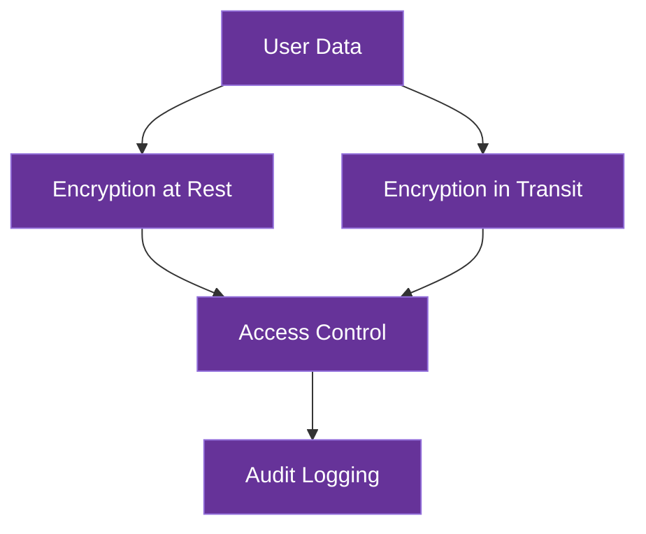

# Data Security

This document details AICO's data security architecture, which implements a comprehensive approach to protecting user data both at rest and in transit.

## Security Overview

AICO implements a privacy-first security model with multiple layers of protection:



## Data at Rest Security

### Encryption Strategy

AICO employs database-specific encryption strategies to protect all stored data:

1. **libSQL (Primary Storage)**
   - **Encryption**: AES-256 encryption via SQLCipher integration
   - **Key Management**: User-controlled encryption keys derived from master password
   - **Implementation**:
     ```python
     # Example libSQL encryption setup
     import libsql_client
     
     # User-derived encryption key (PBKDF2 with high iteration count)
     encryption_key = derive_key_from_password(user_password)
     
     # Connect with encryption
     db = libsql_client.connect(
         url="file:aico.db",
         encryption_key=encryption_key
     )
     ```

2. **ChromaDB (Vector Database)**
   - **Encryption**: Application-level encryption of embeddings and documents
   - **Implementation**:
     ```python
     # Example ChromaDB with encrypted storage
     import chromadb
     from cryptography.fernet import Fernet
     
     # Initialize encryption
     encryption_key = Fernet.generate_key() if new_user else get_user_key()
     cipher = Fernet(encryption_key)
     
     # Store with encryption
     encrypted_embedding = cipher.encrypt(embedding_bytes)
     encrypted_document = cipher.encrypt(document_bytes.encode())
     
     # Store encrypted data
     collection.add(
         ids=[doc_id],
         embeddings=[encrypted_embedding],
         documents=[encrypted_document]
     )
     ```

3. **DuckDB (Analytics)**
   - **Encryption**: File-level encryption of database files
   - **Implementation**: Transparent file encryption using platform-specific secure storage APIs

4. **RocksDB (Key-Value Cache)**
   - **Encryption**: Value encryption for sensitive cached data
   - **Implementation**: Selective encryption of sensitive values before storage

### Key Management

AICO implements a hierarchical key management system:

1. **Master Key**: Derived from user password using Argon2id with high memory and iteration parameters
2. **Database Keys**: Unique keys for each database derived from the master key
3. **Key Rotation**: Support for periodic key rotation without data re-encryption
4. **Key Storage**: Master key never stored, only derived when needed

## Data in Transit Security

### Local Communication

For communication between AICO components on the same device:

1. **Message Bus Security**:
   - **ZeroMQ with CurveZMQ**: Elliptic curve cryptography for all internal communication
   - **Authentication**: Certificate-based peer authentication
   - **Implementation**:
     ```python
     # Example secure ZeroMQ setup
     import zmq
     from zmq.auth.thread import ThreadAuthenticator
     
     # Set up authentication
     context = zmq.Context()
     auth = ThreadAuthenticator(context)
     auth.start()
     auth.configure_curve(domain='*', location=zmq.auth.CURVE_ALLOW_ANY)
     
     # Server socket with curve security
     server = context.socket(zmq.PUB)
     server_public, server_secret = zmq.curve_keypair()
     server.curve_publickey = server_public
     server.curve_secretkey = server_secret
     server.curve_server = True
     ```

### Remote Communication

For federated device synchronization:

1. **End-to-End Encryption**:
   - **Protocol**: TLS 1.3 with strong cipher suites
   - **Certificate Pinning**: Prevents man-in-the-middle attacks
   - **Perfect Forward Secrecy**: Ensures past communications remain secure

2. **API Gateway Security**:
   - **Authentication**: Zero-knowledge proof authentication
   - **Rate Limiting**: Prevents brute force attacks
   - **Request Validation**: Strict schema validation for all requests

## Access Control

AICO implements a fine-grained permission system:

1. **Permission Levels**:
   - **System**: Core system operations
   - **User Data**: Personal user information
   - **Plugin**: Third-party plugin access

2. **Consent Management**:
   - Explicit user consent required for all data access
   - Granular permission control for each data category
   - Time-limited access grants with automatic expiration

## Audit and Monitoring

Security events are logged and monitored:

1. **Audit Logging**:
   - All data access events recorded
   - Encryption/decryption operations logged
   - Authentication attempts tracked

2. **Anomaly Detection**:
   - Unusual access patterns flagged
   - Multiple authentication failures trigger alerts

## Security Testing

AICO's security is regularly validated through:

1. **Automated Testing**:
   - Regular penetration testing
   - Fuzzing of input validation
   - Encryption verification tests

2. **Code Review**:
   - Security-focused code reviews
   - Dependency vulnerability scanning

## Conclusion

AICO's multi-layered security approach ensures user data remains protected throughout its lifecycle. The combination of strong encryption, secure communication channels, and rigorous access controls implements the project's privacy-first philosophy at the technical level.
