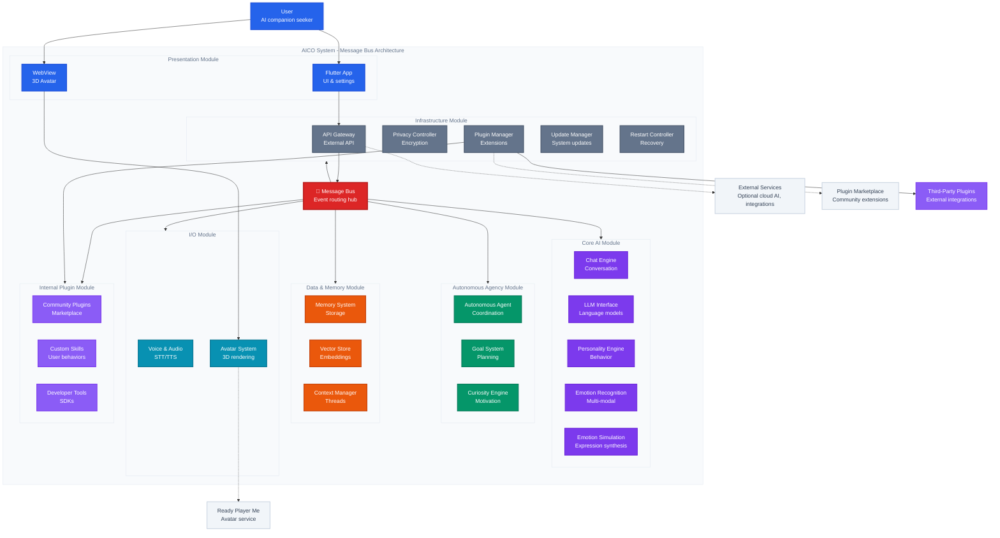

# Component Diagram

## C4 Model - Level 2: Component Diagram

This diagram shows the internal structure of the AICO system, breaking it down into modules and components and their interactions.

## Architectural Approach

**AICO uses a Message Bus Architecture** with modular design principles:

- **Central Message Bus** - All components communicate through ZeroMQ/MQTT event routing
- **Loose Coupling** - Components are independent and communicate only via the message bus
- **Scalability** - New components can be added without modifying existing ones
- **Resilience** - Component failures are isolated and don't cascade
- **Event-Driven** - Autonomous behaviors emerge from event patterns and reactions

## System Overview

The system is organized into **modules** containing related **components** that connect to the central message bus, enabling decoupled, event-driven interactions.

## System Modules

### Presentation Module
- **Flutter App** - Cross-platform UI for settings, chat interface, and user interactions
- **WebView** - 3D avatar rendering using Three.js, Ready Player Me, and TalkingHead.js

### Core AI Module
- **Chat Engine** - Conversation management and real-time messaging coordination
- **LLM Interface** - Language model integration (Llama.cpp, Ollama) with optional cloud fallback
- **Personality Engine** - Dynamic personality modeling and behavioral adaptation
- **Emotion Recognition** - Multi-modal emotion detection (visual, audio, text)
- **Emotion Simulation** - Sophisticated emotion generation using AppraisalCloudPCT with cognitive appraisal processes for believable companion interactions

### Autonomous Agency Module
- **Autonomous Agent** - Central coordinator for self-directed behavior and goal management
- **Goal System** - Hierarchical planning using MCTS and behavior trees
- **Curiosity Engine** - Intrinsic motivation using RND and ICM algorithms

### Data & Memory Module
- **Memory System** - Episodic and semantic memory (SQLite, DuckDB)
- **Vector Store** - Embedding storage and similarity search (ChromaDB)
- **Context Manager** - Conversation context and thread management

### I/O Module
- **Voice & Audio** - STT/TTS processing (Whisper.cpp, Coqui)
- **Avatar System** - 3D rendering with lip-sync and facial expressions

### Infrastructure Module
- **API Gateway** - External interface (FastAPI, gRPC)
- **Privacy Controller** - Encryption and consent management
- **Plugin Manager** - Extension system with hot-reload and sandboxing
- **Update Manager** - Automated system updates with rollback capabilities
- **Restart Controller** - Graceful system restarts and recovery

### Internal Plugin Module
- **Community Plugins** - Hot-loadable extensions from the community marketplace
- **Custom Skills** - User-defined behaviors and responses
- **Developer Tools** - SDKs and documentation for extension development

### External Plugin Integration
- **Third-Party Plugins** - External components that connect to AICO's message bus for smart home, productivity, and custom integrations

### Central Communication
- **Message Bus** - Event routing and pub/sub messaging (ZeroMQ/MQTT)

## Plugin Integration Strategy

### Security Model
- **Plugin Manager as Gateway** - All third-party plugins must connect through the Plugin Manager
- **No Direct Message Bus Access** - Third-party plugins cannot directly access the central message bus
- **Sandboxing & Permissions** - Plugins run in isolated environments with explicit permission grants
- **API-Based Integration** - Plugins interact via well-defined APIs rather than internal system access

### Plugin Types
1. **Community Plugins** - Internal hot-loadable extensions from the marketplace
2. **Custom Skills** - User-defined behaviors and responses
3. **Third-Party Plugins** - External integrations (smart home, productivity tools)
4. **Developer Tools** - SDKs and utilities for plugin development

### Benefits of This Architecture
- **Extensibility** - Easy addition of new capabilities without core system changes
- **Security** - Controlled access prevents malicious or buggy plugins from compromising the system
- **Performance** - Plugin failures don't affect core system stability
- **Developer Experience** - Clear APIs and tools for building extensions

## Emotional Simulation Integration

The **Emotion Simulation** component provides AICO with believable emotional presence:

### Core Capabilities
- **Appraisal-Based Emotions** - Generates emotions through 4-stage cognitive appraisal process (Relevance → Implication → Coping → Normative)
- **Multi-Dimensional States** - Rich emotional representation with PAD compatibility plus extended dimensions
- **Cross-Modal Expression** - Coordinates emotional expression across voice, avatar, and text with sophisticated mapping
- **Relationship Intelligence** - Social context and relationship dynamics influence emotional appropriateness
- **Crisis Handling** - Built-in emotion regulation for extreme situations with automatic recovery
- **Ethical Constraints** - Social appropriateness checks ensure companion-suitable responses
- **Optional Cloud Learning** - Collective emotional intelligence improvement through privacy-preserving cloud enhancement

### Integration Points
- **Personality Engine** → influences emotional tendencies and patterns
- **Avatar System** → receives emotional state for facial expressions and gestures
- **Voice & Audio** → receives emotional context for voice synthesis and tone
- **Chat Engine** → receives emotional context for response generation and word choice
- **Memory System** → stores emotional experiences and retrieves emotionally relevant memories
- **Emotion Recognition** → uses detected user emotions to inform appropriate responses

### Technical Implementation
- **Emotional State Vector** - [valence, arousal, dominance] values in [0,1] range
- **Expression Synthesis** - Converts internal emotional state to external manifestations
- **Contextual Modulation** - Adjusts emotional responses based on conversation context
- **Personality Consistency** - Ensures emotional patterns align with established personality traits

## Key Data Flows

### User Interaction Flow
1. **User** interacts with **Flutter Application**
2. **Flutter Application** communicates through **API Gateway**
3. **Chat Engine** processes conversations via **Message Bus**
4. **LLM Interface** generates responses influenced by **Personality Engine**
5. **Avatar System** renders responses with synchronized lip-sync and expressions

### Autonomous Behavior Flow
1. **Curiosity Engine** identifies interesting patterns or gaps
2. **Autonomous Agent** formulates goals based on curiosity and personality
3. **Goal System** creates hierarchical plans using behavior trees
4. **Planning System** executes multi-step strategies
5. **Memory System** stores experiences and outcomes for future learning

### Memory & Context Flow
1. **Context Manager** maintains conversation threads and context
2. **Memory System** stores episodic experiences and semantic knowledge
3. **Vector Store** enables similarity-based memory retrieval
4. **Privacy Controller** ensures all data remains encrypted and private

## Technology Integration

### Local-First Architecture
- All core AI processing happens locally using quantized models
- Personal data never leaves the device without explicit user consent
- Optional cloud services only used when user opts-in

### Multi-Modal Integration
- **Voice processing** for natural speech interaction
- **Visual emotion recognition** for understanding facial expressions
- **Text analysis** for sentiment and intent understanding
- **Avatar embodiment** for visual presence and non-verbal communication

### Extensibility & Updates
- **Plugin system** allows community-driven feature extensions
- **Hot-reload capabilities** enable updates without system restart
- **Automated update system** maintains security and feature currency
- **Rollback mechanisms** ensure system stability

## Plugin Integration Strategy

### How Plugins Extend AICO

**Internal plugins connect to the Message Bus via the Plugin Manager**. **External third-party plugins connect ONLY through the Plugin Manager** for security. This design enables:

1. **Controlled Access** - Plugin Manager mediates all external plugin access to the system
2. **Security Sandboxing** - Third-party plugins cannot directly access the message bus
3. **Permission Management** - Plugin Manager enforces access controls and permissions
4. **Hot-Loading** - New plugins can be added without system restart
5. **Universal Extension** - Approved plugins can extend any container via managed message bus access

### Plugin Types

- **Behavioral Plugins** - Extend personality and autonomous behaviors
- **I/O Plugins** - Add new input/output modalities (sensors, displays)
- **Integration Plugins** - Connect to external services (smart home, productivity tools)
- **AI Model Plugins** - Add specialized AI capabilities (image generation, music)
- **Embodiment Plugins** - Support new physical forms (robots, AR glasses)

### Plugin Architecture Benefits

- **Security First** - All external plugins go through Plugin Manager security controls
- **No Core Modification** - Plugins extend functionality without changing core containers
- **Event-Driven** - Plugins react to system events and publish their own (via Plugin Manager)
- **Composable** - Multiple plugins can work together through managed message bus access
- **Maintainable** - Plugin failures don't affect core system stability
- **Controlled Access** - Plugin Manager enforces permissions and sandboxing

## Complete Feature Coverage

✅ **All features from architecture documentation are represented:**

- **Conversation & Interaction** - Chat Engine, LLM Interface, Context Manager
- **Intelligence & Memory** - Memory System, Vector Store, Personality Engine
- **Emotion & Awareness** - Emotion Recognition, multi-modal detection
- **Embodiment & Presence** - Avatar System, Voice & Audio, WebView rendering
- **Privacy & Security** - Privacy Controller, local-first processing
- **Extensibility & Integration** - Plugin Manager, Community Plugins, Custom Skills
- **Autonomous Agency** - Autonomous Agent, Goal System, Curiosity Engine
- **Infrastructure** - API Gateway, Message Bus, Update Manager, Restart Controller

This container architecture enables AICO to function as a truly autonomous, emotionally aware companion while maintaining privacy, extensibility, and robust performance across different embodiment devices.
