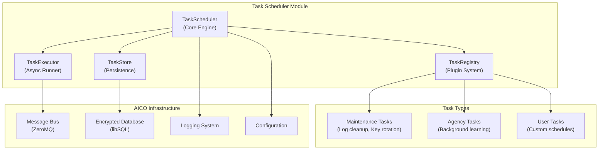

# Task Scheduler Module Architecture

## Overview

The AICO Task Scheduler Module provides zero-maintenance background task execution with cron-like scheduling, plugin system integration, and high-performance message bus communication. It handles periodic maintenance tasks (log cleanup, key rotation, health checks), autonomous agency operations, and user-defined scheduled tasks while maintaining AICO's local-first, privacy-first principles.

## Design Principles

**KISS (Keep It Simple, Stupid)**
- Single scheduler instance per backend service
- Unified task registry with simple registration API
- No external dependencies (Redis, RabbitMQ) - uses existing AICO message bus
- Built-in persistence using existing encrypted database

**DRY (Don't Repeat Yourself)**
- Shared task base classes and utilities
- Common retry/failure handling patterns
- Unified configuration and logging integration
- Reuses AICO's existing security and database infrastructure

**Maximal UX**
- Zero-configuration startup with sensible defaults
- Automatic task discovery and registration
- Rich CLI integration for task management
- Real-time task monitoring and debugging

## Architecture Overview



## Core Components

### TaskScheduler (Core Engine)

The `TaskScheduler` serves as the central coordination point for all scheduled operations. It manages the lifecycle of tasks through a continuous asyncio event loop that checks for ready-to-run tasks every second. The scheduler integrates directly with AICO's configuration system, message bus, and encrypted database to provide seamless operation within the existing architecture.

Key responsibilities include:
- **Task lifecycle management**: Loading persisted tasks on startup and coordinating execution
- **Resource coordination**: Managing connections to message bus, database, and logging systems  
- **Event loop management**: Running the main scheduler loop with proper error handling and recovery
- **Component orchestration**: Coordinating between registry, executor, and storage components

The scheduler maintains 1-second resolution timing to balance responsiveness with system efficiency, automatically backing off during error conditions to prevent resource exhaustion.

### TaskRegistry (Plugin System)

The `TaskRegistry` implements a flexible plugin architecture that enables automatic discovery and registration of scheduled tasks from across the AICO system. It supports both built-in system tasks and user-defined custom tasks through a unified interface.

The registry provides:
- **Auto-discovery**: Scans configured modules to find and register available task classes
- **Task instantiation**: Creates configured task instances with proper scheduling parameters
- **Type safety**: Validates task classes implement required interfaces before registration
- **Modular loading**: Supports conditional loading of task categories (maintenance, agency, user)

Built-in tasks are automatically discovered during scheduler startup, while user tasks can be registered dynamically through the CLI or message bus interface.

### TaskExecutor (Async Runner)

The `TaskExecutor` handles the actual execution of scheduled tasks with comprehensive resource management and failure recovery. It implements sophisticated concurrency control to ensure system stability while maximizing throughput.

Execution features include:
- **Concurrent execution**: Runs multiple tasks in parallel up to configured limits
- **Resource monitoring**: Checks CPU and memory usage before task execution
- **Timeout management**: Enforces configurable timeouts to prevent runaway tasks
- **Execution tracking**: Records detailed metrics and execution history
- **Failure handling**: Implements retry logic with exponential backoff

The executor maintains a registry of running tasks to prevent duplicate execution and provides graceful handling of system resource constraints by deferring tasks when resources are limited.

### TaskStore (Persistence)

The `TaskStore` manages persistent storage of task definitions, execution history, and performance metrics using AICO's encrypted libSQL database. It ensures task schedules survive system restarts and provides comprehensive audit trails.

Storage capabilities:
- **Task persistence**: Stores task definitions with schedules and configuration
- **Execution history**: Maintains detailed logs of all task executions with timing and results
- **Performance metrics**: Tracks success rates, execution times, and failure patterns
- **Audit trails**: Provides complete history for debugging and compliance

## Task Types and Scheduling

### Schedule Formats

AICO supports multiple schedule formats for maximum flexibility:

- **Cron expressions**: Standard cron syntax for complex scheduling (e.g., `0 2 * * *` for daily at 2 AM)
- **Interval expressions**: Simple shortcuts like `@hourly`, `@daily`, `@weekly` or `interval:300` for every 5 minutes
- **One-time execution**: Specific datetime scheduling with `at:2025-01-15T10:00:00Z` format

The scheduler automatically parses and validates all schedule formats, caching compiled patterns for optimal performance.

### Built-in Maintenance Tasks

The scheduler includes several essential maintenance tasks that run automatically:

**Log Cleanup Task** (`maintenance.log_cleanup`)
- Runs daily at 3 AM to manage log retention
- Removes logs older than configured retention period
- Enforces maximum log database size limits
- Integrates with AICO's logging system for seamless operation

**Key Rotation Task** (`security.key_rotation`)
- Executes monthly to rotate encryption keys
- Rotates session keys and derives new database keys
- Follows AICO's security policies for key lifecycle management
- Maintains backward compatibility during rotation periods

**Health Check Task** (`maintenance.health_check`)
- Runs every 5 minutes to monitor system health
- Checks database connectivity, message bus status, and disk space
- Reports metrics through AICO's monitoring system
- Triggers alerts for critical issues

**Database Vacuum Task** (`maintenance.database_vacuum`)
- Performs weekly database maintenance and optimization
- Reclaims unused space and updates query statistics
- Runs during low-activity periods to minimize impact

### Agency Tasks

AICO's autonomous agency capabilities are supported through intelligent background tasks:

**Background Learning Task** (`agency.background_learning`)
- Runs every 30 minutes during system idle periods
- Processes accumulated data for pattern recognition and learning
- Respects system resource constraints and user activity
- Only executes when CPU usage is below 20% and user is inactive
- Contributes to AICO's autonomous decision-making capabilities

**Memory Consolidation Task** (`agency.memory_consolidation`)
- Performs periodic consolidation of conversation and interaction data
- Identifies important patterns and relationships for long-term storage
- Optimizes memory structures for faster retrieval and reasoning
- Runs during extended idle periods to avoid impacting user experience

These tasks enable AICO to continuously improve its understanding and responses while maintaining excellent user experience through intelligent resource management.

## Performance Optimization

### High-Performance Design

The scheduler is architected to handle AICO's demanding performance requirements:

**1000+ Messages/Second Capability**
- Asyncio-based non-blocking execution prevents I/O bottlenecks
- Task batching for database operations reduces transaction overhead
- Connection pooling for message bus minimizes connection establishment costs
- Efficient cron parsing with compiled pattern caching

**<100ms Latency Requirements**
- Pre-compiled schedule patterns eliminate parsing overhead during execution
- In-memory task queue with disk persistence for fast access
- Lazy loading of task classes reduces memory footprint and startup time
- Optimized database queries with strategic indexing

**Caching Strategy**
The scheduler implements multi-level caching to optimize performance:
- **Schedule pattern cache**: Pre-compiled cron expressions for instant evaluation
- **Next run cache**: Cached schedule calculations to avoid repeated computation
- **Task class cache**: Lazy-loaded task classes to reduce memory usage
- **Execution history cache**: Recent execution data for quick status queries

**Batching and Concurrency**
Tasks are executed in optimized batches with configurable concurrency limits. The scheduler maintains precise timing through efficient sleep calculations while supporting parallel execution of independent tasks.

## Integration with AICO Systems

### Message Bus Integration

The scheduler integrates seamlessly with AICO's ZeroMQ message bus for remote management and monitoring:

**Remote Task Management**
- CLI and frontend can create, modify, and delete scheduled tasks via message bus
- Real-time task status updates and execution notifications
- Centralized task monitoring and health reporting
- Secure message authentication using AICO's transit security

**Message Topics**
- `scheduler.task.create` - Create new scheduled tasks
- `scheduler.task.delete` - Remove existing tasks
- `scheduler.task.status` - Query task status and execution history
- `scheduler.stats` - Retrieve scheduler performance metrics
- `scheduler.health` - Health check and system status

### CLI Integration

AICO's CLI provides comprehensive task management capabilities:

**Task Management Commands**
- `aico scheduler list` - Display all scheduled tasks with status
- `aico scheduler create <task-id> <schedule>` - Create new scheduled task
- `aico scheduler delete <task-id>` - Remove scheduled task
- `aico scheduler enable/disable <task-id>` - Toggle task execution
- `aico scheduler logs <task-id>` - View task execution history
- `aico scheduler stats` - Show scheduler performance metrics

**Interactive Features**
- Rich table formatting for task listings
- Real-time status updates during task execution
- Detailed error reporting and troubleshooting guidance
- Schedule validation and syntax checking

## Configuration

### Core Configuration

```yaml
# config/defaults/core.yaml
scheduler:
  enabled: true
  max_concurrent_tasks: 10
  max_cpu_percent: 80
  max_memory_percent: 80
  
  # Task discovery
  auto_discover: true
  task_modules:
    - "aico.scheduler.tasks.maintenance"
    - "aico.scheduler.tasks.agency"
  
  # Performance tuning
  scheduler_interval: 1.0  # seconds
  batch_size: 100
  cache_size: 10000
  
  # Failure handling
  default_retry_count: 3
  default_retry_delay: 60  # seconds
  max_retry_delay: 3600   # 1 hour
  
  # Resource management
  resource_check_interval: 30  # seconds
  idle_threshold_cpu: 20      # percent
  idle_threshold_memory: 70   # percent

# Task-specific configuration
tasks:
  maintenance:
    log_cleanup:
      enabled: true
      schedule: "0 3 * * *"  # Daily at 3 AM
      retention_days: 30
      max_size_mb: 500
    
    key_rotation:
      enabled: true
      schedule: "0 1 1 * *"  # Monthly
      rotate_session_keys: true
      rotate_database_keys: false
    
    health_check:
      enabled: true
      schedule: "*/5 * * * *"  # Every 5 minutes
      check_database: true
      check_message_bus: true
      check_disk_space: true
  
  agency:
    background_learning:
      enabled: true
      schedule: "*/30 * * * *"  # Every 30 minutes
      max_duration: 600  # 10 minutes
      idle_only: true
```

## Database Schema

```sql
-- Scheduled tasks table
CREATE TABLE scheduled_tasks (
    task_id TEXT PRIMARY KEY,
    task_class TEXT NOT NULL,
    schedule TEXT NOT NULL,
    config TEXT,  -- JSON configuration
    enabled BOOLEAN DEFAULT 1,
    created_at TEXT NOT NULL,
    updated_at TEXT NOT NULL,
    last_run TEXT,
    next_run TEXT
);

-- Task execution history
CREATE TABLE task_executions (
    id INTEGER PRIMARY KEY AUTOINCREMENT,
    task_id TEXT NOT NULL,
    execution_id TEXT NOT NULL,
    started_at TEXT NOT NULL,
    completed_at TEXT,
    success BOOLEAN,
    duration_seconds REAL,
    result TEXT,  -- JSON result data
    error_message TEXT,
    retry_count INTEGER DEFAULT 0,
    FOREIGN KEY (task_id) REFERENCES scheduled_tasks(task_id)
);

-- Indexes for performance
CREATE INDEX idx_scheduled_tasks_next_run ON scheduled_tasks(next_run, enabled);
CREATE INDEX idx_task_executions_task_id ON task_executions(task_id, started_at);
CREATE INDEX idx_task_executions_started_at ON task_executions(started_at);
```

## Security Considerations

### Task Isolation and Security

**Task Isolation**
- Each task executes in an isolated async context with no shared state
- Resource limits enforced per task to prevent system impact
- Secure configuration validation prevents malicious task parameters
- Sandboxed execution environment with restricted system access

**Permission Model**
The scheduler implements a hierarchical permission system:
- **System tasks** (`maintenance.*`, `security.*`) - Full system access, run with elevated privileges
- **User tasks** (`user.*`, `custom.*`) - Restricted access, limited to user data and operations
- **Agency tasks** (`agency.*`) - Controlled access to learning and memory systems

Permissions are validated at task registration and execution time, with comprehensive audit logging of all permission checks and task executions.

## Error Handling and Recovery

### Retry Logic

The scheduler implements intelligent retry policies to handle transient failures:

**Exponential Backoff Strategy**
- Failed tasks are retried with exponentially increasing delays
- Base delay starts at 60 seconds, doubling with each retry attempt
- Maximum delay capped at 1 hour to prevent excessive wait times
- Configurable maximum retry count (default: 3 attempts)

**Smart Retry Decisions**
- Permanent errors (ValueError, TypeError) are not retried
- Transient errors (network timeouts, temporary resource unavailability) trigger retries
- Task-specific retry policies can override global defaults
- Retry history is logged for debugging and analysis

### Failure Recovery

**Automatic Recovery Mechanisms**
- Tasks automatically restart when the scheduler starts up
- Failed tasks are queued for retry according to their retry policy
- Dead letter queue captures permanently failed tasks for manual review
- Health monitoring detects and reports systematic failures

**Graceful Degradation**
- Scheduler continues operating even when individual tasks fail
- Resource constraints trigger task deferral rather than failure
- System stress conditions activate reduced scheduling frequency
- Critical system tasks are prioritized during resource constraints

## Monitoring and Observability

### Comprehensive Metrics Collection

The scheduler provides detailed performance and health metrics:

**Execution Metrics**
- Total task executions and success/failure rates
- Average execution times with rolling averages
- Peak and minimum execution times for performance analysis
- Task-specific performance profiles and trends

**System Health Indicators**
- Active task count and queue depth monitoring
- Resource utilization during task execution
- Scheduler loop timing and efficiency metrics
- Memory usage and connection pool statistics

**Operational Insights**
- Most frequently executed tasks and their performance
- Failure patterns and common error categories
- Resource constraint incidents and their impact
- Schedule adherence and timing accuracy

### Health Status Reporting

The scheduler continuously evaluates its health status:
- **Healthy**: Failure rate below 10%, normal execution times
- **Degraded**: Elevated failure rate or performance issues
- **Critical**: Scheduler loop failures or persistent errors

Health status is reported through AICO's logging system and available via CLI and message bus queries.

## Implementation Roadmap

### Phase 1: Core Infrastructure (Week 1-2)
- [ ] Basic TaskScheduler class with asyncio loop
- [ ] TaskRegistry with plugin discovery
- [ ] Simple cron parser and schedule evaluation
- [ ] Database schema and TaskStore implementation
- [ ] Basic task execution with error handling

### Phase 2: Integration (Week 3)
- [ ] Message bus integration for remote control
- [ ] CLI commands for task management
- [ ] Configuration system integration
- [ ] Built-in maintenance tasks (log cleanup, health checks)

### Phase 3: Performance & Reliability (Week 4)
- [ ] High-performance optimizations (caching, batching)
- [ ] Retry logic and failure recovery
- [ ] Resource monitoring and constraints
- [ ] Comprehensive error handling

### Phase 4: Advanced Features (Week 5-6)
- [ ] Agency task integration
- [ ] Advanced scheduling patterns
- [ ] Monitoring and metrics collection
- [ ] Security hardening and task isolation

This architecture provides AICO with a robust, high-performance task scheduling system that integrates seamlessly with existing infrastructure while maintaining the project's core principles of simplicity, security, and local-first operation.
