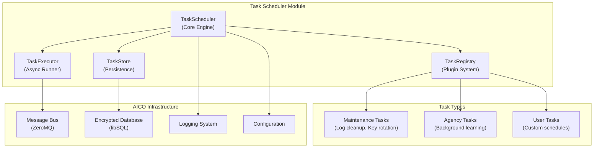

# Task Scheduler Module Architecture

## Overview

The AICO Task Scheduler Module provides zero-maintenance background task execution with cron-like scheduling, plugin system integration, and high-performance message bus communication. It handles periodic maintenance tasks (log cleanup, key rotation, health checks), autonomous agency operations, and user-defined scheduled tasks while maintaining AICO's local-first, privacy-first principles.

## Process Architecture

**Single-Process Integration**
The scheduler runs as a **module within the existing backend service process**, not as a separate process or service. This design aligns with AICO's core principles:

- **KISS principle**: Eliminates process management complexity and inter-process communication
- **Local-first**: No additional services to configure, monitor, or troubleshoot
- **Resource efficiency**: Shares memory, database connections, and message bus with backend
- **Operational simplicity**: Single service to start, stop, monitor, and backup

**No Worker Processes**
Tasks execute as coroutines within the shared asyncio event loop, eliminating the need for worker processes or thread pools. This approach provides:
- Direct access to shared backend resources and state
- Efficient memory usage and reduced overhead
- Unified error handling and logging across all components
- Simplified debugging and monitoring

**Performance Impact Safeguards**
To prevent scheduled tasks from degrading backend performance, the scheduler implements multiple protection layers:
- **Resource monitoring**: Real-time CPU and memory usage checking before task execution
- **Execution limits**: Configurable concurrent task limits and per-task timeouts
- **Cooperative multitasking**: Tasks designed as proper asyncio coroutines that yield control
- **Emergency controls**: Circuit breakers and automatic task suspension during high load

## Technology Stack

**Core Implementation**
- **Pure asyncio**: Leverages the existing backend event loop for task scheduling and execution
- **Custom cron parser**: Lightweight regex-based parsing for standard cron expressions
- **Native Python datetime**: Schedule calculations and timing without external dependencies
- **Existing AICO infrastructure**: Reuses message bus, database, logging, and configuration systems

**Why Not External Libraries?**
Instead of APScheduler, Celery, or RQ, the custom implementation provides:
- **Zero additional dependencies**: Reduces attack surface and maintenance burden
- **Perfect integration**: Native compatibility with AICO's architecture and patterns
- **Full control**: Complete customization of scheduling logic and resource management
- **Performance optimization**: Tailored specifically for AICO's 1000+ msg/sec requirements

## Design Principles

**KISS (Keep It Simple, Stupid)**
- Single scheduler instance per backend service
- Unified task registry with simple registration API
- No external dependencies (Redis, RabbitMQ) - uses existing AICO message bus
- Built-in persistence using existing encrypted database

**DRY (Don't Repeat Yourself)**
- Shared task base classes and utilities
- Common retry/failure handling patterns
- Unified configuration and logging integration
- Reuses AICO's existing security and database infrastructure

**Maximal UX**
- Zero-configuration startup with sensible defaults
- Automatic task discovery and registration
- Rich CLI integration for task management
- Real-time task monitoring and debugging

## Architecture Overview



## Core Components

### TaskScheduler (Core Engine)

The `TaskScheduler` serves as the central coordination point for all scheduled operations. It manages the lifecycle of tasks through a continuous asyncio event loop that checks for ready-to-run tasks every second. The scheduler integrates directly with AICO's configuration system, message bus, and encrypted database to provide seamless operation within the existing architecture.

Key responsibilities include:
- **Task lifecycle management**: Loading persisted tasks on startup and coordinating execution
- **Resource coordination**: Managing connections to message bus, database, and logging systems  
- **Event loop management**: Running the main scheduler loop with proper error handling and recovery
- **Component orchestration**: Coordinating between registry, executor, and storage components

The scheduler maintains 1-second resolution timing to balance responsiveness with system efficiency, automatically backing off during error conditions to prevent resource exhaustion.

### TaskRegistry (Plugin System)

The `TaskRegistry` implements a flexible plugin architecture that enables automatic discovery and registration of scheduled tasks from across the AICO system. It supports both built-in system tasks and user-defined custom tasks through a unified interface.

The registry provides:
- **Auto-discovery**: Scans configured modules to find and register available task classes
- **Task instantiation**: Creates configured task instances with proper scheduling parameters
- **Type safety**: Validates task classes implement required interfaces before registration
- **Modular loading**: Supports conditional loading of task categories (maintenance, agency, user)

Built-in tasks are automatically discovered during scheduler startup, while user tasks can be registered dynamically through the CLI or message bus interface.

### TaskExecutor (Async Runner)

The `TaskExecutor` handles the actual execution of scheduled tasks with comprehensive resource management and failure recovery. It implements sophisticated concurrency control to ensure system stability while maximizing throughput.

Execution features include:
- **Concurrent execution**: Runs multiple tasks in parallel up to configured limits
- **Resource monitoring**: Checks CPU and memory usage before task execution
- **Timeout management**: Enforces configurable timeouts to prevent runaway tasks
- **Execution tracking**: Records detailed metrics and execution history
- **Failure handling**: Implements retry logic with exponential backoff

The executor maintains a registry of running tasks to prevent duplicate execution and provides graceful handling of system resource constraints by deferring tasks when resources are limited.

### TaskStore (Persistence)

The `TaskStore` manages persistent storage of task definitions, execution history, and performance metrics using AICO's encrypted libSQL database. It ensures task schedules survive system restarts and provides comprehensive audit trails.

Storage capabilities:
- **Task persistence**: Stores task definitions with schedules and configuration
- **Execution history**: Maintains detailed logs of all task executions with timing and results
- **Performance metrics**: Tracks success rates, execution times, and failure patterns
- **Audit trails**: Provides complete history for debugging and compliance

## Task Types and Scheduling

### Schedule Formats

AICO supports multiple schedule formats for maximum flexibility:

- **Cron expressions**: Standard cron syntax for complex scheduling (e.g., `0 2 * * *` for daily at 2 AM)
- **Interval expressions**: Simple shortcuts like `@hourly`, `@daily`, `@weekly` or `interval:300` for every 5 minutes
- **One-time execution**: Specific datetime scheduling with `at:2025-01-15T10:00:00Z` format

The scheduler automatically parses and validates all schedule formats, caching compiled patterns for optimal performance.

### Built-in Maintenance Tasks

The scheduler includes several essential maintenance tasks that run automatically:

**Log Cleanup Task** (`maintenance.log_cleanup`)
- Runs daily at 3 AM to manage log retention
- Removes logs older than configured retention period
- Enforces maximum log database size limits
- Integrates with AICO's logging system for seamless operation

**Key Rotation Task** (`security.key_rotation`)
- Executes monthly to rotate encryption keys
- Rotates session keys and derives new database keys
- Follows AICO's security policies for key lifecycle management
- Maintains backward compatibility during rotation periods

**Health Check Task** (`maintenance.health_check`)
- Runs every 5 minutes to monitor system health
- Checks database connectivity, message bus status, and disk space
- Reports metrics through AICO's monitoring system
- Triggers alerts for critical issues

**Database Vacuum Task** (`maintenance.database_vacuum`)
- Performs weekly database maintenance and optimization
- Reclaims unused space and updates query statistics
- Runs during low-activity periods to minimize impact

**Vector Index Optimization** (`maintenance.vector_optimization`)
- Optimizes ChromaDB vector indexes for semantic memory retrieval
- Rebuilds indexes when fragmentation exceeds thresholds
- Runs weekly during low-activity periods to maintain search performance

### Agency Tasks

AICO's autonomous agency capabilities are supported through intelligent background tasks:

**Background Learning Task** (`agency.background_learning`)
- Runs every 30 minutes during system idle periods
- Processes accumulated data for pattern recognition and learning
- **CPU-intensive**: Uses thread pool for ML model training and vector computations
- Only executes when CPU usage is below 20% and user is inactive
- Contributes to AICO's autonomous decision-making capabilities

**Memory Consolidation Task** (`agency.memory_consolidation`)
- Performs periodic consolidation of conversation and interaction data
- **Vector processing**: ChromaDB embedding updates and semantic clustering
- Identifies important patterns and relationships for long-term storage
- Optimizes memory structures for faster retrieval and reasoning
- Runs during extended idle periods to avoid impacting user experience

**Emotion Model Training** (`agency.emotion_training`)
- Refines emotion recognition models based on interaction feedback
- **GPU-accelerated**: Uses process pool for neural network training when GPU available
- Processes facial expression, voice tone, and text sentiment data
- Runs weekly during low-activity periods with automatic resource scaling

**Personality Adaptation** (`agency.personality_evolution`)
- Gradually adapts personality traits based on long-term interaction patterns
- **CPU-intensive**: Complex trait vector calculations and behavioral modeling
- Maintains personality consistency while enabling natural growth
- Executes monthly with comprehensive backup before personality updates

These tasks enable AICO to continuously improve its understanding and responses while maintaining excellent user experience through intelligent resource management and hybrid execution models.

## Performance Optimization

### High-Performance Design

The scheduler is architected to handle AICO's demanding performance requirements:

**1000+ Messages/Second Capability**
- Asyncio-based non-blocking execution prevents I/O bottlenecks
- Task batching for database operations reduces transaction overhead
- Connection pooling for message bus minimizes connection establishment costs
- Efficient cron parsing with compiled pattern caching

**<100ms Latency Requirements**
- Pre-compiled schedule patterns eliminate parsing overhead during execution
- In-memory task queue with disk persistence for fast access
- Lazy loading of task classes reduces memory footprint and startup time
- Optimized database queries with strategic indexing

**Caching Strategy**
The scheduler implements multi-level caching to optimize performance:
- **Schedule pattern cache**: Pre-compiled cron expressions for instant evaluation
- **Next run cache**: Cached schedule calculations to avoid repeated computation
- **Task class cache**: Lazy-loaded task classes to reduce memory usage
- **Execution history cache**: Recent execution data for quick status queries

**Batching and Concurrency**
Tasks are executed in optimized batches with configurable concurrency limits. The scheduler maintains precise timing through efficient sleep calculations while supporting parallel execution of independent tasks.

### Performance Impact Mitigation

**Resource-Aware Execution**
The scheduler implements comprehensive safeguards to prevent performance degradation:

- **CPU monitoring**: Tasks are deferred when CPU usage exceeds configurable thresholds (default 80%)
- **Memory constraints**: Execution blocked if system memory usage is too high
- **Concurrent task limits**: Maximum concurrent tasks configurable (default 10)
- **Timeout enforcement**: Per-task timeouts prevent runaway processes (default 5 minutes)

**Asyncio Task Isolation**
Long-running tasks use asyncio best practices to maintain system responsiveness:
- Tasks run as shielded coroutines that yield control during I/O operations
- Event loop remains responsive for API requests and message bus operations
- Chunked processing breaks large operations into small, interruptible segments
- Progress tracking enables monitoring and graceful cancellation

**How Work is Actually Executed**
No threads are created. All task execution happens within the single asyncio event loop:

1. **Task Scheduling**: The scheduler's main loop runs `await asyncio.sleep(1.0)` every second
2. **Task Triggering**: When a task is ready, `asyncio.create_task()` creates a coroutine
3. **Cooperative Execution**: The task coroutine runs until it hits an `await` statement
4. **Control Yielding**: At each `await`, control returns to the event loop
5. **Interleaved Processing**: Event loop handles API requests, message bus, and other tasks
6. **Task Resumption**: Task continues from where it left off when scheduled again

**Example Task Execution Pattern**:
```python
async def log_cleanup_task():
    # This runs immediately
    log_count = await db.execute("SELECT COUNT(*) FROM logs")
    
    # Control yields here - API requests can be processed
    batch_size = 1000
    for offset in range(0, log_count, batch_size):
        # Process batch
        await db.execute("DELETE FROM logs WHERE ... LIMIT 1000")
        
        # Yield control every batch - critical for responsiveness
        await asyncio.sleep(0)  # Allows other coroutines to run
```

This ensures the backend remains fully responsive while background tasks execute incrementally.

### Design Resilience and Safety Mechanisms

**Addressing Developer Dependency Concerns**

The cooperative multitasking approach includes multiple safety nets to prevent poorly written tasks from blocking the system:

**1. Mandatory Task Timeouts**
- Every task has a hard timeout (default 5 minutes, configurable per task)
- `asyncio.wait_for()` wraps all task execution with timeout enforcement
- Timeout violations automatically cancel the task and log the incident
- No task can block indefinitely regardless of developer mistakes

**2. Task Template and Base Classes**
- All tasks inherit from `BaseTask` with built-in yield patterns
- Template methods enforce proper async structure and yield points
- Code review process validates task implementations before deployment
- Linting rules detect missing `await` statements in loops and heavy operations

**3. Runtime Monitoring and Circuit Breakers**
- Event loop lag detection monitors responsiveness in real-time
- If event loop becomes unresponsive (>100ms), all scheduled tasks are suspended
- Automatic task disabling for tasks that repeatedly cause performance issues
- Health monitoring alerts when task execution patterns become problematic

**4. Hybrid Execution Model for Compute-Intensive Tasks**
- **Thread pool for CPU-bound operations**: ML model training, vector computations, emotion processing
- **Process pool for GPU workloads**: Avatar rendering, voice synthesis, facial recognition
- `asyncio.run_in_executor()` with configurable ThreadPoolExecutor and ProcessPoolExecutor
- **Intelligent task routing**: Automatic detection of task type and execution environment selection
- **Resource-aware scaling**: Thread/process pool sizes adjust based on system capabilities

**5. Task Sandboxing**
- Resource limits enforced at task level (CPU time, memory allocation)
- Database query timeouts prevent runaway queries
- File I/O operations wrapped with async equivalents
- Network operations use async HTTP clients with timeouts

This multi-layered approach ensures system stability even with imperfect task implementations while maintaining the performance benefits of cooperative multitasking.

**Intelligent Scheduling**
- **Idle period detection**: Heavy tasks only execute during low system activity
- **User activity awareness**: Background processing pauses when user is active  
- **Priority-based execution**: Critical maintenance tasks get priority over agency tasks
- **Emergency circuit breaker**: Automatic task disabling if performance impact detected

## Integration with AICO Systems

### Message Bus Integration

The scheduler integrates seamlessly with AICO's ZeroMQ message bus for remote management and monitoring:

**Remote Task Management**
- CLI and frontend can create, modify, and delete scheduled tasks via message bus
- Real-time task status updates and execution notifications
- Centralized task monitoring and health reporting
- Secure message authentication using AICO's transit security

**Message Topics**
- `scheduler.task.create` - Create new scheduled tasks
- `scheduler.task.delete` - Remove existing tasks
- `scheduler.task.status` - Query task status and execution history
- `scheduler.stats` - Retrieve scheduler performance metrics
- `scheduler.health` - Health check and system status

### CLI Integration

AICO's CLI provides comprehensive task management capabilities:

**Task Management Commands**
- `aico scheduler list` - Display all scheduled tasks with status
- `aico scheduler create <task-id> <schedule>` - Create new scheduled task
- `aico scheduler delete <task-id>` - Remove scheduled task
- `aico scheduler enable/disable <task-id>` - Toggle task execution
- `aico scheduler logs <task-id>` - View task execution history
- `aico scheduler stats` - Show scheduler performance metrics

**Interactive Features**
- Rich table formatting for task listings
- Real-time status updates during task execution
- Detailed error reporting and troubleshooting guidance
- Schedule validation and syntax checking

## Configuration

### Core Configuration

```yaml
# config/defaults/core.yaml
scheduler:
  enabled: true
  max_concurrent_tasks: 10
  max_cpu_percent: 80
  max_memory_percent: 80
  
  # Task discovery
  auto_discover: true
  task_modules:
    - "aico.scheduler.tasks.maintenance"
    - "aico.scheduler.tasks.agency"
  
  # Performance tuning
  scheduler_interval: 1.0  # seconds
  batch_size: 100
  cache_size: 10000
  
  # Failure handling
  default_retry_count: 3
  default_retry_delay: 60  # seconds
  max_retry_delay: 3600   # 1 hour
  
  # Resource management
  resource_check_interval: 30  # seconds
  idle_threshold_cpu: 20      # percent
  idle_threshold_memory: 70   # percent

# Task-specific configuration
tasks:
  maintenance:
    log_cleanup:
      enabled: true
      schedule: "0 3 * * *"  # Daily at 3 AM
      retention_days: 30
      max_size_mb: 500
    
    key_rotation:
      enabled: true
      schedule: "0 1 1 * *"  # Monthly
      rotate_session_keys: true
      rotate_database_keys: false
    
    health_check:
      enabled: true
      schedule: "*/5 * * * *"  # Every 5 minutes
      check_database: true
      check_message_bus: true
      check_disk_space: true
  
  agency:
    background_learning:
      enabled: true
      schedule: "*/30 * * * *"  # Every 30 minutes
      max_duration: 600  # 10 minutes
      idle_only: true
```

## Database Schema

```sql
-- Scheduled tasks table
CREATE TABLE scheduled_tasks (
    task_id TEXT PRIMARY KEY,
    task_class TEXT NOT NULL,
    schedule TEXT NOT NULL,
    config TEXT,  -- JSON configuration
    enabled BOOLEAN DEFAULT 1,
    created_at TEXT NOT NULL,
    updated_at TEXT NOT NULL,
    last_run TEXT,
    next_run TEXT
);

-- Task execution history
CREATE TABLE task_executions (
    id INTEGER PRIMARY KEY AUTOINCREMENT,
    task_id TEXT NOT NULL,
    execution_id TEXT NOT NULL,
    started_at TEXT NOT NULL,
    completed_at TEXT,
    success BOOLEAN,
    duration_seconds REAL,
    result TEXT,  -- JSON result data
    error_message TEXT,
    retry_count INTEGER DEFAULT 0,
    FOREIGN KEY (task_id) REFERENCES scheduled_tasks(task_id)
);

-- Indexes for performance
CREATE INDEX idx_scheduled_tasks_next_run ON scheduled_tasks(next_run, enabled);
CREATE INDEX idx_task_executions_task_id ON task_executions(task_id, started_at);
CREATE INDEX idx_task_executions_started_at ON task_executions(started_at);
```

## Security Considerations

### Task Isolation and Security

**Task Isolation**
- Each task executes in an isolated async context with no shared state
- Resource limits enforced per task to prevent system impact
- Secure configuration validation prevents malicious task parameters
- Sandboxed execution environment with restricted system access

**Permission Model**
The scheduler implements a hierarchical permission system:
- **System tasks** (`maintenance.*`, `security.*`) - Full system access, run with elevated privileges
- **User tasks** (`user.*`, `custom.*`) - Restricted access, limited to user data and operations
- **Agency tasks** (`agency.*`) - Controlled access to learning and memory systems

Permissions are validated at task registration and execution time, with comprehensive audit logging of all permission checks and task executions.

## Error Handling and Recovery

### Retry Logic

The scheduler implements intelligent retry policies to handle transient failures:

**Exponential Backoff Strategy**
- Failed tasks are retried with exponentially increasing delays
- Base delay starts at 60 seconds, doubling with each retry attempt
- Maximum delay capped at 1 hour to prevent excessive wait times
- Configurable maximum retry count (default: 3 attempts)

**Smart Retry Decisions**
- Permanent errors (ValueError, TypeError) are not retried
- Transient errors (network timeouts, temporary resource unavailability) trigger retries
- Task-specific retry policies can override global defaults
- Retry history is logged for debugging and analysis

### Failure Recovery

**Automatic Recovery Mechanisms**
- Tasks automatically restart when the scheduler starts up
- Failed tasks are queued for retry according to their retry policy
- Dead letter queue captures permanently failed tasks for manual review
- Health monitoring detects and reports systematic failures

**Graceful Degradation**
- Scheduler continues operating even when individual tasks fail
- Resource constraints trigger task deferral rather than failure
- System stress conditions activate reduced scheduling frequency
- Critical system tasks are prioritized during resource constraints

## Monitoring and Observability

### Comprehensive Metrics Collection

The scheduler provides detailed performance and health metrics:

**Execution Metrics**
- Total task executions and success/failure rates
- Average execution times with rolling averages
- Peak and minimum execution times for performance analysis
- Task-specific performance profiles and trends

**System Health Indicators**
- Active task count and queue depth monitoring
- Resource utilization during task execution
- Scheduler loop timing and efficiency metrics
- Memory usage and connection pool statistics

**Operational Insights**
- Most frequently executed tasks and their performance
- Failure patterns and common error categories
- Resource constraint incidents and their impact
- Schedule adherence and timing accuracy

### Health Status Reporting

The scheduler continuously evaluates its health status:
- **Healthy**: Failure rate below 10%, normal execution times
- **Degraded**: Elevated failure rate or performance issues
- **Critical**: Scheduler loop failures or persistent errors

Health status is reported through AICO's logging system and available via CLI and message bus queries.

## Implementation Guide

### Integration with Existing Backend

**Current Architecture Compatibility**
The scheduler integrates perfectly with AICO's existing backend architecture:
- Uses established FastAPI lifespan pattern in `backend/main.py`
- Leverages existing shared resources (message bus, database, configuration)
- Follows domain-based API organization for management endpoints

**Integration Point**
Add scheduler to existing `backend/main.py` lifespan after API Gateway initialization:

```python
# In lifespan() function, after API Gateway startup:
if config_manager.get("scheduler", {}).get("enabled", True):
    from scheduler.core import TaskScheduler
    task_scheduler = TaskScheduler(config_manager, message_bus_host, shared_db_connection)
    await task_scheduler.start()
    logger.info("Task scheduler started successfully")
```

### Implementation Phases

**Phase 1: Core Scheduler (Day 1-2)**
- `backend/scheduler/core.py` - TaskScheduler, TaskRegistry, TaskExecutor classes
- `backend/scheduler/tasks/base.py` - BaseTask abstract class
- `backend/scheduler/storage.py` - TaskStore with libSQL integration
- Database schema addition to core schema

**Phase 2: Built-in Tasks (Day 3)**
- `backend/scheduler/tasks/maintenance.py` - Log cleanup, key rotation, health checks
- `backend/scheduler/tasks/agency.py` - Background learning, memory consolidation
- Task auto-discovery and registration

**Phase 3: API & CLI (Day 4)**
- `backend/api/scheduler/router.py` - REST endpoints for task management
- `cli/commands/scheduler.py` - CLI commands using message bus
- Integration with existing `aico gateway start` command

**Phase 4: Monitoring & Polish (Day 5)**
- Performance metrics and health monitoring
- Error handling and retry logic refinement
- Documentation and testing

## Task Execution Architecture

The scheduler implements a three-layer task definition pattern to support different types of tasks:

### 1. Built-in System Tasks (Hard-coded)
Essential maintenance tasks bundled with the system for zero-maintenance operation:

```python
# backend/scheduler/tasks/maintenance.py
class LogCleanupTask(BaseTask):
    task_id = "maintenance.log_cleanup"
    
    async def execute(self, context: TaskContext) -> TaskResult:
        retention_days = context.config.get("retention_days", 30)
        deleted_count = await self.cleanup_logs(retention_days)
        return TaskResult(success=True, data={"deleted": deleted_count})
```

### 2. Plugin-Discovered Tasks (Auto-loaded)
Agency and extensible tasks discovered from configured modules:

```python
# backend/scheduler/tasks/agency.py  
class BackgroundLearningTask(BaseTask):
    task_id = "agency.background_learning"
    
    async def execute(self, context: TaskContext) -> TaskResult:
        if not context.system_idle():
            return TaskResult(success=True, skipped=True)
        # ML training logic here
```

### 3. User-Defined Tasks (Database + Code)
Custom tasks created by users via API/CLI:

```python
# Created via: aico scheduler create --task-class "CustomEmailTask" --schedule "0 9 * * *"
# Code in: backend/scheduler/tasks/user/email_task.py
class CustomEmailTask(BaseTask):
    task_id = "user.email_task"
    
    async def execute(self, context: TaskContext) -> TaskResult:
        # Custom user logic
```

### Task Lifecycle Management

**Task Introduction:**
- **System tasks**: Bundled in code, auto-registered at startup
- **Plugin tasks**: Auto-discovered from configured modules via `TaskRegistry.discover_tasks()`
- **User tasks**: Created via API/CLI, requires task class in `tasks/user/` directory

**Task Removal:**
- **System tasks**: Cannot be removed (only disabled via configuration)
- **Plugin tasks**: Removed when plugin is unloaded or module unavailable
- **User tasks**: Deleted via API/CLI, removes database record and optionally code file

**Registry Discovery Pattern:**
```python
class TaskRegistry:
    def discover_tasks(self):
        # 1. Load built-in tasks from tasks/maintenance.py, tasks/agency.py
        # 2. Scan configured plugin modules for BaseTask subclasses
        # 3. Load user task definitions from database
        # 4. Validate all task classes implement required interface
```

This architecture separates **scheduling** (when to run) from **execution** (what to run), following AICO's modular design principles.

### File Structure

```
backend/
├── scheduler/
│   ├── __init__.py
│   ├── core.py              # TaskScheduler, TaskRegistry, TaskExecutor
│   ├── storage.py           # TaskStore with encrypted database
│   ├── cron.py              # Cron expression parser
│   └── tasks/
│       ├── __init__.py
│       ├── base.py          # BaseTask abstract class
│       ├── maintenance.py   # Built-in system maintenance tasks
│       ├── agency.py        # Built-in autonomous agency tasks
│       └── user/            # User-defined task classes
│           └── __init__.py
├── api/
│   └── scheduler/
│       ├── __init__.py
│       ├── router.py        # FastAPI endpoints (JSON CRUD)
│       └── schemas.py       # Pydantic models
```

This architecture provides AICO with a robust, high-performance task scheduling system that integrates seamlessly with existing infrastructure while maintaining the project's core principles of simplicity, security, and local-first operation.
