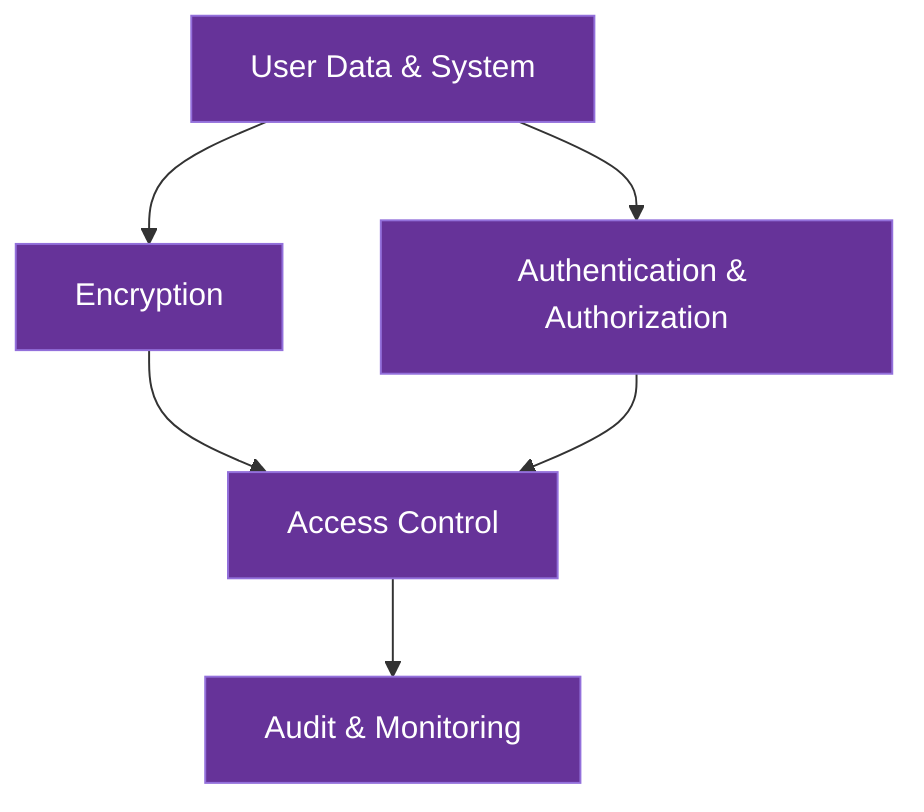

# Security Architecture

This document outlines AICO's comprehensive security architecture, which implements a privacy-first approach to protecting user data, communications, and system integrity across all components.

## Security Principles

AICO's security architecture is built on the following core principles:

### 1. Privacy-First Design
All security decisions prioritize user privacy and data sovereignty. Personal data remains under user control at all times, with local processing preferred over cloud services and explicit consent required for any data sharing. This principle guides all architectural decisions from storage to communication protocols.

### 2. Zero-Effort Security
Security measures work invisibly without user intervention or friction. Security that gets in the user's way is bad security and will be circumvented. AICO implements automatic key derivation, seamless encryption, and background security processes to provide maximum protection with minimum user awareness or interaction.

This principle is implemented through several key mechanisms:

- **Transparent Key Management**: Security is automatically set up during first application launch with secure defaults. Platform-specific secure storage (Keychain, KeyStore, SecretService) manages credentials with optional biometric authentication when available.

- **Seamless Encryption**: All data is encrypted by default without user action, with encryption/decryption happening in background threads. Security levels adapt based on data sensitivity without user intervention.

- **Frictionless Authentication**: Session persistence minimizes re-authentication, with requirements adapting based on action sensitivity. Single sign-on grants appropriate access across the system, and previously authenticated devices require minimal re-verification.

- **Invisible Security Monitoring**: Security monitoring runs without performance impact, with users only notified for actionable, high-priority events. Security patches are applied automatically when safe to do so.

- **Roaming-Aware Security**: Security automatically configures when frontend and backend are co-located (coupled mode) or implements seamless security handshakes between components (detached mode). Security context is maintained during transitions between roaming states.

### 3. Defense in Depth
Multiple security layers provide redundant protection against threats. No single security measure is relied upon exclusively, with overlapping controls ensuring that a breach of one layer doesn't compromise the entire system. This approach combines encryption, access controls, authentication, and monitoring to create a comprehensive security posture.

### 4. Zero Trust Architecture
No component is inherently trusted; all access is verified regardless of source. Every request is authenticated and authorized, whether from internal modules or external systems. This principle is especially important for AICO's modular design and plugin ecosystem, ensuring that even first-party components follow strict security protocols.

### 5. Least Privilege
Components only have access to the resources they need to perform their functions. Permissions are granular and specific, limiting the potential impact of any compromise. This principle applies to both system modules and user-installed plugins, with explicit capability grants that can be audited and revoked.

### 6. Local-First Processing
Data processing happens on-device whenever possible, minimizing exposure and maximizing user control. This principle supports both privacy and security by keeping sensitive operations within the user's security boundary. When remote processing is required, only the minimum necessary data is transmitted with appropriate protections.

### 7. Transparent Security
Users have visibility into security measures and data usage without being overwhelmed by technical details. Security status is communicated clearly, and users can audit what data is stored and how it's protected. This builds trust while ensuring users can make informed decisions about their privacy and security.

## Security Architecture Overview

AICO implements a multi-layered security model that protects all aspects of the system:



## Security Layers

### 1. Encryption Layer

AICO employs comprehensive encryption strategies to protect data both at rest and in transit:

#### Encryption at Rest
- **Filesystem-Level Encryption**: Transparent encryption of all database files using gocryptfs
  - **AES-256-GCM**: Authenticated encryption with per-file random initialization vectors
  - **File Name Encryption**: Prevents metadata leakage and directory structure analysis
  - **Forward Secrecy**: Ensures past data remains secure even if keys are compromised
- **Memory Protection**: Sensitive data in memory is protected against unauthorized access
- **Secure Storage**: Encryption keys stored using platform-specific secure storage mechanisms

#### Encryption in Transit
- **Local Communication**: 
  - **ZeroMQ with CurveZMQ**: Elliptic curve cryptography for all internal communication
  - **Authentication**: Certificate-based peer authentication
  - **Implementation**:
    ```python
    # Example secure ZeroMQ setup
    import zmq
    from zmq.auth.thread import ThreadAuthenticator
    
    # Set up authentication
    context = zmq.Context()
    auth = ThreadAuthenticator(context)
    auth.start()
    auth.configure_curve(domain='*', location=zmq.auth.CURVE_ALLOW_ANY)
    
    # Server socket with curve security
    server = context.socket(zmq.PUB)
    server_public, server_secret = zmq.curve_keypair()
    server.curve_publickey = server_public
    server.curve_secretkey = server_secret
    server.curve_server = True
    ```

- **Remote Communication**:
  - **End-to-End Encryption**: TLS 1.3 with strong cipher suites
  - **Certificate Pinning**: Prevents man-in-the-middle attacks
  - **Perfect Forward Secrecy**: Ensures past communications remain secure

### 2. Authentication & Authorization Layer

#### Key Management and Derivation in AICO

AICO employs a comprehensive approach to key management that combines secure key derivation with platform-native secure storage to support its local-first, file-based architecture and roaming capabilities.

### Key Derivation

**Argon2id** serves as AICO's unified key derivation function across all security contexts:

- **Why Argon2id for AICO**: 
  - Provides optimal security for AICO's filesystem-level encryption (gocryptfs)
  - Supports cross-platform deployment with consistent security guarantees
  - Memory-hard design protects against hardware-accelerated attacks
  - Configurable parameters allow adaptation to different device capabilities

- **AICO-Specific Parameters**:

  | Context | Memory | Iterations | Parallelism | AICO Usage |
  |---------|--------|------------|-------------|--------|
  | Master Key | 1GB | 3 | 4 | Initial login, derives all other keys |
  | File Encryption | 256MB | 2 | 2 | gocryptfs container for databases |
  | Authentication | 64MB | 1 | 1 | Device pairing, roaming authentication |

- **Implementation in AICO Backend**:
  ```python
  # AICO backend implementation using Python-Cryptography
  from cryptography.hazmat.primitives.kdf.argon2 import Argon2
  import os
  
  # Generate a random salt for AICO master key
  salt = os.urandom(16)
  
  # Configure Argon2id for AICO master key derivation
  argon2 = Argon2(
      salt=salt,
      time_cost=3,           # Iterations
      memory_cost=1048576,   # 1GB in KB
      parallelism=4,         # 4 threads
      hash_len=32,           # 256-bit key
      type=2                 # Argon2id
  )
  
  # Derive AICO master key from user password
  master_key = argon2.derive(password.encode())
  ```

### Key Management

AICO's key management system handles the lifecycle of cryptographic keys from creation through storage, use, and rotation:

- **Key Hierarchy**: 
  - **Master Password**: User-provided secret, never stored
  - **Master Key**: Derived via Argon2id, stored in platform secure storage
  - **Purpose-Specific Keys**: Derived from master key for gocryptfs, database access, device pairing

- **Secure Storage**: Platform-native mechanisms for zero-effort security:
  - macOS: Keychain integration
  - Windows: Windows Credential Manager
  - Linux: Secret Service API / GNOME Keyring
  - Mobile: Secure Enclave (iOS) / Keystore (Android)

- **Roaming Support**: 
  - **Coupled Roaming**: Secure key transfer between trusted devices
  - **Detached Roaming**: Backend maintains keys, frontend authenticates via secure protocol

- **Zero-Effort Security**: 
  - Automatic key retrieval during AICO startup
  - Transparent filesystem mounting
  - Optional biometric unlock on supported platforms

#### Authentication Mechanisms
- **Local Authentication**: Biometric or password-based with secure credential storage
- **Remote Authentication**: Zero-knowledge proof authentication for device-to-device communication
- **Device Pairing**: Secure device registration and authentication protocol

#### Authorization Framework
- **Permission Levels**:
  - **System**: Core system operations
  - **User Data**: Personal user information
  - **Plugin**: Third-party plugin access
- **Consent Management**:
  - Explicit user consent required for all data access
  - Granular permission control for each data category
  - Time-limited access grants with automatic expiration

### 3. Access Control Layer

#### Component Isolation
- **Process Separation**: Critical components run in isolated processes
- **Sandboxing**: Plugin execution in sandboxed environments
- **Memory Protection**: Address space layout randomization (ASLR) and data execution prevention

#### API Security
- **API Gateway Security**:
  - **Authentication**: Token-based authentication with short expiration
  - **Rate Limiting**: Prevents brute force and DoS attacks
  - **Request Validation**: Strict schema validation for all requests

#### Plugin Security
- **Capability-based Security**: Plugins only receive access to specific capabilities
- **Resource Limitations**: CPU, memory, and network quotas for plugins
- **Code Signing**: Verification of plugin integrity before execution

### 4. Audit & Monitoring Layer

#### Security Monitoring
- **Audit Logging**:
  - All security-relevant events recorded
  - Authentication attempts tracked
  - Access control decisions logged
- **Anomaly Detection**:
  - Unusual access patterns flagged
  - Multiple authentication failures trigger alerts
  - Behavioral analysis to detect potential threats

#### Incident Response
- **Alert System**: Real-time notification of security events
- **Recovery Procedures**: Documented steps for security incident recovery
- **Secure Defaults**: System returns to secure state after failures

## Security in Deployment Patterns

### Coupled Deployment Security
- Single device security boundary
- Local encryption at rest
- No network exposure required
- Platform-specific security features utilized

### Detached Deployment Security
- Network communication security (TLS/encryption)
- Authentication between frontend and backend
- Distributed trust model
- Network-based attack surface mitigation

