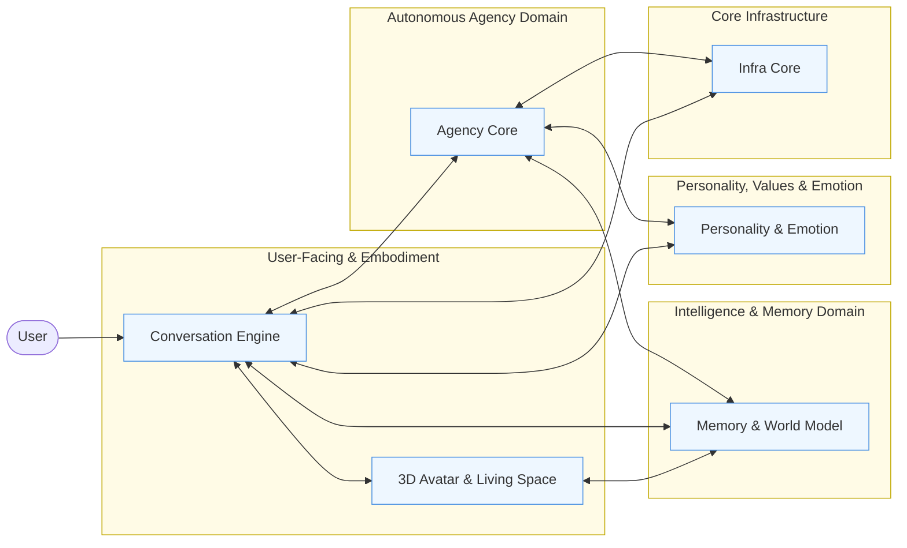
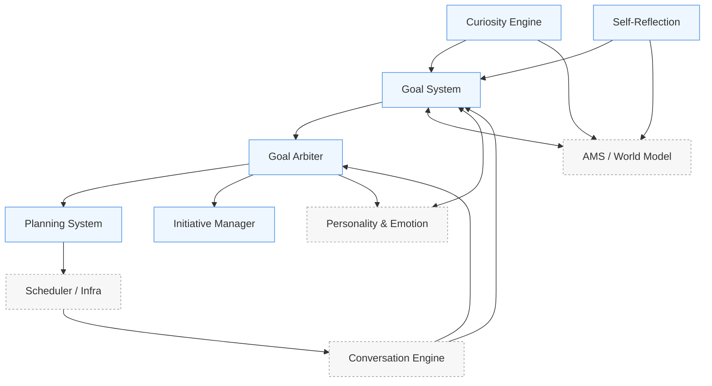
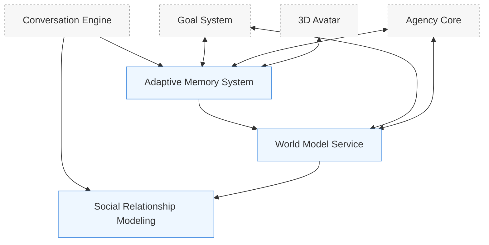
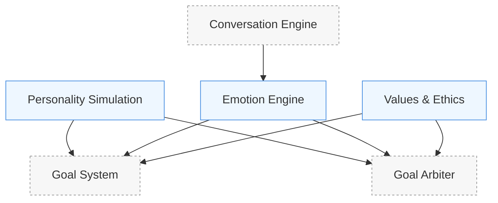
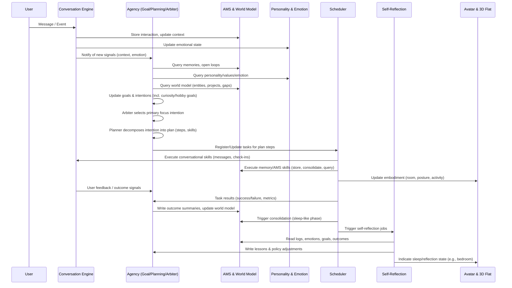

# Agency Architecture

## 1. Purpose and Scope

This document describes the **technical architecture** of AICO’s agency system. It refines the conceptual requirements in `agency.md` into a concrete structure of domains, modules, data flows, and control loops.

- **Audience**: backend/AI engineers, system architects, advanced contributors.  
- **Related docs**: `agency.md` (concepts & requirements), `/docs/architecture/architecture-overview.md`, `/docs/concepts/memory/ams.md`, `/docs/concepts/personality/personality-sim-architecture.md`.

## 2. High-Level Agent Loop

AICO’s agency follows a recurrent control loop:

1. **Perceive**: collect signals from conversation, memory, sensors, and internal state.  
2. **Interpret**: update beliefs and context via memory and social models.  
3. **Form/Update Goals**: propose or update goals and intentions.  
4. **Plan**: decompose intentions into skills, tool calls, and scheduled tasks.  
5. **Act**: execute skills through conversation, tools, and embodiment.  
6. **Evaluate**: log outcomes, collect feedback, and update memory, skills, and goals.

This loop is realized across several domains.

## 3. Domain and Module Mapping

### 3.1 Autonomous Agency Domain

- **Goal System**  
  + Maintains the goal/intent graph (long‑term themes, projects, short‑term tasks).  
  + Tracks status, priority, and dependencies.  
  + Consumes signals from memory, personality, social models, curiosity, and self-reflection.

- **Planning System**  
  + Uses the LLM and rule‑based templates to decompose goals into executable plans.  
  + Produces sequences of skills/tool calls with preconditions and expected outcomes.  
  + Interfaces with the Task Scheduler to register and update jobs.

- **Curiosity Engine**  
  + Detects novelty, prediction errors, and informational gaps in the world model, AMS, and interaction patterns.  
  + Computes intrinsic motivation signals (uncertainty reduction, potential insight, user relevance).  
  + Proposes exploration and self-development goals and feeds them into the Goal System.

- **Goal Arbiter & Meta-Control**  
  + Collects candidate goals from user requests, Curiosity Engine, system maintenance, and long-term relationship themes.  
  + Scores and ranks goals under personality, emotion, social context, values/ethics, and resource budgets.  
  + Maintains the active intention set and decides what AICO actually pursues at a given time.

- **Self-Reflection Engine**  
  + Periodically analyzes recent actions, outcomes, and feedback (often during sleep-like phases).  
  + Derives lessons and policy adjustments (what to do more/less of, when to intervene, how to express).  
  + Feeds updated preferences and heuristics back into Goal System, Curiosity Engine, and Planning.

- **Initiative Manager**  
  + Decides when to surface proactive behavior to the user (check‑ins, suggestions, follow‑ups).  
  + Ensures user‑visible initiatives respect quiet hours, preferences, and relationship context, and reflects the current intention set.

### 3.2 Intelligence & Memory Domain

- **Adaptive Memory System (AMS)**  
  + Provides long‑term context, open loops, and preference evolution.  
  + Runs consolidation and sleep‑phase processing that change future goals and behavior.  
  + Supplies summaries and facts for use in planning and reflection.

- **World Model Service (Knowledge/Property Graph + Schemas)**  
  + Maintains a hybrid world model combining knowledge/property graph, semantic memory, and embeddings.  
  + Detects inconsistencies, drifts, and unknowns in AICO’s understanding of the user and environment.  
  + Exposes graph-augmented queries and hypothesis APIs to planning, curiosity, and self-reflection.

- **Knowledge Graph & Social Relationship Modeling**  
  + Provides structured representations of people, entities, and relationships.  
  + Supplies relationship vectors (intimacy, authority, care responsibility, stability) used in goal selection and initiative decisions.

### 3.3 Personality, Values & Emotion Domain

- **Personality Simulation**  
  + Maintains the trait vector and value system.  
  + Exposes decision‑making and communication parameters that bias planning, goal selection, and initiative.

- **Values & Ethics Layer**  
  + Encodes core AICO principles, user-specific boundaries, and relationship roles.  
  + Evaluates goals and plans for long-term wellbeing, consent, and non-coercion.  
  + Feeds constraints and annotations into the Goal Arbiter, Planning System, and Conversation Engine.

- **Emotion Simulation**  
  + Supplies emotional state and appraisals that modulate which goals are appropriate and how actions are expressed.  
  + Provides affective signals (urgency, risk, comfort) used by the Goal Arbiter and Curiosity Engine.

### 3.4 Core Infrastructure

- **Task Scheduler**  
+ Executes background jobs (consolidation, analysis, long‑running plans).  
+ Enforces temporal constraints (sleep phases, daily rhythm).

- **Resource Monitor**  
+ Provides CPU/memory/battery metrics.  
+ Enforces resource budgets for agency‑driven work.

- **Message Bus (ZeroMQ + Protobuf)**  
+ Connects all agency‑related modules via topic‑based pub/sub.  
+ Ensures loose coupling and testable contracts.

### 3.5 User Interface and Embodiment

- **Conversation Engine**  
+ Primary surface where agency appears as text (initiated messages, follow‑ups, narrative around ongoing projects).  
+ Integrates agency context (goals, plans, relationship state) into LLM prompts.

- **3D Avatar and Living‑Space**  
+ Renders AICO’s current state in a 3D flat with rooms (desk, couch, bed, kitchen, etc.).  
+ Room and posture are derived from the current lifecycle state and active goals (e.g., “working” → desk, “reading/learning” → couch, “sleep/consolidation” → bedroom).  
+ Acts as a visual, spatial interface to agency: users can see what AICO is doing even when not actively chatting.

## 4. Data and Control Flows (Conceptual)

At a high level, agency data and control flows follow this pattern:

1. **Signals In**  
   - Conversation events (messages, feedback, sentiment, emotion).  
   - Memory events (new facts, updated preferences, unresolved items).  
   - Social events (relationship changes, household context).  
   - System events (resource status, scheduler triggers).

2. **Goal and Plan Updates**  
   - Goal System updates goal/intent graph.  
   - Planning System revises or instantiates plans.  
   - Curiosity Engine proposes exploration goals.

3. **Scheduling and Execution**  
   - Plans become scheduled tasks via the Task Scheduler.  
   - Skills/tool calls are executed (conversation, memory operations, external integrations).  
   - Embodiment engine updates spatial state (room, posture) to reflect activity.

4. **Evaluation and Learning**  
   - Outcomes, user feedback, and telemetry are logged.  
   - AMS and Behavioral Learning update preferences and skill selection.  
   - Personality and relationship models are gradually updated.

## 5. Component Relationship Diagram

The previous detailed component diagram is intentionally simplified here to emphasise clarity. Internal modules are described in the text above; this diagram focuses on **domains** and their main connections.

### 5.1 Autonomous Agency Detail Diagram

This diagram focuses on the internal structure of the **Autonomous Agency Domain** and its main interfaces.

### 5.2 Intelligence & Memory Detail Diagram

This diagram highlights the **Intelligence & Memory Domain** and how it supports agency.

### 5.3 Personality, Values, Emotion & Safety Detail Diagram

This diagram focuses on **Personality, Values, Emotion & Safety** and their role in shaping agency decisions.

## 6. Execution Flows Diagram

This diagram illustrates the main runtime execution flows of the Agency subsystem, from perception to evaluation, across typical operation.

## 7. References

For conceptual background, see the references listed in `agency.md` (Section 6). Those works provide the theoretical basis for the agent loop, goal/plan structures, and memory-driven self-evolution that this architecture instantiates.
