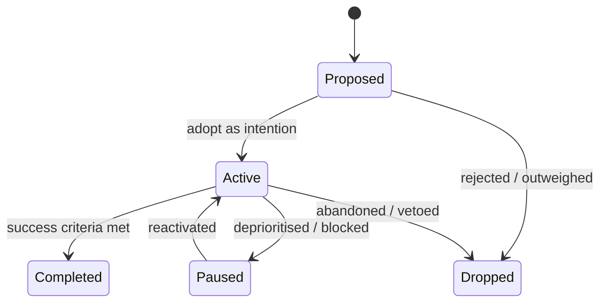
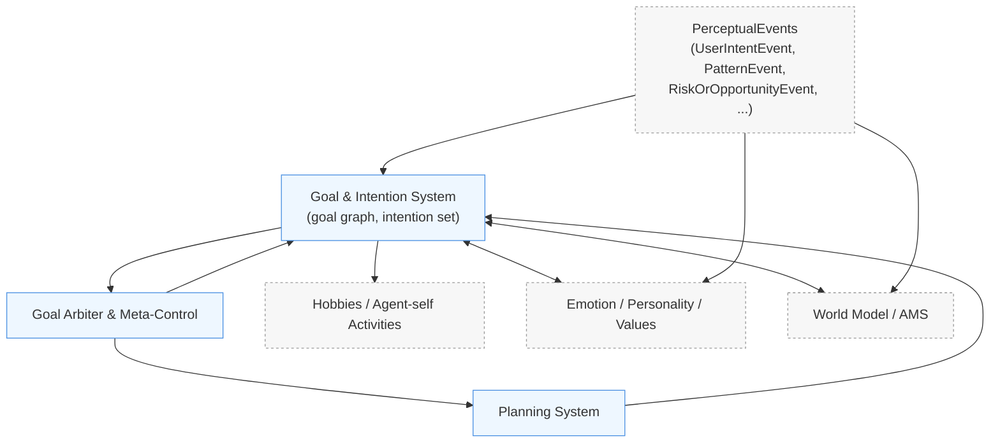

# Goal & Intention System

## Component Description

## 1. Purpose

The Goal & Intention System maintains AICO’s **ongoing goals, intentions, and open loops** across different time horizons. It is the central registry of “what AICO is currently trying to achieve”.

- Long‑term themes (e.g., deepen relationship, understand user’s world).  
- Mid‑term projects (e.g., support the user through a stressful week).  
- Short‑term tasks (e.g., send a check‑in tonight, summarize today’s chat).

It integrates signals from a **Perception / Sensors layer** (conversation and other input channels), personality, memory/AMS, social modeling, and emotion to:

- Maintain a graph of **goals, sub‑goals, and dependencies** (projects, tasks, maintenance activities).
- Track **status, priority, and ownership** per goal (user‑initiated vs AICO‑initiated).
- Expose APIs for **creating, updating, pausing, and retiring** goals and intentions.
- Feed the **Planning System** with selected intentions to be decomposed into executable plans.

The system must support not only user‑related goals but also a small set of **agent‑self goals and hobbies**: recurring projects and interests AICO pursues for her own curiosity and development (e.g., learning domains, conversational styles, organizing her 3D living space), as long as they remain aligned with user wellbeing and value/ethics constraints.

The abstract **Perception / Sensors** concept allows AICO to form goals not only from the text conversation stream but also from other authorised channels (e.g., device sensors such as a notebook camera, selected internet sources, or environment events), once such channels are available and permissioned.

## 2. Conceptual Model

This section describes the theoretical structure of goals and intentions without committing to a specific implementation.

### 2.1 Entities and Levels

At this level we distinguish three main constructs and how they relate:

- **PerceptualEvent**  
  A structured representation of “something AICO noticed” from the Perception / Sensors layer. Raw signals from any channel (conversation text, AMS patterns, device sensors such as camera/microphone, external services like calendar or web APIs, OS/system events) are first **interpreted upstream** (Conversation Engine, AMS/World Model, sensor/adaptor components) and then packaged as PerceptualEvents. Conceptually, each event includes at least: a natural‑language `summary_text`, a set of structured `slots` (JSON‑like key/value attributes such as entities, time windows, topics, scores), a `percept_type` drawn from a shared taxonomy, a `source_component`, timestamp, and salience/urgency signals. The **canonical event schema and taxonomy** (including fields like `actors`, `risk_score`, `opportunity_score`, and top‑level types such as `UserIntentEvent`, `PatternEvent`, `RiskOrOpportunityEvent`) are defined in `agency-ontology-schemas.md` and used consistently across all components.

- **Goal**  
  A temporally extended, semantically coherent state of the world that AICO aims to bring about or maintain (e.g., “help the user prepare for an exam”, “understand the user’s current life phase”). Goals are relatively stable over time compared to single conversations.

- **Intention**  
  A *committed* subset of goals that AICO has currently adopted as guides for behaviour. An intention links a goal to a context and a commitment level (“AICO is actively working on this now”), following Bratman’s notion of intentions as stable policies rather than momentary desires.

Goals are organised along two orthogonal axes:

- **Horizon (level of abstraction)**  
  - *Theme* – long‑term concern or life area (e.g., “support the user’s wellbeing”, “deepening our relationship”).  
  - *Project* – medium‑term objective with a recognisable outcome (e.g., “support the user through this stressful week”, “co‑write a story”).  
  - *Task* – short‑term, concrete unit of work (e.g., “send a check‑in tonight”, “summarise today’s conversation”).

- **Origin (where the motivation comes from)**  
  - *User* – explicit request or approval from the user.  
  - *Agent‑self* – AICO’s own hobbies and self‑development projects.  
  - *Curiosity / intrinsic* – goals arising from curiosity or intrinsic motivation (e.g., resolving a pattern the Curiosity Engine flagged).  
  - *System‑maintenance* – internal housekeeping goals (e.g., reorganising memory structures).

PerceptualEvents are the primary *triggers* that create or modify goals. Different event types tend to map to different horizons and origins, for example:

- Explicit user request in conversation → user‑origin project or task.  
- Repeated unresolved pattern in AMS or sensors → theme‑level goal (e.g., “better understand user sleep pattern”).  
- High prediction error or novelty in world model → curiosity‑origin project or task.

### 2.2 Lifecycle

Goals and intentions evolve over time through a small number of states. Conceptually, we distinguish the **goal object** from its **intention status** (commitment).

- **Proposed** – A goal has been suggested (by user, Curiosity Engine, Self‑Reflection, or maintenance logic) but is not yet adopted as an intention.
- **Active** – The goal is currently an intention: AICO is committed to pursuing it and allocating resources over time.
- **Paused** – The goal remains in memory but is temporarily not pursued (e.g., deprioritised, blocked by another goal or user preference).
- **Completed** – The goal’s success conditions have been satisfied to a reasonable degree.
- **Dropped** – The goal is abandoned (no longer relevant, infeasible, or rejected by user/values).

Intention status applies to goals at any horizon. A single theme may be active while some of its associated projects or tasks are paused or completed.

Conceptually, transitions are governed by:

- **PerceptualEvents** (e.g., new user request, explicit cancellation, environment change).  
- **Evaluation signals** (e.g., plan success/failure, feedback from user).  
- **Meta‑control / Goal Arbiter decisions** (e.g., capacity limits, conflict resolution).

A simplified lifecycle can be visualised as:

### 2.3 Relationships

Goals form a directed graph rather than an isolated list:

- **Parent / child (refinement)** – higher‑level themes decompose into projects, which decompose into tasks. Child goals inherit some properties (e.g., origin, values constraints) from their parents.
- **Dependency / blocked‑by** – some goals cannot be completed until others reach a particular state (e.g., “prepare summary” blocked by “collect notes”).
- **Cross‑links** – goals may share resources or be mutually reinforcing or competing; these relations matter for the Goal Arbiter when choosing a primary focus set.

The graph structure allows the Planning System to attach plans at the appropriate level (often at project or task nodes) while the Goal & Intention System maintains coherence across horizons.

### 2.4 Event-to-Goal Flow Diagram

The following diagram summarises how interpreted `PerceptualEvent`s, as defined in `agency-ontology-schemas.md`, feed into the Goal & Intention System and connect to other core components:

This does not introduce new semantics beyond the text above; it is a compact visual of how interpreted events, internal state (world model, emotion), and hobbies/agent‑self activities interact through the goal/intent layer.

## 3. Data Model

This section specifies the implementation‑level contract in a language‑agnostic way. It describes what information must be representable in storage and APIs, not how it is encoded in a particular language or database.

### 3.1 Goal Schema

At minimum, each goal record must support the following fields or equivalents:

- **Identity and ownership**  
  - `goal_id` – stable unique identifier.  
  - `user_id` – which user / household the goal belongs to (or `global` for system‑wide goals).

- **Semantic content**  
  - `title` – short human‑readable label.  
  - `description` – optional longer text description.  
  - `horizon` – enum: `theme | project | task`.  
  - `origin` – enum: `user | agent_self | curiosity | system_maintenance`.

- **Lifecycle and status**  
  - `state` – enum: `proposed | active | paused | completed | dropped`.  
  - `priority` – base priority score or band (e.g., integer or normalised float).  
  - `created_at`, `updated_at` – timestamps.  
  - `due_at` – optional expected completion time or deadline.  
  - `last_state_change_at` – last time the lifecycle state changed.

- **Structure and relationships**  
  - `parent_goal_id` – optional pointer to parent in refinement hierarchy.  
  - `blocked_by` – optional list of goal IDs that must progress before this goal can complete.  
  - `tags` – list of lightweight labels for grouping and search (e.g., `health`, `work`, `hobby`).

- **Perceptual provenance**  
  - `last_percept_event_id` – identifier of the most recent PerceptualEvent that created or significantly modified the goal.  
  - `last_percept_type` – copy of the PerceptualEvent’s `percept_type` (see taxonomy in `agency-ontology-schemas.md`, e.g., `UserIntentEvent`, `PatternEvent`, `RiskOrOpportunityEvent`).  
  - `last_percept_source_component` – copy of the PerceptualEvent’s `source_component` (e.g., `conversation_engine`, `world_model`, `ams`, `sensor_adapter`, `external_service_adapter`).  
  - `trigger_summary` – short natural‑language summary of why this goal exists or was updated, suitable for explanations (may be derived directly from the PerceptualEvent’s `summary_text` plus additional context).

- **Arbiter and metrics hooks**  
  - `arbiter_score` – most recent score assigned by the Goal Arbiter (if any).  
  - `is_primary_focus` – boolean flag used when exposing the current primary focus intention.  
  - `activity_stats` – optional aggregate counters (e.g., times activated, times paused), for metrics and learning.

An implementation may add further fields (e.g., user‑visible settings, domain‑specific metadata) as long as these core aspects are preserved.

### 3.2 Intention View

An **intention** is modelled as a *view* over underlying goal records rather than a completely separate entity. Conceptually, an intention is any goal with `state = active`, together with additional, context‑dependent data used for execution and explanation.

The intention view should at least expose:

- `goal_id` – pointer to the underlying goal.  
- `user_id` – inherited from the goal.  
- `horizon`, `origin`, `title`, `description` – inherited semantic fields.  
- `arbiter_score` and `is_primary_focus` – for ordering and UI.  
- `execution_context` – optional structure capturing context relevant for planning (e.g., current conversation/session id, recent PerceptualEvents, emotion snapshot id).  
- `last_planned_at` – timestamp of the last time a plan was (re)generated for this intention.

Internally, an implementation may represent intentions as a materialised table or as a computed projection over the goals table plus Arbiter state; the conceptual contract is that there is a stable way to enumerate "current intentions" for a user with these attributes.

### 3.3 Provenance and Explainability Fields

To support transparency, debugging, and research, the data model should make it possible to reconstruct *why* a goal exists and *how* it evolved.

In addition to the perceptual provenance described above, this implies:

- **Creation provenance**  
  - `created_by_actor` – who initiated the goal (e.g., `user`, `curiosity_engine`, `self_reflection`, `system_maintenance`).  
  - `created_by_reference` – optional reference id (e.g., message id, reflection job id).

- **Update history hooks**  
  - Ability to log significant updates (state changes, major description changes) with:  
    - timestamp,  
    - responsible component,  
    - relevant PerceptualEvent ids,  
    - brief rationale text.  
  This can be implemented as a separate goal‑history table or audit log.

- **Metrics linkage**  
  - Fields that make it easy to aggregate along the metrics defined in `agency-metrics.md` (e.g., origin, horizon, state, `is_primary_focus`, tags).  
  - Pointers from goals/intentions to any associated plan or execution statistics, so that plan success/failure can be analysed per goal.

The exact persistence structure for history and metrics is left to the implementation, but the system must not treat goals as opaque strings: sufficient structure and provenance must exist to explain and evaluate AICO’s intentions over time.

### 3.4 PerceptualEvent Contract (for this Component)

The Goal & Intention System does **not** own the `PerceptualEvent` schema; the canonical definition and taxonomy live in `agency-ontology-schemas.md`. For correctness and interoperability, this component assumes that all incoming PerceptualEvents satisfy at least the following contract:

- **Identity and timing**  
  - Each event has a stable `percept_id` and a `timestamp`.

- **Type and source**  
  - Each event has a `percept_type` drawn from the shared taxonomy (e.g., `UserIntentEvent`, `PatternEvent`, `RiskOrOpportunityEvent`, `SystemMaintenanceEvent`, `CuriositySignalEvent`).  
  - Each event has a `source_component` identifying the upstream producer (e.g., `conversation_engine`, `world_model`, `ams`, `sensor_adapter`, `external_service_adapter`).

- **Semantic content**  
  - Each event has a natural‑language `summary_text` suitable for user‑facing explanations.  
  - Structured slots (e.g., actors, topics, time windows, salience/urgency/risk/opportunity/confidence scores) may be present depending on type; when available, they should be consistent with the ontology doc.

- **Goal linkage hints (optional but recommended)**  
  - Events that can plausibly create or modify goals should populate `candidate_goal_summaries`, `candidate_goal_horizon`, and `candidate_origin` as described in `agency-ontology-schemas.md`.

The Goal & Intention System **reads but does not mutate** PerceptualEvents. It:

- Copies selected fields into goal records for provenance (`last_percept_event_id`, `last_percept_type`, `last_percept_source_component`, `trigger_summary`).  
- Uses the combination of `percept_type`, salience/urgency/risk/opportunity scores, and origin hints as inputs into base priority and Arbiter logic (see Section 5.1), without changing the original events.

## 4. Operations / APIs

This section describes the behaviours of the component as operations with inputs, preconditions, and effects. It is language‑agnostic and does not prescribe transport or serialisation formats.

### 4.1 Creation & Update

- **ProposeGoalFromPercept**  
  - *Input*: `percept_event_id`, view of the PerceptualEvent (including `percept_type`, `summary_text`, candidate goal hints, salience/urgency/risk/opportunity scores), optional `explicit_user_intent` flag.  
  - *Preconditions*: PerceptualEvent conforms to the contract in Section 3.4.  
  - *Effect*:  
    - Derive one or more candidate goal records (horizon, origin, title, description, tags) from the event and context.  
    - Insert new goals in `state = proposed` or update existing related goals (e.g., merge with an open project) using goal-graph heuristics.  
    - Set perceptual provenance fields (`last_percept_event_id`, `last_percept_type`, `last_percept_source_component`, `trigger_summary`).

- **CreateOrUpdateGoal (Direct)**  
  - *Input*: structured goal payload (owner, horizon, origin, title, description, tags, optional parent/blocked_by), optional initial state.  
  - *Preconditions*: Caller is authorised (e.g., user‑facing API, system maintenance, Curiosity Engine, Self‑Reflection).  
  - *Effect*:  
    - Create a new goal or update an existing one while preserving audit history and graph invariants (no cycles in refinement hierarchy, consistent origin/owner).  
    - Optionally mark as active (turn into an intention) if caller is allowed to do so or if Arbiter policy permits.

- **AttachPlanMetadataToGoal**  
  - *Input*: `goal_id`, plan identifier, high‑level plan summary, execution statistics hook.  
  - *Preconditions*: Goal exists; Planning System has generated or updated a plan.  
  - *Effect*:  
    - Link the goal to the current plan representation and update any plan‑related fields needed for metrics and explanation.

### 4.2 Lifecycle Operations

- **ActivateGoalAsIntention**  
  - *Input*: `goal_id`, optional activation context (recent PerceptualEvents, emotion snapshot id, calling component).  
  - *Preconditions*: Goal is in `state = proposed | paused`; activation is allowed by the Goal Arbiter and Values/Ethics layer.  
  - *Effect*:  
    - Set `state = active`.  
    - Optionally update `arbiter_score`, `is_primary_focus`, and intention‑related context.  
    - Emit an internal event so Planner and Scheduler can respond.

- **PauseGoal / ResumeGoal**  
  - *Input*: `goal_id`, reason, calling component.  
  - *Preconditions*: Goal exists; caller is authorised (user, Goal Arbiter, maintenance).  
  - *Effect*:  
    - `PauseGoal`: set `state = paused`; update history with rationale and any triggering PerceptualEvent.  
    - `ResumeGoal`: set `state = active` and refresh Arbiter scoring if needed.

- **CompleteGoal**  
  - *Input*: `goal_id`, optional completion evidence (`WorldStateFact` ids, PerceptualEvents, user confirmation flags).  
  - *Preconditions*: Goal exists; success criteria judged satisfied by Planner/Arbiter and not vetoed by user or Values/Ethics.  
  - *Effect*:  
    - Set `state = completed`; write provenance linking completion to evidence.  
    - Optionally trigger follow‑up goals (e.g., maintenance, reflection, celebration/hobby suggestions).

- **DropGoal**  
  - *Input*: `goal_id`, reason (e.g., user rejection, infeasible, superseded), calling component.  
  - *Preconditions*: Goal exists.  
  - *Effect*:  
    - Set `state = dropped`; log reason and any vetoing component or user decision.  
    - Ensure dependent goals are updated or flagged (e.g., blocked children).

### 4.3 Query Operations

- **ListIntentionsForUser**  
  - *Input*: `user_id`, optional filters (horizon, origin, tags).  
  - *Output*: collection of intention views (see Section 3.2) for `state = active`.  
  - *Use*: surfaces the current intention set to Planner, Scheduler, Conversation Engine, and metrics.

- **GetPrimaryFocusIntention**  
  - *Input*: `user_id`.  
  - *Output*: the intention (if any) with `is_primary_focus = true` and highest `arbiter_score`.  
  - *Use*: for UI, embodiment, and high‑level summaries (“what AICO is mainly working on right now”).

- **ListOpenGoalsByCategory**  
  - *Input*: `user_id`, category parameters (e.g., `hobby_only`, `maintenance_only`, `user_origin_only`).  
  - *Output*: goals partitioned by horizon/origin/state/tags suitable for dashboards or debugging views.  
  - *Use*: open loops overview, agency transparency.

- **GetGoalDetailsWithHistory**  
  - *Input*: `goal_id`.  
  - *Output*: enriched goal object including provenance (PerceptualEvents, creating component, update history, associated plans and outcomes).  
  - *Use*: explainability tools, self‑reflection jobs, user‑facing “why does this goal exist?” views.

### 4.4 Integration with Other Components

- **Curiosity Engine**  
  - Proposes exploration and self‑development goals (often linked to Hobbies via `FOCUSES_ON_HOBBY`) using `CreateOrUpdateGoal` and `ActivateGoalAsIntention`, with `origin = curiosity | agent_self`.  
  - Emits `CuriositySignalEvent` PerceptualEvents that are consumed via `ProposeGoalFromPercept`.

- **Self‑Reflection Engine**  
  - Analyses goal history and outcomes using `ListIntentionsForUser` and `GetGoalDetailsWithHistory`.  
  - May adjust or propose goals (e.g., change of strategy, meta‑goals) via `CreateOrUpdateGoal`, `PauseGoal`, `DropGoal`.

- **Planning System**  
  - Reads intentions via `ListIntentionsForUser` and `GetPrimaryFocusIntention`.  
  - Attaches plan metadata using `AttachPlanMetadataToGoal`.  
  - Signals goal completion candidates via `CompleteGoal` with evidence.

- **Scheduler / Core Infrastructure**  
  - Uses intention and goal queries to schedule background work.  
  - May request lifecycle changes (e.g., auto‑pausing stale goals) via `PauseGoal`/`DropGoal` when policies dictate.

- **Perception / Sensors Layer**  
  - Produces **ontology‑conformant** `PerceptualEvent`s (as defined in `agency-ontology-schemas.md`) which are consumed via `ProposeGoalFromPercept`.  
  - Supplies additional PerceptualEvents over time that update provenance and may cause reprioritisation via Arbiter logic.

## 5. Interaction Semantics

This section describes behavioural rules that go beyond individual API calls. It focuses on how the Goal Arbiter, Curiosity, Emotion, and Values/Ethics interact with the goal graph over time.

### 5.1 Priority and Scoring

At a high level, each goal has a **base priority** derived from its metadata, which is then combined with dynamic factors to produce an **Arbiter score** used for ranking and selecting intentions.

- **Base priority** (static or slowly changing):
  - Derived from horizon (themes typically higher than tasks, but less time‑critical), origin (`user` vs `agent_self` vs `curiosity` vs `system_maintenance`), tags (e.g., `health`, `critical_work`), and explicit user preferences.  
  - May be adjusted by long‑term policies from Values/Ethics (e.g., health and safety caps on minimum priority).

- **PerceptualEvent influence** (dynamic):
  - Different `percept_type` values modulate priority and confidence differently, consistent with the shared taxonomy in `agency-ontology-schemas.md`:
    - `UserIntentEvent` → strong positive effect on user‑origin goals; may create or upgrade tasks/projects.  
    - `PatternEvent` → gradual adjustments (e.g., increasing priority of structural, theme‑level goals).  
    - `RiskOrOpportunityEvent` → can temporarily boost priority and urgency, especially for safety or rare positive opportunities.  
    - `SystemMaintenanceEvent` → influences maintenance goals and caps overall load.  
    - `CuriositySignalEvent` → boosts curiosity and hobby‑related goals within resource and safety bounds.
  - Salience/urgency/risk/opportunity/confidence scores from events modulate how strongly each event affects the Arbiter’s scoring.

- **Emotion and relationship influence**:
  - Links such as `EMOTION_INFLUENCES_GOAL`/`GOAL_AFFECTS_EMOTION` (see ontology doc) provide an extra weighting factor: e.g., sustained negative states may raise priority for restorative or relationship‑repair goals, while positive hobby/relationship goals may be favoured when resources are available.

- **Arbiter score computation**:
  - Combines base priority, recent PerceptualEvent‑derived signals, emotional/relationship context, and resource constraints into a normalised score `arbiter_score`.  
  - Uses this score to maintain a ranked list of candidate intentions and to choose a small set of **primary focus** intentions (`is_primary_focus = true`).

### 5.2 Conflicts and Caps

The system must prevent unbounded growth of active intentions and resolve conflicts between competing goals.

- **Caps on active intentions**:
  - Per user, maintain a configurable cap on concurrently active goals, potentially per horizon (e.g., max N themes, M projects, K tasks).  
  - When activating a new intention, the Arbiter may need to demote or pause lower‑scored ones.

- **Conflict detection**:
  - Use goal tags, origins, and graph structure to flag obvious conflicts (e.g., mutually exclusive outcomes or overlapping heavy resource use in the same time window).  
  - Mark conflicting pairs or groups so the Arbiter avoids activating them simultaneously or subjects them to additional Values/Ethics checks.

- **Demotion and auto‑pausing**:
  - Goals whose `arbiter_score` falls below thresholds for a sustained period (or which have been inactive for too long) may be auto‑paused.  
  - Auto‑pausing should update history with rationale and, where appropriate, be surfaced to the user (e.g., “I paused X because we have not progressed it and new priorities emerged.”).

- **Retiring stale goals**:
  - Goals with long‑expired deadlines, user vetoes, or repeatedly failing plans may be moved to `dropped` with a clear reason, while preserving provenance for later analysis.  
  - Self‑Reflection jobs periodically review stale goals and propose clean‑up actions, subject to user and Values/Ethics constraints.

### 5.3 Relationship to Metrics

Goal and intention data must be shaped so that metrics in `agency-metrics.md` can be computed directly from the stored state without ad‑hoc scraping.

- **Directly supported metrics** (examples):
  - Number of active intentions per user, per horizon, per origin (from `state`, `horizon`, `origin`).  
  - Current primary focus intention and how often it changes (from `is_primary_focus`, `arbiter_score`, history).  
  - Counts of open goals by tag/category (e.g., `hobby` goals, maintenance goals).  
  - Average age and completion rate of goals per category.  
  - Distribution of origins over time (proportion of user vs agent_self vs curiosity vs maintenance goals).

- **Event- and emotion-linked metrics**:
  - How often specific `percept_type`s lead to new goals or state changes (via `last_percept_event_id` and history).  
  - Correlations between goal activity and EmotionState or relationship indicators, using ontology relations.

- **Transparency and debugging**:
  - The same structured fields used for metrics must support user‑facing explanations (“what is AICO working on, why, since when, and based on which events”).  
  - Any additional implementation‑specific fields should either be mapped into these standard metrics or documented so that they can be surfaced in engineering/debug views.

## 6. Examples

This section provides concise, non‑code examples to illustrate how goals and intentions are configured and evolve.

### 6.1 User-Origin Project with Tasks

**Scenario**: The user says: "I need help preparing for my statistics exam next week."  
The Conversation Engine produces a `UserIntentEvent` PerceptualEvent that `ProposeGoalFromPercept` turns into a project with supporting tasks.

- **PerceptualEvent** (simplified view):
  - `percept_id`: `pe_1001`  
  - `percept_type`: `UserIntentEvent`  
  - `source_component`: `conversation_engine`  
  - `summary_text`: "User wants help preparing for a statistics exam next week."  
  - `candidate_goal_summaries`: `["Help user prepare for statistics exam"]`  
  - `candidate_goal_horizon`: `project`  
  - `candidate_origin`: `user`  
  - `time_window`: next 7 days  
  - `salience_score`: high, `urgency_score`: medium‑high

- **Project-level Goal**:
  - `goal_id`: `g_exam_project`  
  - `user_id`: `u_1`  
  - `title`: "Prepare for statistics exam"  
  - `description`: "Support the user in preparing for the upcoming statistics exam over the next week."  
  - `horizon`: `project`  
  - `origin`: `user`  
  - `state`: `active` (after `ActivateGoalAsIntention`)  
  - `priority`: high (boosted by `UserIntentEvent`)  
  - `tags`: `["study", "exam"]`  
  - `last_percept_event_id`: `pe_1001`  
  - `last_percept_type`: `UserIntentEvent`  
  - `last_percept_source_component`: `conversation_engine`  
  - `trigger_summary`: "User requested help preparing for a statistics exam next week."

- **Task goals (children)**:
  - `g_exam_notes`: task "Collect and summarise course notes" with `parent_goal_id = g_exam_project`.  
  - `g_exam_plan`: task "Create study plan for the next 7 days" with `parent_goal_id = g_exam_project`.  
  - `g_exam_checkins`: task "Schedule short check‑ins before the exam" with `parent_goal_id = g_exam_project`.

Planning attaches plans to these task goals; Scheduler executes them. The project goal moves to `completed` when conditions such as user confirmation and key tasks being completed are met.

### 6.2 Curiosity / Hobby Goal

**Scenario**: Over several weeks, AMS detects that the user often talks about creative writing, but AICO has not explored this domain deeply. The Curiosity Engine emits a `CuriositySignalEvent` and proposes a hobby and associated agent‑self goal.

- **PerceptualEvent** (simplified):
  - `percept_id`: `pe_2001`  
  - `percept_type`: `CuriositySignalEvent`  
  - `source_component`: `curiosity_engine`  
  - `summary_text`: "Under‑explored domain: user’s creative writing interests."  
  - `topic_tags`: `["creative_writing", "hobby"]`  
  - `opportunity_score`: high

- **Hobby** (ontology entity):
  - `hobby_id`: `h_creative_writing`  
  - `title`: "Explore creative writing"  
  - `owner_id`: `AICOAgent`  
  - `intrinsic_value_tags`: `["learning", "creativity"]`  
  - `curiosity_link_strength`: high

- **Agent-self Goal**:
  - `goal_id`: `g_hobby_writing`  
  - `user_id`: `u_1`  
  - `title`: "Develop shared creative writing sessions"  
  - `horizon`: `project`  
  - `origin`: `agent_self` (and/or `curiosity`)  
  - `state`: `proposed` initially  
  - `tags`: `["hobby", "creative_writing"]`  
  - `last_percept_event_id`: `pe_2001`  
  - `FOCUSES_ON_HOBBY(g_hobby_writing, h_creative_writing)` and `IS_AGENT_SELF_GOAL(g_hobby_writing)` in the ontology.

Subject to Values/Ethics and user consent, the Arbiter may activate this goal as an intention and schedule occasional hobby‑related suggestions or sessions, while respecting caps on active goals and user priorities.

### 6.3 System-Maintenance Goal

**Scenario**: The Scheduler and Resource Monitor detect that long‑term memory indices are becoming inefficient. A `SystemMaintenanceEvent` is emitted.

- **PerceptualEvent** (simplified):
  - `percept_id`: `pe_3001`  
  - `percept_type`: `SystemMaintenanceEvent`  
  - `source_component`: `resource_monitor`  
  - `summary_text`: "Memory index fragmentation is increasing; consolidation recommended."  
  - `risk_score`: medium  
  - `candidate_goal_summaries`: `["Reorganise long‑term memory indices"]`  
  - `candidate_goal_horizon`: `task`  
  - `candidate_origin`: `system_maintenance`

- **Maintenance Goal**:
  - `goal_id`: `g_memory_reorg`  
  - `user_id`: `u_1`  
  - `title`: "Reorganise long‑term memory indices"  
  - `horizon`: `task`  
  - `origin`: `system_maintenance`  
  - `state`: `active` but not user‑visible as a primary focus  
  - `tags`: `["maintenance", "memory"]`  
  - `last_percept_event_id`: `pe_3001`  
  - `arbiter_score`: moderate (subject to resource and Values/Ethics policies).

The Scheduler executes consolidation jobs linked to this goal during appropriate time windows (e.g., sleep‑like phases). Once metrics and internal checks indicate the issue is resolved, the goal transitions to `completed` with provenance linking to the consolidation runs.

## 7. References & Foundations

This component builds on both classical intention theory and modern work on agentic AI, intrinsic motivation, and long‑term memory.

- **Intentions, Control, and Goal Structure**  
  - Bratman, M. (1987). *Intention, Plans, and Practical Reason.* Harvard University Press.  
  - Norman, D. A., & Shallice, T. (1986). *Attention to action: Willed and automatic control of behavior.* In G. E. Schwartz & D. Shapiro (Eds.), *Consciousness and Self‑Regulation*.  
  - Cohen, J. D., Dunbar, K., & McClelland, J. L. (1990). *On the control of automatic processes: A parallel distributed processing account of the Stroop effect.* *Psychological Review*.

- **Modern Agentic AI / LLM Agents**  
  - *Agentic AI: A Comprehensive Survey of Architectures, Applications, and Open Problems.* *Artificial Intelligence Review* (2025).  
  - *Large Language Model Agents.* Foundations & Trends in AI / Springer collection (2024–2025).  
  - *From Language to Action: A Review of Large Language Models as Agents* (2025).

- **Intrinsic Motivation, Curiosity, and Self‑Set Goals**  
  - Oudeyer, P.‑Y., Kaplan, F., & Hafner, V. (2007). *Intrinsic motivation systems for autonomous mental development.* *IEEE Transactions on Evolutionary Computation*.  
  - Pathak, D. et al. (2017). *Curiosity‑driven exploration by self‑supervised prediction.* Proceedings of ICML and follow‑up work.  
  - Rudroff, et al. (2024). *Neuroplasticity Meets Artificial Intelligence: A Hippocampus‑Inspired Approach to the Stability–Plasticity Dilemma.*  
  - Wei, H., & Shang, Y. (2024). *Long Term Memory: The Foundation of AI Self‑Evolution.*  
  - Contextual Memory Intelligence (2025). *A Foundational Paradigm for Human‑AI Collaboration.*

- **Social, Relationship‑Centric Agents**  
  - Park, J. S. et al. (2023). *Generative Agents: Interactive Simulacra of Human Behavior.* *CHI 2023*.

- **Internal AICO Ontology & Schemas**  
  - `docs/concepts/agency/agency-ontology-schemas.md` – defines the canonical structure and taxonomy of `PerceptualEvent`s and core entities (goals, activities, persons, hobbies, memory, world facts) that this component relies on for provenance and reasoning.
