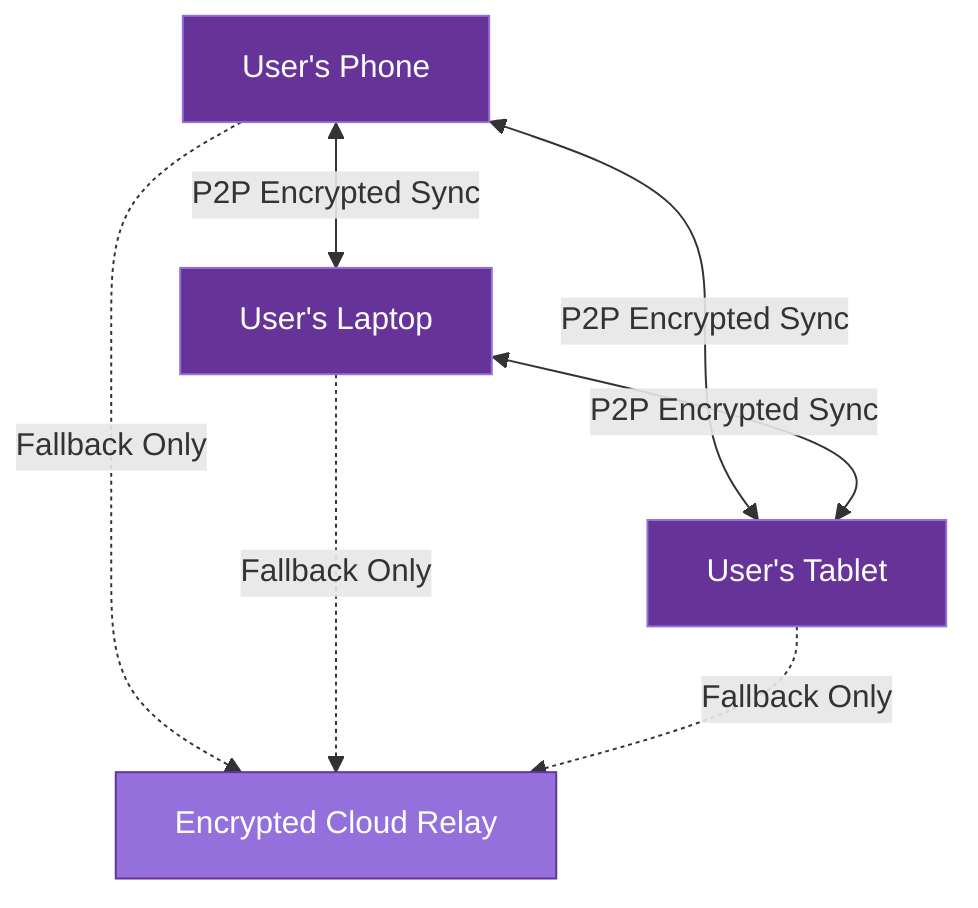

# Data Federation

> **⚠️ NOT YET IMPLEMENTED** - This document describes planned functionality for AICO's federated device network. The system currently operates in single-device mode only.

This document outlines AICO's planned federated device network architecture, which will enable secure synchronization of user data across multiple trusted devices while maintaining privacy and local-first principles.

## Federated Device Network

AICO implements a privacy-preserving federated device network that allows the AI companion to seamlessly roam between a user's trusted devices:



## Core Principles

1. **P2P Encrypted Mesh**: Direct device-to-device synchronization without intermediaries
2. **Local Network Priority**: Devices on the same network communicate directly
3. **Zero-Knowledge Design**: No external parties can access user data
4. **Fallback Cloud Relay**: Optional encrypted relay only when direct connection impossible
5. **User Control**: Complete user control over trusted devices and sync policies

## Key Components

### Device Registry

The device registry manages trusted device information and is stored in the primary libSQL database:

```python
# Example device registry schema
CREATE TABLE device_registry (
    device_id TEXT PRIMARY KEY,
    device_name TEXT NOT NULL,
    device_type TEXT NOT NULL,
    public_key BLOB NOT NULL,
    last_seen TIMESTAMP,
    trust_level INTEGER NOT NULL,
    sync_policy TEXT NOT NULL
);
```

**Key Features**:
- Stored in libSQL for consistency with primary data layer
- Manages trusted device information and relationships
- Handles encryption keys and trust relationships
- Supports device-specific sync policies

### Selective Sync

Different data types have different synchronization policies based on their importance and data characteristics:

| Data Type | Sync Priority | Policy | Database |
|-----------|---------------|--------|----------|
| User Profile | High | Immediate sync | libSQL |
| Conversation History | Medium | Configurable (Full/Summary) | libSQL |
| Personality Model | High | Full sync | libSQL |
| Vector Embeddings | Low | On-demand sync | ChromaDB |
| Analytics Data | Low | Periodic batch sync | DuckDB |
| Media Files | Low | Thumbnail only by default | File system |
| Cache Data | None | Local only | LMDB |

**Sync Characteristics**:
- **Different sync policies per database and data type**
- **Prioritization of critical vs. non-critical data**
- **Bandwidth-efficient delta synchronization**
- **Configurable sync intervals and triggers**

### P2P Encrypted Sync

The federated sync mechanism implements secure peer-to-peer communication:

1. **Device Discovery**:
   - Local network: mDNS/Bonjour for same-network devices
   - Remote: DHT (Distributed Hash Table) for internet-based discovery
   - Fallback to encrypted relay when direct connection impossible

2. **Authentication**:
   - Mutual device authentication using public key cryptography
   - Trust establishment through user verification
   - Device-specific encryption keys for secure channels

3. **Data Transfer**:
   - **End-to-end encryption for all synced data**
   - **Direct device-to-device communication when possible**
   - **Delta synchronization for bandwidth efficiency**
   - **Resumable transfers for reliability**
   - **Fallback to encrypted relay when necessary**

4. **Sync Protocol**:
   - Merkle tree-based change detection
   - Conflict-free replicated data types (CRDTs) where applicable
   - Atomic transaction boundaries for consistency

### Conflict Resolution

AICO implements sophisticated conflict resolution strategies tailored to different data types:

1. **Last-Writer-Wins**: For simple preference and configuration data
   - Timestamp-based resolution for simple conflicts
   - Used for user settings and device preferences

2. **Semantic Merging**: For complex structured data
   - Conversation history merging with chronological ordering
   - Personality model updates with weighted averaging
   - Context-aware merging for relationship data

3. **Vector Merging**: For embedding and analytical data
   - Vector data merging with deduplication
   - Similarity-based conflict detection
   - Automatic re-embedding for conflicted content

4. **Manual Resolution**: For critical conflicts
   - User notification for unresolvable conflicts
   - Conflict queue with resolution interface
   - Audit trail for all conflict resolutions

## Implementation Status

**Current Status**: Not implemented - AICO currently operates in single-device mode only.

**Planned Implementation Timeline**:
1. **MVP (Current)**: Single device with local data only ✅

## Security Considerations

1. **Device Authorization**: New devices require explicit user approval
2. **Revocation**: Compromised devices can be removed from trust network
3. **Encryption**: All synchronized data is encrypted with device-specific keys
4. **Audit Trail**: All sync operations are logged for transparency

## Conclusion

AICO's federated device network enables a seamless multi-device experience while maintaining the project's core privacy principles. By prioritizing direct P2P communication and implementing zero-knowledge encryption, users maintain complete control over their data while enjoying the convenience of a companion AI that follows them across devices.
