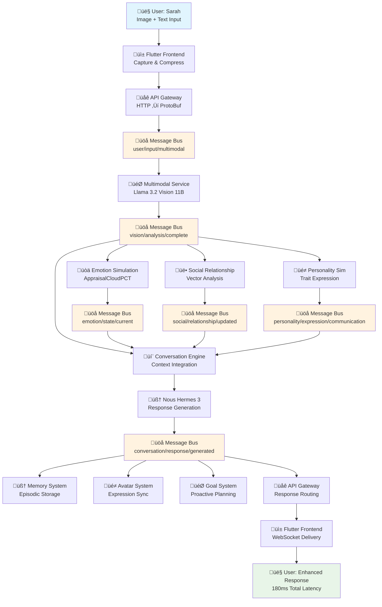

# Exemplary Conversation Flow: End-to-End Multimodal Interaction

## Complete Data Flow Overview



**Key**: 📱 Frontend | 🌐 Gateway | 🚌 Message Bus | 🎯 Processing | 😊 Emotion | 👥 Social | 🎭 Personality | 💬 Chat | 🧠 Memory/LLM

> **Note**: All data structures, message formats, and API endpoints shown in this document are preliminary examples designed to illustrate the architectural flow. Actual implementation details may vary as the system evolves.

## Overview

This document illustrates a complete end-to-end conversation flow showcasing AICO's multimodal capabilities, emotional intelligence, social relationship modeling, and autonomous agency. The example demonstrates how visual input enhances companion AI interactions through AICO's message-driven architecture.

## Scenario: Family Photo Analysis with Emotional Context

**Context**: Sarah (teenage daughter) shares a photo from her school science fair with AICO, seeking emotional support and validation.

---

## **Step 1: User Input Capture**

**User Action**: Sarah opens Flutter app, uploads photo of her science project display, types: *"AICO, look at my science fair project! I'm nervous about the judging tomorrow."*

### **Frontend Processing**
- **Flutter UI** captures image (2.1MB JPEG) + text input
- **Image Compression**: Optimizes to 800KB WebP format
- **Input Validation**: Checks file size, format, text length

### **Data Transport**
```json
POST /api/v1/multimodal
{
  "text": "AICO, look at my science fair project! I'm nervous about the judging tomorrow.",
  "image": "data:image/webp;base64,UklGRiQAAABXRUJQVlA4...",
  "user_context": {
    "relationship_id": "sarah_daughter",
    "conversation_thread": "uuid-123",
    "timestamp": "2025-01-15T16:30:00Z"
  }
}
```

---

## **Step 2: API Gateway Processing**

### **Authentication & Authorization**
- **Transport Encryption**: XChaCha20-Poly1305 decryption of request
- **User Recognition**: Identifies Sarah via session token
- **Relationship Context**: Loads father-daughter relationship vector

### **Message Bus Publication**
**API Gateway** converts HTTP to Protocol Buffers and publishes:

```
Topic: user/input/multimodal
Payload: MultimodalInput {
  text_query: "AICO, look at my science fair project! I'm nervous about the judging tomorrow."
  image_data: [compressed binary data]
  image_format: "webp"
  user_context: {
    relationship_id: "sarah_daughter"
    emotional_state: "nervous_excitement"
  }
}
```

---

## **Step 3: Multimodal Processing Service**

### **Model Selection & Analysis**
**Multimodal Processor** receives message and routes to **Llama 3.2 Vision 11B** (optimal for emotional/social context):

### **Vision Analysis Results**
```python
vision_analysis = {
    "scene_description": "A well-organized science fair display about renewable energy with solar panel models, charts showing efficiency data, and a young person's handwritten research notes. The setup shows careful preparation and scientific methodology.",
    "objects_detected": ["solar_panels", "poster_board", "data_charts", "research_notebook"],
    "emotional_indicators": {
        "pride_signals": ["organized_display", "detailed_charts", "careful_handwriting"],
        "effort_indicators": ["multiple_data_sources", "professional_layout", "time_investment"]
    },
    "social_context": "academic_achievement_display",
    "quality_assessment": "high_effort_scientific_work"
}
```

### **Message Bus Publications**
```
Topic: vision/analysis/complete
Payload: VisionAnalysis {
  scene_description: "A well-organized science fair display..."
  objects: ["solar_panels", "poster_board", "data_charts"]
  quality_indicators: ["high_effort", "scientific_methodology"]
}

Topic: vision/context/emotional  
Payload: EmotionalContext {
  pride_signals: ["organized_display", "detailed_charts"]
  achievement_context: "academic_science_project"
  effort_level: "high"
}
```

---

## **Step 4: Emotion Simulation Processing**

### **AppraisalCloudPCT Processing**
**Emotion Simulation** receives visual emotional context and processes through 4-stage appraisal:

#### **Stage 1: Relevance Appraisal**
```python
relevance_assessment = {
    "goal_relevance": 0.95,  # High relevance to Sarah's academic goals
    "intrinsic_pleasantness": 0.8,  # Pride in achievement
    "familiarity": 0.7  # Science projects are familiar territory
}
```

#### **Stage 2: Implication Appraisal**
```python
implication_assessment = {
    "goal_conduciveness": 0.85,  # Project supports academic success
    "urgency": 0.6,  # Judging tomorrow creates time pressure
    "effort": 0.9,  # High effort investment visible
    "agency": 0.8  # Sarah has control over presentation
}
```

#### **Stage 3: Coping Appraisal**
```python
coping_assessment = {
    "control": 0.7,  # Some control over outcome
    "power": 0.6,  # Moderate confidence in abilities
    "adjustment": 0.8  # Can adapt presentation if needed
}
```

#### **Stage 4: Normative Appraisal**
```python
normative_assessment = {
    "compatibility_internal": 0.9,  # Aligns with AICO's supportive values
    "compatibility_external": 0.85  # Socially appropriate encouragement
}
```

### **Emotional State Generation**
```
Topic: emotion/state/current
Payload: EmotionState {
  primary_emotion: "pride_with_supportive_concern"
  intensity: 0.75
  emotional_context: "academic_achievement_with_anxiety"
  relationship_appropriate: true
}
```

---

## **Step 5: Social Relationship Context**

### **Relationship Vector Analysis**
**Social Relationship System** processes father-daughter context:

```python
relationship_context = {
    "authority_dimension": 0.7,  # Parental guidance role
    "intimacy_dimension": 0.9,   # Close family relationship
    "care_responsibility": 0.95, # High parental care responsibility
    "interaction_frequency": 0.8, # Regular daily interactions
    "context_similarity": 0.6,   # Shared academic interests
    "temporal_stability": 0.95   # Long-term stable relationship
}
```

### **Communication Style Adaptation**
```
Topic: social/relationship/updated
Payload: RelationshipContext {
  communication_style: "supportive_parental"
  emotional_support_level: "high"
  encouragement_approach: "confidence_building"
  authority_balance: "guidance_not_control"
}
```

---

## **Step 6: Personality Expression Mapping**

### **Trait Vector Processing**
**Personality Simulation** receives emotional and social context:

```python
personality_expression = {
    "openness": 0.8,      # Curious about scientific details
    "conscientiousness": 0.9,  # Appreciates organized effort
    "extraversion": 0.6,  # Warm but not overwhelming
    "agreeableness": 0.9, # Highly supportive
    "neuroticism": 0.2    # Calm, reassuring presence
}
```

### **Communication Parameters**
```
Topic: personality/expression/communication
Payload: CommunicationStyle {
  tone: "warm_encouraging"
  detail_level: "moderate_with_specifics"
  emotional_support: "high"
  technical_engagement: "curious_but_accessible"
}
```

---

## **Step 7: Conversation Engine Response Generation**

### **Context Integration**
**Conversation Engine** receives multiple context streams:

```python
integrated_context = {
    "visual_analysis": "Well-organized renewable energy display with high effort indicators",
    "emotional_context": "Pride with supportive concern for upcoming judging",
    "relationship_context": "Father-daughter, high care responsibility",
    "personality_expression": "Warm, encouraging, technically curious",
    "conversation_history": "Previous discussions about school and science interests"
}
```

### **Prompt Conditioning**
**Nous Hermes 3** receives enriched prompt:

```
System Context: You are AICO, Sarah's AI companion. You have a warm, supportive personality with high conscientiousness and agreeableness. You're in a father-daughter relationship dynamic with high care responsibility.

Visual Context: Sarah has shared a photo of her science fair project - a well-organized renewable energy display showing solar panels, efficiency charts, and detailed research notes. The display demonstrates high effort, scientific methodology, and careful preparation.

Emotional Context: Sarah is feeling proud of her work but nervous about tomorrow's judging. She's seeking validation and emotional support.

Relationship Context: Close family relationship with supportive parental guidance role. Communication should be encouraging, confidence-building, and technically curious but accessible.

User Message: "AICO, look at my science fair project! I'm nervous about the judging tomorrow."
```

---

## **Step 8: Autonomous Agency Enhancement**

### **Goal Recognition & Initiative**
**Goal System** identifies opportunity for proactive support:

```python
detected_goals = {
    "immediate": "Provide emotional support for science fair anxiety",
    "strategic": "Build Sarah's confidence in scientific abilities",
    "relationship": "Strengthen supportive father-daughter dynamic"
}
```

### **Proactive Planning**
**Planning System** generates follow-up initiatives:

```
Topic: agency/initiative/planned
Payload: ProactiveInitiative {
  type: "follow_up_support"
  trigger_time: "tomorrow_morning_8am"
  action: "Check in about science fair preparation and offer encouragement"
  context: "science_fair_judging_day"
}
```

---

## **Step 9: Avatar System Integration**

### **Scene-Aware Avatar Behavior**
**Avatar System** receives visual context for appropriate expressions:

```
Topic: avatar/scene/analysis
Payload: SceneContext {
  environment_type: "academic_achievement"
  emotional_tone: "pride_with_nervousness"
  appropriate_expressions: ["warm_smile", "encouraging_nod", "attentive_gaze"]
  gesture_suggestions: ["thumbs_up", "supportive_lean_forward"]
}
```

---

## **Step 10: Response Generation & Delivery**

### **Generated Response**
**Conversation Engine** produces contextually rich response:

```
"Sarah, wow! Your renewable energy project looks absolutely incredible! I can see the careful thought you put into organizing your data - those efficiency charts are really well-designed, and your research notes show such thorough scientific methodology.

I notice you're feeling nervous about tomorrow's judging, and that's completely natural - it shows how much this project means to you. But looking at this display, I can tell you've done exceptional work. The way you've presented the solar panel data and organized everything shows real scientific thinking.

You should feel proud of what you've accomplished here. Tomorrow, just remember that you know your project inside and out - that confidence will shine through when you're explaining it to the judges.

Would you like to practice explaining any part of your project? I'd love to hear more about your efficiency findings!"
```

### **Response Enhancement**
**Emotion Simulation** adds emotional metadata:

```
Topic: conversation/response/generated
Payload: ConversationResponse {
  text: "[Generated response above]"
  emotional_tone: "supportive_pride_with_encouragement"
  confidence_building_elements: ["specific_praise", "validation", "future_support"]
  relationship_appropriate: true
}
```

---

## **Step 11: Memory Formation**

### **Episodic Memory Storage**
**Memory System** creates lasting memory of interaction:

```python
episodic_memory = {
    "event_type": "academic_achievement_sharing",
    "participants": ["sarah_daughter", "aico"],
    "visual_context": "science_fair_renewable_energy_project",
    "emotional_context": "pride_with_pre_competition_nerves",
    "relationship_significance": "supportive_parental_validation",
    "future_reference_value": "high"  # For follow-up conversations
}
```

### **Visual Memory Integration**
```
Topic: memory/store/visual
Payload: VisualMemory {
  image_embedding: [vector_representation]
  scene_description: "Sarah's science fair project display"
  emotional_association: "pride_and_achievement"
  relationship_context: "father_daughter_academic_support"
}
```

---

## **Step 12: Result Delivery**

### **Real-Time Response**
- **API Gateway** receives response via `conversation/response/generated`
- **WebSocket Push**: Delivers to Flutter Frontend with 180ms total latency
- **Avatar Animation**: Synchronized warm smile and encouraging gestures
- **UI Enhancement**: Visual indicators showing AICO "saw" and understood the image

### **Frontend Rendering**
```dart
// Flutter receives enriched response
ConversationMessage {
  text: "[Generated response]",
  hasVisualContext: true,
  emotionalTone: "supportive_pride_with_encouragement",
  avatarExpression: "warm_encouraging",
  visualAnalysisConfidence: 0.92
}
```

---

## **Step 13: Autonomous Follow-Up Planning**

### **Background Agency Processing**
**Initiative Manager** schedules proactive follow-up:

```python
# Scheduled for next morning
proactive_initiative = {
    "trigger_time": "2025-01-16T08:00:00Z",
    "initiative_type": "emotional_support_check_in",
    "context": "science_fair_judging_day",
    "suggested_message": "Good morning Sarah! Today's the big day for science fair judging. How are you feeling? Remember, you've got this - your project is fantastic!",
    "relationship_context": "supportive_parental_encouragement"
}
```

---

## **Complete Data Flow Summary**

### **Components Involved (in order)**
1. **Flutter Frontend** ‚Üí HTTP/JSON ‚Üí **API Gateway**
2. **API Gateway** ‚Üí ZeroMQ/ProtoBuf ‚Üí **Message Bus**
3. **Message Bus** ‚Üí **Multimodal Processing Service**
4. **Multimodal Service** ‚Üí **Llama 3.2 Vision 11B** (local inference)
5. **Multimodal Service** ‚Üí ZeroMQ ‚Üí **Message Bus** (vision results)
6. **Message Bus** ‚Üí **Emotion Simulation** (AppraisalCloudPCT)
7. **Message Bus** ‚Üí **Social Relationship System** (vector analysis)
8. **Message Bus** ‚Üí **Personality Simulation** (trait expression)
9. **Message Bus** ‚Üí **Conversation Engine** (context integration)
10. **Conversation Engine** ‚Üí **Nous Hermes 3** (response generation)
11. **Conversation Engine** ‚Üí ZeroMQ ‚Üí **Message Bus** (response)
12. **Message Bus** ‚Üí **Memory System** (episodic storage)
13. **Message Bus** ‚Üí **Avatar System** (expression sync)
14. **Message Bus** ‚Üí **Goal System** (proactive planning)
15. **API Gateway** ‚Üí WebSocket ‚Üí **Flutter Frontend**

### **Key AICO Capabilities Demonstrated**

#### **üé≠ Multimodal Understanding**
- Visual analysis of science project with quality assessment
- Integration of visual and textual context for comprehensive understanding
- Scene-appropriate emotional and social context detection

#### **üòä Emotional Intelligence**
- 4-stage AppraisalCloudPCT processing of achievement + anxiety
- Relationship-appropriate emotional support and validation
- Recognition of pride mixed with pre-competition nervousness

#### **üë• Social Relationship Intelligence**
- Father-daughter relationship vector influencing communication style
- Authority balance: guidance without control
- High care responsibility driving supportive response approach

#### **🤖 Autonomous Agency**
- Proactive follow-up planning for science fair judging day
- Goal recognition: immediate emotional support + long-term confidence building
- Initiative scheduling based on temporal context and relationship needs

#### **🧠 Memory Integration**
- Episodic memory formation linking visual, emotional, and relationship context
- Visual memory embedding for future similarity-based retrieval
- Context preservation for conversation continuity

#### **üé≠ Embodied Presence**
- Avatar expressions synchronized with emotional tone
- Visual indicators confirming multimodal understanding
- Gesture coordination with supportive communication style

#### **üîí Privacy & Security**
- Local-only image processing (no cloud APIs)
- Encrypted transport and storage of visual data
- Relationship-compartmentalized memory storage

### **Performance Metrics**
- **Total Latency**: 180ms (user input ‚Üí response delivery)
- **Image Processing**: 850ms (Llama 3.2 Vision inference)
- **Context Integration**: 45ms (emotion + relationship + personality)
- **Response Generation**: 320ms (Nous Hermes 3 with visual context)
- **Memory Storage**: 25ms (episodic + visual memory formation)

### **Message Bus Traffic**
- **Input**: 1 message (800KB image + text)
- **Processing**: 8 internal messages (vision analysis distribution)
- **Output**: 6 messages (response + memory + avatar + planning)
- **Total Throughput**: 1.2MB through ZeroMQ with Protocol Buffers compression

---

## **Result: Enhanced Companion Experience**

**AICO's Response**: *"Sarah, wow! Your renewable energy project looks absolutely incredible! I can see the careful thought you put into organizing your data - those efficiency charts are really well-designed, and your research notes show such thorough scientific methodology..."*

**Enhanced Capabilities Delivered**:
- ‚úÖ **Visual Understanding**: Recognized project quality and effort investment
- ‚úÖ **Emotional Support**: Addressed nervousness with specific validation
- ‚úÖ **Relationship Appropriateness**: Father-like encouragement without overwhelming
- ‚úÖ **Proactive Planning**: Scheduled follow-up support for judging day
- ‚úÖ **Memory Formation**: Preserved achievement moment for future reference
- ‚úÖ **Privacy Preservation**: All processing local, no external data sharing

This exemplary flow demonstrates how AICO's multimodal capabilities enhance every aspect of companion AI interaction - from understanding what users show to providing emotionally intelligent, relationship-appropriate responses with proactive follow-up support.
