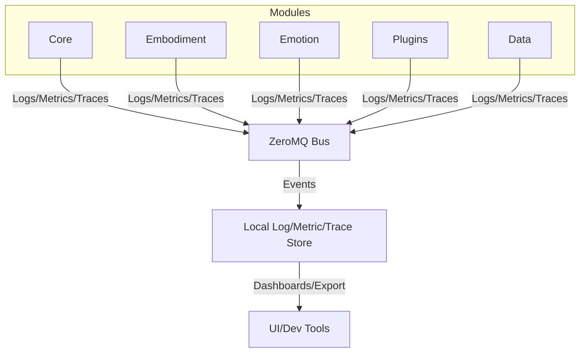

# Instrumentation Architecture

## Overview
AICO's instrumentation system provides unified, privacy-respecting observability across all modules, modes, and devices. It is designed to support both **coupled** (single-device) and **detached** (multi-device/federated) deployments, in line with AICO's core architectural principles as outlined in the [Architecture Overview](../../architecture/architecture-overview.md).

## Design Goals
- **Consistent Observability:** Unified approach for logging, metrics, tracing, and auditing across all modules and plugins.
- **Privacy-First:** All instrumentation is local-first, user-controlled, and zero-knowledge by default. No sensitive data is exported without explicit user consent.
- **Modular & Extensible:** Instrumentation is a cross-cutting concern, integrated via standard interfaces and message bus topics.
- **Multi-Modal & Embodied:** Observes not just backend logic, but also embodiment, emotion, and user interaction layers.
- **Works in All Modes:** Fully functional in both coupled (all-in-one) and detached (distributed/federated) deployments.

## Instrumentation Modes & Stages

AICO’s instrumentation system is designed to be **privacy-first, local-first, and user-friendly by default**, with opt-in escalation for advanced users and developers. There are three distinct stages:

### 1. Casual User (Default)
- **Minimal, non-technical logging:** Only essential events and errors are logged, using clear, human-friendly messages.
- **User notifications:** Important system events are surfaced as simple notifications (e.g., "AICO restarted"), not technical logs.
- **No metrics, tracing, or analytics** are collected or exposed.
- **No external dashboards or endpoints.**
- **Privacy:** All data remains local, never leaves the device.

### 2. Pro User (Opt-In)
- **Resource & health insights:** In-app dashboard or status page shows resource usage, performance, and health (CPU, memory, uptime, etc.).
- **In-depth logs:** More detailed logs are available for inspection/export.
- **Debug Capsules:** On-demand, session-based instrumentation "capsules" can be generated (encrypted, portable files containing logs/metrics for a session). Users can review/redact before sharing for support.
- **Still local-first:** All insights and data remain on-device unless explicitly exported by the user.

### 3. Developer Mode (Opt-In Plugin)
- **Full observability plugin:** When enabled, exposes advanced instrumentation endpoints (Prometheus, OpenTelemetry, etc.).
- **Local Prometheus/Grafana instances:** Pre-configured, run locally (never required for normal use).
- **Predefined dashboards:** For metrics, traces, and logs across all modules.
- **Advanced tracing and analytics:** Full distributed tracing, activity streams, and audit logs available.
- **Plugin isolation:** Dev tools are sandboxed and can be disabled/removed at any time.

---

## Core Components (Across All Stages)

- **Logging:** Structured, leveled logs with module/topic tagging. Always local by default.
- **Metrics:** Quantitative health and performance data (pro/dev only). Exposed via in-app dashboard or local endpoints.
- **Tracing:** End-to-end trace IDs and span contexts (dev only).
- **Event Auditing:** Key events recorded in append-only, local-first logs.
- **Health Probes:** Liveness/readiness endpoints for orchestration and monitoring (pro/dev only).
- **Error Reporting:** Centralized error/event collection with context.
- **Usage Analytics:** Aggregated, anonymized, strictly opt-in (pro/dev only).
- **Privacy & Security:** Dedicated audit logs, real-time alerts, and strict privacy enforcement at every stage.
- **Debug Capsules:** Portable, encrypted session logs for support (pro/dev).
- **Plugin Instrumentation:** API hooks for plugin logging/metrics, with enforced boundaries (dev only).

---

## Architectural Integration

### Distributed Tracing in a Message Bus Architecture
- **Trace Context Propagation:**
  - Every ZeroMQ message envelope includes trace metadata (`trace_id`, `span_id`, `parent_span_id`, timestamps, etc.).
  - When a module receives a message, it extracts the trace context, creates a new span for its processing, and attaches updated context to any new messages it publishes.
  - This enables end-to-end tracing across all modules, even in a purely event-driven, local-first system.
- **OpenTelemetry Compatibility:**

**Example Envelope Addition:**
```json
{
  "trace": {
    "trace_id": "abc123",
    "span_id": "ghi789",
    "parent_span_id": "def456"
  }
}
```

---

## Phase 4: Auditing & Debug Capsules

**Goal:** Provide robust event auditing and portable debug data for support/compliance.

- **Append-only audit logs:** Key events are recorded for later review.
- **Debug Capsules:** Users/devs can generate encrypted session logs for troubleshooting.
- **Privacy:** All audit data is local and encrypted; export is user-controlled.
- **Developer Guidance:**
    - Use audit API for critical actions.
    - Ensure debug capsules redact or encrypt sensitive data.

---

## Phase 5: Analytics & Extensibility

**Goal:** Enable advanced analytics, usage insights, and plugin observability.

- **Aggregated analytics:** Strictly opt-in, anonymized, local-first.
- **Plugin Instrumentation:** Plugins use the same APIs (logging, metrics, tracing) with enforced boundaries.
- **Advanced Dashboards:** For dev mode, provide Prometheus/Grafana endpoints and pre-built dashboards.
- **Developer Guidance:**
    - Follow API contracts for plugin instrumentation.
    - Never bypass privacy controls.

---

## Unified Instrumentation Architecture Diagram




## References
- [OpenTelemetry](https://opentelemetry.io/)
- [Prometheus](https://prometheus.io/)
- [Grafana](https://grafana.com/)
- [ZeroMQ](https://zeromq.org/)

