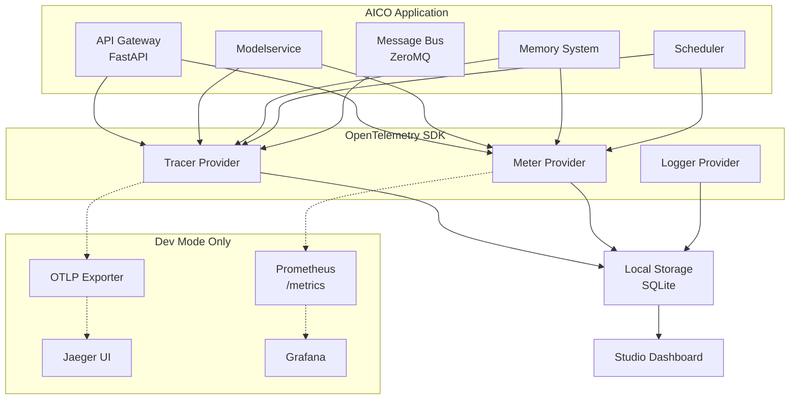

# Instrumentation Architecture

## Overview
AICO's instrumentation system provides unified, privacy-respecting observability across all modules, modes, and devices using **OpenTelemetry** as the industry-standard foundation. It is designed to support both **coupled** (single-device) and **detached** (multi-device/federated) deployments, in line with AICO's core architectural principles as outlined in the [Architecture Overview](../../architecture/architecture-overview.md).

### Technology Foundation
- **OpenTelemetry (OTel)**: CNCF-graduated standard for traces, metrics, and logs
- **Auto-Instrumentation**: Zero-code instrumentation for FastAPI, SQLite, and other frameworks
- **Vendor-Neutral**: Export to any backend (Prometheus, Jaeger, Grafana, etc.)
- **Local-First**: All telemetry stored locally by default, with optional export in dev mode
- **Apache 2.0 License**: Fully open-source and compatible with AICO's licensing

## Design Goals
- **Consistent Observability:** Unified approach for logging, metrics, tracing, and auditing across all modules and plugins.
- **Privacy-First:** All instrumentation is local-first, user-controlled, and zero-knowledge by default. No sensitive data is exported without explicit user consent.
- **Modular & Extensible:** Instrumentation is a cross-cutting concern, integrated via standard interfaces and message bus topics.
- **Multi-Modal & Embodied:** Observes not just backend logic, but also embodiment, emotion, and user interaction layers.
- **Works in All Modes:** Fully functional in both coupled (all-in-one) and detached (distributed/federated) deployments.

## Instrumentation Modes & Stages

AICO’s instrumentation system is designed to be **privacy-first, local-first, and user-friendly by default**, with opt-in escalation for advanced users and developers. There are three distinct stages:

### 1. Casual User (Default)
- **Minimal, non-technical logging:** Only essential events and errors are logged, using clear, human-friendly messages.
- **User notifications:** Important system events are surfaced as simple notifications (e.g., "AICO restarted"), not technical logs.
- **No metrics, tracing, or analytics** are collected or exposed.
- **No external dashboards or endpoints.**
- **Privacy:** All data remains local, never leaves the device.

### 2. Pro User (Opt-In)
- **Resource & health insights:** In-app dashboard or status page shows resource usage, performance, and health (CPU, memory, uptime, etc.).
- **In-depth logs:** More detailed logs are available for inspection/export.
- **Debug Capsules:** On-demand, session-based instrumentation "capsules" can be generated (encrypted, portable files containing logs/metrics for a session). Users can review/redact before sharing for support.
- **Metrics Export (Optional):** Can enable Prometheus `/metrics` endpoint for integration with monitoring systems.
- **Still local-first:** All insights and data remain on-device unless explicitly exported by the user.

### 3. Developer Mode (Opt-In Plugin)
- **Full observability plugin:** When enabled, exposes advanced instrumentation endpoints (Prometheus `/metrics`, OTLP exporters).
- **Local Prometheus/Jaeger/Grafana:** Pre-configured stack runs locally (never required for normal use).
- **Predefined dashboards:** Pre-built Grafana dashboards for all AICO subsystems.
- **Advanced tracing and analytics:** Full distributed tracing via Jaeger, activity streams, and audit logs.
- **OpenTelemetry Collector:** Optional local collector for advanced telemetry routing.
- **Plugin isolation:** Dev tools are sandboxed and can be disabled/removed at any time.

### 4. Production Mode (Enterprise/Self-Hosted)
- **Prometheus Integration:** `/metrics` endpoint available for production monitoring systems.
- **Grafana Dashboards:** Pre-built dashboards work with production Grafana instances.
- **OTLP Export:** Optional export to production observability backends (Jaeger, Tempo, etc.).
- **Privacy Controls:** Automatic PII redaction, configurable data retention.
- **Security:** Metrics endpoint can be secured with authentication, rate limiting.
- **Local-First Option:** Can run entirely local even in production (no external export required).

---

## Core Components (Across All Stages)

### Instrumentation Layer (OpenTelemetry)
- **Traces:** Distributed tracing with automatic context propagation via ZeroMQ envelopes
- **Metrics:** Counters, gauges, histograms for performance and health monitoring
- **Logs:** Structured logs with trace correlation and semantic attributes
- **Auto-Instrumentation:** FastAPI, SQLite, HTTP clients instrumented automatically
- **Custom Instrumentation:** Business logic instrumented via OTel SDK

### Storage & Export
- **Local Storage (Always):** SQLite-based metrics store for Studio dashboard
- **Prometheus Exporter (Pro/Dev/Production):** `/metrics` endpoint for Prometheus scraping
  - Casual: Disabled by default
  - Pro: Opt-in, local only
  - Dev: Enabled by default
  - Production: Configurable, with authentication
- **OTLP Exporter (Dev/Production):** Push traces to Jaeger, metrics to collectors
  - Casual/Pro: Disabled
  - Dev: Enabled by default
  - Production: Opt-in, configurable endpoint
- **Grafana Integration (All Modes):** Pre-built dashboards work with any Grafana instance

### Privacy & Security
- **Local-First:** All telemetry stored locally by default
- **Opt-In Export:** External backends only enabled in dev mode
- **Data Redaction:** Sensitive data automatically scrubbed from telemetry
- **Audit Logs:** Instrumentation access and export tracked
- **Debug Capsules:** Encrypted, portable telemetry bundles for support

---

## Architectural Integration

### Distributed Tracing in a Message Bus Architecture

**OpenTelemetry Context Propagation via ZeroMQ:**
- Every ZeroMQ message envelope includes W3C Trace Context headers
- Modules extract trace context, create child spans, and propagate to downstream messages
- Enables end-to-end tracing across all modules in event-driven architecture

**Envelope Format (W3C Trace Context):**
```json
{
  "headers": {
    "traceparent": "00-0af7651916cd43dd8448eb211c80319c-b7ad6b7169203331-01",
    "tracestate": "aico=module:conversation,priority:high"
  },
  "trace": {
    "trace_id": "0af7651916cd43dd8448eb211c80319c",
    "span_id": "b7ad6b7169203331",
    "parent_span_id": "00f067aa0ba902b7",
    "trace_flags": "01"
  }
}
```

**Implementation:**
- Use `opentelemetry.propagate` to inject/extract context
- Automatic span creation for message handlers
- Trace correlation across async operations

---

## Implementation Architecture

### Layer 1: OpenTelemetry SDK (Core)
```python
from opentelemetry import trace, metrics
from opentelemetry.sdk.trace import TracerProvider
from opentelemetry.sdk.metrics import MeterProvider

# Initialize providers
trace.set_tracer_provider(TracerProvider())
metrics.set_meter_provider(MeterProvider())

# Get instruments
tracer = trace.get_tracer("aico.backend")
meter = metrics.get_meter("aico.backend")
```

### Layer 2: Auto-Instrumentation
- **FastAPI:** `opentelemetry-instrumentation-fastapi` (automatic middleware)
- **SQLite:** `opentelemetry-instrumentation-sqlite3` (query tracing)
- **HTTP Clients:** `opentelemetry-instrumentation-requests` (outbound calls)
- **ZeroMQ:** Custom propagator for message bus context

### Layer 3: Custom Metrics (Business Logic)
```python
# API Gateway metrics
request_counter = meter.create_counter(
    "aico.api.requests",
    description="Total API requests",
    unit="1"
)
latency_histogram = meter.create_histogram(
    "aico.api.latency",
    description="Request latency",
    unit="ms"
)

# Modelservice metrics
inference_counter = meter.create_counter(
    "aico.modelservice.inferences",
    description="Total inferences",
    unit="1"
)
inference_duration = meter.create_histogram(
    "aico.modelservice.inference_duration",
    description="Inference duration",
    unit="s"
)
```

### Layer 4: Storage & Export

**Casual Mode (Default):**
- Local SQLite metrics database for Studio dashboard
- No external export
- No metrics endpoint exposed

**Pro Mode:**
- Metrics aggregation for in-app insights
- Debug capsule generation
- Optional Prometheus `/metrics` endpoint (opt-in, local only)

**Dev Mode:**
- Prometheus exporter on `/metrics` (enabled by default)
- OTLP exporter to Jaeger (traces)
- Grafana dashboards (pre-configured local stack)

**Production Mode:**
- All exporters available and configurable
- Prometheus `/metrics` with optional authentication
- OTLP export to production backends
- Grafana dashboards for production monitoring
- Privacy controls enforced (PII redaction)
- Configurable data retention and sampling

### Health Calculation
- OpenTelemetry metrics feed into health calculator
- Transparent scoring with degradation reasons
- Real-time component status based on actual telemetry

---

## Unified Instrumentation Architecture Diagram


```mermaid
graph TD;
  subgraph AICO Application
    API[API Gateway<br/>FastAPI]
    Model[Modelservice]
    Memory[Memory System]
    Scheduler[Scheduler]
    Bus[Message Bus<br/>ZeroMQ]
  end
  
  subgraph OpenTelemetry SDK
    Tracer[Tracer Provider]
    Meter[Meter Provider]
    Logger[Logger Provider]
  end
  
  API --> Tracer
  API --> Meter
  Model --> Tracer
  Model --> Meter
  Memory --> Tracer
  Memory --> Meter
  Scheduler --> Tracer
  Scheduler --> Meter
  Bus --> Tracer
  
  Tracer --> LocalStore[Local Storage<br/>SQLite]
  Meter --> LocalStore
  Logger --> LocalStore
  
  LocalStore --> Studio[Studio Dashboard]
  
  subgraph Dev Mode Only
    Tracer -.-> OTLP[OTLP Exporter]
    Meter -.-> Prom[Prometheus<br/>/metrics]
    OTLP -.-> Jaeger[Jaeger UI]
    Prom -.-> Grafana[Grafana]
  end
```


## Dependencies

### Core (Always Installed)
```toml
[project.dependencies]
opentelemetry-api = "^1.20.0"
opentelemetry-sdk = "^1.20.0"
opentelemetry-instrumentation-fastapi = "^0.41b0"
opentelemetry-instrumentation-sqlite3 = "^0.41b0"
```

### Dev Mode (Optional)
```toml
[project.optional-dependencies]
dev = [
    "opentelemetry-exporter-prometheus = ^0.41b0",
    "opentelemetry-exporter-otlp = ^1.20.0",
    "prometheus-client = ^0.19.0"
]
```

## Migration Path

1. **Phase 1:** Install OTel SDK, add auto-instrumentation to FastAPI
2. **Phase 2:** Add custom metrics for business logic (API Gateway, Modelservice, etc.)
3. **Phase 3:** Create local storage adapter, feed Studio dashboard
4. **Phase 4:** Add health calculator using OTel metrics
5. **Phase 5:** Add optional Prometheus/Jaeger exporters for dev mode
6. **Phase 6:** Create pre-built Grafana dashboards

## References
- [OpenTelemetry Python](https://opentelemetry.io/docs/languages/python/)
- [OpenTelemetry FastAPI](https://opentelemetry-python-contrib.readthedocs.io/en/latest/instrumentation/fastapi/fastapi.html)
- [Prometheus](https://prometheus.io/)
- [Jaeger](https://www.jaegertracing.io/)
- [Grafana](https://grafana.com/)
- [W3C Trace Context](https://www.w3.org/TR/trace-context/)

