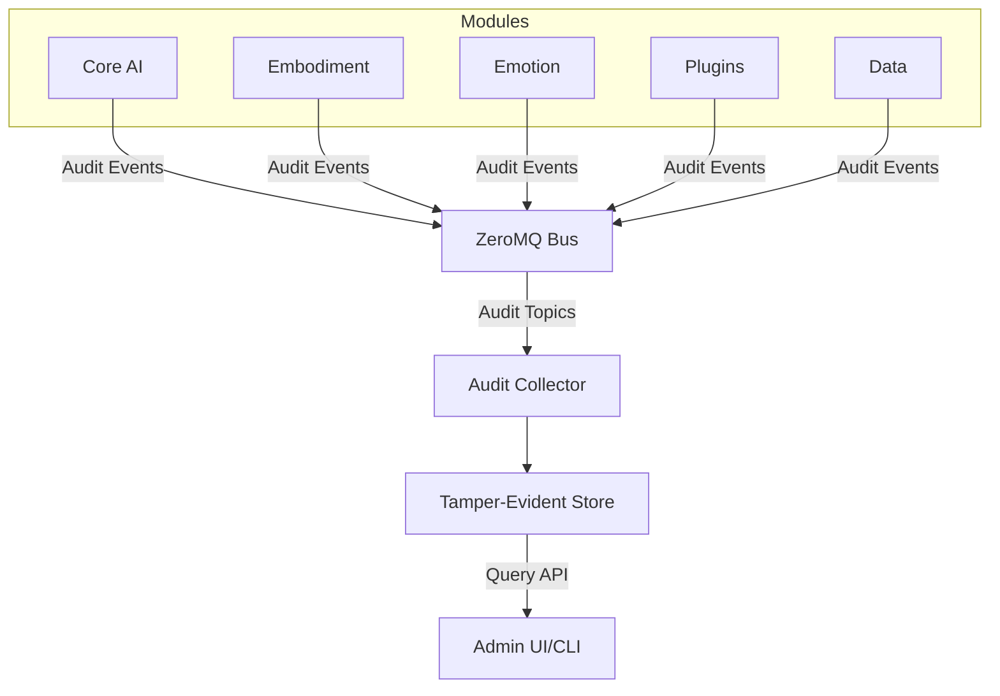

# AICO Audit System

## Overview

The AICO Audit System provides comprehensive, privacy-respecting audit capabilities across all system components, user interactions, and data operations. It is designed to support both coupled (single-device) and detached (multi-device/federated) deployments while maintaining AICO's core principles of local-first processing, privacy by design, and zero-effort security.

This document outlines the architecture, implementation, and best practices for AICO's audit system, which serves as the foundation for security monitoring, compliance verification, and operational transparency.

## Core Principles

### 1. Privacy-First Auditing
- All audit data is stored locally by default
- No audit information leaves the device without explicit user consent
- Sensitive data is redacted or encrypted in audit records
- Users maintain full control over audit data retention and access

### 2. Comprehensive Coverage
- Every security-relevant event is audited across all system components
- All modules, plugins, and external integrations participate in the audit system
- Both frontend and backend activities are captured with consistent schema
- Audit coverage spans all deployment patterns (coupled and detached)

### 3. Tamper-Evident Records
- Audit logs are cryptographically protected against modification
- Append-only storage prevents deletion or alteration of past records
- Hash chaining ensures log integrity and sequence validation
- Secure timestamps provide non-repudiation of event timing

### 4. Minimal Performance Impact
- Efficient, asynchronous audit recording with minimal latency impact
- Optimized storage and indexing for fast query performance
- Configurable verbosity levels based on security context and user preferences
- Background processing for audit analysis and aggregation

### 5. Actionable Insights
- Audit data supports real-time security monitoring and alerts
- Historical analysis for pattern detection and anomaly identification
- Clear correlation between audit events and system activities
- Exportable audit reports for compliance and review

## Audit Categories

The AICO Audit System captures events across six primary categories:

### 1. Authentication & Authorization
- User authentication attempts (success/failure)
- Session creation, renewal, and termination
- Permission grants and revocations
- Access control decisions (allow/deny)
- Role changes and privilege modifications
- Device pairing and trust establishment

### 2. Data Operations
- Data access (read/write/delete)
- Database schema changes
- Encryption/decryption operations
- Backup and restore activities
- Data export and import
- Federation and synchronization events

### 3. System Operations
- System startup and shutdown
- Configuration changes
- Plugin installation, activation, and removal
- Updates and patches
- Resource allocation and utilization thresholds
- Health status changes and recovery actions

### 4. User Interactions
- Conversation history (metadata only, not content)
- Feature usage patterns (privacy-preserving)
- User preference changes
- Consent grants and withdrawals
- Profile modifications
- Embodiment and presence changes

### 5. Security Events
- Security policy violations
- Anomalous behavior detection
- Rate limiting and throttling actions
- Encryption key rotation
- Certificate operations
- Security-relevant configuration changes

### 6. External Integrations
- API access by external systems
- Plugin activity and resource usage
- Third-party service interactions
- Data sharing events (when explicitly permitted)
- Federation with other AICO instances
- Cloud service utilization (when enabled)

## Audit Record Schema

All audit events conform to a standardized schema to ensure consistency across components:

```json
{
  "audit_id": "uuid-v4-here",
  "timestamp": "2025-08-04T07:35:54.123Z",
  "category": "authentication",
  "event_type": "login_attempt",
  "outcome": "success|failure",
  "severity": "info|warning|critical",
  "source": {
    "module": "backend.auth_service",
    "component": "login_handler",
    "function": "process_login",
    "file": "auth_service.py",
    "line": 142
  },
  "subject": {
    "type": "user|system|plugin",
    "id": "user-123",
    "name": "admin",
    "device_id": "device-456"
  },
  "object": {
    "type": "resource|data|function",
    "id": "resource-789",
    "name": "user_database",
    "path": "/data/users"
  },
  "context": {
    "session_id": "session-abc",
    "request_id": "req-xyz",
    "trace_id": "trace-def",
    "ip_address": "192.168.1.1",
    "device_info": "MacBook Pro (2025)"
  },
  "details": {
    // Event-specific details, varies by event type
  },
  "metadata": {
    "record_hash": "sha256-hash-of-previous-record-plus-this-record",
    "previous_hash": "sha256-hash-of-previous-record",
    "sequence_number": 12345
  }
}
```

### Required Fields
- `audit_id`: Unique identifier for the audit record
- `timestamp`: ISO 8601 timestamp with millisecond precision
- `category`: One of the six primary audit categories
- `event_type`: Specific event identifier (e.g., "login_attempt")
- `outcome`: Result of the audited action (success/failure/etc.)
- `source`: Information about the code generating the audit event
- `metadata`: Record integrity information

### Optional Fields
- `severity`: Importance level of the audit event
- `subject`: Entity performing the action (user, system, plugin)
- `object`: Target of the action (resource, data, function)
- `context`: Additional environmental information
- `details`: Event-specific details (varies by event type)

## Architecture Integration

The Audit System integrates with AICO's existing architecture through several key mechanisms:

### 1. Message Bus Integration

Audit events are published to dedicated topics on the ZeroMQ message bus:

```
audit.{category}.{event_type}
```

For example:
- `audit.authentication.login_attempt`
- `audit.data.database_access`
- `audit.security.policy_violation`

This allows the Audit Collector service to subscribe to all audit events while maintaining the system's message-driven architecture.

### 2. Cross-Cutting Aspect

The Audit System functions as a cross-cutting concern across all modules:



### 3. Audit Collector Service

The Audit Collector service:
- Subscribes to all `audit.*` topics
- Validates and enriches audit records
- Computes integrity hashes and maintains chain
- Stores records in the tamper-evident audit store
- Provides query capabilities for authorized access

### 4. Frontend-Backend Bridge

For frontend audit events:
1. Flutter emits audit events via secure WebSocket/HTTP
2. Backend bridge validates and republishes to ZeroMQ
3. Audit Collector processes events identically to backend events

This ensures consistent audit coverage regardless of source.

## Tamper-Evident Storage

The Audit System uses OpenTelemetry's integrity verification with libSQL to ensure audit records cannot be modified or deleted:

### 1. Simplified Hash Chaining

- Each audit record includes a hash of the previous record
- Hash chaining is implemented using OpenTelemetry's integrity extension
- Verification can be performed on-demand rather than continuously

```
Record 1: Hash = H(Salt + Record1_Contents)
Record 2: Hash = H(Record1_Hash + Record2_Contents)
Record 3: Hash = H(Record2_Hash + Record3_Contents)
```

### 2. Storage Implementation

```python
def store_audit_record(record):
    # Get the last record hash
    previous_hash = get_last_record_hash()
    
    # Add metadata to the record
    record['metadata'] = {
        'previous_hash': previous_hash,
        'sequence_number': get_next_sequence(),
        'record_hash': None  # Placeholder
    }
    
    # Calculate the record hash (excluding the hash field itself)
    record_json = json.dumps(record, sort_keys=True)
    record_hash = hashlib.sha256(record_json.encode()).hexdigest()
    
    # Update the record with its hash
    record['metadata']['record_hash'] = record_hash
    
    # Store in append-only database
    append_to_audit_store(record)
    
    # Return the hash for the next record
    return record_hash
```

### 3. Verification Process

The system periodically verifies the integrity of the audit chain:

```python
def verify_audit_chain():
    records = get_all_audit_records()
    previous_hash = None
    
    for record in records:
        # Verify sequence
        if previous_hash and record['metadata']['previous_hash'] != previous_hash:
            raise IntegrityError(f"Chain broken at record {record['audit_id']}")
        
        # Verify record hash
        stored_hash = record['metadata']['record_hash']
        calculated_hash = calculate_record_hash(record)
        
        if stored_hash != calculated_hash:
            raise IntegrityError(f"Record tampered: {record['audit_id']}")
        
        previous_hash = stored_hash
    
    return True
```

## Privacy Controls

The Audit System implements several privacy safeguards:

### 1. Data Minimization

- Only security-relevant information is recorded
- Personal data is excluded or redacted by default
- Content of conversations is never included in audit logs
- Configurable verbosity levels control detail capture

### 2. Access Controls

- Audit data access requires elevated permissions
- Role-based access controls limit visibility
- All audit data access is itself audited (meta-auditing)
- Time-limited access grants for review purposes

### 3. Retention Policies

- Configurable retention periods (default: 90 days)
- Automatic pruning of expired audit records
- Option to archive rather than delete expired records
- Legal hold capability for compliance scenarios

### 4. Encryption

- Audit database encrypted at rest (gocryptfs)
- Sensitive fields encrypted with separate keys
- Export packages encrypted with recipient keys
- Key rotation does not affect historical audit verification

## Implementation Components

### 1. Audit API

A simple, consistent API for generating audit events:

```python
# Backend (Python) example
from aico.audit import audit_event

def change_user_role(user_id, new_role):
    # Perform the role change
    result = user_service.update_role(user_id, new_role)
    
    # Audit the action
    audit_event(
        category="authorization",
        event_type="role_change",
        outcome="success" if result else "failure",
        subject={"type": "user", "id": current_user.id},
        object={"type": "user", "id": user_id},
        details={"previous_role": user.role, "new_role": new_role}
    )
    
    return result
```

```dart
// Frontend (Flutter) example
import 'package:aico/audit/audit.dart';

void changeUserSettings(String setting, dynamic value) {
  // Update the setting
  userSettings.update(setting, value);
  
  // Audit the change
  auditEvent(
    category: "user_settings",
    eventType: "setting_change",
    outcome: "success",
    object: {"type": "setting", "id": setting},
    details: {"previous_value": previousValue, "new_value": value}
  );
}
```

### 2. Audit Collector Service

The central service responsible for collecting, validating, and storing audit events:

```python
class AuditCollector:
    def __init__(self):
        # Initialize OpenTelemetry with the audit processor
        self.tracer_provider = TracerProvider()
        self.tracer = self.tracer_provider.get_tracer("audit_system")
        
        # Set up ZeroMQ subscription
        self.zmq_context = zmq.Context()
        self.socket = self.zmq_context.socket(zmq.SUB)
        self.socket.connect("tcp://localhost:5555")
        self.socket.setsockopt_string(zmq.SUBSCRIBE, "audit.")
        
        # Initialize the store using the existing libSQL database
        self.store = AuditStore()
    
    def start(self):
        while True:
            topic, message = self.socket.recv_multipart()
            audit_record = json.loads(message)
            
            # Process with OpenTelemetry
            with self.tracer.start_as_current_span("audit_record") as span:
                span.set_attribute("audit.category", audit_record["category"])
                span.set_attribute("audit.event_type", audit_record["event_type"])
                
                # Store with integrity verification
                self.store.append(audit_record)
                
                # Check for alertable conditions
                if audit_record.get("severity") == "critical":
                    self.trigger_alert(audit_record)
```

### 3. Audit Store

A simplified store that leverages libSQL with OpenTelemetry's integrity verification:

```python
class AuditStore:
    def __init__(self):
        # Reuse the existing libSQL database
        self.db = libsql.connect("aico.db")
        self.initialize_schema()
    
    def initialize_schema(self):
        self.db.execute("""
        CREATE TABLE IF NOT EXISTS audit_records (
            id INTEGER PRIMARY KEY AUTOINCREMENT,
            timestamp TEXT NOT NULL,
            category TEXT NOT NULL,
            event_type TEXT NOT NULL,
            data JSON NOT NULL,
            hash TEXT NOT NULL,
            previous_hash TEXT
        )
        """)
    
    def append(self, record):
        # Add integrity metadata
        record['metadata'] = {
            'previous_hash': self.last_hash,
            'sequence_number': self.get_next_sequence(),
        }
        
        # Calculate record hash
        record_json = json.dumps(record, sort_keys=True)
        record_hash = hashlib.sha256(record_json.encode()).hexdigest()
        record['metadata']['record_hash'] = record_hash
        
        # Store the record
        self.db.execute(
            "INSERT INTO audit_records VALUES (?, ?, ?, ?, ?, ?, ?, ?)",
            (None, record['audit_id'], record['timestamp'], record['category'],
             record['event_type'], json.dumps(record), record_hash,
             record['metadata']['previous_hash'], record['metadata']['sequence_number'])
        )
        
        # Update last hash
        self.last_hash = record_hash
        
        return record_hash
```

### 4. Audit Query API

A secure API for searching and retrieving audit records:

```python
class AuditQuery:
    def __init__(self, store):
        self.store = store
    
    def search(self, filters, start_time=None, end_time=None, limit=100, offset=0):
        # Build query based on filters
        query = "SELECT * FROM audit_records WHERE 1=1"
        params = []
        
        if start_time:
            query += " AND timestamp >= ?"
            params.append(start_time)
        
        if end_time:
            query += " AND timestamp <= ?"
            params.append(end_time)
        
        if 'category' in filters:
            query += " AND category = ?"
            params.append(filters['category'])
        
        # Add more filters as needed
        
        query += " ORDER BY timestamp DESC LIMIT ? OFFSET ?"
        params.extend([limit, offset])
        
        # Execute query
        results = self.store.db.execute(query, params).fetchall()
        
        # Process and return results
        return [json.loads(row['record_data']) for row in results]
    
    def get_record_by_id(self, audit_id):
        result = self.store.db.execute(
            "SELECT record_data FROM audit_records WHERE audit_id = ?",
            (audit_id,)
        ).fetchone()
        
        if result:
            return json.loads(result['record_data'])
        return None
```

### 5. Admin Interface

The Audit System provides both CLI and UI interfaces for authorized administrators:

#### CLI Commands

```bash
# Search audit logs
aico-cli audit search --category=authentication --start="2025-08-01" --limit=50

# Export audit logs
aico-cli audit export --start="2025-08-01" --end="2025-08-04" --format=json --output=audit.json

# Verify audit chain integrity
aico-cli audit verify-chain

# View audit statistics
aico-cli audit stats --period=30d
```

#### Admin UI Dashboard

The Admin UI provides:
- Interactive audit log search and filtering
- Visual timeline of security events
- Pattern analysis and anomaly detection
- Compliance reporting templates
- Audit health monitoring

## Deployment Patterns

### Coupled Mode (Single Device)

In coupled mode, where frontend and backend run on the same device:

- Audit events flow directly through the local message bus
- All audit storage is on the local device
- Verification and queries operate on the local audit store
- No network transmission of audit data

### Detached Mode (Multi-Device)

In detached mode, where frontend and backend are on separate devices:

- Frontend audit events are sent to backend via secure channel
- Backend maintains the authoritative audit store
- Frontend maintains minimal local audit cache for offline operation
- Synchronization occurs when connection is established
- Integrity verification spans both components

### Federation Considerations

When multiple AICO instances are federated:

- Each instance maintains its own audit store
- Cross-instance actions include federation context
- Audit records can be correlated across instances via trace IDs
- Federation audit events capture synchronization activities

## Security Monitoring & Alerting

The Audit System supports real-time security monitoring:

### 1. Alert Rules

Configurable rules trigger alerts based on audit patterns:

```yaml
alerts:
  - name: "Multiple Authentication Failures"
    condition:
      category: "authentication"
      event_type: "login_attempt"
      outcome: "failure"
      count: 5
      window: "5m"
    actions:
      - "notify_admin"
      - "increase_security"
  
  - name: "Sensitive Data Access"
    condition:
      category: "data"
      object.path: "/data/personal/*"
    actions:
      - "log_access"
      - "notify_user"
```

### 2. Response Actions

Automated responses to security events:

- Temporary account lockout after multiple failures
- Notification to administrators for critical events
- Increased logging verbosity during suspicious activity
- Security posture adjustments based on threat level

### 3. Correlation Engine

Pattern detection across multiple audit events:

```python
def detect_patterns(recent_events):
    # Check for brute force pattern
    login_failures = [e for e in recent_events 
                     if e['category'] == 'authentication' and e['outcome'] == 'failure']
    
    if len(login_failures) >= 5:
        # Group by source IP
        by_ip = group_by(login_failures, lambda e: e['context']['ip_address'])
        
        for ip, events in by_ip.items():
            if len(events) >= 3:
                trigger_alert("possible_brute_force", {
                    "ip_address": ip,
                    "attempt_count": len(events),
                    "target_accounts": list(set(e['object']['id'] for e in events))
                })
```

## Compliance & Reporting

The Audit System supports compliance requirements through:

### 1. Compliance Reports

Pre-configured reports for common compliance frameworks:

- Access control effectiveness
- Authentication activity
- Data access patterns
- Configuration changes
- Security incident timeline

### 2. Evidence Collection

Automated evidence gathering for audits:

```python
def generate_compliance_evidence(framework, period_start, period_end):
    evidence = {}
    
    # Collect authentication evidence
    evidence['authentication'] = {
        'total_logins': count_events('authentication', 'login_attempt', 'success', period_start, period_end),
        'failed_logins': count_events('authentication', 'login_attempt', 'failure', period_start, period_end),
        'password_changes': count_events('authentication', 'password_change', None, period_start, period_end),
        'mfa_usage': calculate_mfa_percentage(period_start, period_end)
    }
    
    # Collect access control evidence
    evidence['access_control'] = {
        'permission_changes': list_events('authorization', 'permission_change', None, period_start, period_end),
        'role_changes': list_events('authorization', 'role_change', None, period_start, period_end),
        'access_denials': count_events('authorization', 'access_attempt', 'denied', period_start, period_end)
    }
    
    # More evidence types...
    
    return evidence
```

### 3. Retention Compliance

Automated enforcement of retention policies:

```python
def enforce_retention_policy():
    # Get retention period from config
    retention_days = config.get('audit.retention_days', 90)
    cutoff_date = datetime.now() - timedelta(days=retention_days)
    
    # Check for legal hold
    if not is_legal_hold_active():
        # Delete or archive expired records
        if config.get('audit.archive_expired', False):
            archive_records_before(cutoff_date)
        else:
            delete_records_before(cutoff_date)
```

## Best Practices

### 1. When to Audit

Audit events should be generated for:

- All authentication and authorization decisions
- Access to sensitive data or functions
- Configuration and security policy changes
- User consent grants and withdrawals
- Security-relevant system operations
- Plugin installation, activation, and permissions

### 2. Audit Detail Level

Balance between security needs and privacy:

- **High Detail:** Security operations, authentication, authorization
- **Medium Detail:** System configuration, plugin activity, data access patterns
- **Low Detail:** User interactions, feature usage (metadata only)
- **No Auditing:** Conversation content, personal data, emotional state

### 3. Implementation Guidelines

For developers implementing audit hooks:

- Use the audit API consistently across all modules
- Include all required fields in every audit event
- Never log sensitive data in audit records
- Ensure audit calls don't block main execution path
- Test audit coverage as part of security review

### 4. Operational Recommendations

For system administrators:

- Regularly review audit logs for anomalies
- Test the integrity verification process periodically
- Configure appropriate retention periods
- Establish clear procedures for audit review
- Document all custom alert rules and responses

## Conclusion

The AICO Audit System provides comprehensive visibility into system operations while respecting user privacy and maintaining system performance. By capturing security-relevant events across all components, it enables effective monitoring, compliance, and incident response while upholding AICO's core principles of privacy-first design and local-first processing.

The tamper-evident storage ensures the integrity of audit records, while the flexible query capabilities support both automated monitoring and manual investigation. Together with AICO's broader security architecture, the Audit System forms a critical component of the platform's defense-in-depth strategy.

## References

- [OWASP Logging Cheat Sheet](https://cheatsheetseries.owasp.org/cheatsheets/Logging_Cheat_Sheet.html)
- [NIST SP 800-92: Guide to Computer Security Log Management](https://csrc.nist.gov/publications/detail/sp/800-92/final)
- [AICO Security Architecture](./data_security.md)
- AICO Access Control (file does not exist)
- [AICO Instrumentation](../operations/instrumentation/instrumentation.md)
- [AICO Instrumentation Logging](../operations/instrumentation/instrumentation_logging.md)
