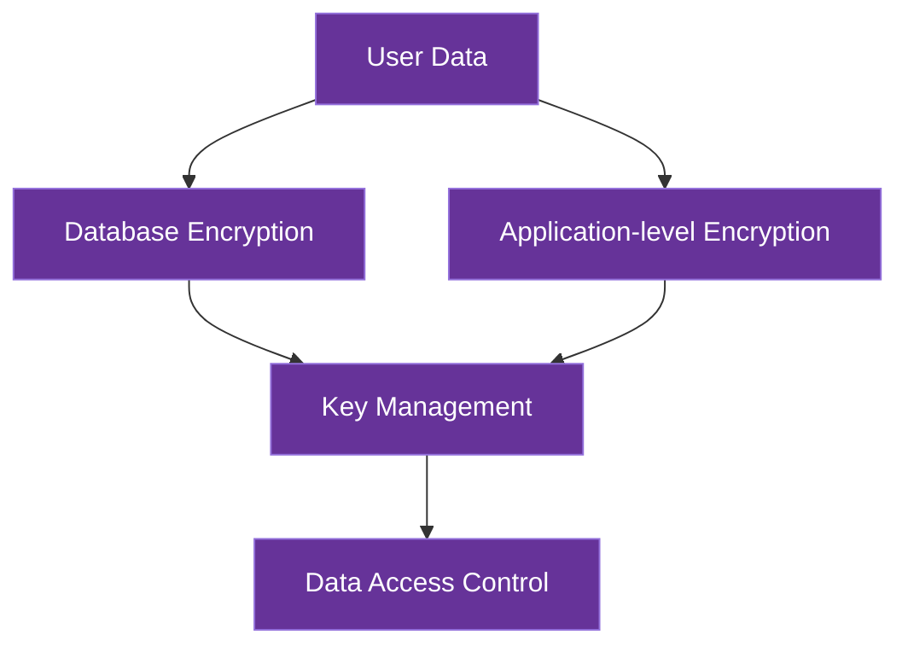
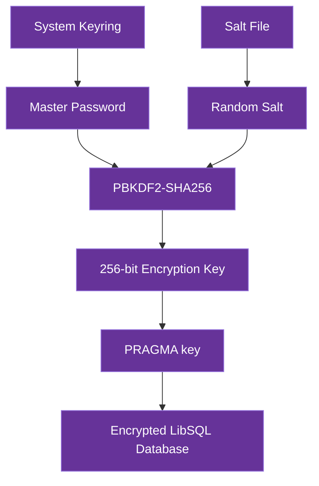
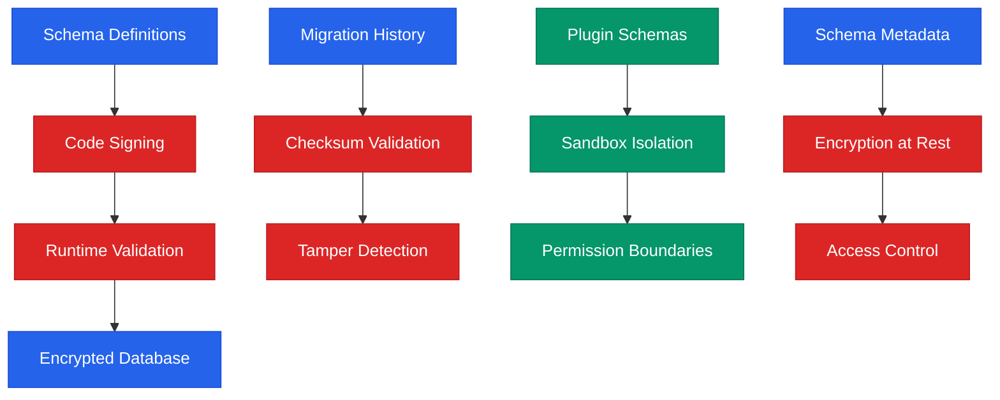

# Data Security

This document details AICO's data security architecture, focusing specifically on protecting user data both at rest and in transit.

## Data Security Overview

AICO implements a privacy-first data security model with multiple layers of protection:



## Data at Rest Security

### Encryption Strategy

> **ℹ️ Note on Filesystem-Level Encryption**
> 
> Traditional filesystem-level encryption solutions (gocryptfs, securefs, EncFS) face significant challenges in multi-platform environments:
> - **Platform Limitations**: Most solutions lack reliable macOS/Windows support or require complex manual builds
> - **Database Compatibility**: FUSE-based encryption can cause file locking issues and performance degradation with databases
> - **Dependency Management**: Requires platform-specific FUSE implementations (macFUSE, WinFsp) with varying stability
> 
> AICO addresses these challenges with a modern application-level encryption approach.

AICO employs a hybrid application-level encryption strategy that provides robust, cross-platform data protection without filesystem dependencies:

#### Database-Native Encryption

Each database uses its optimal encryption method for maximum performance and reliability:

- **libSQL**: SQLCipher-style encryption via PRAGMA statements with PBKDF2 key derivation
- **DuckDB**: Built-in AES-256 encryption via PRAGMA statements
- **RocksDB**: Native EncryptedEnv for transparent key-value encryption
- **ChromaDB**: Custom file-level encryption wrapper

**Implementation Example**:
```python
# LibSQL with encryption
from aico.data.libsql import EncryptedLibSQLConnection

# Create encrypted database connection
conn = EncryptedLibSQLConnection(
    db_path="secure_data.db",
    master_password="user_master_password",
    store_in_keyring=True  # Secure password storage
)

# Use with context manager for automatic cleanup
with conn:
    # All operations are automatically encrypted
    conn.execute("CREATE TABLE users (id INTEGER, name TEXT)")
    conn.execute("INSERT INTO users VALUES (?, ?)", (1, "Alice"))
    
    # Query encrypted data
    users = conn.fetch_all("SELECT * FROM users")
    print(users)  # [{'id': 1, 'name': 'Alice'}]

# Key derivation and encryption details:
# - PBKDF2-SHA256 with 100,000 iterations
# - 256-bit encryption key (32 bytes)
# - 128-bit salt (16 bytes)
# - SQLCipher-style PRAGMA key encryption
# - System keyring integration for password storage

# DuckDB encryption
import duckdb

def create_encrypted_duckdb(db_path, key_manager, master_key):
    # Derive database-specific key
    db_key = key_manager.derive_database_key(master_key, "duckdb")
    return DuckDBConnection(db_path, encryption_key=db_key)

# Generic File Encryption

For files without native encryption support, AICO provides a transparent encryption wrapper:

```python
from aico.security import EncryptedFile

# Drop-in replacement for open()
with EncryptedFile("sensitive_data.enc", "wb", key_manager=km) as f:
    f.write(data)  # Automatically encrypted

with EncryptedFile("sensitive_data.enc", "rb", key_manager=km) as f:
    data = f.read()  # Automatically decrypted
```

### LibSQL Encryption Implementation

AICO's LibSQL encryption implementation provides transparent, secure database encryption using industry-standard cryptographic practices:

#### Architecture Overview



#### Security Specifications

| Component | Specification | Details |
|-----------|---------------|----------|
| **Key Derivation** | PBKDF2-SHA256 | 100,000 iterations, cryptographically secure |
| **Encryption Key** | 256-bit AES | 32-byte key for maximum security |
| **Salt** | 128-bit random | 16-byte salt, unique per database |
| **Database Encryption** | SQLCipher-style | PRAGMA key with hex-encoded key |
| **Password Storage** | System Keyring | Platform-native secure storage |
| **Salt Storage** | Restricted file | 0o600 permissions, separate from database |

#### Implementation Details

**Key Derivation Process:**
```python
# PBKDF2 key derivation with secure parameters
kdf = PBKDF2HMAC(
    algorithm=hashes.SHA256(),
    length=32,  # 256-bit key
    salt=salt,  # 128-bit random salt
    iterations=100000,  # Resistant to brute force
    backend=default_backend()
)
key = kdf.derive(password.encode('utf-8'))
```

**Database Encryption:**
```python
# SQLCipher-style encryption via PRAGMA
connection.execute(f"PRAGMA key = 'x\"{key.hex()}\"'")
```

**Security Features:**
- ✅ **Transparent encryption**: All database operations automatically encrypted
- ✅ **Key verification**: Automatic validation that encryption key is correct
- ✅ **Secure storage**: Master passwords stored in system keyring
- ✅ **Salt management**: Unique salt per database, securely stored
- ✅ **File permissions**: Restrictive permissions on salt files (0o600)
- ✅ **Error handling**: Comprehensive error handling for encryption failures

**Usage Patterns:**
```python
# Simple encrypted database
conn = EncryptedLibSQLConnection("data.db", master_password="secret")

# With keyring storage
conn = EncryptedLibSQLConnection("data.db", store_in_keyring=True)

# Custom encryption parameters
conn = EncryptedLibSQLConnection(
    "data.db",
    kdf_iterations=200000,  # Higher security
    keyring_service="my_app"
)

# Verify encryption is working
if conn.verify_encryption():
    print("Database is properly encrypted")
```

**File Structure:**
```
data/
├── secure_data.db        # Encrypted LibSQL database
├── secure_data.db.salt   # Salt file (0o600 permissions)
└── ...
```

#### Directory Structure

AICO maintains organized encrypted storage with clear separation:

```
/path/to/aico/
└── data/
    ├── libsql/
    │   └── main.db          # SQLCipher encrypted
    ├── duckdb/
    │   └── analytics.db     # DuckDB native encryption
    ├── chroma/
    │   ├── index.enc        # Custom encrypted files
    │   └── metadata.enc
    └── rocksdb/
        └── kvstore/         # RocksDB EncryptedEnv
```

#### Advantages of Application-Level Encryption

1. **Zero Functionality Restrictions**:
   - Databases operate with full feature sets and native performance
   - No need to modify database code or implement application-level encryption
   - All database features work without modification

2. **Unified Security Model**:
   - Single encryption layer protects all databases consistently
   - Simplifies security auditing and compliance
   - Reduces risk of implementation errors in database-specific encryption

3. **Cross-Platform Support**:
   - Works on all platforms with "Full" backend support
   - Compatible with all backend deployment targets (Linux, macOS, Windows via FUSE)

4. **Performance Efficiency**:
   - Minimal overhead compared to application-level encryption
   - Efficient for both high-performance desktops and resource-constrained devices
   - Avoids double encryption overhead

### Key Management

AICO implements a unified key management approach for application-level encryption, using appropriate key derivation functions for different use cases:

#### Key Derivation Functions

AICO uses different key derivation functions optimized for specific use cases:

**PBKDF2-SHA256 for Database Encryption:**
- Used in LibSQL encrypted connections
- 100,000 iterations for balance of security and performance
- Widely supported and battle-tested
- Suitable for database encryption scenarios

**Argon2id for General Authentication:**
- Used for master key derivation and user authentication
- Memory-hard function resistant to GPU attacks
- Configurable memory, time, and parallelism parameters
- Recommended by security experts for password hashing

```python
from cryptography.hazmat.primitives.kdf.argon2 import Argon2
import os
import keyring
import getpass

class AICOKeyManager:
    """Unified key management for all authentication scenarios"""
    
    def __init__(self, service_name="AICO"):
        self.service_name = service_name
        
    def setup_or_retrieve_key(self, password=None, interactive=True):
        """DRY method: handles setup, interactive, and service authentication"""
        # Try to retrieve existing key first (service mode)
        stored_key = keyring.get_password(self.service_name, "master_key")
        
        if stored_key:
            return bytes.fromhex(stored_key)  # Service startup - no user interaction
        elif password:
            return self._derive_and_store(password)  # Setup mode
        elif interactive:
            password = getpass.getpass("Enter master password: ")
            return self._derive_and_store(password)  # Interactive mode
        else:
            raise AuthenticationError("No stored key and no password provided")
            
    def _derive_and_store(self, password):
        """Derive master key and store securely"""
        # Use consistent Argon2id parameters for master key
        salt = os.urandom(16)
        argon2 = Argon2(
            salt=salt,
            time_cost=3,           # 3 iterations
            memory_cost=1048576,   # 1GB memory
            parallelism=4,         # 4 threads
            hash_len=32,           # 256-bit key
            type=2                 # Argon2id
        )
        
        master_key = argon2.derive(password.encode())
        
        # Store derived key securely
        keyring.set_password(self.service_name, "master_key", master_key.hex())
        keyring.set_password(self.service_name, "salt", salt.hex())
        
        # Clear password from memory
        password = None
        
        return master_key
        
    def derive_database_key(self, master_key, database_type):
        """Derive database-specific key from master key"""
        # Balanced parameters for database encryption
        salt = os.urandom(16)
        argon2 = Argon2(
            salt=salt,
            memory_cost=262144,     # 256 MB
            iterations=2,
            lanes=2,
            type=2                 # Argon2id
        )
        # Derive using master key + database type identifier
        context = master_key + f"aico-{database_type}".encode()
        key = argon2.derive(context)
        return key
        
    def derive_file_encryption_key(self, master_key, file_purpose):
        """Derive file-specific encryption key from master key"""
        salt = os.urandom(16)
        argon2 = Argon2(
            salt=salt,
            memory_cost=131072,     # 128 MB for file operations
            iterations=1,
            lanes=2,
            type=2                 # Argon2id
        )
        context = master_key + f"aico-file-{file_purpose}".encode()
        key = argon2.derive(context)
        return key
```

#### Key Management Process

The unified key management process supports three authentication scenarios:

**1. Initial Setup (Interactive)**
```python
key_manager = AICOKeyManager()
master_key = key_manager.setup_master_password(password="user_password")
# Derives and stores master key securely
```

**2. User Authentication (Interactive)**
```python
key_manager = AICOKeyManager()
master_key = key_manager.authenticate(interactive=True)
# Uses stored key if available, otherwise prompts for password
```

**3. Service Startup (Automatic)**
```python
key_manager = AICOKeyManager()
master_key = key_manager.authenticate(interactive=False)
# Retrieves stored key without user interaction
```

#### Security Properties

1. **Master Password**: User-provided master password is the root of trust
   - Never stored, only used transiently during key derivation
   - Cleared from memory immediately after use

## Schema Management Security

AICO's in-code schema management system is designed with security-first principles to protect both schema integrity and user data during database evolution.

### Security Architecture



### Threat Model

#### Protected Against
1. **Schema Tampering**: Unauthorized modification of database structure
2. **Migration Replay**: Malicious re-execution of previous migrations
3. **Plugin Schema Conflicts**: Plugins interfering with core or other plugin data
4. **Data Exposure**: Schema operations revealing sensitive user information
5. **Rollback Attacks**: Malicious downgrades to vulnerable schema versions

#### Security Controls

##### 1. Schema Definition Protection
```python
# Schema definitions are immutable and version-locked
CORE_SCHEMA_DEFINITIONS = {
    1: SchemaVersion(
        version=1,
        name="Initial Schema",
        # Cryptographic hash ensures integrity
        checksum="sha256:a1b2c3d4...",
        sql_statements=[...],
        rollback_statements=[...]
    )
}

# Runtime validation
class SchemaManager:
    def _validate_schema_integrity(self, schema_version: SchemaVersion):
        """Validate schema definition hasn't been tampered with"""
        computed_hash = self._compute_schema_hash(schema_version)
        if computed_hash != schema_version.checksum:
            raise SecurityError("Schema integrity violation detected")
```

##### 2. Migration History Protection
```python
# Migration history with tamper detection
CREATE TABLE schema_migration_history (
    id INTEGER PRIMARY KEY AUTOINCREMENT,
    component_name TEXT NOT NULL,
    version INTEGER NOT NULL,
    applied_at TIMESTAMP DEFAULT CURRENT_TIMESTAMP,
    checksum TEXT NOT NULL,  -- Prevents replay attacks
    migration_hash TEXT NOT NULL,  -- Validates migration content
    rollback_hash TEXT  -- Validates rollback integrity
)

# Checksum validation prevents replay attacks
def apply_migration(self, version: int):
    migration_hash = self._compute_migration_hash(version)
    
    # Check if already applied
    existing = self.connection.fetch_one(
        "SELECT checksum FROM schema_migration_history WHERE version = ?",
        (version,)
    )
    
    if existing and existing['checksum'] == migration_hash:
        logger.warning(f"Migration {version} already applied, skipping")
        return
    
    # Apply migration with integrity tracking
    self._execute_migration(version, migration_hash)
```

##### 3. Plugin Schema Isolation
```python
# Plugin schemas are sandboxed and isolated
class PluginSchemaManager(SchemaManager):
    def __init__(self, connection, plugin_name, schema_definitions):
        self.plugin_name = plugin_name
        self.table_prefix = f"{plugin_name}_"  # Namespace isolation
        super().__init__(connection, schema_definitions)
    
    def _validate_table_access(self, table_name: str):
        """Ensure plugin only accesses its own tables"""
        if not table_name.startswith(self.table_prefix):
            raise SecurityError(
                f"Plugin {self.plugin_name} cannot access table {table_name}"
            )
    
    def _validate_sql_statement(self, sql: str):
        """Validate SQL doesn't access unauthorized resources"""
        # Parse SQL and check table references
        parsed = sqlparse.parse(sql)[0]
        for token in parsed.flatten():
            if token.ttype is sqlparse.tokens.Name:
                if self._is_table_reference(token.value):
                    self._validate_table_access(token.value)
```

### Encryption Integration

#### Schema Metadata Encryption
```python
# Schema metadata is encrypted with user data
class EncryptedSchemaManager(SchemaManager):
    def __init__(self, encrypted_connection: EncryptedLibSQLConnection, schema_definitions):
        super().__init__(encrypted_connection, schema_definitions)
        self.encrypted_connection = encrypted_connection
    
    def _store_metadata(self, key: str, value: str):
        """Store schema metadata in encrypted database"""
        # Metadata automatically encrypted by EncryptedLibSQLConnection
        self.connection.execute(
            "INSERT OR REPLACE INTO schema_metadata (key, value) VALUES (?, ?)",
            (key, value)
        )
    
    def _verify_encryption_status(self):
        """Ensure database is properly encrypted"""
        if not self.encrypted_connection.verify_encryption():
            raise SecurityError("Database encryption verification failed")
```

#### Key Derivation for Schema Operations
```python
# Schema operations use same encryption as user data
class SecureSchemaOperations:
    def __init__(self, master_password: str):
        self.connection = EncryptedLibSQLConnection(
            db_path="~/.aico/user.db",
            master_password=master_password  # Same key as user data
        )
    
    def apply_schema_migration(self, schema_definitions):
        """Apply schema migration with full encryption"""
        # All schema operations encrypted with user's master key
        schema_manager = EncryptedSchemaManager(
            self.connection, 
            schema_definitions
        )
        schema_manager.migrate_to_latest()
```

### Access Control

#### Local-Only Operations
```python
# Schema management is strictly local
class LocalSchemaManager:
    def __init__(self):
        # No network access allowed
        self.network_disabled = True
        self.local_only = True
    
    def _validate_local_access(self):
        """Ensure no remote schema operations"""
        if self._detect_network_activity():
            raise SecurityError("Network access detected during schema operation")
    
    def migrate_to_latest(self):
        self._validate_local_access()
        super().migrate_to_latest()
```

#### Permission Boundaries
```python
# Strict permission model for schema operations
class PermissionAwareSchemaManager:
    ALLOWED_OPERATIONS = {
        'core': ['CREATE TABLE', 'CREATE INDEX', 'ALTER TABLE'],
        'plugin': ['CREATE TABLE', 'CREATE INDEX'],  # No ALTER on core tables
        'test': ['CREATE TABLE', 'DROP TABLE', 'CREATE INDEX', 'DROP INDEX']
    }
    
    def __init__(self, connection, schema_definitions, context: str):
        self.context = context  # 'core', 'plugin', or 'test'
        super().__init__(connection, schema_definitions)
    
    def _validate_sql_permission(self, sql: str):
        """Validate SQL operation is allowed in current context"""
        operation = self._extract_sql_operation(sql)
        if operation not in self.ALLOWED_OPERATIONS[self.context]:
            raise PermissionError(
                f"Operation {operation} not allowed in {self.context} context"
            )
```

### Security Best Practices

#### Development Guidelines
1. **Schema Review**: All schema changes must be reviewed for security implications
2. **Minimal Permissions**: Grant only necessary database permissions to each component
3. **Rollback Testing**: Verify rollback operations don't expose sensitive data
4. **Checksum Validation**: Always validate schema integrity before applying changes
5. **Audit Logging**: Log all schema operations for security monitoring

#### Operational Security
1. **Backup Before Migration**: Always backup database before schema changes
2. **Test Migrations**: Test schema changes in isolated environments first
3. **Monitor Integrity**: Regularly verify schema integrity and detect tampering
4. **Plugin Vetting**: Review plugin schemas before installation
5. **Access Logging**: Log all schema access for security auditing

#### Incident Response
```python
# Security incident detection and response
class SchemaSecurityMonitor:
    def detect_tampering(self):
        """Detect schema tampering attempts"""
        current_checksums = self._compute_all_checksums()
        stored_checksums = self._get_stored_checksums()
        
        if current_checksums != stored_checksums:
            self._trigger_security_alert("Schema tampering detected")
            self._lock_database_access()
            return True
        return False
    
    def _trigger_security_alert(self, message: str):
        """Trigger security incident response"""
        logger.critical(f"SECURITY ALERT: {message}")
        # Additional alerting mechanisms
        self._notify_security_team(message)
        self._create_incident_report(message)
```

### Compliance Considerations

#### Data Protection
- **GDPR Compliance**: Schema operations respect user data protection rights
- **Data Minimization**: Schema definitions contain no personal data
- **Right to Erasure**: Schema rollback can remove user data when required
- **Data Portability**: Schema versioning supports data export/import

#### Security Standards
- **Defense in Depth**: Multiple security layers protect schema integrity
- **Principle of Least Privilege**: Minimal permissions for schema operations
- **Secure by Default**: Schema management defaults to most secure configuration
- **Audit Trail**: Complete audit trail for all schema modifications

2. **Key Derivation**: Argon2id key derivation with context-specific parameters
   - Master key: 1GB memory, 3 iterations, 4 threads
   - File encryption: 256MB memory, 2 iterations, 2 threads
   - Authentication: 64MB memory, 1 iteration, 1 thread

3. **Secure Storage**: Derived keys securely stored using platform-specific mechanisms:
   - macOS: Keychain
   - Windows: Windows Credential Manager
   - Linux: Secret Service API / GNOME Keyring
   - Mobile: Secure Enclave (iOS) / Keystore (Android)

4. **Persistent Service Authentication**: Backend services restart without user interaction
   - Master key retrieved from secure storage on service startup
   - No password re-entry required for non-technical users
   - Maintains security through OS-level protection

5. **Biometric Unlock**: Optional biometric authentication for accessing the encryption key
   - Integrates with platform biometric APIs
   - Falls back to master password when biometrics unavailable

6. **Automatic Mounting**: Zero-effort security with automatic mounting during application startup
   - Retrieves keys from secure storage
   - Mounts encrypted filesystem transparently

For complete details on the overall key management system, see Security Architecture documentation (file does not exist).

## Data Synchronization Security

When data is synchronized between devices during roaming:

1. **Selective Sync Encryption**:
   - End-to-end encrypted data transfer between trusted devices
   - Encrypted database snapshots for initial synchronization
   - Incremental encrypted updates for ongoing synchronization

2. **Sync Protocol Security**:
   - Authenticated and encrypted channels for all data transfers
   - Cryptographic verification of data integrity during sync
   - Version vectors for conflict detection and resolution

## Data Access Control

AICO implements fine-grained data access controls:

1. **Data Classification**:
   - **Personal Data**: User conversations, preferences, and personal information
   - **System Data**: Configuration, logs, and operational data
   - **Derived Data**: AI-generated insights and analytics

2. **Data Access Policies**:
   - Module-specific data access permissions
   - Explicit data access logging for all sensitive operations
   - Data minimization principles applied to all access requests

## Data Privacy Features

1. **Data Minimization**:
   - Only essential data is collected and stored
   - Automatic data pruning based on relevance and age
   - Privacy-preserving analytics with differential privacy techniques

2. **User Data Control**:
   - Data export functionality for all user data
   - Selective data deletion capabilities
   - Transparency tools showing what data is stored and how it's used

## Data Security for Roaming Scenarios

AICO's data security adapts to different roaming patterns, maintaining security while supporting both coupled and detached deployment models:

1. **Coupled Roaming Security**:
   - Complete encrypted data directory moves with the application
   - Database files remain encrypted using native encryption methods
   - Master key securely synchronized via platform-specific secure storage
   - Zero-effort security maintained across device transitions

2. **Detached Roaming Security**:
   - Backend maintains encrypted databases using application-level encryption
   - Frontend accesses data via secure API with end-to-end encryption
   - Mutual TLS authentication between frontend and backend
   - Secure WebSocket or gRPC channels with forward secrecy
   - Lightweight frontend devices operate without needing local encryption capabilities
