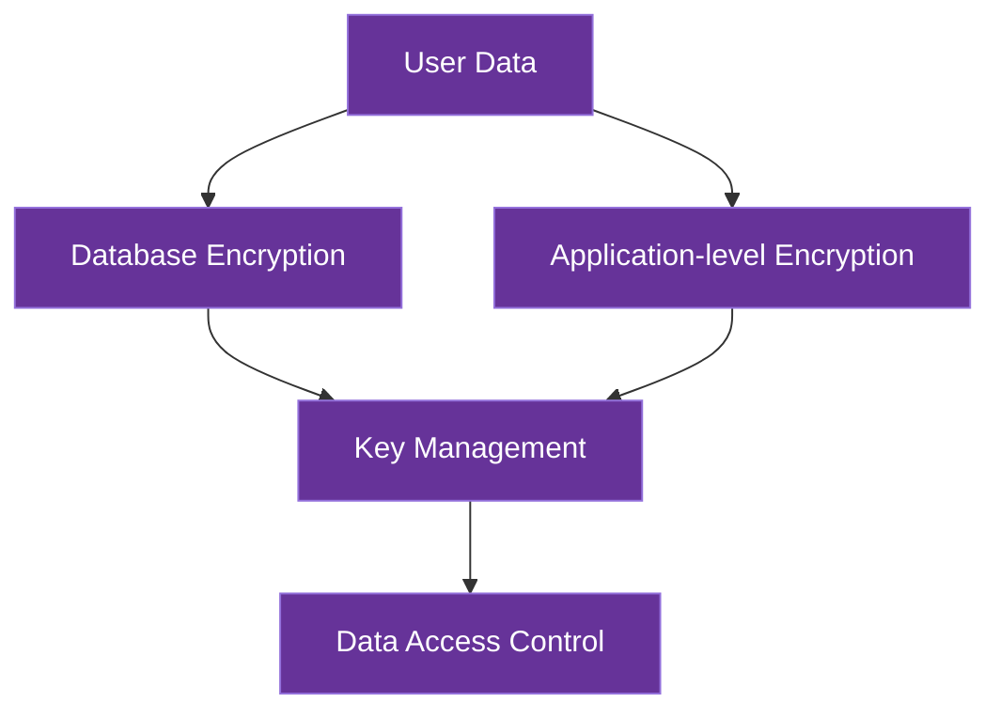

# Data Security

This document details AICO's data security architecture, focusing specifically on protecting user data both at rest and in transit.

## Data Security Overview

AICO implements a privacy-first data security model with multiple layers of protection:



## Data at Rest Security

### Encryption Strategy

> **ℹ️ Note on Filesystem-Level Encryption**
> 
> Traditional filesystem-level encryption solutions (gocryptfs, securefs, EncFS) face significant challenges in multi-platform environments:
> - **Platform Limitations**: Most solutions lack reliable macOS/Windows support or require complex manual builds
> - **Database Compatibility**: FUSE-based encryption can cause file locking issues and performance degradation with databases
> - **Dependency Management**: Requires platform-specific FUSE implementations (macFUSE, WinFsp) with varying stability
> 
> AICO addresses these challenges with a modern application-level encryption approach.

AICO employs a hybrid application-level encryption strategy that provides robust, cross-platform data protection without filesystem dependencies:

#### Database-Native Encryption

Each database uses its optimal encryption method for maximum performance and reliability:

- **libSQL/SQLite**: SQLCipher integration for industry-standard database encryption
- **DuckDB**: Built-in AES-256 encryption via PRAGMA statements
- **RocksDB**: Native EncryptedEnv for transparent key-value encryption
- **ChromaDB**: Custom file-level encryption wrapper

**Implementation Example**:
```python
# SQLCipher integration
import sqlcipher3 as sqlite3
from aico.security import AICOKeyManager

class EncryptedDatabase:
    def __init__(self, db_path, key_manager):
        self.db_path = db_path
        self.key_manager = key_manager
        
    def connect(self):
        """Connect to encrypted SQLite database"""
        # Derive database-specific key
        db_key = self.key_manager.derive_database_key("libsql")
        
        # Connect with encryption
        conn = sqlite3.connect(self.db_path)
        conn.execute(f"PRAGMA key = '{db_key.hex()}'")
        
        return conn

# DuckDB encryption
import duckdb

def create_encrypted_duckdb(db_path, key_manager):
    """Create encrypted DuckDB instance"""
    db_key = key_manager.derive_database_key("duckdb")
    
    conn = duckdb.connect(db_path)
    conn.execute(f"PRAGMA enable_encryption='{db_key.hex()}'")
    
    return conn
```

#### Generic File Encryption

For files without native encryption support, AICO provides a transparent encryption wrapper:

```python
from aico.security import EncryptedFile

# Drop-in replacement for open()
with EncryptedFile("sensitive_data.enc", "wb", key_manager=km) as f:
    f.write(data)  # Automatically encrypted

with EncryptedFile("sensitive_data.enc", "rb", key_manager=km) as f:
    data = f.read()  # Automatically decrypted
```

#### Directory Structure

AICO maintains organized encrypted storage with clear separation:

```
/path/to/aico/
└── data/
    ├── libsql/
    │   └── main.db          # SQLCipher encrypted
    ├── duckdb/
    │   └── analytics.db     # DuckDB native encryption
    ├── chroma/
    │   ├── index.enc        # Custom encrypted files
    │   └── metadata.enc
    └── rocksdb/
        └── kvstore/         # RocksDB EncryptedEnv
```

#### Advantages of Application-Level Encryption

1. **Zero Functionality Restrictions**:
   - Databases operate with full feature sets and native performance
   - No need to modify database code or implement application-level encryption
   - All database features work without modification

2. **Unified Security Model**:
   - Single encryption layer protects all databases consistently
   - Simplifies security auditing and compliance
   - Reduces risk of implementation errors in database-specific encryption

3. **Cross-Platform Support**:
   - Works on all platforms with "Full" backend support
   - Compatible with all backend deployment targets (Linux, macOS, Windows via FUSE)

4. **Performance Efficiency**:
   - Minimal overhead compared to application-level encryption
   - Efficient for both high-performance desktops and resource-constrained devices
   - Avoids double encryption overhead

### Key Management

AICO implements a unified key management approach for application-level encryption, using Argon2id as the key derivation function:

#### Key Derivation with Argon2id

Argon2id is used as the primary key derivation function for all security contexts:

```python
from cryptography.hazmat.primitives.kdf.argon2 import Argon2
import os
import keyring
import getpass

class AICOKeyManager:
    """Unified key management for all authentication scenarios"""
    
    def __init__(self, service_name="AICO"):
        self.service_name = service_name
        
    def setup_or_retrieve_key(self, password=None, interactive=True):
        """DRY method: handles setup, interactive, and service authentication"""
        # Try to retrieve existing key first (service mode)
        stored_key = keyring.get_password(self.service_name, "master_key")
        
        if stored_key:
            return bytes.fromhex(stored_key)  # Service startup - no user interaction
        elif password:
            return self._derive_and_store(password)  # Setup mode
        elif interactive:
            password = getpass.getpass("Enter master password: ")
            return self._derive_and_store(password)  # Interactive mode
        else:
            raise AuthenticationError("No stored key and no password provided")
            
    def _derive_and_store(self, password):
        """Derive master key and store securely"""
        # Use consistent Argon2id parameters for master key
        salt = os.urandom(16)
        argon2 = Argon2(
            salt=salt,
            time_cost=3,           # 3 iterations
            memory_cost=1048576,   # 1GB memory
            parallelism=4,         # 4 threads
            hash_len=32,           # 256-bit key
            type=2                 # Argon2id
        )
        
        master_key = argon2.derive(password.encode())
        
        # Store derived key securely
        keyring.set_password(self.service_name, "master_key", master_key.hex())
        keyring.set_password(self.service_name, "salt", salt.hex())
        
        # Clear password from memory
        password = None
        
        return master_key
        
    def derive_database_key(self, master_key, database_type):
        """Derive database-specific key from master key"""
        # Balanced parameters for database encryption
        salt = os.urandom(16)
        argon2 = Argon2(
            salt=salt,
            memory_cost=262144,     # 256 MB
            iterations=2,
            lanes=2,
            type=2                 # Argon2id
        )
        # Derive using master key + database type identifier
        context = master_key + f"aico-{database_type}".encode()
        key = argon2.derive(context)
        return key
        
    def derive_file_encryption_key(self, master_key, file_purpose):
        """Derive file-specific encryption key from master key"""
        salt = os.urandom(16)
        argon2 = Argon2(
            salt=salt,
            memory_cost=131072,     # 128 MB for file operations
            iterations=1,
            lanes=2,
            type=2                 # Argon2id
        )
        context = master_key + f"aico-file-{file_purpose}".encode()
        key = argon2.derive(context)
        return key
```

#### Key Management Process

The unified key management process supports three authentication scenarios:

**1. Initial Setup (Interactive)**
```python
key_manager = AICOKeyManager()
master_key = key_manager.setup_or_retrieve_key(password="user_password")
# Derives and stores master key securely
```

**2. User Authentication (Interactive)**
```python
key_manager = AICOKeyManager()
master_key = key_manager.setup_or_retrieve_key()  # Prompts for password
# Uses stored key if available, otherwise prompts for password
```

**3. Service Startup (Automatic)**
```python
key_manager = AICOKeyManager()
master_key = key_manager.setup_or_retrieve_key(interactive=False)
# Retrieves stored key without user interaction
```

#### Security Properties

1. **Master Password**: User-provided master password is the root of trust
   - Never stored, only used transiently during key derivation
   - Cleared from memory immediately after use

2. **Key Derivation**: Argon2id key derivation with context-specific parameters
   - Master key: 1GB memory, 3 iterations, 4 threads
   - File encryption: 256MB memory, 2 iterations, 2 threads
   - Authentication: 64MB memory, 1 iteration, 1 thread

3. **Secure Storage**: Derived keys securely stored using platform-specific mechanisms:
   - macOS: Keychain
   - Windows: Windows Credential Manager
   - Linux: Secret Service API / GNOME Keyring
   - Mobile: Secure Enclave (iOS) / Keystore (Android)

4. **Persistent Service Authentication**: Backend services restart without user interaction
   - Master key retrieved from secure storage on service startup
   - No password re-entry required for non-technical users
   - Maintains security through OS-level protection

5. **Biometric Unlock**: Optional biometric authentication for accessing the encryption key
   - Integrates with platform biometric APIs
   - Falls back to master password when biometrics unavailable

6. **Automatic Mounting**: Zero-effort security with automatic mounting during application startup
   - Retrieves keys from secure storage
   - Mounts encrypted filesystem transparently

For complete details on the overall key management system, see [Security Architecture](security_overview.md).

## Data Synchronization Security

When data is synchronized between devices during roaming:

1. **Selective Sync Encryption**:
   - End-to-end encrypted data transfer between trusted devices
   - Encrypted database snapshots for initial synchronization
   - Incremental encrypted updates for ongoing synchronization

2. **Sync Protocol Security**:
   - Authenticated and encrypted channels for all data transfers
   - Cryptographic verification of data integrity during sync
   - Version vectors for conflict detection and resolution

## Data Access Control

AICO implements fine-grained data access controls:

1. **Data Classification**:
   - **Personal Data**: User conversations, preferences, and personal information
   - **System Data**: Configuration, logs, and operational data
   - **Derived Data**: AI-generated insights and analytics

2. **Data Access Policies**:
   - Module-specific data access permissions
   - Explicit data access logging for all sensitive operations
   - Data minimization principles applied to all access requests

## Data Privacy Features

1. **Data Minimization**:
   - Only essential data is collected and stored
   - Automatic data pruning based on relevance and age
   - Privacy-preserving analytics with differential privacy techniques

2. **User Data Control**:
   - Data export functionality for all user data
   - Selective data deletion capabilities
   - Transparency tools showing what data is stored and how it's used

## Data Security for Roaming Scenarios

AICO's data security adapts to different roaming patterns, maintaining security while supporting both coupled and detached deployment models:

1. **Coupled Roaming Security**:
   - Complete encrypted data directory moves with the application
   - Database files remain encrypted using native encryption methods
   - Master key securely synchronized via platform-specific secure storage
   - Zero-effort security maintained across device transitions

2. **Detached Roaming Security**:
   - Backend maintains encrypted databases using application-level encryption
   - Frontend accesses data via secure API with end-to-end encryption
   - Mutual TLS authentication between frontend and backend
   - Secure WebSocket or gRPC channels with forward secrecy
   - Lightweight frontend devices operate without needing local encryption capabilities
