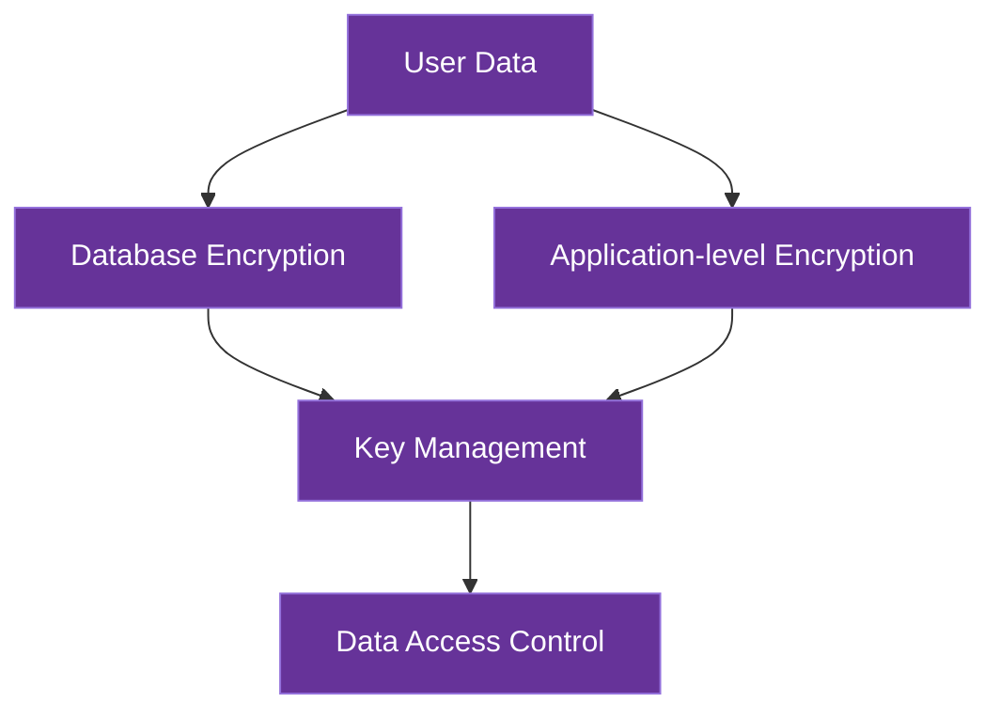

# Data Security

This document details AICO's data security architecture, focusing specifically on protecting user data both at rest and in transit.

## Data Security Overview

AICO implements a privacy-first data security model with multiple layers of protection:



## Data at Rest Security

### Encryption Strategy

AICO employs filesystem-level transparent encryption using gocryptfs to protect all stored data without imposing functionality restrictions on databases:

#### Filesystem-Level Encryption with gocryptfs

- **Approach**: Transparent filesystem encryption that secures all database files at rest
- **Encryption**: AES-256-GCM authenticated encryption with per-file random IVs
- **Security Features**:
  - Forward secrecy with scrypt key derivation
  - File name encryption to prevent metadata leakage
  - Authenticated encryption to detect tampering

- **Implementation**:
  ```python
  # Python wrapper for gocryptfs mounting
  import subprocess
  import os
  import getpass
  
  class SecureStorage:
      def __init__(self, encrypted_dir, mount_point):
          self.encrypted_dir = encrypted_dir
          self.mount_point = mount_point
          self.mounted = False
          
      def initialize(self, password=None):
          """Initialize a new encrypted filesystem if not exists"""
          if not os.path.exists(self.encrypted_dir):
              os.makedirs(self.encrypted_dir)
              
          if not os.listdir(self.encrypted_dir):  # Empty dir = not initialized
              if password is None:
                  password = getpass.getpass("Enter encryption password: ")
                  
              # Initialize gocryptfs with secure defaults
              proc = subprocess.Popen(
                  ["gocryptfs", "-init", self.encrypted_dir],
                  stdin=subprocess.PIPE, stdout=subprocess.PIPE
              )
              proc.communicate(input=password.encode())
              return True
          return False
              
      def mount(self, password=None):
          """Mount the encrypted filesystem"""
          if not os.path.exists(self.mount_point):
              os.makedirs(self.mount_point)
              
          if password is None:
              password = getpass.getpass("Enter encryption password: ")
              
          # Mount with idle timeout for security (auto unmount after inactivity)
          proc = subprocess.Popen(
              ["gocryptfs", "-idle", "30m", self.encrypted_dir, self.mount_point],
              stdin=subprocess.PIPE, stdout=subprocess.PIPE
          )
          proc.communicate(input=password.encode())
          self.mounted = True
          
      def unmount(self):
          """Unmount the encrypted filesystem"""
          if self.mounted:
              subprocess.run(["fusermount", "-u", self.mount_point])
              self.mounted = False
  ```

#### Database Directory Structure

```
/path/to/aico/
├── encrypted/           # Encrypted container (gocryptfs)
└── databases/           # Mount point where databases are accessed
    ├── libsql/          # Primary database
    ├── chroma/          # Vector database
    ├── duckdb/          # Analytics database
    └── rocksdb/         # Key-value cache
```

#### Advantages of Filesystem-Level Encryption

1. **Zero Functionality Restrictions**:
   - Databases operate with full feature sets and native performance
   - No need to modify database code or implement application-level encryption
   - All database features work without modification

2. **Unified Security Model**:
   - Single encryption layer protects all databases consistently
   - Simplifies security auditing and compliance
   - Reduces risk of implementation errors in database-specific encryption

3. **Cross-Platform Support**:
   - Works on all platforms with "Full" backend support
   - Compatible with all backend deployment targets (Linux, macOS, Windows via FUSE)

4. **Performance Efficiency**:
   - Minimal overhead compared to application-level encryption
   - Efficient for both high-performance desktops and resource-constrained devices
   - Avoids double encryption overhead

### Key Management

AICO implements a unified key management approach with gocryptfs, using Argon2id as the key derivation function:

#### Key Derivation with Argon2id

Argon2id is used as the primary key derivation function for all security contexts:

```python
from cryptography.hazmat.primitives.kdf.argon2 import Argon2
import os
import keyring

class AICOKeyManager:
    def __init__(self):
        self.service_name = "AICO"
        
    def derive_master_key(self, password, salt=None):
        """Derive master key using Argon2id with high security parameters"""
        salt = salt or os.urandom(16)
        # High security parameters for master key
        argon2 = Argon2(
            salt=salt,
            time_cost=3,           # Iterations
            memory_cost=1048576,   # 1GB in KB
            parallelism=4,         # 4 threads
            hash_len=32,           # 256-bit key
            type=2                 # Argon2id
        )
        key = argon2.derive(password.encode())
        return key, salt
        
    def derive_gocryptfs_key(self, master_key, salt=None):
        """Derive gocryptfs-specific key from master key"""
        salt = salt or os.urandom(16)
        # Balanced parameters for file encryption
        argon2 = Argon2(
            salt=salt,
            time_cost=2,           # Iterations
            memory_cost=262144,    # 256MB in KB
            parallelism=2,         # 2 threads
            hash_len=32,           # 256-bit key
            type=2                 # Argon2id
        )
        # Derive using master key + purpose identifier
        context = master_key + b"gocryptfs-filesystem"
        key = argon2.derive(context)
        return key, salt
```

#### Key Management Process

1. **Master Password**: User-provided master password is the root of trust
   - Never stored, only used transiently during key derivation

2. **Key Derivation**: Argon2id key derivation with context-specific parameters
   - Master key: 1GB memory, 3 iterations, 4 threads
   - File encryption: 256MB memory, 2 iterations, 2 threads
   - Authentication: 64MB memory, 1 iteration, 1 thread

3. **Secure Storage**: Derived keys securely stored using platform-specific mechanisms:
   - macOS: Keychain
   - Windows: Windows Credential Manager
   - Linux: Secret Service API / GNOME Keyring
   - Mobile: Secure Enclave (iOS) / Keystore (Android)

4. **Biometric Unlock**: Optional biometric authentication for accessing the encryption key
   - Integrates with platform biometric APIs
   - Falls back to master password when biometrics unavailable

5. **Automatic Mounting**: Zero-effort security with automatic mounting during application startup
   - Retrieves keys from secure storage
   - Mounts encrypted filesystem transparently

For complete details on the overall key management system, see [Security Architecture](security_overview.md).

## Data Synchronization Security

When data is synchronized between devices during roaming:

1. **Selective Sync Encryption**:
   - End-to-end encrypted data transfer between trusted devices
   - Encrypted database snapshots for initial synchronization
   - Incremental encrypted updates for ongoing synchronization

2. **Sync Protocol Security**:
   - Authenticated and encrypted channels for all data transfers
   - Cryptographic verification of data integrity during sync
   - Version vectors for conflict detection and resolution

## Data Access Control

AICO implements fine-grained data access controls:

1. **Data Classification**:
   - **Personal Data**: User conversations, preferences, and personal information
   - **System Data**: Configuration, logs, and operational data
   - **Derived Data**: AI-generated insights and analytics

2. **Data Access Policies**:
   - Module-specific data access permissions
   - Explicit data access logging for all sensitive operations
   - Data minimization principles applied to all access requests

## Data Privacy Features

1. **Data Minimization**:
   - Only essential data is collected and stored
   - Automatic data pruning based on relevance and age
   - Privacy-preserving analytics with differential privacy techniques

2. **User Data Control**:
   - Data export functionality for all user data
   - Selective data deletion capabilities
   - Transparency tools showing what data is stored and how it's used

## Data Security for Roaming Scenarios

AICO's data security adapts to different roaming patterns, maintaining security while supporting both coupled and detached deployment models:

1. **Coupled Roaming Security**:
   - Complete encrypted filesystem moves with the application
   - gocryptfs container transferred securely between devices
   - Master key securely synchronized via platform-specific secure storage
   - Zero-effort security maintained across device transitions

2. **Detached Roaming Security**:
   - Backend maintains the gocryptfs encrypted container
   - Frontend accesses data via secure API with end-to-end encryption
   - Mutual TLS authentication between frontend and backend
   - Secure WebSocket or gRPC channels with forward secrecy
   - Lightweight frontend devices operate without needing local encryption capabilities
