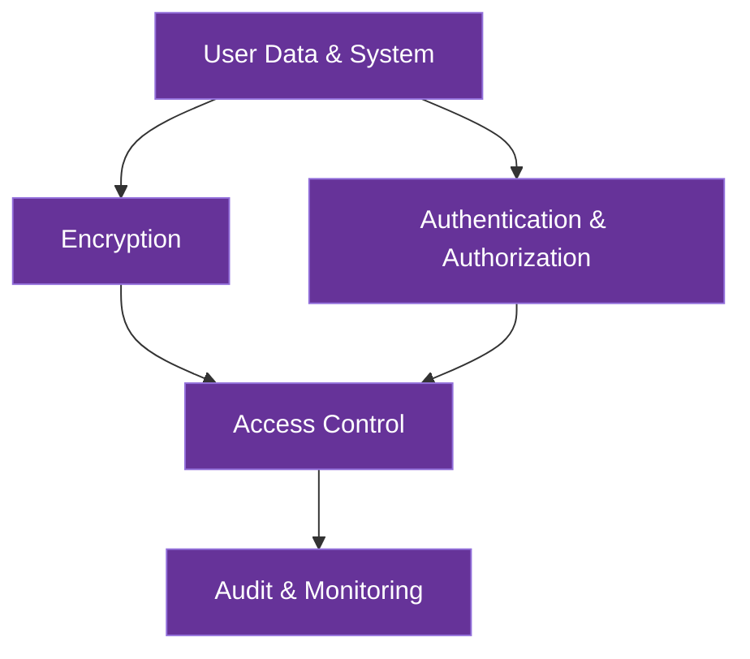

# Security Architecture

This document outlines AICO's comprehensive security architecture, which implements a privacy-first approach to protecting user data, communications, and system integrity across all components.

## Principles

AICO's security architecture is built on the following core principles:

**1. Privacy-First Design**
All security decisions prioritize user privacy and data sovereignty. Personal data remains under user control at all times, with local processing preferred over cloud services and explicit consent required for any data sharing. This principle guides all architectural decisions from storage to communication protocols.

**2. Zero-Effort Security**
Security measures work invisibly without user intervention or friction. Security that gets in the user's way is bad security and will be circumvented. AICO implements automatic key derivation, seamless encryption, and background security processes to provide maximum protection with minimum user awareness or interaction.

This principle is implemented through several key mechanisms:

- **Transparent Key Management**: Security is automatically set up during first application launch with secure defaults. Platform-specific secure storage (Keychain, KeyStore, SecretService) manages credentials with optional biometric authentication when available.

- **Seamless Encryption**: All data is encrypted by default without user action, with encryption/decryption happening in background threads. Security levels adapt based on data sensitivity without user intervention.

- **Frictionless Authentication**: Session persistence minimizes re-authentication, with requirements adapting based on action sensitivity. Single sign-on grants appropriate access across the system, and previously authenticated devices require minimal re-verification.

- **Invisible Security Monitoring**: Security monitoring runs without performance impact, with users only notified for actionable, high-priority events. Security patches are applied automatically when safe to do so.

- **Roaming-Aware Security**: Security automatically configures when frontend and backend are co-located (coupled mode) or implements seamless security handshakes between components (detached mode). Security context is maintained during transitions between roaming states.

**3. Defense in Depth**
Multiple security layers provide redundant protection against threats. No single security measure is relied upon exclusively, with overlapping controls ensuring that a breach of one layer doesn't compromise the entire system. This approach combines encryption, access controls, authentication, and monitoring to create a comprehensive security posture.

**4. Zero Trust Architecture**
No component is inherently trusted; all access is verified regardless of source. Every request is authenticated and authorized, whether from internal modules or external systems. This principle is especially important for AICO's modular design and plugin ecosystem, ensuring that even first-party components follow strict security protocols.

**5. Least Privilege**
Components only have access to the resources they need to perform their functions. Permissions are granular and specific, limiting the potential impact of any compromise. This principle applies to both system modules and user-installed plugins, with explicit capability grants that can be audited and revoked.

**6. Local-First Processing**
Data processing happens on-device whenever possible, minimizing exposure and maximizing user control. This principle supports both privacy and security by keeping sensitive operations within the user's security boundary. When remote processing is required, only the minimum necessary data is transmitted with appropriate protections.

**7. Transparent Security**
Users have visibility into security measures and data usage without being overwhelmed by technical details. Security status is communicated clearly, and users can audit what data is stored and how it's protected. This builds trust while ensuring users can make informed decisions about their privacy and security.

## Architecture Overview

### Frontend vs Backend Security Responsibilities

AICO's architecture supports both coupled (same device) and detached (separate devices) deployment models, requiring specific security implementations for each component:

#### Backend Security Responsibilities

- **Data Encryption**: 
  - Database-native encryption (SQLCipher, DuckDB, RocksDB)
  - File-level encryption wrapper for generic files
  - Key derivation (Argon2id)
  - Master key management

- **Authentication Services**:
  - Credential verification
  - Session management
  - Device pairing and trust establishment

- **Authorization Enforcement**:
  - Access control to databases
  - Permission validation
  - API request authorization

- **Secure Storage**:
  - Platform keyring integration
  - Encrypted database management
  - Secure configuration storage

#### Frontend Security Responsibilities

- **User Authentication**:
  - Biometric integration
  - Password collection and validation
  - Multi-factor authentication UI

- **Secure Communication**:
  - TLS certificate validation
  - API request signing
  - WebSocket security

- **UI Security Controls**:
  - Permission request interfaces
  - Security status indicators
  - Privacy controls and consent management

#### Coupled Mode Considerations

When frontend and backend are on the same device:

- Direct memory access between components (no network exposure)
- Shared security context and platform capabilities
- Single platform keyring for credential storage
- Unified permission model within device boundaries

#### Detached Mode Considerations

When frontend and backend are on separate devices:

- Mutual TLS authentication between components
- Remote attestation to verify device integrity
- Delegated authentication with short-lived tokens
- End-to-end encryption for all communications
- Independent key storage on each device

This separation of security responsibilities ensures that AICO maintains strong security guarantees regardless of deployment pattern, while optimizing for the capabilities of each device type.

AICO's overall security architecture consists of multiple layers that work together to provide comprehensive protection:



## Security Layers

### 1. Encryption Layer

AICO employs comprehensive encryption strategies to protect data both at rest and in transit:

#### Encryption at Rest
- **Application-Level Encryption**: Database-native and file-level encryption for optimal performance
  - **Database-Native**: SQLCipher (SQLite), DuckDB encryption, RocksDB EncryptedEnv
  - **File-Level Wrapper**: AES-256-GCM for files without native encryption support
  - **Forward Secrecy**: Ensures past data remains secure even if keys are compromised
- **Memory Protection**: Sensitive data in memory is protected against unauthorized access
- **Secure Storage**: Encryption keys stored using platform-specific secure storage mechanisms

#### Encryption in Transit
- **Local Communication**: 
  - **ZeroMQ with CurveZMQ**: Elliptic curve cryptography for all internal communication
  - **Authentication**: Certificate-based peer authentication
  - **Implementation**:
    ```python
    # Example secure ZeroMQ setup
    import zmq
    from zmq.auth.thread import ThreadAuthenticator
    
    # Set up authentication
    context = zmq.Context()
    auth = ThreadAuthenticator(context)
    auth.start()
    auth.configure_curve(domain='*', location=zmq.auth.CURVE_ALLOW_ANY)
    
    # Server socket with curve security
    server = context.socket(zmq.PUB)
    server_public, server_secret = zmq.curve_keypair()
    server.curve_publickey = server_public
    server.curve_secretkey = server_secret
    server.curve_server = True
    ```

- **Remote Communication**:
  - **End-to-End Encryption**: TLS 1.3 with strong cipher suites
  - **Certificate Pinning**: Prevents man-in-the-middle attacks
  - **Perfect Forward Secrecy**: Ensures past communications remain secure

### 2. Authentication & Authorization Layer

#### Key Management and Derivation in AICO

AICO employs a comprehensive approach to key management that combines secure key derivation with platform-native secure storage to support its local-first, file-based architecture and roaming capabilities.

### Key Derivation

**Argon2id** serves as AICO's unified key derivation function across all security contexts:

- **Why Argon2id for AICO**: 
  - Provides optimal security for AICO's application-level encryption strategy
  - Supports cross-platform deployment with consistent security guarantees
  - Memory-hard design protects against hardware-accelerated attacks
  - Configurable parameters allow adaptation to different device capabilities

- **Context-Specific Parameters**:
  | Context | Memory | Iterations | Parallelism | AICO Usage |
  |---------|--------|------------|-------------|--------|
  | Master Key | 1GB | 3 | 4 | Initial login, derives all other keys |
  | Database Encryption | 256MB | 2 | 2 | SQLCipher, DuckDB, RocksDB keys |
  | File Encryption | 128MB | 1 | 2 | Generic file encryption wrapper |
  | Authentication | 64MB | 1 | 1 | Device pairing, roaming authentication |

- **Implementation in AICO Backend**:
  ```python
  # AICO backend implementation using Python-Cryptography
  from cryptography.hazmat.primitives.kdf.argon2 import Argon2
  import os
  
  # Generate a random salt for AICO master key
  salt = os.urandom(16)
  
  # Configure Argon2id for AICO master key derivation
  argon2 = Argon2(
      salt=salt,
      time_cost=3,           # Iterations
      memory_cost=1048576,   # 1GB in KB
      parallelism=4,         # 4 threads
      hash_len=32,           # 256-bit key
      type=2                 # Argon2id
  )
  
  # Derive AICO master key from user password
  master_key = argon2.derive(password.encode())
  ```

### Key Management

AICO's key management system handles the lifecycle of cryptographic keys from creation through storage, use, and rotation:

- **Key Hierarchy**: 
  - **Master Password**: User-provided secret, never stored
  - **Master Key**: Derived via Argon2id, stored in platform secure storage
  - **Purpose-Specific Keys**: Derived from master key for database encryption, file encryption, device pairing

- **Secure Storage**: Platform-native mechanisms for zero-effort security:
  - macOS: Keychain integration
  - Windows: Windows Credential Manager
  - Linux: Secret Service API / GNOME Keyring
  - Mobile: Secure Enclave (iOS) / Keystore (Android)
  
  AICO uses the Python `keyring` library as a cross-platform abstraction layer for secure key storage:
  
  ```python
  import keyring
  import getpass
  from cryptography.hazmat.primitives.kdf.argon2 import Argon2
  import os
  
  class AICOKeyManager:
      """Unified key management for all authentication scenarios"""
      
      def __init__(self, service_name="AICO"):
          self.service_name = service_name
          
      def setup_or_retrieve_key(self, password=None, interactive=True):
          """DRY method: handles setup, interactive, and service authentication"""
          # Try to retrieve existing key first (service mode)
          stored_key = keyring.get_password(self.service_name, "master_key")
          
          if stored_key:
              return bytes.fromhex(stored_key)  # Service startup - no user interaction
          elif password:
              return self._derive_and_store(password)  # Setup mode
          elif interactive:
              password = getpass.getpass("Enter master password: ")
              return self._derive_and_store(password)  # Interactive mode
          else:
              raise AuthenticationError("No stored key and no password provided")
              
      def _derive_and_store(self, password):
          """Derive master key and store securely"""
          # Use consistent Argon2id parameters for master key
          salt = os.urandom(16)
          argon2 = Argon2(
              salt=salt,
              time_cost=3,           # 3 iterations
              memory_cost=1048576,   # 1GB memory
              parallelism=4,         # 4 threads
              hash_len=32,           # 256-bit key
              type=2                 # Argon2id
          )
          
          master_key = argon2.derive(password.encode())
          
          # Store derived key securely
          keyring.set_password(self.service_name, "master_key", master_key.hex())
          keyring.set_password(self.service_name, "salt", salt.hex())
          
          # Clear password from memory
          password = None
          
          return master_key
          
      def change_password(self, old_password, new_password):
          """Update master password and re-derive keys"""
          # Verify old password
          stored_key = self.setup_or_retrieve_key(old_password, interactive=False)
          
          # Derive and store new key
          return self._derive_and_store(new_password)
          
      def clear_stored_keys(self):
          """Remove all stored keys (for security incidents)"""
          keyring.delete_password(self.service_name, "master_key")
          keyring.delete_password(self.service_name, "salt")
  ```
  
  This unified approach provides:
  - **KISS**: Single class handles all authentication scenarios
  - **DRY**: Common key derivation and storage logic
  - **Maintainable**: Clear separation of concerns with simple state handling

- **Roaming Support**: 
  - **Coupled Roaming**: Secure key transfer between trusted devices
  - **Detached Roaming**: Backend maintains keys, frontend authenticates via secure protocol

- **Zero-Effort Security**: 
  - Automatic key retrieval during AICO startup
  - Transparent filesystem mounting
  - Optional biometric unlock on supported platforms

- **Persistent Service Authentication**: 
  AICO backend services can restart automatically without user password re-entry while maintaining security:
  
  - **One-Time Setup**: User enters master password during initial setup or password change
  - **Secure Storage**: Derived master key stored in platform-native secure storage (Keychain, Credential Manager, Secret Service)
  - **Service Startup**: Backend retrieves stored key automatically on restart
  - **No User Interaction**: Services restart seamlessly without password prompts
  - **Security Maintained**: Platform-level protection and service isolation provide security
  - **Biometric Enhancement**: Optional biometric unlock for accessing stored keys
  - **Platform compatibility**: Works across macOS, Windows, and Linux

- **CLI Session Management**:
  AICO CLI implements session-based authentication for improved developer experience:
  
  - **30-Minute Sessions**: Automatic session timeout after 30 minutes of inactivity
  - **Activity Extension**: Sessions extend automatically on CLI usage
  - **Secure Caching**: Master key cached in memory during active sessions
  - **Force Fresh Auth**: Sensitive operations (password changes, exports) always require fresh authentication
  - **Session Visibility**: `aico security session` command shows session status and remaining time
  - **Manual Control**: `aico security clear` forces immediate session termination
  
  This approach supports:
  - **Non-technical users**: No command-line interaction required
  - **System integration**: Backend starts automatically with OS
  - **Security compliance**: Master password never stored, only derived keys
  - **Platform compatibility**: Works across macOS, Windows, and Linux

#### Authentication Mechanisms
- **Local Authentication**: Biometric or password-based with secure credential storage
- **Remote Authentication**: Zero-knowledge proof authentication for device-to-device communication
- **Device Pairing**: Secure device registration and authentication protocol

#### Authorization Framework
- **Permission Levels**:
  - **System**: Core system operations
  - **User Data**: Personal user information
  - **Plugin**: Third-party plugin access
- **Consent Management**:
  - Explicit user consent required for all data access
  - Granular permission control for each data category
  - Time-limited access grants with automatic expiration

## Security Features

AICO's architecture requires specific security implementations for both frontend and backend components to support local-first operation and flexible roaming patterns.

### Frontend Security Requirements

| Feature | Implementation | Rationale |
|---------|----------------|------------|
| **Secure Authentication UI** | Biometric integration, secure password fields, MFA support | Frontend is the user's entry point; must securely collect credentials while preventing interception |
| **Certificate Validation** | Certificate pinning, CRL checking, OCSP | Must verify backend identity in detached mode to prevent MITM attacks |
| **Local Storage Encryption** | AES-256 for Flutter secure storage | Temporary data and settings on frontend need protection, especially on mobile/AR devices |
| **Secure WebView Sandboxing** | Content Security Policy, iframe isolation | For rendering content safely without exposing the application to web-based attacks |
| **Permission Request Interfaces** | Consent dialogs, permission visualization | Frontend must clearly communicate and obtain consent for security-sensitive operations |
| **Secure Input Handling** | Input validation, sanitization libraries | Prevent injection attacks by sanitizing all inputs before sending to backend |
| **Biometric Integration** | Platform-specific biometric APIs | Leverage platform biometric capabilities for seamless, secure authentication |
| **Security Status Visualization** | Status indicators, security dashboards | Users need visibility into security state without technical complexity |

### Backend Security Requirements

| Feature | Implementation | Rationale |
|---------|----------------|------------|
| **Database Encryption** | SQLCipher, DuckDB, RocksDB native encryption | Core protection for all database files using optimal encryption methods |
| **Key Derivation** | Argon2id with context-specific parameters | Secure generation of encryption keys from master password |
| **Secure Key Storage** | Python keyring library with platform backends | Platform-native secure storage of cryptographic keys |
| **Authentication Service** | Token-based authentication with JWTs | Verify user identity and manage sessions across both coupled and detached modes |
| **Access Control Enforcement** | Role-based access control, attribute-based policies | Backend must enforce all permissions and access controls at the data layer |
| **Secure API Gateway** | Request validation, rate limiting, authentication | All frontend requests must be authenticated, authorized, and validated |
| **Device Pairing Protocol** | Challenge-response authentication, QR pairing | Establish trust between devices for roaming capabilities |
| **Encrypted Backup System** | Envelope encryption, key rotation support | Protect data during backup/restore operations while maintaining key security |
| **Secure P2P Synchronization** | End-to-end encrypted channels, conflict resolution | Enable encrypted device-to-device data transfer for roaming support |
| **Audit Logging** | Tamper-evident logs, selective privacy-preserving logging | Record security-relevant events for troubleshooting and potential forensic analysis |

### Coupled vs. Detached Mode Security

The security implementations adapt based on deployment mode:

**Coupled Mode (Frontend + Backend on same device)**
- Direct authentication via shared memory
- Local keyring access for both components
- No network exposure between components
- Unified permission context

**Detached Mode (Frontend on separate device)**
- Mutual TLS authentication between devices
- Delegated authentication with short-lived tokens
- Network security with perfect forward secrecy
- Independent key storage with secure synchronization

### 3. Access Control Layer

#### Component Isolation
- **Process Separation**: Critical components run in isolated processes
- **Sandboxing**: Plugin execution in sandboxed environments
- **Memory Protection**: Address space layout randomization (ASLR) and data execution prevention

#### API Security
- **API Gateway Security**:
  - **Authentication**: Token-based authentication with short expiration
  - **Rate Limiting**: Prevents brute force and DoS attacks
  - **Request Validation**: Strict schema validation for all requests

#### Plugin Security
- **Capability-based Security**: Plugins only receive access to specific capabilities
- **Resource Limitations**: CPU, memory, and network quotas for plugins
- **Code Signing**: Verification of plugin integrity before execution

### 4. Audit & Monitoring Layer

#### Security Monitoring
- **Audit Logging**:
  - All security-relevant events recorded
  - Authentication attempts tracked
  - Access control decisions logged
- **Anomaly Detection**:
  - Unusual access patterns flagged
  - Multiple authentication failures trigger alerts
  - Behavioral analysis to detect potential threats

#### Incident Response
- **Alert System**: Real-time notification of security events
- **Recovery Procedures**: Documented steps for security incident recovery
- **Secure Defaults**: System returns to secure state after failures

## Deployment Patterns

### Coupled Deployment Security
- Single device security boundary
- Local encryption at rest
- No network exposure required
- Platform-specific security features utilized

### Detached Deployment Security
- Network communication security (TLS/encryption)
- Authentication between frontend and backend
- Distributed trust model
- Network-based attack surface mitigation

