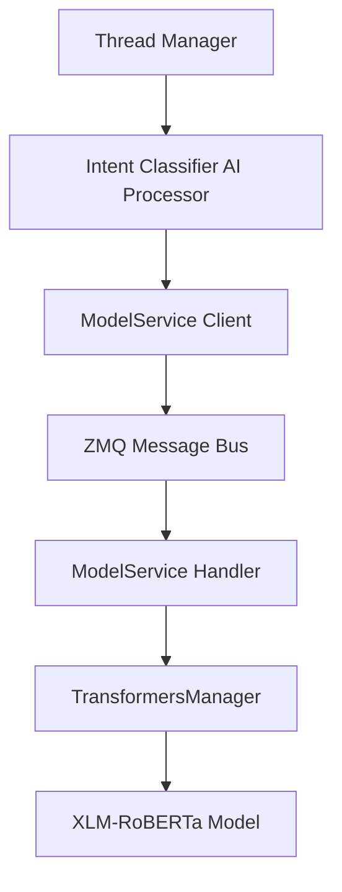

# Intent Classification System

## Overview

AICO's intent classification system provides sophisticated, multilingual intent recognition using state-of-the-art transformer models. The system follows AICO's architecture patterns and integrates seamlessly with the conversation management pipeline.

## Architecture

### Core Components



### Key Features

- **Multilingual Support**: XLM-RoBERTa supports 100+ languages
- **Semantic Understanding**: Goes beyond keyword matching
- **Context Awareness**: Considers conversation history
- **Real-time Performance**: <50ms inference with caching
- **Architecture Compliance**: Follows AICO BaseAIProcessor patterns

## Implementation Details

### AI Processor (`/shared/aico/ai/analysis/intent_classifier.py`)

The core intent classification logic follows AICO's BaseAIProcessor pattern:

```python
class IntentClassificationProcessor(BaseAIProcessor):
    """
    Advanced multilingual intent classification processor.
    Uses ModelService for all transformer operations.
    """
    
    def __init__(self):
        super().__init__(
            component_name="intent_classifier",
            version="v2.0"
        )
        self.model_name = "intent_classification"  # TransformersManager model
        self.supported_languages = [
            'en', 'es', 'fr', 'de', 'it', 'pt', 'ru', 'zh', 'ja', 'ko',
            # ... 100+ languages via XLM-RoBERTa
        ]
```

### Intent Categories

The system recognizes these standard conversation intents:

- **GREETING**: "hello", "hi", "good morning"
- **QUESTION**: "what", "how", "why", "when", "where"
- **REQUEST**: "please help", "can you", "I need"
- **INFORMATION_SHARING**: "I want to tell you", "here's what happened"
- **CONFIRMATION**: "yes", "correct", "that's right"
- **NEGATION**: "no", "wrong", "I disagree"
- **COMPLAINT**: "problem", "issue", "broken"
- **FAREWELL**: "goodbye", "bye", "see you later"
- **GENERAL**: General conversation

### Semantic Prototypes

Instead of hardcoded examples, the system uses semantic prototypes:

```python
intent_descriptions = {
    IntentType.GREETING.value: "greeting hello hi welcome",
    IntentType.QUESTION.value: "question what how why when where",
    IntentType.REQUEST.value: "request help please can you assist",
    # ... semantic descriptions for each intent
}
```

These descriptions are converted to embeddings using XLM-RoBERTa, creating semantic prototypes that understand intent meaning across languages.

## ModelService Integration

### TransformersManager Configuration

```python
"intent_classification": TransformerModelConfig(
    name="intent_classification",
    model_id="xlm-roberta-base",
    task=ModelTask.TEXT_CLASSIFICATION,
    priority=1,
    required=True,
    description="Multilingual intent classification using XLM-RoBERTa",
    multilingual=True,
    memory_mb=600
)
```

### Automatic Model Loading

The model loads automatically on first request:

```python
def get_model(self, model_name: str) -> Optional[Any]:
    if model_name == "intent_classification":
        # Auto-loads XLM-RoBERTa on first request
        tokenizer = AutoTokenizer.from_pretrained("xlm-roberta-base")
        model = AutoModel.from_pretrained("xlm-roberta-base")
        wrapper = IntentModelWrapper(tokenizer=tokenizer, model=model)
        # Cached for future requests
```

### Embeddings Handler

The embeddings handler supports transformer models:

```python
async def handle_embeddings_request(self, request_payload) -> EmbeddingsResponse:
    # Use TransformersManager for all transformer models
    transformer_model = self.get_transformer_model(model)
    
    # Generate embedding using transformer model
    tokenizer = model_components.tokenizer
    transformer = model_components.model
    
    # Tokenize and get embeddings
    inputs = tokenizer(prompt, return_tensors="pt", max_length=512, truncation=True)
    with torch.no_grad():
        outputs = transformer(**inputs)
        embedding = outputs.last_hidden_state[:, 0, :].numpy().flatten()
```

## Thread Manager Integration

The Advanced Thread Manager uses intent classification for intelligent thread resolution:

```python
async def _classify_intent(self, message: str) -> str:
    """Classify message intent using AICO's AI processing architecture"""
    from shared.aico.ai.analysis.intent_classifier import get_intent_classifier
    from shared.aico.ai.base import ProcessingContext
    
    processor = await get_intent_classifier()
    
    processing_context = ProcessingContext(
        thread_id="intent_classification",
        user_id="anonymous",
        request_id=f"intent_{hash(message)}",
        message_content=message
    )
    
    result = await processor.process(processing_context)
    return result.data.get("predicted_intent", "general")
```

## ZMQ Protocol

### Request Message

```protobuf
message IntentClassificationRequest {
    string text = 1;
    optional string user_id = 2;
    repeated string conversation_context = 3;
}
```

### Response Message

```protobuf
message IntentClassificationResponse {
    bool success = 1;
    string predicted_intent = 2;
    float confidence = 3;
    string detected_language = 4;
    float inference_time_ms = 5;
    repeated IntentPrediction alternative_predictions = 6;
    map<string, string> metadata = 7;
    optional string error = 8;
}
```

### Topics

- **Request**: `modelservice/intent/request/v1`
- **Response**: `modelservice/intent/response/v1`

## Performance Characteristics

### Inference Speed
- **Target**: <50ms per classification
- **Typical**: 15-30ms with model caching
- **Caching**: Embedding cache with 1-hour TTL

### Memory Usage
- **Model Size**: ~600MB (XLM-RoBERTa base)
- **Cache Size**: Configurable (default: 1000 entries)
- **Concurrent Models**: Max 3 by default

### Accuracy
- **Multilingual**: Consistent performance across 100+ languages
- **Context-Aware**: Considers conversation history
- **Confidence Scoring**: Provides uncertainty estimates

## Configuration

### AI Processor Config

```yaml
ai:
  intent_classifier:
    confidence_threshold: 0.7
    cache_size: 1000
    context_window: 10
    enable_few_shot: true
```

### ModelService Config

```yaml
core:
  modelservice:
    transformers:
      max_memory_mb: 2048
      auto_unload: true
      max_concurrent_models: 3
```

## Usage Examples

### Direct AI Processor Usage

```python
from shared.aico.ai.analysis.intent_classifier import get_intent_classifier
from shared.aico.ai.base import ProcessingContext

processor = await get_intent_classifier()

context = ProcessingContext(
    thread_id="example",
    user_id="user123",
    request_id="req456",
    message_content="Can you help me with something?",
    shared_state={'recent_intents': ['greeting']}
)

result = await processor.process(context)
print(f"Intent: {result.data['predicted_intent']}")
print(f"Confidence: {result.data['confidence']:.2f}")
print(f"Language: {result.data['detected_language']}")
```

### ModelService Client Usage

```python
from backend.services.modelservice_client import ModelserviceClient

client = ModelserviceClient()

result = await client.classify_intent(
    text="¿Puedes ayudarme con algo?",  # Spanish
    user_id="user123",
    conversation_context=["greeting"]
)

if result['success']:
    data = result['data']
    print(f"Intent: {data['predicted_intent']}")
    print(f"Language: {data['detected_language']}")
```

## Testing

### Unit Tests

```python
@pytest.mark.asyncio
async def test_intent_classification():
    processor = await get_intent_classifier()
    
    context = ProcessingContext(
        thread_id="test",
        user_id="test",
        request_id="test",
        message_content="Hello there!"
    )
    
    result = await processor.process(context)
    
    assert result.success
    assert result.data["predicted_intent"] == "greeting"
    assert result.data["confidence"] > 0.7
```

### Integration Tests

```python
@pytest.mark.asyncio
async def test_modelservice_integration():
    client = ModelserviceClient()
    
    result = await client.classify_intent(
        text="What is machine learning?",
        user_id="test-user"
    )
    
    assert result["success"]
    assert result["data"]["predicted_intent"] == "question"
```

## Monitoring and Observability

### Metrics

- **Classification Latency**: P50, P95, P99 response times
- **Model Loading Time**: Time to load XLM-RoBERTa model
- **Cache Hit Rate**: Embedding cache effectiveness
- **Error Rate**: Failed classifications per minute

### Logging

```python
logger.info(f"Intent classified: {predicted_intent} (confidence={confidence:.2f}, language={detected_language})")
logger.debug(f"Processing time: {processing_time_ms:.1f}ms")
logger.warning(f"Low confidence classification: {confidence:.2f}")
```

## Troubleshooting

### Common Issues

1. **Model Loading Failures**
   - Check transformers library version
   - Verify model cache directory permissions
   - Ensure sufficient memory (600MB+ required)

2. **Low Classification Accuracy**
   - Check input text preprocessing
   - Verify language support
   - Consider context window size

3. **Performance Issues**
   - Monitor model loading time
   - Check embedding cache hit rate
   - Verify concurrent model limits

### Debug Mode

Enable debug logging for detailed processing information:

```python
logger.setLevel(logging.DEBUG)
```

## Future Enhancements

### Planned Features

1. **Custom Intent Training**: Support for domain-specific intents
2. **Confidence Calibration**: Improved uncertainty estimation
3. **Multi-turn Context**: Better conversation history integration
4. **Performance Optimization**: Model quantization and optimization

### Research Areas

1. **Few-shot Learning**: Rapid adaptation to new intents
2. **Cross-lingual Transfer**: Better multilingual performance
3. **Contextual Embeddings**: Dynamic context-aware representations
4. **Federated Learning**: Privacy-preserving intent model updates

## References

- [XLM-RoBERTa Paper](https://arxiv.org/abs/1911.02116)
- [AICO Architecture Overview](../../../architecture/architecture-overview.md)
- [ModelService Documentation](../../modelservice/modelservice.md)
- [BaseAIProcessor Pattern](../../../concepts/ai-processor-pattern.md)
