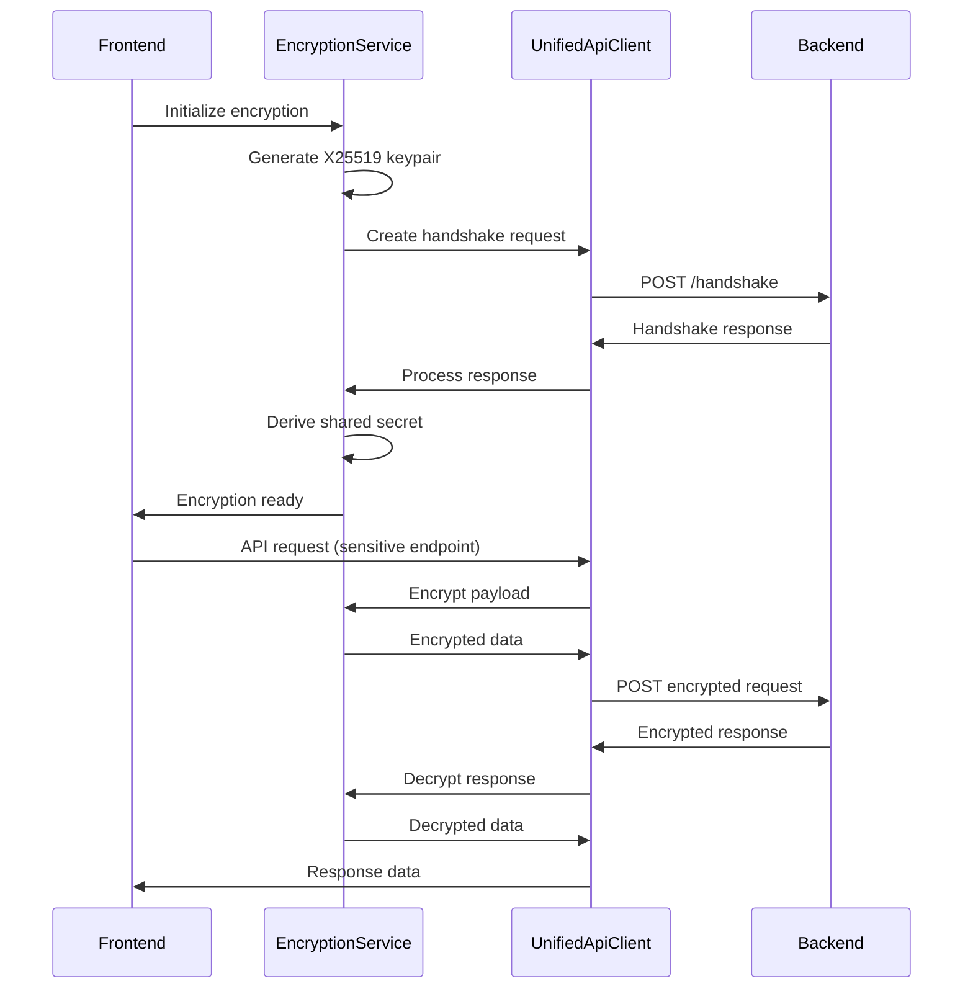

# Frontend Encryption Integration

## Overview

The AICO frontend implements **end-to-end encryption** for sensitive API communications through a sophisticated handshake protocol and automatic endpoint detection. This document details the encryption architecture, implementation patterns, and integration with the backend security system.

## Architecture

### Core Components

- **EncryptionService**: Manages encryption keys, handshake protocol, and payload encryption/decryption
- **UnifiedApiClient**: Automatically routes requests to encrypted or unencrypted endpoints
- **Platform Integration**: Uses Flutter Secure Storage with native Keychain/Credential Manager
- **Handshake Protocol**: Establishes secure sessions with backend using X25519 key exchange

### Security Flow



## Implementation Details

### EncryptionService

The `EncryptionService` handles all cryptographic operations using the **Sodium** library for high-performance, secure encryption:

```dart
class EncryptionService {
  // X25519 key exchange for session establishment
  late KeyPair _keyPair;
  late Uint8List _sharedSecret;
  String? _clientId;
  
  Future<void> initialize() async {
    // Generate X25519 keypair for handshake
    _keyPair = CryptoBox.generateKeyPair();
    _clientId = _generateClientId();
  }
  
  Future<Map<String, dynamic>> createHandshakeRequest() async {
    return {
      'handshake_request': {
        'client_public_key': base64Encode(_keyPair.publicKey),
        'client_id': _clientId,
        'protocol_version': '1.0',
      }
    };
  }
  
  Map<String, dynamic> encryptPayload(Map<String, dynamic> data) {
    final plaintext = utf8.encode(jsonEncode(data));
    final nonce = randomBytes(24); // XSalsa20Poly1305 nonce
    final encrypted = CryptoBox.encrypt(plaintext, nonce, _sharedSecret);
    
    return {
      'data': base64Encode(encrypted),
      'nonce': base64Encode(nonce),
    };
  }
}
```

### UnifiedApiClient Integration

The `UnifiedApiClient` provides **transparent encryption** by automatically detecting which endpoints require encryption:

```dart
class UnifiedApiClient {
  // Endpoints that should NOT be encrypted
  static const _unencryptedPaths = [
    '/health',
    '/gateway/status', 
    '/gateway/metrics',
    '/docs',
    '/redoc',
    '/openapi.json',
    '/handshake',
  ];
  
  Future<T> request<T>(String method, String endpoint, {
    Map<String, dynamic>? data,
    T Function(Map<String, dynamic>)? fromJson,
  }) async {
    final needsEncryption = _requiresEncryption(endpoint);
    
    if (needsEncryption) {
      // Encrypt sensitive endpoints
      if (!_handshakeCompleted || !_encryptionService.isSessionActive) {
        throw EncryptionConnectionException(
          'No active encryption session. Call initializeEncryption() first.'
        );
      }
      
      final encryptedPayload = data != null ? 
        _encryptionService.encryptPayload(data) : null;
        
      final encryptedRequest = {
        'encrypted': true,
        'payload': encryptedPayload,
        'client_id': _encryptionService.clientId,
      };
      
      // Send encrypted request via Dio
      final response = await _dio.request(endpoint, 
        data: encryptedRequest,
        options: Options(method: method)
      );
      
      // Decrypt response if needed
      if (response.data['encrypted'] == true) {
        final decrypted = _encryptionService.decryptPayload(
          response.data['payload']
        );
        return fromJson != null ? fromJson(decrypted) : decrypted as T;
      }
    } else {
      // Use plain HTTP for public endpoints
      return _handlePlainRequest<T>(method, endpoint, data: data, fromJson: fromJson);
    }
  }
}
```

## Platform Security Integration

### Secure Key Storage

The frontend leverages **platform-native secure storage** for encryption keys:

```dart
// macOS: Keychain Services
// Windows: Credential Manager  
// Linux: Secret Service API
// Android: Android Keystore
// iOS: iOS Keychain

class SecureStorage {
  static const _storage = FlutterSecureStorage(
    aOptions: AndroidOptions(
      encryptedSharedPreferences: true,
    ),
    iOptions: IOSOptions(
      accessibility: IOSAccessibility.first_unlock_this_device,
    ),
  );
  
  Future<void> storeEncryptionKey(String key, Uint8List value) async {
    await _storage.write(
      key: key, 
      value: base64Encode(value)
    );
  }
}
```

### Keychain Integration (macOS)

The frontend requires proper **Keychain entitlements** for secure key storage:

```xml
<!-- DebugProfile.entitlements & Release.entitlements -->
<dict>
  <key>keychain-access-groups</key>
  <array>
    <string>$(AppIdentifierPrefix)com.aico.frontend</string>
  </array>
  <key>com.apple.security.application-groups</key>
  <array>
    <string>group.com.aico.frontend</string>
  </array>
</dict>
```

## Error Handling & Resilience

### Encryption Failures

The system handles encryption failures gracefully with clear user feedback:

```dart
try {
  await client.initializeEncryption();
} catch (e) {
  if (e is EncryptionConnectionException) {
    // Show user-friendly error
    showError('Unable to establish secure connection. Please check your network.');
  } else {
    // Log technical details for debugging
    logger.error('Encryption initialization failed', error: e);
  }
}
```

### Session Management

- **Automatic Renewal**: Sessions are renewed before expiration
- **Graceful Degradation**: Falls back to unencrypted endpoints when possible
- **Error Recovery**: Automatic retry with exponential backoff
- **Session Persistence**: Keys stored securely across app restarts

## Security Guarantees

### Cryptographic Strength

- **X25519**: Elliptic curve Diffie-Hellman key exchange
- **XSalsa20Poly1305**: Authenticated encryption with associated data
- **Perfect Forward Secrecy**: Session keys are ephemeral
- **Zero-Knowledge**: Backend cannot decrypt without client participation

### Implementation Security

- **Constant-Time Operations**: Sodium library prevents timing attacks
- **Memory Safety**: Secure key erasure and memory protection
- **Platform Integration**: Leverages OS-level security features
- **Audit Trail**: Comprehensive logging for security monitoring

## Testing & Validation

### Unit Tests

```dart
group('EncryptionService', () {
  test('should generate valid handshake request', () async {
    final service = EncryptionService();
    await service.initialize();
    
    final handshake = await service.createHandshakeRequest();
    expect(handshake['handshake_request']['client_public_key'], isNotNull);
    expect(handshake['handshake_request']['client_id'], isNotNull);
  });
  
  test('should encrypt and decrypt payload correctly', () {
    final testData = {'message': 'Hello, World!'};
    final encrypted = service.encryptPayload(testData);
    final decrypted = service.decryptPayload(encrypted);
    
    expect(decrypted, equals(testData));
  });
});
```

### Integration Tests

- **End-to-End Encryption**: Full handshake and encrypted communication flow
- **Error Scenarios**: Network failures, invalid keys, session expiration
- **Platform Testing**: Keychain access across different platforms
- **Performance**: Encryption overhead and throughput measurements

## Future Enhancements

### Planned Features

- **Certificate Pinning**: Additional transport security for network requests
- **Hardware Security**: Integration with platform hardware security modules
- **Multi-Device Sync**: Secure key synchronization across user devices
- **Audit Logging**: Enhanced security event logging and monitoring

### Performance Optimizations

- **Key Caching**: Intelligent session key caching strategies
- **Batch Encryption**: Optimized encryption for multiple requests
- **Streaming Encryption**: Support for large file uploads/downloads
- **Background Processing**: Encryption operations on background threads

This encryption integration ensures that sensitive user data remains protected throughout the communication pipeline while maintaining excellent user experience and developer productivity.
