# AICO – The AI+Companion Project

!!! info "Welcome to AICO"
    Building an **emotionally present, embodied, and proactive AI companion** that evolves from basic conversation partner to trusted co-adventurer.

**Quick Links**

- [Join the AICO Discord](https://discord.gg/4tGyGtbCPt) – real-time chat for support, dev discussion, and showcases.
- [Homepage](https://boeni.industries/aico) – easy to digest basics about project AICO.

## Project Vision

AICO is an open-source, local-first AI companion designed to be emotionally present, embodied, and proactive. It is built for privacy, extensibility, and genuine relationship—not just productivity. AICO naturally recognizes and builds individual relationships with family members while maintaining a consistent personality, creating authentic bonds without technical barriers. It combines advanced conversation, emotion simulation, personality, and agency with a modular, message-driven architecture that prioritizes user autonomy and security.

AICO aims to be a true family member: emotionally aware, visually present, and capable of self-driven initiative. Like a real person, AICO recognizes each family member naturally through voice and behavior, building unique relationships while maintaining its core personality. Its architecture enables seamless evolution from basic companion to proactive confidante, sidekick, and beyond—while keeping user data private and local.

**This isn't about "superintelligence"**—it's about real resonance, authentic relationship, and an AI that sometimes nudges you first without being told.

## The Evolutionary Journey

AICO's development follows a unique relationship-deepening progression:

```mermaid
graph LR
    A[🤝 Companion<br/>MVP] --> B[💭 Confidante<br/>Emotional Intelligence]
    B --> C[🦾 Sidekick<br/>Advanced Agency]
    C --> D[🌟 Co-Adventurer<br/>Collaborative Growth]
    D --> E[🌐 Embodied Presence<br/>Multi-Modal Integration]
    E --> F[🤝 Community<br/>Collective Learning]
```

Each stage builds deeper companionship rather than just adding features.

## Core Principles

- **Autonomous agency** – Proactive, self-driven behavior and curiosity
- **Local-first, privacy-first** – All data and processing remain user-controlled
- **Modular, message-driven design** – System > Domain > Module > Component hierarchy, strict boundaries, and ZeroMQ/Protocol Buffers messaging
- **Natural family recognition** – Multi-modal identification without technical authentication
- **Real-time emotional intelligence** – Multi-modal recognition and simulation
- **Extensibility** – Plugin system, APIs, and admin tools for customization

## 🚀 Key Capabilities

AICO is engineered to deliver a truly companionable, proactive, and privacy-first AI experience. Its capabilities span conversation, memory, emotion, agency, embodiment, privacy, extensibility, and system administration.

### 👥 **Social Relationship Intelligence** ✅ *Production*
- **Property Graph Storage**: NetworkX + DuckDB with 204 nodes, 27 edges, 552 indexed properties
- **Multi-Pass Entity Extraction**: GLiNER zero-shot recognition + LLM relationship extraction
- **Entity Resolution**: 3-step deduplication (semantic blocking → LLM matching → merging)
- **Temporal Reasoning**: Bi-temporal tracking (valid_from, valid_until, is_current)
- **Graph Analytics**: PageRank importance, Louvain community detection, betweenness centrality
- **GQL/Cypher Queries**: Full graph query language via GrandCypher
- **Graph Fusion**: Conflict resolution and canonical ID management
- **HNSW Search**: Approximate nearest neighbor for fast entity similarity

*Planned:* Dynamic relationship learning, voice biometrics, natural family recognition

### 🗣️ **Conversation & Memory** ✅ *Production*
**Three-Tier Architecture** with brain-inspired complementary learning:
- **Working Memory (LMDB)**: 24-hour TTL, sub-millisecond access, conversation-scoped
- **Semantic Memory (ChromaDB)**: Hybrid Search V3 with semantic + BM25 + IDF filtering + RRF fusion
- **Knowledge Graph (DuckDB)**: Property graph with temporal reasoning and multi-hop queries
- **Adaptive Memory System (AMS)**: Memory consolidation, Thompson Sampling, RLHF behavioral learning
- **Memory Album**: User-curated conversation and message-level memories with emotional tone
- **Real-time Streaming**: WebSocket-based token streaming for responsive conversations
- **Local LLM**: Qwen3 Abliterated 8B via Ollama with automatic model management
- **Context Assembly**: Multi-factor scoring (recency, relevance, relationship) across all memory tiers

*Planned:* Voice conversations, proactive conversation starters

### 🎭 **Custom Character Personalities** ✅ *Production*
- **Eve Character**: Warm, curious, contemplative companion with genuine thoughts and feelings
- **Ollama Modelfiles**: Define custom AI personalities with distinct traits and communication styles
- **Character Parameters**: Fine-tune temperature, context window, sampling for consistency
- **Thinking Process**: Ollama 0.12+ native thinking API for internal reasoning
- **Memory Integration**: Characters naturally reference past conversations via memory system
- **Create Your Own**: Define professional assistants, creative collaborators, philosophical thinkers, or supportive friends

### 😊 **Emotional Intelligence** 🚧 *In Development*
**Production:**
- **Text Sentiment**: BERT Multilingual sentiment classification
- **Emotion Analysis**: RoBERTa 6-emotion classification (joy, sadness, anger, fear, surprise, disgust)
- **Intent Classification**: XLM-RoBERTa multilingual intent understanding
- **Memory Album Integration**: Automatic emotional tone detection

**Planned:**
- Advanced emotion simulation (AppraisalCloudPCT with 4-stage appraisal)
- Multi-modal emotion recognition (facial, voice)
- Personality simulation with evolving traits (Big Five, HEXACO)
- Crisis detection and empathetic response generation

### 🤖 **Autonomous Agency & Task Automation** ✅ *Production*
**Production:**
- **Task Scheduler**: Cron-based scheduler with resource awareness and adaptive execution
- **Built-in Tasks**: Log cleanup, key rotation, health checks, database vacuum
- **AMS Tasks**: Memory consolidation, feedback classification, Thompson sampling, trajectory cleanup
- **KG Tasks**: Graph consolidation, entity resolution, relationship inference
- **Resource Monitoring**: CPU/memory tracking for intelligent task execution

**Planned:**
- Goal generation and hierarchical planning (MCTS)
- Curiosity-driven learning (RND, ICM)
- Proactive engagement and conversation starters
- Meta-cognition and self-assessment
- Background learning during idle periods

### 🎭 **Frontend & User Experience** ✅ *Production*
- **Flutter 3.27+**: Cross-platform UI (macOS, iOS, Android, Linux, Windows)
- **Glassmorphic Design**: Premium UI with backdrop blur, noise textures, organic curves
- **Riverpod 3.0**: Modern state management with compile-safe code generation
- **Drift + SQLCipher**: Encrypted local message cache with <200ms load times
- **Message Actions**: Hover-based toolbar (Copy, Remember, Regenerate, Feedback)
- **Real-time Streaming**: WebSocket support for streaming AI responses
- **Offline-First**: Cache-first loading with background sync

**Planned:**
- 3D Avatar System (Three.js + Ready Player Me + TalkingHead.js)
- Voice interaction (speech-to-text and text-to-speech)
- Multi-device roaming with P2P encrypted sync
- AR/VR integration and spatial computing

### 🔒 **Privacy & Security** ✅ *Production*
- **SQLCipher Encryption**: AES-256-GCM for all databases (libSQL + Drift)
- **CurveZMQ**: 100% encrypted message bus with mandatory mutual authentication
- **Argon2id**: Memory-hard KDF for master key derivation
- **PBKDF2**: Database encryption key derivation (100k iterations)
- **NaCl/libsodium**: Modern cryptography for frontend (Ed25519, X25519)
- **JWT Authentication**: HS256 tokens with 24-hour expiry and refresh
- **Platform Keychain**: OS-native secure storage (Keychain, Credential Manager)
- **Audit Logging**: Encrypted log persistence with 7-day retention
- **Local-First**: All data and processing remain on-device

*Planned:* Federated learning, granular consent management

### 🔌 **Extensibility & Administration** ✅ *Production*
- **CLI v1.1.0**: 15 command groups with 100+ subcommands for complete system administration
  - Security, database, gateway, ollama, knowledge graph, scheduler, logs, config, bus, chroma, lmdb, dev, version, modelservice
- **Plugin System**: Message bus, log consumer, validation, security, rate limiting, encryption
- **API Gateway**: FastAPI with REST + WebSocket on port 8771, 12+ endpoint groups
- **Task Scheduler**: Extensible task system with built-in and custom tasks
- **Developer Tools**: Schema management, protobuf generation, testing utilities
- **Hot Reload**: Configuration changes without service restart
- **Health Monitoring**: Comprehensive system health and performance tracking

**Planned:**
- Plugin marketplace and community extensions
- React-based Admin UI (Studio)
- External integrations (calendar, email, smart home)
- Automated update system with rollback

### 🤝 **Community & Collaboration**
- **Privacy-Preserving Collective Learning**: Improve AICO's emotional intelligence through federated learning and anonymized data sharing (opt-in only)
- **Federated Architecture Benefits**: Distributed resilience, peer-to-peer mesh, and community-driven innovation
- **Open-Source Governance**: Transparent development with community input on major decisions
- **Global Community Connections**: Connect with other AICO users while maintaining privacy and autonomy
- **Distributed Problem-Solving**: Collaborative research on AI companionship, emotion, and agency
- **Plugin Ecosystem Participation**: Enable users to contribute to and benefit from a vibrant plugin ecosystem
- **Balanced Connection**: Maintains individual relationship while enabling community benefits

This represents the culmination of AICO's evolution from individual companion to community-connected intelligence—always preserving the core values of privacy, agency, and authentic relationship.

AICO represents a new paradigm in AI companionship—prioritizing emotional connection, personal growth, privacy, and genuine relationship over mere task completion. All features are designed to be modular, extensible, and evolve with the needs of users and developers.

## 🛤️ Development Roadmap

!!! info "Current Phase: Foundation"
    We're currently building the core infrastructure scaffolding. See our roadmap for the complete development journey.

### **Development Stages**

1. **🛠️ Foundation I** ✅ *(Complete)* - Essential infrastructure
    - ✅ CurveZMQ encrypted message bus with Protocol Buffers
    - ✅ FastAPI backend with plugin architecture
    - ✅ Task scheduler with resource awareness
    - ✅ Encrypted data storage (SQLCipher for all databases)
    - ✅ WebSocket streaming communication
    - ✅ CLI v1.1.0 with 100+ commands

2. **🤝 Companion** 🚧 *(In Progress)* - MVP with basic companionship
    - ✅ Text conversation with streaming responses
    - ✅ Three-tier memory system (working, semantic, knowledge graph)
    - ✅ Local LLM integration (Qwen3 Abliterated via Ollama)
    - ✅ Custom character personalities (Eve + Modelfile system)
    - ✅ Knowledge graph with 204 nodes, 27 edges
    - ✅ Memory Album for user-curated memories
    - 🚧 Voice interaction (planned)
    - 🚧 3D avatar (ready for integration)

3. **🛠️ Foundation II** 🚧 *(Partially Complete)* - Advanced infrastructure
    - ✅ Plugin system (message bus, log consumer, security)
    - ✅ Advanced resource management (CPU/memory monitoring)
    - ✅ Production deployment patterns
    - 🚧 Update system with rollback
    - 🚧 CI/CD pipeline
    - 🚧 Advanced monitoring and alerting

4. **💭 Confidante** - Deep emotional intelligence
    - Advanced emotion simulation, crisis support, empathy modeling

5. **🦾 Sidekick** - Advanced autonomous agency
    - MCTS planning, curiosity-driven learning, proactive assistance

6. **🌟 Co-Adventurer** - Collaborative learning and growth
    - Shared goal pursuit, collaborative problem-solving, meta-learning

7. **🌐 Embodied Presence** - Multi-modal integration
    - Federated device roaming, AR/VR, IoT, robotics, spatial computing

8. **🤝 Community** - Collective intelligence
    - Privacy-preserving social features, federated learning

## 🤝 Who's This For?

### **For Users**
- Builders and tinkerers who want a companion, not just a tool
- People who feel a bit outside the "noise" and want their own private, supportive AI presence
- Anyone who believes technology should care, not just calculate
- Individuals seeking genuine AI companionship and emotional connection
- Privacy-conscious users who want local-first AI without data harvesting

### **For Contributors & Developers**
- **AI/ML Engineers** working on LLMs, emotion recognition, or autonomous agents
- **Flutter Developers** interested in cross-platform AI applications
- **Python Backend Developers** experienced with FastAPI, async programming, or message systems
- **3D/Avatar Developers** skilled in Three.js, Ready Player Me, or real-time animation
- **Privacy Engineers** focused on encryption, federated learning, or zero-knowledge systems
- **UX/UI Designers** passionate about human-AI interaction and emotional design
- **Researchers** in affective computing, personality modeling, or human-AI interaction
- **Plugin Developers** wanting to extend AICO's capabilities
- **Community Builders** interested in fostering open-source collaboration
- **Hardware Buffs** who want to build the next generation of AI companions

## 🚀 Contributing

AICO is an open experiment—all code and progress are public. Whether you want to add features, challenge assumptions, help build the ethics framework, or just watch the journey unfold, you're welcome.

**Ready to contribute?** Start with our Contributing Guide (link removed: file does not exist).

### **Architecture Overview**

- **System Hierarchy:**
  - **System**: The complete AICO platform
  - **Domain**: Major functional areas (e.g., Core AI, Data, Admin, Extensibility)
  - **Module**: Logical subsystems within domains (e.g., Personality, Agency, Plugin Manager)
  - **Component**: Individual functional units (e.g., Trait Vector, Appraisal Engine)

- **Key Technologies:**
  - **Backend:** Python 3.13, FastAPI 0.116+, ZeroMQ 27.0+ (CurveZMQ), Protocol Buffers 6.32, libSQL 0.1.8 (SQLCipher), DuckDB 1.3.2+, ChromaDB 1.0.16+, LMDB
  - **Frontend:** Flutter 3.27+, Dart 3.8+, Riverpod 3.0, Drift 2.29 (SQLCipher), Dio 5.4, Protocol Buffers 5.0
  - **Modelservice:** ZeroMQ service with Ollama, GLiNER (entity extraction), sentence-transformers (embeddings), BERT/RoBERTa (sentiment/emotion)
  - **AI Models:** Qwen3 Abliterated 8B (conversation), Llama 3.2 Vision 11B (optional), Llama 3.2 1B (optional)
  - **CLI:** Typer 0.12, Rich 13.7, PyInstaller (v1.1.0, production-ready)
  - **Security:** CurveZMQ encryption, Argon2id, PBKDF2, NaCl/libsodium, JWT (HS256), SQLCipher (AES-256-GCM)

## Learn More
- Docs: [docs/](https://boeni-industries.github.io/aico/welcome/) (WIP)
- Lead Maintainer: Michael Böni ([boeni.industries](https://boeni.industries))
- Contact: [michael@boeni.industries](mailto:michael@boeni.industries)

> "The best sidekicks don't shout—they show up, understand, and help you move forward. That's what I want from AICO."
