# AICO – The AI+Companion Project

!!! info "Welcome to AICO"
    Building an **emotionally present, embodied, and proactive AI companion** that evolves from basic conversation partner to trusted co-adventurer.

## Project Vision

AICO is an open-source experiment to build an AI companion that's more than just a virtual assistant—it's a sidekick, confidante, and co-adventurer. We're creating an AI that is present, curious, and grows with you, featuring genuine emotional intelligence, autonomous agency, and deep respect for privacy.

**This isn't about "superintelligence"**—it's about real resonance, authentic relationship, and an AI that sometimes nudges you first without being told.

## The Evolutionary Journey

AICO's development follows a unique relationship-deepening progression:

```mermaid
graph LR
    A[🤝 Companion<br/>MVP] --> B[💭 Confidante<br/>Emotional Intelligence]
    B --> C[🦾 Sidekick<br/>Advanced Agency]
    C --> D[🌟 Co-Adventurer<br/>Collaborative Growth]
    D --> E[🌐 Embodied Presence<br/>Multi-Modal Integration]
    E --> F[🤝 Community<br/>Collective Learning]
```

Each stage builds deeper companionship rather than just adding features.

## Core Principles

- **Autonomous Agency** - AICO has its own goals, interests, and curiosities that drive self-directed behavior
- **Strong User-Centric Privacy** - Local-first processing with full user control and end-to-end encryption
- **Modular, Extensible Architecture** - Message-driven design prioritizing companionship and long-term learning
- **Real-Time Emotional Awareness** - Multi-modal emotion recognition and sophisticated empathetic responses
- **Embodied Presence** - Visual avatar system with spatial awareness and multi-device synchronization
- **Community Intelligence** - Privacy-preserving collective learning and federated knowledge sharing

## 🚀 Key Capabilities

### **Conversation & Memory**
- **Local LLM Integration** (Ollama) for private, offline conversations
- **Vector-Based Semantic Search** with ChromaDB for contextual memory retrieval
- **Episodic & Semantic Memory** systems for long-term relationship building
- **Context-Aware Responses** that reference past conversations and shared experiences

### **Emotional Intelligence**
- **AppraisalCloudPCT Emotion Simulation** - 4-stage appraisal process for sophisticated emotional responses
- **Multi-Modal Emotion Recognition** through voice tone, facial expressions, and text analysis
- **Crisis Detection & Support** with appropriate emotional regulation and response
- **Emotional Memory Integration** for consistent personality expression over time

### **Autonomous Agency**
- **MCTS Planning System** for strategic decision-making and goal pursuit
- **RND Curiosity Engine** for intrinsic motivation and autonomous learning
- **Background Learning** that continues even when not actively conversing
- **Proactive Initiatives** - check-ins, suggestions, and conversation starters

### **Audio-Visual Embodiment**
- **Ready Player Me Avatar Integration** with realistic facial expressions and lip-sync
- **TalkingHead.js** for advanced speech animation and emotional expression
- **Cross-Platform Presence** (desktop, mobile, AR/VR, IoT devices)
- **Spatial Awareness** and multi-device synchronization

### **Privacy & Security**
- **AES-256 Encryption** for all local data storage using SQLCipher
- **Local-First Processing** with optional federated learning
- **Zero-Knowledge Architecture** - your data never leaves your device without explicit consent
- **Homomorphic Encryption** for privacy-preserving collective learning

### **Platform & Extensibility**
- **ZeroMQ Message Bus** for modular, scalable architecture
- **Hot-Loading Plugin System** for community-developed extensions
- **Community Marketplace** for sharing skills, personalities, and capabilities
- **Cross-Platform Deployment** (Windows, macOS, Linux, mobile)

## 🛤️ Development Roadmap

!!! info "Current Phase: Foundation"
    We're currently building the core infrastructure scaffolding. See our [detailed roadmaps](../roadmap/) for the complete development journey.

### **Development Stages**

1. **🛠️ Foundation** *(Current)* - Core infrastructure scaffolding
    - ZeroMQ message bus, plugin system, FastAPI backend
    - Resource management, security framework, development pipeline
    - [View Foundation Roadmap](../roadmap/foundation.md)

2. **🤝 Companion** *(Next)* - MVP with basic companionship
    - Text chat, voice interaction, basic avatar, memory system
    - Local LLM integration, personality engine, emotion recognition
    - [View MVP Roadmap](../roadmap/mvp.md)

3. **💭 Confidante** - Deep emotional intelligence
    - Advanced emotion simulation, crisis support, empathy modeling
    - [View Confidante Roadmap](../roadmap/confidante.md)

4. **🦾 Sidekick** - Advanced autonomous agency
    - MCTS planning, curiosity-driven learning, proactive assistance
    - [View Sidekick Roadmap](../roadmap/sidekick.md)

5. **🌟 Co-Adventurer** - Collaborative learning and growth
    - Shared goal pursuit, collaborative problem-solving, meta-learning
    - [View Co-Adventurer Roadmap](../roadmap/co-adventurer.md)

6. **🌐 Embodied Presence** - Multi-modal integration
    - AR/VR, IoT, robotics, spatial computing
    - [View Embodied Presence Roadmap](../roadmap/embodied-presence.md)

7. **🤝 Community** - Collective intelligence
    - Privacy-preserving social features, federated learning
    - [View Community Roadmap](../roadmap/community.md)

## 🤝 Who's This For?

### **For Users**
- Privacy-conscious individuals seeking local AI companionship
- People interested in emotional AI and authentic digital relationships
- Early adopters wanting to shape the future of AI companions
- Researchers studying human-AI interaction and emotional computing

### **For Contributors & Developers**
- **AI/ML Engineers** working on LLMs, emotion recognition, or autonomous agents
- **Flutter Developers** interested in cross-platform AI applications
- **Python Backend Developers** experienced with FastAPI, async programming, or message systems
- **3D/Avatar Developers** skilled in Three.js, Ready Player Me, or real-time animation
- **Privacy Engineers** focused on encryption, federated learning, or zero-knowledge systems
- **UX/UI Designers** passionate about human-AI interaction and emotional design
- **Researchers** in affective computing, personality modeling, or human-AI interaction
- **Plugin Developers** wanting to extend AICO's capabilities
- **Community Builders** interested in fostering open-source collaboration
- **Hardware Buffs** who want to build the next generation of AI companions

## 🚀 Contributing

AICO is an open experiment—all code and progress are public. Whether you want to add features, challenge assumptions, help build the ethics framework, or just watch the journey unfold, you're welcome.

**Ready to contribute?** Start with our [Contributing Guide](development/contributing.md).

### **Community & Collaboration**
- **Privacy-Preserving Collective Learning** - Improve AICO's emotional intelligence through federated learning
- **Federated Architecture Benefits** - Distributed resilience and community-driven innovation
- **Open-Source Governance** - Transparent development with community input on major decisions
- **Global Community Connections** - Connect with other AICO users while maintaining privacy
- **Distributed Problem-Solving** - Collaborative research on AI companionship challenges

## Get in Touch

If you have any questions, suggestions, or want to contribute, please reach out to [Michael Böni](mailto:michael@boeni.industries).

---

**Lead Maintainer:** Michael Böni ([michael@boeni.industries](mailto:michael@boeni.industries)) at [boeni.industries](https://boeni.industries)
