# AICO – The AI+Companion Project

!!! info "Welcome to AICO"
    Building an **emotionally present, embodied, and proactive AI companion** that evolves from basic conversation partner to trusted co-adventurer.

## Project Vision

AICO is an open-source, local-first AI companion designed to be emotionally present, embodied, and proactive. It is built for privacy, extensibility, and genuine relationship—not just productivity. AICO naturally recognizes and builds individual relationships with family members while maintaining a consistent personality, creating authentic bonds without technical barriers. It combines advanced conversation, emotion simulation, personality, and agency with a modular, message-driven architecture that prioritizes user autonomy and security.

AICO aims to be a true family member: emotionally aware, visually present, and capable of self-driven initiative. Like a real person, AICO recognizes each family member naturally through voice and behavior, building unique relationships while maintaining its core personality. Its architecture enables seamless evolution from basic companion to proactive confidante, sidekick, and beyond—while keeping user data private and local.

**This isn't about "superintelligence"**—it's about real resonance, authentic relationship, and an AI that sometimes nudges you first without being told.

## The Evolutionary Journey

AICO's development follows a unique relationship-deepening progression:

```mermaid
graph LR
    A[🤝 Companion<br/>MVP] --> B[💭 Confidante<br/>Emotional Intelligence]
    B --> C[🦾 Sidekick<br/>Advanced Agency]
    C --> D[🌟 Co-Adventurer<br/>Collaborative Growth]
    D --> E[🌐 Embodied Presence<br/>Multi-Modal Integration]
    E --> F[🤝 Community<br/>Collective Learning]
```

Each stage builds deeper companionship rather than just adding features.

## Core Principles

- **Autonomous agency** – Proactive, self-driven behavior and curiosity
- **Local-first, privacy-first** – All data and processing remain user-controlled
- **Modular, message-driven design** – System > Domain > Module > Component hierarchy, strict boundaries, and ZeroMQ/Protocol Buffers messaging
- **Natural family recognition** – Multi-modal identification without technical authentication
- **Real-time emotional intelligence** – Multi-modal recognition and simulation
- **Extensibility** – Plugin system, APIs, and admin tools for customization

## 🚀 Key Capabilities

AICO is engineered to deliver a truly companionable, proactive, and privacy-first AI experience. Its capabilities span conversation, memory, emotion, agency, embodiment, privacy, extensibility, and system administration.

### 👥 **Social Relationship Intelligence**
- **Hybrid Vector-Graph Architecture**: Modern relationship modeling using vector embeddings and graph neural networks
- **Dynamic Learning**: Relationships learned from interactions rather than predefined categories
- **Multi-dimensional Understanding**: Authority, intimacy, care responsibility, and interaction patterns
- **Natural Recognition**: Voice biometrics, behavioral patterns, and conversation style analysis
- **Adaptive Context**: "Hi Sarah, how was your piano lesson?" with relationship-appropriate responses
- **Privacy Boundaries**: Personal conversations compartmentalized per relationship context
- **Zero Technical Barriers**: Natural interaction without passwords or authentication friction

### 🗣️ **Conversation & Memory**
- Real-time text and voice conversations with context awareness
- Multi-turn dialogue management with natural interruption handling and resumption
- Episodic, semantic, and procedural memory systems that remember your interactions
- Vector-based semantic search for intelligent memory retrieval (ChromaDB)
- Continual learning that adapts to your communication style and preferences
- Local LLM integration (Ollama) with privacy-first inference
- Personality and emotion context injected into LLM prompts

### 😊 **Emotional Intelligence**
- Multi-modal emotion recognition (facial, voice, text analysis)
- Advanced emotion simulation using AppraisalCloudPCT (Component Process Model)
- 4-stage appraisal process: Relevance → Implication → Coping → Normative
- Mood tracking and empathetic response generation with emotional memory
- Personality simulation with evolving traits, values, and behavioral consistency
- Crisis detection and appropriate support mechanisms
- Emotional memory integration for consistent personality expression
- Gradual emotional transitions and contextual appropriateness

### 🤖 **Autonomous Agency**
- Multi-faceted self-directed behavior and initiative
- Goal generation: self-formulated objectives and hierarchical planning (MCTS)
- Curiosity-driven learning (RND, ICM) and intrinsic motivation
- Interest development and autonomous preference formation
- Planning & reasoning: multi-step strategic thinking and adaptation
- Meta-cognition: self-awareness of learning progress and capabilities
- Proactive engagement: reminders, suggestions, conversation starters, and contextual follow-ups
- Background learning and skill development, even when not actively conversing

### 🎭 **Embodiment & Presence**
- Visual avatar (Three.js + Ready Player Me + TalkingHead.js), real-time lip-sync, facial expressions
- Voice synthesis and emotion-driven audio
- Gestures, spatial awareness, and AR/VR integration
- Multi-device roaming: federated, encrypted P2P sync for seamless continuity
- Cross-platform presence (desktop, mobile, AR/VR, IoT)
- Smart device and IoT integration
- Synchronized presence and attention management across devices

### 🔒 **Privacy & Security**
- Local-first, encrypted data storage (libSQL, SQLCipher, gocryptfs)
- End-to-end encryption, granular consent management, and permission controls
- Homomorphic encryption for privacy-preserving cloud computations (optional, post-MVP)
- Transparent audit logging and zero-knowledge authentication
- Secure key management, device pairing, and roaming support
- No admin/user data leaves the device unless explicitly exported by a privileged operator

### 🔌 **Extensibility & Admin**
- Hot-loading, sandboxed plugin system for skills, integrations, and extensions
- Plugin marketplace and developer SDK
- Unified API gateway (REST, WebSocket, gRPC)
- **Admin UI:** React-based, manifest-driven dashboard for all backend/admin modules
- **CLI:** Python Typer-based, cross-platform, universal executable for advanced admin, scripting, and diagnostics
- Instrumentation: system health, logging, compliance, monitoring, and audit modules
- Backup/restore, update management, and developer tools for safe extensibility

### 🤝 **Community & Collaboration**
- **Privacy-Preserving Collective Learning**: Improve AICO's emotional intelligence through federated learning and anonymized data sharing (opt-in only)
- **Federated Architecture Benefits**: Distributed resilience, peer-to-peer mesh, and community-driven innovation
- **Open-Source Governance**: Transparent development with community input on major decisions
- **Global Community Connections**: Connect with other AICO users while maintaining privacy and autonomy
- **Distributed Problem-Solving**: Collaborative research on AI companionship, emotion, and agency
- **Plugin Ecosystem Participation**: Enable users to contribute to and benefit from a vibrant plugin ecosystem
- **Balanced Connection**: Maintains individual relationship while enabling community benefits

This represents the culmination of AICO's evolution from individual companion to community-connected intelligence—always preserving the core values of privacy, agency, and authentic relationship.

AICO represents a new paradigm in AI companionship—prioritizing emotional connection, personal growth, privacy, and genuine relationship over mere task completion. All features are designed to be modular, extensible, and evolve with the needs of users and developers.

## 🛤️ Development Roadmap

!!! info "Current Phase: Foundation"
    We're currently building the core infrastructure scaffolding. See our roadmap for the complete development journey.

### **Development Stages**

1. **🛠️ Foundation** *(Current)* - Core infrastructure scaffolding
    - ZeroMQ message bus, plugin system, FastAPI backend
    - Resource management, security framework, development pipeline

2. **🤝 Companion** *(Next)* - MVP with basic companionship
    - Text chat, voice interaction, basic avatar, memory system
    - Local LLM integration, personality engine, emotion recognition

3. **💭 Confidante** - Deep emotional intelligence
    - Advanced emotion simulation, crisis support, empathy modeling

4. **🦾 Sidekick** - Advanced autonomous agency
    - MCTS planning, curiosity-driven learning, proactive assistance

5. **🌟 Co-Adventurer** - Collaborative learning and growth
    - Shared goal pursuit, collaborative problem-solving, meta-learning

6. **🌐 Embodied Presence** - Multi-modal integration
    - Federated device roaming, AR/VR, IoT, robotics, spatial computing

7. **🤝 Community** - Collective intelligence
    - Privacy-preserving social features, federated learning

## 🤝 Who's This For?

### **For Users**
- Builders and tinkerers who want a companion, not just a tool
- People who feel a bit outside the "noise" and want their own private, supportive AI presence
- Anyone who believes technology should care, not just calculate
- Individuals seeking genuine AI companionship and emotional connection
- Privacy-conscious users who want local-first AI without data harvesting

### **For Contributors & Developers**
- **AI/ML Engineers** working on LLMs, emotion recognition, or autonomous agents
- **Flutter Developers** interested in cross-platform AI applications
- **Python Backend Developers** experienced with FastAPI, async programming, or message systems
- **3D/Avatar Developers** skilled in Three.js, Ready Player Me, or real-time animation
- **Privacy Engineers** focused on encryption, federated learning, or zero-knowledge systems
- **UX/UI Designers** passionate about human-AI interaction and emotional design
- **Researchers** in affective computing, personality modeling, or human-AI interaction
- **Plugin Developers** wanting to extend AICO's capabilities
- **Community Builders** interested in fostering open-source collaboration
- **Hardware Buffs** who want to build the next generation of AI companions

## 🚀 Contributing

AICO is an open experiment—all code and progress are public. Whether you want to add features, challenge assumptions, help build the ethics framework, or just watch the journey unfold, you're welcome.

**Ready to contribute?** Start with our Contributing Guide (link removed: file does not exist).

### **Architecture Overview**

- **System Hierarchy:**
  - **System**: The complete AICO platform
  - **Domain**: Major functional areas (e.g., Core AI, Data, Admin, Extensibility)
  - **Module**: Logical subsystems within domains (e.g., Personality, Agency, Plugin Manager)
  - **Component**: Individual functional units (e.g., Trait Vector, Appraisal Engine)

- **Key Technologies:**
  - **Backend:** Python, FastAPI, ZeroMQ, Protocol Buffers, libSQL, DuckDB, ChromaDB, RocksDB
  - **Frontend:** Flutter (UI), WebView (Three.js/Ready Player Me/TalkingHead.js for avatar)
  - **Admin Tools:** React-based Admin UI, Python CLI (Typer, Rich)
  - **Security:** End-to-end encryption, consent management, audit logging

## Learn More
- Docs: [docs/](https://boeni-industries.github.io/aico/welcome/) (WIP)
- Lead Maintainer: Michael Böni ([boeni.industries](https://boeni.industries))
- Contact: [michael@boeni.industries](mailto:michael@boeni.industries)

> "The best sidekicks don't shout—they show up, understand, and help you move forward. That's what I want from AICO."
